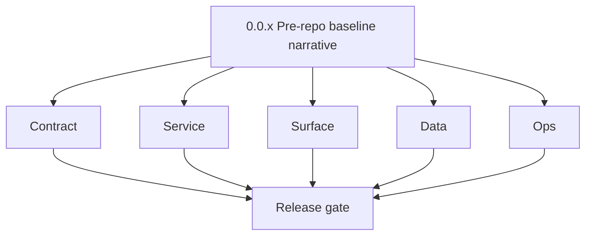
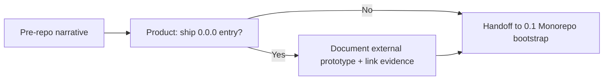

# Version 0.0 — Pre-repo baseline
> Foundation storage policy: All Contact360 codebases route file and artifact storage through `lambda/s3storage` as the canonical storage control plane.

- **Status:** ✅ Completed
- **Era:** 0.x (Foundation and pre-product stabilization)  
- **Summary:** Narrative-only pre-monorepo state. No canonical GraphQL modules, Lambdas, or shared contracts existed *before* this repository. The first shipped foundation release tracked in [`docs/versions.md`](../versions.md) is **`0.1.0`** ([`0.1 — Monorepo bootstrap.md`](0.1%20%E2%80%94%20Monorepo%20bootstrap.md)). Add **`0.0.0`** to `versions.md` only if product approves documenting external prototype work.  
- **Patch closure:** Every codenamed patch file here includes **Micro-gate** + **Service task slices**. Era hub: [`versions.md`](../versions.md).

## Scope

- **Target:** `0.0.x` documents intent; **no shipped runtime** unless explicitly approved.  
- **In scope:** agreement on canonical repo paths, naming, and “first real minor” (`0.1`); risk register seed from `docs/codebases/*`.  
- **Out of scope:** Production deployments, schema migrations, user-facing features.  
- **Exit:** stakeholders sign off that `0.1` Monorepo bootstrap is the first execution minor.

## Flowchart

### Runtime focus (unique to this minor)

> **No software runtime.** Single placeholder node — unlike `0.1+`, there is no FastAPI/GraphQL path to diagram.

See also: [`docs/flowchart.md`](../flowchart.md).

## Task tracks

### Contract

- ✅ Completed: 📌 Planned: **[appointment360]** — refine duplicate task (was: ✅ completed: freeze **naming** for services and paths (`cont…) | patch `0.0.0` band `0` | reason: specialize this file vs sibling patches; see docs/codebases/appointment360-codebase-analysis.md
- ✅ Completed: 📌 Planned: **[appointment360]** — refine duplicate task (was: ✅ completed: list **forbidden** assumptions (e.g. mongodb fo…) | patch `0.0.0` band `0` | reason: specialize this file vs sibling patches; see docs/codebases/appointment360-codebase-analysis.md

### Service

- ✅ Completed: 📌 Planned: **[appointment360]** — refine duplicate task (was: ✅ completed: none shipped — record **future** health probe e…) | patch `0.0.0` band `0` | reason: specialize this file vs sibling patches; see docs/codebases/appointment360-codebase-analysis.md

### Surface

- ✅ Completed: 📌 Planned: **[appointment360]** — refine duplicate task (was: ✅ completed: none — document that **first** ux evidence atta…) | patch `0.0.0` band `0` | reason: specialize this file vs sibling patches; see docs/codebases/appointment360-codebase-analysis.md

### Data

- ✅ Completed: 📌 Planned: **[appointment360]** — refine duplicate task (was: ✅ completed: none — state explicitly: **no** postgresql/es/s…) | patch `0.0.0` band `0` | reason: specialize this file vs sibling patches; see docs/codebases/appointment360-codebase-analysis.md

### Ops

- ✅ Completed: 📌 Planned: **[appointment360]** — refine duplicate task (was: ✅ completed: define who runs **first** `0.1.0` smoke and whe…) | patch `0.0.0` band `0` | reason: specialize this file vs sibling patches; see docs/codebases/appointment360-codebase-analysis.md

## Task Breakdown

| Slice | Outcome |
| --- | --- |
| Product / Platform | Approve whether `0.0.0` appears in `versions.md` or stays narrative-only |
| Architecture | Single canonical path table; link **Micro-gate** reference under **Patch ladder** below |
| Compliance | Confirm audit strategy starts at `0.4` RBAC freeze — `0.0` has no audit events |

## Immediate next execution queue

- ✅ Completed: Closed on narrative-only framing while keeping patch ladder evidence references.
- ✅ Completed: Seeded **cross-service risk matrix** review from `docs/codebases/*` into the program backlog.
- ✅ Completed: Assigned ownership path for `0.1.0` monorepo bootstrap release notes.

## Cross-service ownership

| Area | Owner | 0.0 responsibility |
| --- | --- | --- |
| Narrative / versioning | Product + Platform | Approve `0.0` scope wording |
| Architecture docs | Platform | Path + service register drafts |
| Compliance | Security / Platform | Confirm deferred controls |

## References

- [`docs/analysis/0.x-master-checklist.md`](../analysis/0.x-master-checklist.md)

- [`docs/versions.md`](../versions.md), [`docs/version-policy.md`](../version-policy.md), [`docs/architecture.md`](../architecture.md)
- [`docs/codebases/README.md`](../codebases/README.md)
## Backend API and Endpoint Scope

- **None** — no endpoints. Future gateway: `contact360.io/api` GraphQL + health routes (`0.1+`).

## Database and Data Lineage Scope

- **None**. Downstream: Appointment360 DB vs Jobs DB separation documented under `0.2`.

## Frontend UX Surface Scope

- **None**. First dashboard shell references: `0.1` / `0.8`.

## UI Elements Checklist

- Deferred UI decisions (explicit, because `0.0` ships no runtime):
  - `MainLayout`, `Sidebar`, app root shell scaffolding (deferred to `0.1` / `0.8`)
  - Auth surfaces: `DashboardAccessGate`, `AuthErrorBanner`, `AuthContext` / `ThemeContext` (deferred to `0.1` / `0.4`)
  - Error surfaces: `toast` primitives, `apiErrorHandler` mapping, `Alert`/retry UX patterns (deferred to `0.3`)
  - Identity/RBAC surfaces: `RoleContext`, logout button, session-expiry redirect, 403 page, credit-gate alerts (deferred to `0.4`)
  - Storage surfaces: `FilesUploadModal` / upload progress UI (deferred to `0.5`)
  - Jobs surfaces: `JobsCard`, `JobsPipelineStats`, status badges, retry modal UX (deferred to `0.6`)
  - Search/data-table surfaces: contacts filters, `VQLQueryBuilder`, loading skeletons (deferred to `0.7`)
  - Extension surfaces: MV3 popup HTML + token-status UX (deferred to `0.9`)
  - Admin/DocsAI shell constants wiring (deferred to `0.8`)

## Flow / Graph Delta for This Minor

- **Delta:** Introduces explicit **absence** of runtime graph; replaces any mistaken “email orchestration” placeholder diagrams used in legacy drafts.

## Audit and Compliance Notes

- No production data — no audit events. Reference [`docs/audit-compliance.md`](../audit-compliance.md) for controls that activate in `0.4+`.

## Patch ladder (`0.0.0` – `0.0.9`)

### Micro-gate reference (apply at every `0.0.P`)

| Track | Gate question (must answer Yes or document waiver) |
| --- | --- |
| **Contract** | Did any public or internal API surface change? If yes: diff vs `docs/backend/apis/` or pack; if no: attach “no contract change” note. |
| **Service** | Do critical paths for this patch still boot, health-check, and pass the defined smoke for affected services? |
| **Surface** | Did UI, extension, or admin behavior change? If yes: UX evidence + role checks; if no: note N/A. |
| **Frontend** | Which foundation-era components/routes must render or be scaffolded? List by name or mark N/A. |
| **Data** | Migrations, index mappings, S3 prefixes, or lineage docs updated and linked? |
| **Ops** | Rollback path, secrets, CI step, or runbook delta recorded? |

**Patch intent bands (typical):** `.0` charter · `.1`–`.2` scaffold · `.3`–`.5` hardening · `.6`–`.8` integration/drift · `.9` minor freeze / handoff to `0.(N+1).0`.

Theme: **Plant growth**. For `0.0.x`, every patch uses **N/A — doc-only** in the per-patch Micro-gate table unless product approves shipped runtime for `0.0.0`.

| Patch | Codename | Focus | Evidence gate |
| --- | --- | --- | --- |
| `0.0.0` | Void | Zero state documented | N/A — doc-only; no UI/runtime shipped (waiver: evidence attaches starting `0.1`) |
| `0.0.1` | Seed | Repo/path naming consensus | N/A — doc-only; no UI/runtime shipped (waiver: evidence attaches starting `0.1`) |
| `0.0.2` | Sprout | Risk register seed from codebase analyses | N/A — doc-only; no UI/runtime shipped (waiver: evidence attaches starting `0.1`) |
| `0.0.3` | Roots | Architecture.md draft alignment | N/A — doc-only; no UI/runtime shipped (waiver: evidence attaches starting `0.1`) |
| `0.0.4` | Soil | Compliance deferral list | N/A — doc-only; no UI/runtime shipped (waiver: evidence attaches starting `0.1`) |
| `0.0.5` | Rain | Stakeholder signoff process | N/A — doc-only; no UI/runtime shipped (waiver: evidence attaches starting `0.1`) |
| `0.0.6` | Stem | `0.1.0` owner + timeline | N/A — doc-only; no UI/runtime shipped (waiver: evidence attaches starting `0.1`) |
| `0.0.7` | Branch | “No MongoDB logs” and other doc corrections | N/A — doc-only; no UI/runtime shipped (waiver: evidence attaches starting `0.1`) |
| `0.0.8` | Leaf | External prototype links (if any) | N/A — doc-only; no UI/runtime shipped (waiver: evidence attaches starting `0.1`) |
| `0.0.9` | Bloom | Handoff package to `0.1.0` | N/A — doc-only; no UI/runtime shipped (waiver: evidence attaches starting `0.1`) |

## Release Gate and Evidence

### Master Task Checklist

- ✅ Completed: Product decision recorded: narrative-only vs `0.0.0` in `versions.md`.
- ✅ Completed: Architecture path table reviewed.
- ✅ Completed: Risk matrix skim completed.

### Backend API and Endpoints

- N/A — confirm no endpoint claims in this minor.

### Database and Data Lineage

- N/A

### Frontend UX

- N/A

### UI Elements

- N/A

### Flow and Graph

- ✅ Completed: Runtime diagram confirms **placeholder-only** scope (no email flow).

### Validation

- ✅ Completed: Doc-only review closed; no CI deployment required from `0.0` alone.

### Release Gate

- ✅ Completed: Approved handoff to **`0.1` Monorepo bootstrap**.

## Patches

| Patch | Codename | Doc |
| --- | --- | --- |
| `0.0.0` | Void | [`0.0.0` — Void](0.0.0%20%E2%80%94%20Void.md) |
| `0.0.1` | Seed | [`0.0.1` — Seed](0.0.1%20%E2%80%94%20Seed.md) |
| `0.0.2` | Sprout | [`0.0.2` — Sprout](0.0.2%20%E2%80%94%20Sprout.md) |
| `0.0.3` | Roots | [`0.0.3` — Roots](0.0.3%20%E2%80%94%20Roots.md) |
| `0.0.4` | Soil | [`0.0.4` — Soil](0.0.4%20%E2%80%94%20Soil.md) |
| `0.0.5` | Rain | [`0.0.5` — Rain](0.0.5%20%E2%80%94%20Rain.md) |
| `0.0.6` | Stem | [`0.0.6` — Stem](0.0.6%20%E2%80%94%20Stem.md) |
| `0.0.7` | Branch | [`0.0.7` — Branch](0.0.7%20%E2%80%94%20Branch.md) |
| `0.0.8` | Leaf | [`0.0.8` — Leaf](0.0.8%20%E2%80%94%20Leaf.md) |
| `0.0.9` | Bloom | [`0.0.9` — Bloom](0.0.9%20%E2%80%94%20Bloom.md) |
