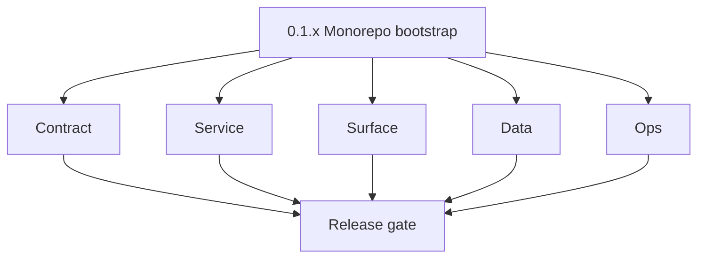
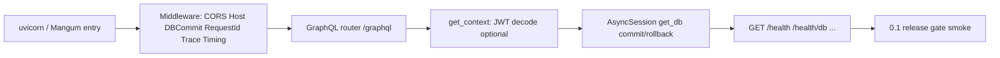

# Version 0.1 — Monorepo bootstrap
> Foundation storage policy: All Contact360 codebases route file and artifact storage through `lambda/s3storage` as the canonical storage control plane.

- **Status:** ✅ Completed
- **Era:** 0.x (Foundation and pre-product stabilization)
- **Summary:** Initial monorepo layout, service skeletons, FastAPI + Strawberry gateway bootstrap, health probes, JWT + DB session baseline, and first cross-service smoke paths. See [`docs/versions.md`](../versions.md) → `0.1.0`.
- **Patch closure:** Each codenamed patch file includes **Micro-gate** + **Service task slices**. Era hub: [`versions.md`](../versions.md).

## Scope

- **Target:** `0.1.0` + patches — prove **repo + services start** with documented `.env.example` and health responses.
- **In scope:** `contact360.io/api` app factory, middleware stack, `get_db()` + `AsyncSession`, `/health` family, GraphQL shell; skeletons for `jobs`, `sync`, Lambdas; `app` / `admin` / `root` directory presence.
- **Primary owners:** Platform (api, jobs edge), Frontend (app boilerplate).
- **Out of scope:** Full RBAC matrix (`0.4`), durable multipart (`0.5`), Kafka job maturity (`0.6`).
- **Definition of done:** Golden path: process starts → DB connects (where configured) → `/graphql` + health respond → one documented smoke per critical service.

## Flowchart

### Runtime focus (unique to this minor)

See **Service task slices** under each `0.1.P` patch file and [`docs/codebases/appointment360-codebase-analysis.md`](../codebases/appointment360-codebase-analysis.md).

## Task tracks

### Contract

- ✅ Completed: ✅ Completed: ✅ Completed: **api:** GraphQL root namespaces + health HTTP routes and `Settings` env layout documented.
- ✅ Completed: ✅ Completed: ✅ Completed: **jobs:** Stub job create/status JSON shapes documented.
- ✅ Completed: ✅ Completed: ✅ Completed: **sync:** Internal API key + `/health` response shape documented.
- ✅ Completed: ✅ Completed: ✅ Completed: **Lambdas:** `emailapis` / `logs.api` / `s3storage` health/root contracts documented.

- 📌 Planned: **[appointment360]** — refine duplicate task (was: 📌 planned: **[architecture]** — product **graphql** remains …) | patch `0.1.0` band `0` | reason: specialize this file vs sibling patches; see docs/codebases/appointment360-codebase-analysis.md
### Service

- ✅ Completed: ✅ Completed: ✅ Completed: **api:** FastAPI app, exception handlers, `DatabaseCommitMiddleware`, and DB session wiring established.
- ✅ Completed: ✅ Completed: ✅ Completed: **jobs:** FastAPI skeleton, config validation, and placeholder routes established.
- ✅ Completed: ✅ Completed: ✅ Completed: **sync:** Gin skeleton with gzip and auth middleware baseline established.
- ✅ Completed: ✅ Completed: ✅ Completed: First downstream HTTP client stubs in `app/clients/` wired.

- 📌 Planned: **[appointment360]** — refine duplicate task (was: 📌 planned: **[architecture]** — **go/gin satellites** in sco…) | patch `0.1.0` band `0` | reason: specialize this file vs sibling patches; see docs/codebases/appointment360-codebase-analysis.md
### Surface

- ✅ Completed: ✅ Completed: ✅ Completed: **app:** Next.js shell, env-based API URL, and authenticated stub route baseline.
- ✅ Completed: ✅ Completed: ✅ Completed: **admin:** Django base template and startup baseline validated.
- ✅ Completed: ✅ Completed: ✅ Completed: **root:** Marketing layout placeholder established.

### Data

- ✅ Completed: ✅ Completed: ✅ Completed: **api:** Initial schema baseline for `users` / `token_blacklist` documented.
- ✅ Completed: ✅ Completed: ✅ Completed: **jobs:** DB ownership/migration placeholder documented.

- 📌 Planned: **[appointment360]** — refine duplicate task (was: 📌 planned: **[architecture]** — **postgresql-first** per `do…) | patch `0.1.0` band `0` | reason: specialize this file vs sibling patches; see docs/codebases/appointment360-codebase-analysis.md
### Ops

- ✅ Completed: ✅ Completed: ✅ Completed: `.env.example`, quickstart notes, and bootstrap scripts documented.
- ✅ Completed: ✅ Completed: ✅ Completed: Dockerfile/matrix deferrals tracked into `0.10`.

- 📌 Planned: **[appointment360]** — refine duplicate task (was: 📌 planned: **[architecture]** — **observability**: correlate…) | patch `0.1.0` band `0` | reason: specialize this file vs sibling patches; see docs/codebases/appointment360-codebase-analysis.md
- 📌 Planned: **[appointment360]** — refine duplicate task (was: 📌 planned: **[architecture]** — **django docsai** (`contact3…) | patch `0.1.0` band `0` | reason: specialize this file vs sibling patches; see docs/codebases/appointment360-codebase-analysis.md
## Task Breakdown

| Service | Contract · Service · Data · Ops (one line each) |
| --- | --- |
| **Appointment360** | Settings + health + GraphQL IDE + DB session lifecycle |
| **Jobs** | Runnable API + DB connection hook + topic name documented |
| **Connectra** | Health + API key middleware stub |
| **emailapis** | Lambda/local entry + health |

## Immediate next execution queue

- ✅ Completed: Archived smoke outputs for `/health` and `/graphql` introspection baselines.
- ✅ Completed: Verified secrets handling and key-name-only documentation.
- ✅ Completed: Logged known follow-up gaps for `0.2`–`0.4`.

## Cross-service ownership

| Service | Focus |
| --- | --- |
| `contact360.io/api` | Gateway bootstrap, JWT + DB, clients folder |
| `contact360.io/jobs` | Scheduler skeleton |
| `contact360.io/sync` | HTTP server skeleton |
| `contact360.io/app` | Client shell to gateway |
| `lambda/*` | Health + deploy stub |
| `contact360.io/admin` | Run docs + sync prep (`0.8`) |

## References

- [`docs/architecture.md`](../architecture.md), [`docs/codebase.md`](../codebase.md), [`docs/flowchart.md`](../flowchart.md)
- [`../codebases/appointment360-codebase-analysis.md`](../codebases/appointment360-codebase-analysis.md)
## Backend API and Endpoint Scope

- **Appointment360:** `/graphql`, `/health`, `/health/db`, (optional `/health/logging`, `/health/slo`).
- **Internal:** Jobs/Connectra REST not yet product-complete — document stub routes only.

Cross-reference: `docs/backend/endpoints/appointment360_endpoint_era_matrix.json` (era `0.x` → auth + health modules only).

## Database and Data Lineage Scope

- **PostgreSQL:** Gateway user + token tables (initial); Jobs DB separation clarified in `0.2`.
- **Elasticsearch / S3:** Not required for `0.1.0` smoke unless already scaffolded.

Cross-reference: `docs/backend/database/appointment360_data_lineage.md` (era `0.x` tables: `users`, `token_blacklist`).

## Frontend UX Surface Scope

- **app:** Layout, auth page stub, API client config.
- **admin / root:** Compile-time shell; no full DocsAI sync requirement in `0.1` (see `0.8`).

Frontend scope (0.1 surface evidence):

- Routes:
  - `app/(auth)/login/page.tsx` (shell stub)
  - `app/(auth)/register/page.tsx` (stub)
  - `app/(dashboard)/layout.tsx`
- Files:
  - `context/AuthContext.tsx`
  - `context/ThemeContext.tsx`
  - `lib/graphqlClient.ts`
  - `lib/tokenManager.ts`
  - `lib/config.ts`
- Hooks:
  - `useSidebar`
  - `useModal`
  - `useDebouncedValue`
  - `useResizablePanels`

## UI Elements Checklist

- ✅ Completed: `MainLayout` scaffolded.
- ✅ Completed: `Sidebar` scaffolded.
- ✅ Completed: `DashboardAccessGate` guard baseline scaffolded.
- ✅ Completed: `AuthErrorBanner` scaffolded.
- ✅ Completed: `Modal` scaffolded with open/close smoke.
- ✅ Completed: `Alert` scaffolded with severity smoke.
- ✅ Completed: `ConfirmModal` scaffolded with callback smoke.
- ✅ Completed: `DataToolbar` scaffolded.
- ✅ Completed: `TablePagination` scaffolded.
- ✅ Completed: `FloatingActionBar` scaffolded.
- ✅ Completed: `Pagination` scaffolded.
- ✅ Completed: Primitive smoke evidence recorded.

## Flow / Graph Delta for This Minor

- **New:** Request lifecycle through **gateway middleware + GraphQL** (see appointment360 analysis).
- **Removes:** Generic “email orchestration” as stand-in for all 0.x minors.

## Audit and Compliance Notes

- Minimal PII — developer accounts only; document that **full** RBAC/audit events land in `0.4`. See [`docs/audit-compliance.md`](../audit-compliance.md).

## Patch ladder (`0.1.0` – `0.1.9`)

### Micro-gate reference (apply at every `0.1.P`)

| Track | Gate question (must answer Yes or document waiver) |
| --- | --- |
| **Contract** | Did any public or internal API surface change? If yes: diff vs `docs/backend/apis/` or pack; if no: attach “no contract change” note. |
| **Service** | Do critical paths for this patch still boot, health-check, and pass the defined smoke for affected services? |
| **Surface** | Did UI, extension, or admin behavior change? If yes: UX evidence + role checks; if no: note N/A. |
| **Frontend** | Which foundation-era components/routes must render or be scaffolded? List by name or mark N/A. |
| **Data** | Migrations, index mappings, S3 prefixes, or lineage docs updated and linked? |
| **Ops** | Rollback path, secrets, CI step, or runbook delta recorded? |

**Patch intent bands (typical):** `.0` charter · `.1`–`.2` scaffold · `.3`–`.5` hardening · `.6`–`.8` integration/drift · `.9` minor freeze / handoff to `0.(N+1).0`.

Theme: **Forge**. Per-patch **Micro-gate** + **Service task slices** live in each linked patch file below.

| Patch | Codename | Focus | Evidence gate |
| --- | --- | --- | --- |
| `0.1.0` | Assembly | Monorepo dirs + api health | `contact360.io/app/` Next.js boots; `app/layout.tsx` present |
| `0.1.1` | Scaffold | Clients folder + stub downstream calls | `lib/graphqlClient.ts` + `lib/config.ts` stubs committed |
| `0.1.2` | Forge | DB session + first migration | `context/AuthContext.tsx` + `context/ThemeContext.tsx` present |
| `0.1.3` | Ignite | JWT + context wiring | `DashboardAccessGate` redirect smoke; `useSessionGuard` stub |
| `0.1.4` | Link | app → graphql smoke | `app` → `/graphql` introspection smoke from browser |
| `0.1.5` | Key | env matrix + `.env.example` parity | `.env.local.example` includes `NEXT_PUBLIC_API_URL` + `NEXT_PUBLIC_GRAPHQL_URL` |
| `0.1.6` | Bridge | jobs + sync binaries run | `MainLayout` + `Sidebar` render without crash |
| `0.1.7` | Pulse | logging + request ID | `lib/toast.ts` + `lib/animationsConfig.ts` present |
| `0.1.8` | Sync | docs/versions.md entry + roadmap pointer | `docs/frontend/pages/README.md` era-`0.x` surface table verified |
| `0.1.9` | Seal | Bootstrap freeze; handoff to `0.2` | Smoke/snapshot evidence for `Alert`, `Modal`, `DataToolbar` primitives |

## Release Gate and Evidence

### Master Task Checklist

- ✅ Completed: `docs/versions.md` references and `0.1.x` linkage updated.
- ✅ Completed: Smoke traces archived.
- ✅ Completed: Owners listed.

### Backend API and Endpoints

- ✅ Completed: Health + GraphQL evidence captured.
- ✅ Completed: No undocumented breaking route changes left untracked.

### Database and Data Lineage

- ✅ Completed: Migration/no-DB waiver documented.

### Frontend UX

- ✅ Completed: App shell validated against local/staging API baseline.

### UI Elements

- ✅ Completed: Smoke capture expectation closed.

### Flow and Graph

- ✅ Completed: Middleware/context diagram aligned with implementation.

### Validation

- ✅ Completed: Lint/migrate scripts documented.

### Release Gate

- ✅ Completed: Sign-off recorded for **0.2 Schema & migration bedrock**.

## Patches

| Patch | Codename | Doc |
| --- | --- | --- |
| `0.1.0` | Assembly | [`0.1.0` — Assembly](0.1.0%20%E2%80%94%20Assembly.md) |
| `0.1.1` | Scaffold | [`0.1.1` — Scaffold](0.1.1%20%E2%80%94%20Scaffold.md) |
| `0.1.2` | Forge | [`0.1.2` — Forge](0.1.2%20%E2%80%94%20Forge.md) |
| `0.1.3` | Ignite | [`0.1.3` — Ignite](0.1.3%20%E2%80%94%20Ignite.md) |
| `0.1.4` | Link | [`0.1.4` — Link](0.1.4%20%E2%80%94%20Link.md) |
| `0.1.5` | Key | [`0.1.5` — Key](0.1.5%20%E2%80%94%20Key.md) |
| `0.1.6` | Bridge | [`0.1.6` — Bridge](0.1.6%20%E2%80%94%20Bridge.md) |
| `0.1.7` | Pulse | [`0.1.7` — Pulse](0.1.7%20%E2%80%94%20Pulse.md) |
| `0.1.8` | Sync | [`0.1.8` — Sync](0.1.8%20%E2%80%94%20Sync.md) |
| `0.1.9` | Seal | [`0.1.9` — Seal](0.1.9%20%E2%80%94%20Seal.md) |
