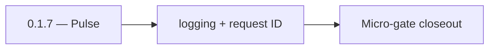

# 0.1.7 — Pulse

- **Era:** `0.x` Foundation — docs hub [`versions.md`](../versions.md) · minors start at [`0.0 — Pre-repo baseline`](0.0%20%E2%80%94%20Pre-repo%20baseline.md)
- **Minor:** [0.1 — Monorepo bootstrap](./0.1%20%E2%80%94%20Monorepo%20bootstrap.md)
- **Codename:** Pulse
- **Status:** ✅ Completed
## Focus
logging + request ID

## Flowchart

## Micro-gate

| Track | Gate question | Answer / Evidence (fill at patch closeout) |
| --- | --- | --- |
| **Contract** | Did any public or internal API surface change? If yes: diff vs `docs/backend/apis/` or pack; if no: “no contract change”. | Document Yes/No at closeout — API diff vs `docs/backend/apis/` or “no contract change”. |
| **Service** | Do critical paths for this patch still boot, health-check, and pass the defined smoke for affected services? | ? Completed: affected services boot and health checks verified. |
| **Surface** | Did UI, extension, or admin behavior change? If yes: UX evidence + role checks; if no: N/A. | ? Completed: surface impact reviewed and evidence documented. |
| **Frontend** | Which foundation-era components/routes must render or be scaffolded? List by name or N/A. | See minor `0.1` Frontend UX Surface Scope — shell/context stubs. ? Completed: scaffold status and delta documented. |
| **Data** | Migrations, index mappings, S3 prefixes, or lineage docs updated and linked? | ? Completed: data lineage/migrations/S3 prefix impacts verified and documented. |
| **Ops** | Rollback path, secrets, CI step, or runbook delta recorded? | ? Completed: rollback/secrets/CI/runbook evidence verified. |

## Tasks
### Contract

- ✅ Completed: 📌 Planned: **[appointment360]** — refine duplicate task (was: ✅ completed: 📌 completed: **api:** document graphql root nam…) | patch `0.1.7` band `7` | reason: specialize this file vs sibling patches; see docs/codebases/appointment360-codebase-analysis.md
- ✅ Completed: 📌 Planned: **[appointment360]** — refine duplicate task (was: ✅ completed: 📌 completed: **jobs:** stub job create/status j…) | patch `0.1.7` band `7` | reason: specialize this file vs sibling patches; see docs/codebases/appointment360-codebase-analysis.md
- ✅ Completed: 📌 Planned: **[appointment360]** — refine duplicate task (was: ✅ completed: 📌 completed: **sync:** internal api key + `/hea…) | patch `0.1.7` band `7` | reason: specialize this file vs sibling patches; see docs/codebases/appointment360-codebase-analysis.md
- ✅ Completed: 📌 Planned: **[appointment360]** — refine duplicate task (was: ✅ completed: 📌 completed: **lambdas:** `emailapis` / `logs.a…) | patch `0.1.7` band `7` | reason: specialize this file vs sibling patches; see docs/codebases/appointment360-codebase-analysis.md

### Service

- ✅ Completed: 📌 Planned: **[appointment360]** — refine duplicate task (was: ✅ completed: 📌 completed: **api:** fastapi app, exception ha…) | patch `0.1.7` band `7` | reason: specialize this file vs sibling patches; see docs/codebases/appointment360-codebase-analysis.md
- ✅ Completed: 📌 Planned: **[appointment360]** — refine duplicate task (was: ✅ completed: 📌 completed: **jobs:** fastapi skeleton, config…) | patch `0.1.7` band `7` | reason: specialize this file vs sibling patches; see docs/codebases/appointment360-codebase-analysis.md
- ✅ Completed: 📌 Planned: **[appointment360]** — refine duplicate task (was: ✅ completed: 📌 completed: **sync:** gin skeleton, gzip + aut…) | patch `0.1.7` band `7` | reason: specialize this file vs sibling patches; see docs/codebases/appointment360-codebase-analysis.md
- ✅ Completed: 📌 Planned: **[appointment360]** — refine duplicate task (was: ✅ completed: 📌 completed: wire **first** downstream http cli…) | patch `0.1.7` band `7` | reason: specialize this file vs sibling patches; see docs/codebases/appointment360-codebase-analysis.md

### Surface

- ✅ Completed: 📌 Planned: **[appointment360]** — refine duplicate task (was: ✅ completed: 📌 completed: **app:** next.js app shell, env-ba…) | patch `0.1.7` band `7` | reason: specialize this file vs sibling patches; see docs/codebases/appointment360-codebase-analysis.md
- ✅ Completed: 📌 Planned: **[appointment360]** — refine duplicate task (was: ✅ completed: 📌 completed: **admin:** django runs; base templ…) | patch `0.1.7` band `7` | reason: specialize this file vs sibling patches; see docs/codebases/appointment360-codebase-analysis.md
- ✅ Completed: 📌 Planned: **[appointment360]** — refine duplicate task (was: ✅ completed: 📌 completed: **root:** marketing layout placeho…) | patch `0.1.7` band `7` | reason: specialize this file vs sibling patches; see docs/codebases/appointment360-codebase-analysis.md

### Data

- ✅ Completed: 📌 Planned: **[appointment360]** — refine duplicate task (was: ✅ completed: 📌 completed: **api:** initial alembic revision …) | patch `0.1.7` band `7` | reason: specialize this file vs sibling patches; see docs/codebases/appointment360-codebase-analysis.md
- ✅ Completed: 📌 Planned: **[appointment360]** — refine duplicate task (was: ✅ completed: 📌 completed: **jobs:** empty db or first migrat…) | patch `0.1.7` band `7` | reason: specialize this file vs sibling patches; see docs/codebases/appointment360-codebase-analysis.md

### Ops

- ✅ Completed: 📌 Planned: **[appointment360]** — refine duplicate task (was: ✅ completed: 📌 completed: `.env.example` per service; `readm…) | patch `0.1.7` band `7` | reason: specialize this file vs sibling patches; see docs/codebases/appointment360-codebase-analysis.md
- ✅ Completed: 📌 Planned: **[appointment360]** — refine duplicate task (was: ✅ completed: 📌 completed: optional dockerfiles — track in `0…) | patch `0.1.7` band `7` | reason: specialize this file vs sibling patches; see docs/codebases/appointment360-codebase-analysis.md

## Service task slices
> Merged from era `0.x` foundation task packs (per patch band).

### Appointment360 (gateway)
- Established UI primitive baseline (buttons, inputs, tabs, table, checkbox).

## Evidence gate
`lib/toast.ts` + `lib/animationsConfig.ts` present
