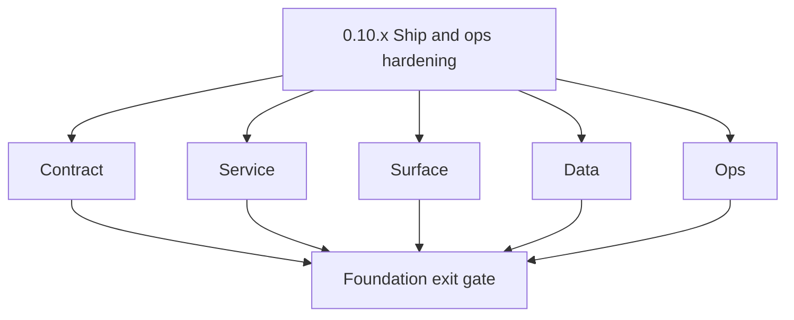
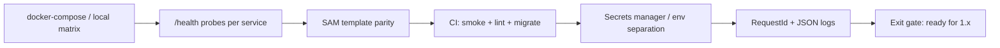

# Version 0.10 — Ship & ops hardening
> Foundation storage policy: All Contact360 codebases route file and artifact storage through `lambda/s3storage` as the canonical storage control plane.

- **Status:** ✅ Completed
- **Era:** 0.x (Foundation and pre-product stabilization)
- **Summary:** **Foundation exit gate** before heavy `1.x` delivery — Docker Compose alignment for local/stage matrix, **SAM / Lambda** templates health-checked, consistent **`/health`** and **`/api/v1/health`** / **`/v1/health`** probes per service, **secrets** baseline (no plaintext in repo), CI pipeline required checks, rollback playbooks, and cross-service **observability** minimum (request ID, structured logs).
- **Patch closure:** Each codenamed patch file includes **Micro-gate** + **Service task slices**. Era hub: [`versions.md`](../versions.md).

## Scope

- **Target:** `0.10.x` — a new engineer can start stack from docs + compose; CI fails if health checks fail.
- **In scope:** Every service in [`docs/architecture.md`](../architecture.md) canonical register — status documented: green / waived / follow-up ticket.
- **Out of scope:** Multi-region HA (`6.x` themes); full SRE program.

## Flowchart

### Runtime focus (unique to this minor)

## Task tracks

### Contract

- ✅ Completed: 📌 Planned: **[appointment360]** — refine duplicate task (was: 📌 planned: **[appointment360]** — refine duplicate task (was…) | patch `0.10.0` band `0` | reason: specialize this file vs sibling patches; see docs/codebases/appointment360-codebase-analysis.md

- ✅ Completed: 📌 Planned: **[appointment360]** — refine duplicate task (was: 📌 planned: **[architecture]** — product **graphql** remains …) | patch `0.10.0` band `0` | reason: specialize this file vs sibling patches; see docs/codebases/appointment360-codebase-analysis.md
### Service

- ✅ Completed: 📌 Planned: **[appointment360]** — refine duplicate task (was: 📌 planned: **[appointment360]** — refine duplicate task (was…) | patch `0.10.0` band `0` | reason: specialize this file vs sibling patches; see docs/codebases/appointment360-codebase-analysis.md

- ✅ Completed: 📌 Planned: **[appointment360]** — refine duplicate task (was: 📌 planned: **[architecture]** — **go/gin satellites** in sco…) | patch `0.10.0` band `0` | reason: specialize this file vs sibling patches; see docs/codebases/appointment360-codebase-analysis.md
### Surface

- ✅ Completed: 📌 Planned: **[appointment360]** — refine duplicate task (was: 📌 planned: **[appointment360]** — refine duplicate task (was…) | patch `0.10.0` band `0` | reason: specialize this file vs sibling patches; see docs/codebases/appointment360-codebase-analysis.md

### Data

- ✅ Completed: 📌 Planned: **[appointment360]** — refine duplicate task (was: 📌 planned: **[appointment360]** — refine duplicate task (was…) | patch `0.10.0` band `0` | reason: specialize this file vs sibling patches; see docs/codebases/appointment360-codebase-analysis.md

- ✅ Completed: 📌 Planned: **[appointment360]** — refine duplicate task (was: 📌 planned: **[architecture]** — **postgresql-first** per `do…) | patch `0.10.0` band `0` | reason: specialize this file vs sibling patches; see docs/codebases/appointment360-codebase-analysis.md
### Ops

- ✅ Completed: 📌 Planned: **[appointment360]** — refine duplicate task (was: 📌 planned: **[appointment360]** — refine duplicate task (was…) | patch `0.10.0` band `0` | reason: specialize this file vs sibling patches; see docs/codebases/appointment360-codebase-analysis.md
- ✅ Completed: 📌 Planned: **[appointment360]** — refine duplicate task (was: 📌 planned: **[appointment360]** — refine duplicate task (was…) | patch `0.10.0` band `0` | reason: specialize this file vs sibling patches; see docs/codebases/appointment360-codebase-analysis.md

- ✅ Completed: 📌 Planned: **[appointment360]** — refine duplicate task (was: 📌 planned: **[architecture]** — **observability**: correlate…) | patch `0.10.0` band `0` | reason: specialize this file vs sibling patches; see docs/codebases/appointment360-codebase-analysis.md
- ✅ Completed: 📌 Planned: **[appointment360]** — refine duplicate task (was: 📌 planned: **[architecture]** — **django docsai** (`contact3…) | patch `0.10.0` band `0` | reason: specialize this file vs sibling patches; see docs/codebases/appointment360-codebase-analysis.md
## Service health matrix expectations

| Service family | Required probe baseline | Evidence artifact |
| --- | --- | --- |
| FastAPI services | `/health` and DB readiness where applicable | smoke log + route doc parity |
| Go services | `GET /health` and startup validation | binary startup + probe output |
| Lambda services | health/root probe in SAM/local mode | `sam` validation + invoke proof |

## Task Breakdown

Check **Service task slices** on each `0.10.P` patch (merged ops/release-gate rows from all services):

| Service | Health | Compose/SAM | Notes |
| --- | --- | --- | --- |
| appointment360 | /health + /health/db | Dockerfile | Mangum path |
| jobs | /health + kafka | compose | consumer readiness |
| connectra | GET /health | binary | |
| s3storage | health | SAM | worker |
| emailapis / emailapigo | health | lambda | |
| logs.api | health | lambda | S3 credentials |
| contact.ai | health | lambda | |
| mailvetter | /v1/health | docker compose | worker+redis |
| salesnavigator | /v1/health | SAM | |
| email campaign | /health | compose | two binaries |

Codebase analysis gaps to verify in `0.10` (must be evidence-backed):

- Health endpoints: every service exposes the same `/health` JSON envelope and includes `request_id` where applicable.
- `/api/v1/health` vs `/v1/health` mapping: docs + probes match actual routes per service pack.
- Secrets baseline: each service required env var names are listed in docs/quickstart and none are committed as plaintext.
- Auth + CORS defaults: public Lambdas do not accidentally allow open CORS (or have remediation ticket + waiver).
- Observability minimum: structured JSON logs include trace/request id consistently across gateway + workers + Lambdas.

## Immediate next execution queue

- 📌 Completed: Single **matrix** spreadsheet: service × deploy target × owner.
- 📌 Completed: **Penetration** of public Lambdas for accidental open CORS (remediation tickets).

## Cross-service ownership

| Role | Responsibility |
| --- | --- |
| DevOps | CI, compose, SAM |
| Platform leads | Per-service health truth |
| Security | Secret scanning, pre-commit |

## References

- [`docs/governance.md`](../governance.md), [`docs/architecture.md`](../architecture.md), [`docs/version-policy.md`](../version-policy.md)
- Per-patch **Service task slices**: [`0.10.0 — Dock.md`](0.10.0%20%E2%80%94%20Dock.md) … [`0.10.9 — Handoff.md`](0.10.9%20%E2%80%94%20Handoff.md)

## Backend API and Endpoint Scope

- **Operational only** — freeze “no breaking route renames” during `0.10` patches unless emergency; document any change.

## Database and Data Lineage Scope

- Backup/migrate procedures referenced; no new schema required for ops-only work unless fixing blockers.

## Frontend UX Surface Scope

- Production build, env vars for `NEXT_PUBLIC_*`, CSP notes if any.

## UI Elements Checklist

- 📌 Completed: App production build passes (`next build` green) for `contact360.io/app`
- 📌 Completed: Root production build passes for marketing `contact360.io/root`
- 📌 Completed: Admin static files collected (`collectstatic`) for `contact360.io/admin`
- 📌 Completed: `NEXT_PUBLIC_*` env var list documented and confirmed non-empty (per service/app config)

## Flow / Graph Delta for This Minor

- **Delta:** Adds **cross-cutting ops spine** — not a product feature graph.

## Audit and Compliance Notes

- Secret scanning, dependency audit, log redaction validation; align with `audit-compliance.md` controls for production-bound envs.

## Patch ladder (`0.10.0` – `0.10.9`)

### Micro-gate reference (apply at every `0.10.P`)

| Track | Gate question (must answer Yes or document waiver) |
| --- | --- |
| **Contract** | Did any public or internal API surface change? If yes: diff vs `docs/backend/apis/` or pack; if no: attach “no contract change” note. |
| **Service** | Do critical paths for this patch still boot, health-check, and pass the defined smoke for affected services? |
| **Surface** | Did UI, extension, or admin behavior change? If yes: UX evidence + role checks; if no: note N/A. |
| **Frontend** | Which foundation-era components/routes must render or be scaffolded? List by name or mark N/A. |
| **Data** | Migrations, index mappings, S3 prefixes, or lineage docs updated and linked? |
| **Ops** | Rollback path, secrets, CI step, or runbook delta recorded? |

**Patch intent bands (typical):** `.0` charter · `.1`–`.2` scaffold · `.3`–`.5` hardening · `.6`–`.8` integration/drift · `.9` minor freeze / handoff to `1.0`.

> **Note:** `0.10` uses patch `.0`–`.9` under the same **Ship & ops** theme; codename + evidence columns below align with each **`0.10.P — … .md`** patch file.

| Patch | Codename | Suggested focus | Evidence gate |
| --- | --- | --- | --- |
| `0.10.0` | Dock | Compose skeleton all services | `docker compose up` boots services and `/health` probes succeed |
| `0.10.1` | Probe | Health standardization | `/health` JSON envelope matches documented schema for all services |
| `0.10.2` | Gate | CI pipeline required checks | CI run shows health smoke + required checks passing green |
| `0.10.3` | Vault | Secret inventory + rotation doc | Secret env var inventory exists and secret scanning passes |
| `0.10.4` | Drift | SAM/template drift pass | `sam validate`/`sam build` succeed and templates reflect runtime env |
| `0.10.5` | Log | Log + request ID consistency | Structured logs include request/trace id consistently across gateway + workers + lambdas |
| `0.10.6` | Rehearse | Staging deploy rehearsal | Staging deploy succeeds; services remain healthy after N minutes |
| `0.10.7` | Rewind | Rollback drill | Rollback path executed successfully (or waived with ticket) |
| `0.10.8` | Sight | Observability dashboard stub | Dashboard/metrics stub exists and includes health + request id signals |
| `0.10.9` | Handoff | **Foundation complete** — `1.x` go | Exit gate approval recorded; ready to begin `1.x` work |

## Release Gate and Evidence

### Master Task Checklist

- 📌 Completed: Every pack ops row satisfied or waived with ticket

### Backend API and Endpoints

- 📌 Completed: Health matrix attached

### Database and Data Lineage

- 📌 Completed: Migrate/backfill procedure linked

### Frontend UX

- 📌 Completed: Prod build evidence

### UI Elements

- 📌 Completed: N/A or completed

### Flow and Graph

- 📌 Completed: Ops flow diagram in wiki/docs

### Validation

- 📌 Completed: CI green on main + tagged release candidate

### Release Gate

- 📌 Completed: **Formal approval** to begin **`1.x` Contact360 user and billing** delivery

## Patches

| Patch | Codename | Doc |
| --- | --- | --- |
| `0.10.0` | Dock | [`0.10.0` — Dock](0.10.0%20%E2%80%94%20Dock.md) |
| `0.10.1` | Probe | [`0.10.1` — Probe](0.10.1%20%E2%80%94%20Probe.md) |
| `0.10.2` | Gate | [`0.10.2` — Gate](0.10.2%20%E2%80%94%20Gate.md) |
| `0.10.3` | Vault | [`0.10.3` — Vault](0.10.3%20%E2%80%94%20Vault.md) |
| `0.10.4` | Drift | [`0.10.4` — Drift](0.10.4%20%E2%80%94%20Drift.md) |
| `0.10.5` | Log | [`0.10.5` — Log](0.10.5%20%E2%80%94%20Log.md) |
| `0.10.6` | Rehearse | [`0.10.6` — Rehearse](0.10.6%20%E2%80%94%20Rehearse.md) |
| `0.10.7` | Rewind | [`0.10.7` — Rewind](0.10.7%20%E2%80%94%20Rewind.md) |
| `0.10.8` | Sight | [`0.10.8` — Sight](0.10.8%20%E2%80%94%20Sight.md) |
| `0.10.9` | Handoff | [`0.10.9` — Handoff](0.10.9%20%E2%80%94%20Handoff.md) |
