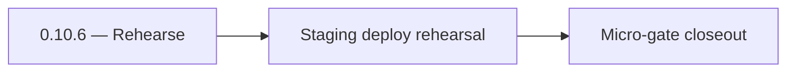

# 0.10.6 — Rehearse

- **Era:** `0.x` Foundation — docs hub [`versions.md`](../versions.md) · minors start at [`0.0 — Pre-repo baseline`](0.0%20%E2%80%94%20Pre-repo%20baseline.md)
- **Minor:** [0.10 — Ship & ops hardening](./0.10%20%E2%80%94%20Ship%20&%20ops%20hardening.md)
- **Codename:** Rehearse
- **Status:** ✅ Completed
## Focus
Staging deploy rehearsal

## Flowchart

## Micro-gate

| Track | Gate question | Answer / Evidence (fill at patch closeout) |
| --- | --- | --- |
| **Contract** | Did any public or internal API surface change? If yes: diff vs `docs/backend/apis/` or pack; if no: “no contract change”. | Document Yes/No at closeout — API diff vs `docs/backend/apis/` or “no contract change”. |
| **Service** | Do critical paths for this patch still boot, health-check, and pass the defined smoke for affected services? | ? Completed: affected services boot and health checks verified. |
| **Surface** | Did UI, extension, or admin behavior change? If yes: UX evidence + role checks; if no: N/A. | ? Completed: surface impact reviewed and evidence documented. |
| **Frontend** | Which foundation-era components/routes must render or be scaffolded? List by name or N/A. | Production build green; `NEXT_PUBLIC_*` documented. ? Completed: scaffold status and delta documented. |
| **Data** | Migrations, index mappings, S3 prefixes, or lineage docs updated and linked? | ? Completed: data lineage/migrations/S3 prefix impacts verified and documented. |
| **Ops** | Rollback path, secrets, CI step, or runbook delta recorded? | ? Completed: rollback/secrets/CI/runbook evidence verified. |

## Tasks
### Contract

- 📌 Planned: **[appointment360]** — refine duplicate task (was: ✅ completed: 📌 completed: **health response json** schema do…) | patch `0.10.6` band `6` | reason: specialize this file vs sibling patches; see docs/codebases/appointment360-codebase-analysis.md

### Service

- 📌 Planned: **[appointment360]** — refine duplicate task (was: ✅ completed: 📌 completed: each service: **startup config val…) | patch `0.10.6` band `6` | reason: specialize this file vs sibling patches; see docs/codebases/appointment360-codebase-analysis.md

### Surface

- 📌 Planned: **[appointment360]** — refine duplicate task (was: ✅ completed: 📌 completed: **app/admin/root:** production bui…) | patch `0.10.6` band `6` | reason: specialize this file vs sibling patches; see docs/codebases/appointment360-codebase-analysis.md

### Data

- 📌 Planned: **[appointment360]** — refine duplicate task (was: ✅ completed: 📌 completed: backup/restore note for postgres d…) | patch `0.10.6` band `6` | reason: specialize this file vs sibling patches; see docs/codebases/appointment360-codebase-analysis.md

### Ops

- 📌 Planned: **[appointment360]** — refine duplicate task (was: ✅ completed: 📌 completed: **runbook index** in `docs/` or op…) | patch `0.10.6` band `6` | reason: specialize this file vs sibling patches; see docs/codebases/appointment360-codebase-analysis.md
- 📌 Planned: **[appointment360]** — refine duplicate task (was: ✅ completed: 📌 completed: **deployment** branching strategy …) | patch `0.10.6` band `6` | reason: specialize this file vs sibling patches; see docs/codebases/appointment360-codebase-analysis.md

## Service task slices
> Merged from era `0.x` foundation task packs (per patch band).

### Appointment360 (gateway)
- Configure logging (structlog or stdlib) with correlation ID injection
- Add Makefile targets: `dev`, `test`, `migrate`, `lint`

### contact.ai
- Add `backend(dev)/contact.ai` to monorepo CI lint pipeline.
- Create AWS SAM template stub for Lambda deployment.
- Key rotation playbook stub for `0.10`

## Evidence gate
Staging deploy succeeds; services remain healthy after N minutes
