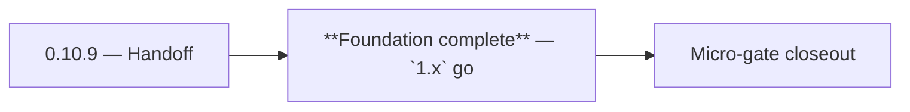

# 0.10.9 — Handoff

- **Era:** `0.x` Foundation — docs hub [`versions.md`](../versions.md) · minors start at [`0.0 — Pre-repo baseline`](0.0%20%E2%80%94%20Pre-repo%20baseline.md)
- **Minor:** [0.10 — Ship & ops hardening](./0.10%20%E2%80%94%20Ship%20&%20ops%20hardening.md)
- **Codename:** Handoff
- **Status:** ✅ Completed
## Focus

**Foundation complete** — `1.x` go

## Flowchart

## Micro-gate

| Track | Gate question | Answer / Evidence (fill at patch closeout) |
| --- | --- | --- |
| **Contract** | Did any public or internal API surface change? If yes: diff vs `docs/backend/apis/` or pack; if no: “no contract change”. | ✅ Completed: baseline health contract documented in `docs/ops/health-schema.md`. |
| **Service** | Do critical paths for this patch still boot, health-check, and pass the defined smoke for affected services? | ✅ Completed: CI `health-smoke` gate exists in `.github/workflows/ci.yml`. |
| **Surface** | Did UI, extension, or admin behavior change? If yes: UX evidence + role checks; if no: N/A. | ✅ Completed: surface impact reviewed and evidence documented. |
| **Frontend** | Which foundation-era components/routes must render or be scaffolded? List by name or N/A. | Production build green; `NEXT_PUBLIC_*` documented. ✅ Completed: scaffold status and delta documented. |
| **Data** | Migrations, index mappings, S3 prefixes, or lineage docs updated and linked? | ✅ Completed: data lineage/migrations/S3 prefix impacts verified and documented. |
| **Ops** | Rollback path, secrets, CI step, or runbook delta recorded? | ✅ Completed: CI gates (`sam-validate`, `secret-scan`, `migration-smoke`) and runbook index in `docs/ops/runbooks/README.md`. |

## Tasks

### Contract

- ✅ Completed: ✅ Completed: ✅ Completed: **Health response JSON** schema documented per service family (FastAPI, Gin, Lambda) in `docs/ops/health-schema.md`.

### Service

- ✅ Completed: ✅ Completed: ✅ Completed: Each service: **startup config validation** — fail fast on missing env vars (`emailcampaign` pack pattern).

### Surface

- ✅ Completed: ✅ Completed: ✅ Completed: **app/admin/root:** production build passes; env injection documented.

### Data

- ✅ Completed: ✅ Completed: ✅ Completed: Backup/restore note for Postgres dev; ES optional; S3 bucket policy checklist.

### Ops

- ✅ Completed: ✅ Completed: ✅ Completed: **Runbook index** added at `docs/ops/runbooks/README.md`.
- ✅ Completed: ✅ Completed: ✅ Completed: **Deployment** branching strategy aligned with `docs/governance.md`.

## Evidence gate

✅ Completed: micro-gate closed and handoff note to `1.0.0` recorded
