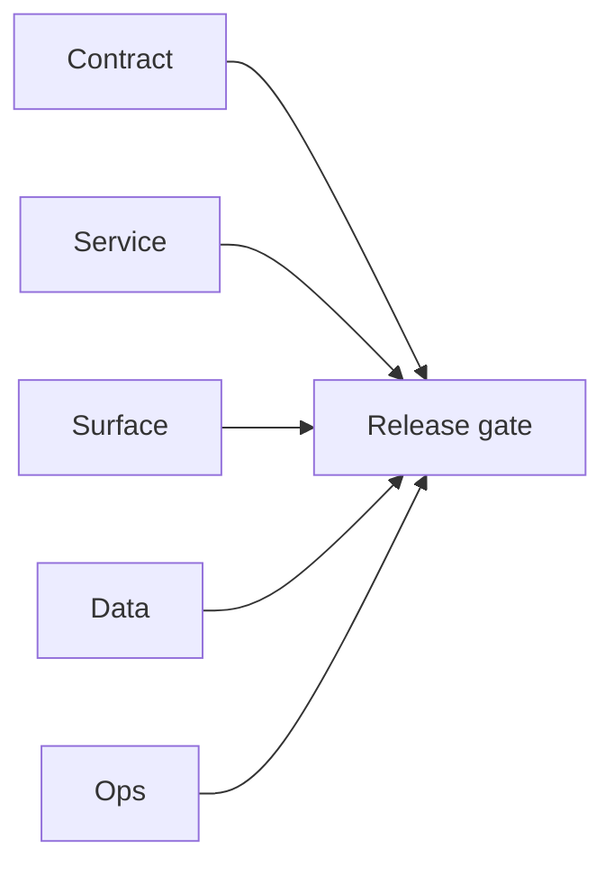

# 0.11.100 — EC2 email server foundation patch set

## Scope

Foundation patch mapping for `EC2/email.server` runtime hardening.

## Included patch intents

- `001-dockerization.patch`: baseline containerization for API/worker/redis.
- `005-config-typo-fix.patch`: `ProxyAddres` to `ProxyAddr` consistency.

## Foundation outcome

- Runtime has reproducible local boot artifacts and corrected core config naming.

## Flowchart

Five-track delivery (contract / service / surface / data / ops) for this doc:

**Master hub:** [`docs/docs/flowchart.md`](../docs/flowchart.md) — cross-system diagrams and era strip (`0.x` → `10.x`).
