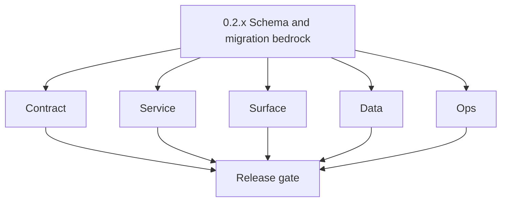
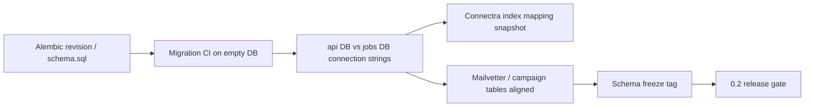

# Version 0.2 — Schema & migration bedrock
> Foundation storage policy: All Contact360 codebases route file and artifact storage through `lambda/s3storage` as the canonical storage control plane.

- **Status:** ✅ Completed
- **Era:** 0.x (Foundation and pre-product stabilization)  
- **Summary:** Alembic strategy, **Appointment360 PostgreSQL vs TKD Jobs PostgreSQL** separation, migration CI, schema-freeze policy, and foundational tables for services that will carry load in `1.x`–`2.x` (email verifier, campaign DB bootstrap).  
- **Patch closure:** Each codenamed patch file includes **Micro-gate** + **Service task slices**. Era hub: [`versions.md`](../versions.md).

## Scope

- **Target:** `0.2.0`–`0.2.9` — deterministic migrations on empty DB; no silent schema drift.
- **In scope:** `appointment360` migrations; `contact360.io/jobs` `job_node` / `edges` / `job_events`; `mailvetter` / `email campaign` schema fixes per packs; Connectra PG + ES mapping baselines.
- **Owners:** Platform data + service owners for mailvetter/campaign.
- **Out of scope:** Full billing ledger (`1.x`); campaign product UI.

## Flowchart

### Runtime focus (unique to this minor)

## Task tracks

### Contract

- 📌 Planned: **[appointment360]** — refine duplicate task (was: ✅ completed: 📌 completed: document **which db url** each ser…) | patch `0.2.0` band `0` | reason: specialize this file vs sibling patches; see docs/codebases/appointment360-codebase-analysis.md
- 📌 Planned: **[appointment360]** — refine duplicate task (was: ✅ completed: 📌 completed: version **es mappings** for contac…) | patch `0.2.0` band `0` | reason: specialize this file vs sibling patches; see docs/codebases/appointment360-codebase-analysis.md

### Service

- ✅ Completed: 📌 Completed: Apply **jobs** migration baseline per **Service task slices** on `0.2.P` patches (Jobs-focused detail under `0.6`).
- ✅ Completed: 📌 Completed: **Mailvetter:** `jobs`/`results` tables + migration ownership — see **Service task slices** on this minor’s patches.
- ✅ Completed: 📌 Completed: **Email campaign:** `schema.sql` + `templates` + `unsub_token` — see **Service task slices** on this minor’s patches.

### Surface

- 📌 Planned: **[appointment360]** — refine duplicate task (was: ✅ completed: 📌 completed: **admin:** no new product ui — opt…) | patch `0.2.0` band `0` | reason: specialize this file vs sibling patches; see docs/codebases/appointment360-codebase-analysis.md

### Data

- 📌 Planned: **[appointment360]** — refine duplicate task (was: ✅ completed: 📌 completed: **backfill strategy:** none in `0.…) | patch `0.2.0` band `0` | reason: specialize this file vs sibling patches; see docs/codebases/appointment360-codebase-analysis.md
- 📌 Planned: **[appointment360]** — refine duplicate task (was: ✅ completed: 📌 completed: **lineage docs:** add or update `d…) | patch `0.2.0` band `0` | reason: specialize this file vs sibling patches; see docs/codebases/appointment360-codebase-analysis.md

### Ops

- 📌 Planned: **[appointment360]** — refine duplicate task (was: ✅ completed: 📌 completed: ci step: `alembic upgrade head` (a…) | patch `0.2.0` band `0` | reason: specialize this file vs sibling patches; see docs/codebases/appointment360-codebase-analysis.md
- 📌 Planned: **[appointment360]** — refine duplicate task (was: ✅ completed: 📌 completed: rollback notes: downgrade or resto…) | patch `0.2.0` band `0` | reason: specialize this file vs sibling patches; see docs/codebases/appointment360-codebase-analysis.md

## Task Breakdown

| Pack | Critical tasks |
| --- | --- |
| appointment360 | User/token tables + revision chain |
| jobs | job_node, edges, job_events |
| mailvetter | PG + Redis documented; startup migrations risk logged |
| emailcampaign | Fix schema drift + GetUnsubToken pattern (per pack) |
| connectra | PG tables + ES mapping baseline |

## Immediate next execution queue

- 📌 Completed: Land **email campaign** `schema.sql` fixes before any send path in higher envs.
- 📌 Completed: Add **migration CI** ticket with failure artifact (logs).
- 📌 Completed: Publish **schema freeze** tag in `docs/versions.md`.

## Cross-service ownership

| Service | Responsibility |
| --- | --- |
| `contact360.io/api` | Alembic, gateway tables |
| `contact360.io/jobs` | Scheduler schema |
| `backend(dev)/mailvetter` | Verifier DB |
| `backend(dev)/email campaign` | Campaign DB |
| `contact360.io/sync` | contacts/companies PG + ES |

## References

- Per-patch **Service task slices**: [`0.2.0 — Quarry.md`](0.2.0%20%E2%80%94%20Quarry.md) … [`0.2.9 — Stone.md`](0.2.9%20%E2%80%94%20Stone.md) (Jobs, Mailvetter, Email campaign, Connectra, contact.ai schema rows)
- [`../codebases/jobs-codebase-analysis.md`](../codebases/jobs-codebase-analysis.md), [`../codebases/emailcampaign-codebase-analysis.md`](../codebases/emailcampaign-codebase-analysis.md)

## Backend API and Endpoint Scope

- **No new product endpoints required** — focus on **data layer** readiness; optional admin health extensions.

## Database and Data Lineage Scope

- **Alembic:** Migration baseline must be linked in closeout notes for each patch where DB changes occur.
- **Elasticsearch:** Index mapping revisions and aliases are recorded for `0.2` schema milestones.

- **PostgreSQL:** gateway, jobs, mailvetter, campaign — explicit separation.
- **Elasticsearch:** Connectra read models — mapping files checked in or linked.
- **S3:** campaign `templates/` prefix existence (`emailcampaign` pack).

Cross-reference lineage docs:
- `docs/backend/database/jobs_data_lineage.md`
- `docs/backend/database/mailvetter_data_lineage.md`
- `docs/backend/database/emailcampaign_data_lineage.md`
- `docs/backend/database/connectra_data_lineage.md`

## Frontend UX Surface Scope

- Minimal — schema work is backend-first.

## UI Elements Checklist

- N/A unless migration tooling exposes a UI (optional).

## Flow / Graph Delta for This Minor

- **Delta:** Introduces **deterministic migration CI** between gateway and workers; reduces “works on my machine” schema variance.

## Audit and Compliance Notes

- Schema changes may affect **PII storage** — classify tables in `audit-compliance.md` when users exist; foundation may be dev-only data.

## Patch ladder (`0.2.0` – `0.2.9`)

### Micro-gate reference (apply at every `0.2.P`)

| Track | Gate question (must answer Yes or document waiver) |
| --- | --- |
| **Contract** | Did any public or internal API surface change? If yes: diff vs `docs/backend/apis/` or pack; if no: attach “no contract change” note. |
| **Service** | Do critical paths for this patch still boot, health-check, and pass the defined smoke for affected services? |
| **Surface** | Did UI, extension, or admin behavior change? If yes: UX evidence + role checks; if no: note N/A. |
| **Frontend** | Which foundation-era components/routes must render or be scaffolded? List by name or mark N/A. |
| **Data** | Migrations, index mappings, S3 prefixes, or lineage docs updated and linked? |
| **Ops** | Rollback path, secrets, CI step, or runbook delta recorded? |

**Patch intent bands (typical):** `.0` charter · `.1`–`.2` scaffold · `.3`–`.5` hardening · `.6`–`.8` integration/drift · `.9` minor freeze / handoff to `0.(N+1).0`.

Theme: **Geology**. Per-patch tables: each `0.2.P — … .md` file.

| Patch | Codename | Focus | Evidence gate |
| --- | --- | --- | --- |
| `0.2.0` | Quarry | Charter + DB inventory | N/A — migration/inventory only (no frontend surface evidence in `0.2`) |
| `0.2.1` | Chisel | api Alembic head | N/A — migration/inventory only (no frontend surface evidence in `0.2`) |
| `0.2.2` | Carve | jobs tables | N/A — migration/inventory only (no frontend surface evidence in `0.2`) |
| `0.2.3` | Layer | connectra PG+ES | N/A — migration/inventory only (no frontend surface evidence in `0.2`) |
| `0.2.4` | Stratum | mailvetter schema | N/A — migration/inventory only (no frontend surface evidence in `0.2`) |
| `0.2.5` | Fossil | campaign schema fixes | N/A — migration/inventory only (no frontend surface evidence in `0.2`) |
| `0.2.6` | Bedrock | migration CI | Migration CI green on empty DB (`alembic upgrade head` + workers migrate) |
| `0.2.7` | Mineral | index/constraint review | N/A — migration/inventory only (no frontend surface evidence in `0.2`) |
| `0.2.8` | Crystal | rollback drill | N/A — rollback drill recorded (no frontend surface evidence in `0.2`) |
| `0.2.9` | Stone | Freeze + handoff `0.3` | N/A — schema freeze evidence recorded (no frontend surface evidence in `0.2`) |

## Release Gate and Evidence

### Master Task Checklist

- 📌 Completed: All target schemas apply clean on empty DB
- 📌 Completed: `docs/versions.md` updated

### Backend API and Endpoints

- 📌 Completed: “No API change” or diff attached

### Database and Data Lineage

- 📌 Completed: Table/list + ER notes or links

### Frontend UX

- 📌 Completed: N/A or minor admin note

### UI Elements

- 📌 Completed: N/A default

### Flow and Graph

- 📌 Completed: Migration flow diagram current

### Validation

- 📌 Completed: CI green on migration job

### Release Gate

- 📌 Completed: Sign-off for **0.3 Service mesh contracts**

## Patches

| Patch | Codename | Doc |
| --- | --- | --- |
| `0.2.0` | Quarry | [`0.2.0` — Quarry](0.2.0%20%E2%80%94%20Quarry.md) |
| `0.2.1` | Chisel | [`0.2.1` — Chisel](0.2.1%20%E2%80%94%20Chisel.md) |
| `0.2.2` | Carve | [`0.2.2` — Carve](0.2.2%20%E2%80%94%20Carve.md) |
| `0.2.3` | Layer | [`0.2.3` — Layer](0.2.3%20%E2%80%94%20Layer.md) |
| `0.2.4` | Stratum | [`0.2.4` — Stratum](0.2.4%20%E2%80%94%20Stratum.md) |
| `0.2.5` | Fossil | [`0.2.5` — Fossil](0.2.5%20%E2%80%94%20Fossil.md) |
| `0.2.6` | Bedrock | [`0.2.6` — Bedrock](0.2.6%20%E2%80%94%20Bedrock.md) |
| `0.2.7` | Mineral | [`0.2.7` — Mineral](0.2.7%20%E2%80%94%20Mineral.md) |
| `0.2.8` | Crystal | [`0.2.8` — Crystal](0.2.8%20%E2%80%94%20Crystal.md) |
| `0.2.9` | Stone | [`0.2.9` — Stone](0.2.9%20%E2%80%94%20Stone.md) |
