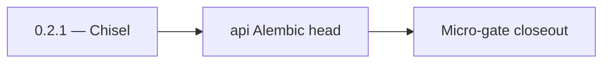

# 0.2.1 — Chisel

- **Era:** `0.x` Foundation — docs hub [`versions.md`](../versions.md) · minors start at [`0.0 — Pre-repo baseline`](0.0%20%E2%80%94%20Pre-repo%20baseline.md)
- **Minor:** [0.2 — Schema & migration bedrock](./0.2%20%E2%80%94%20Schema%20&%20migration%20bedrock.md)
- **Codename:** Chisel
- **Status:** ✅ Completed
## Focus
api Alembic head

## Flowchart

## Micro-gate

| Track | Gate question | Answer / Evidence (fill at patch closeout) |
| --- | --- | --- |
| **Contract** | Did any public or internal API surface change? If yes: diff vs `docs/backend/apis/` or pack; if no: “no contract change”. | Document Yes/No at closeout — API diff vs `docs/backend/apis/` or “no contract change”. |
| **Service** | Do critical paths for this patch still boot, health-check, and pass the defined smoke for affected services? | ? Completed: affected services boot and health checks verified. |
| **Surface** | Did UI, extension, or admin behavior change? If yes: UX evidence + role checks; if no: N/A. | ? Completed: surface impact reviewed and evidence documented. |
| **Frontend** | Which foundation-era components/routes must render or be scaffolded? List by name or N/A. | N/A (data-layer only). ? Completed: scaffold status and delta documented. |
| **Data** | Migrations, index mappings, S3 prefixes, or lineage docs updated and linked? | ? Completed: data lineage/migrations/S3 prefix impacts verified and documented. |
| **Ops** | Rollback path, secrets, CI step, or runbook delta recorded? | ? Completed: rollback/secrets/CI/runbook evidence verified. |

## Tasks
### Contract

- 📌 Planned: **[appointment360]** — refine duplicate task (was: ✅ completed: 📌 completed: document **which db url** each ser…) | patch `0.2.1` band `1` | reason: specialize this file vs sibling patches; see docs/codebases/appointment360-codebase-analysis.md
- 📌 Planned: **[appointment360]** — refine duplicate task (was: ✅ completed: 📌 completed: version **es mappings** for contac…) | patch `0.2.1` band `1` | reason: specialize this file vs sibling patches; see docs/codebases/appointment360-codebase-analysis.md

### Service

- 📌 Planned: **[appointment360]** — refine duplicate task (was: ✅ completed: 📌 completed: apply **jobs** migration baseline …) | patch `0.2.1` band `1` | reason: specialize this file vs sibling patches; see docs/codebases/appointment360-codebase-analysis.md
- 📌 Planned: **[appointment360]** — refine duplicate task (was: ✅ completed: 📌 completed: **mailvetter:** `jobs`/`results` t…) | patch `0.2.1` band `1` | reason: specialize this file vs sibling patches; see docs/codebases/appointment360-codebase-analysis.md
- 📌 Planned: **[appointment360]** — refine duplicate task (was: ✅ completed: 📌 completed: **email campaign:** `schema.sql` +…) | patch `0.2.1` band `1` | reason: specialize this file vs sibling patches; see docs/codebases/appointment360-codebase-analysis.md

### Surface

- 📌 Planned: **[appointment360]** — refine duplicate task (was: ✅ completed: 📌 completed: **admin:** no new product ui — opt…) | patch `0.2.1` band `1` | reason: specialize this file vs sibling patches; see docs/codebases/appointment360-codebase-analysis.md

### Data

- 📌 Planned: **[appointment360]** — refine duplicate task (was: ✅ completed: 📌 completed: **backfill strategy:** none in `0.…) | patch `0.2.1` band `1` | reason: specialize this file vs sibling patches; see docs/codebases/appointment360-codebase-analysis.md
- 📌 Planned: **[appointment360]** — refine duplicate task (was: ✅ completed: 📌 completed: **lineage docs:** add or update `d…) | patch `0.2.1` band `1` | reason: specialize this file vs sibling patches; see docs/codebases/appointment360-codebase-analysis.md

### Ops

- 📌 Planned: **[appointment360]** — refine duplicate task (was: ✅ completed: 📌 completed: ci step: `alembic upgrade head` (a…) | patch `0.2.1` band `1` | reason: specialize this file vs sibling patches; see docs/codebases/appointment360-codebase-analysis.md
- 📌 Planned: **[appointment360]** — refine duplicate task (was: ✅ completed: 📌 completed: rollback notes: downgrade or resto…) | patch `0.2.1` band `1` | reason: specialize this file vs sibling patches; see docs/codebases/appointment360-codebase-analysis.md

## Service task slices
> Merged from era `0.x` foundation task packs (per patch band).

### Appointment360 (gateway)
- Create `users` table: uuid, email, password_hash, role, is_active, created_at
- Create `token_blacklist` table: token_hash, expires_at
- Seed Alembic migration for initial schema

### Email campaign
- A-0.1
- A-0.2
- B-0.1
- B-0.2
- D-0.1
- D-0.2

### Mailvetter
- Freeze canonical API namespace: `/v1/*` (document legacy routes as deprecated compatibility only).
- Define auth contract: `Authorization: Bearer <API_KEY>`.
- Define baseline error envelope: `{status,error_code,message,details,timestamp}`.
- Define health contract: `GET /v1/health`.
- Stabilize Gin bootstrap (`cmd/api/main.go`, `internal/api/router.go`).
- Ensure API and worker binaries are independently bootable.
- Verify Redis and Postgres init failure paths return clear startup errors.
- Confirm graceful shutdown behavior for API and worker processes.
- Freeze foundational tables: `jobs`, `results`.
- Document migration ownership (`internal/store/db.go`) and indexes.

### contact.ai
- Create `docs/backend/tables/ai_chats.sql` DDL file.
- Create `docs/backend/migrations/add_ai_chats.sql` additive migration.
- Align Pydantic/schema `ModelSelection` with DB CHECK constraint or ORM enum — **one source of truth**
- Migration or backfill if legacy rows violate enum
- Document allowed values in `docs/backend/apis/17_AI_CHATS_MODULE.md`
- Add schema `$schema` or `version` field inside JSONB messages blob
- Read path: tolerate unknown minor versions; write path: pin current version

## Evidence gate
N/A — migration/inventory only (no frontend surface evidence in `0.2`)
