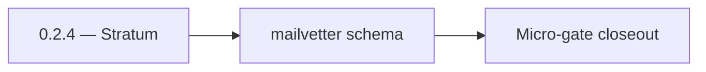

# 0.2.4 — Stratum

- **Era:** `0.x` Foundation — docs hub [`versions.md`](../versions.md) · minors start at [`0.0 — Pre-repo baseline`](0.0%20%E2%80%94%20Pre-repo%20baseline.md)
- **Minor:** [0.2 — Schema & migration bedrock](./0.2%20%E2%80%94%20Schema%20&%20migration%20bedrock.md)
- **Codename:** Stratum
- **Status:** ✅ Completed
## Focus
mailvetter schema

## Flowchart

## Micro-gate

| Track | Gate question | Answer / Evidence (fill at patch closeout) |
| --- | --- | --- |
| **Contract** | Did any public or internal API surface change? If yes: diff vs `docs/backend/apis/` or pack; if no: “no contract change”. | Document Yes/No at closeout — API diff vs `docs/backend/apis/` or “no contract change”. |
| **Service** | Do critical paths for this patch still boot, health-check, and pass the defined smoke for affected services? | ? Completed: affected services boot and health checks verified. |
| **Surface** | Did UI, extension, or admin behavior change? If yes: UX evidence + role checks; if no: N/A. | ? Completed: surface impact reviewed and evidence documented. |
| **Frontend** | Which foundation-era components/routes must render or be scaffolded? List by name or N/A. | N/A (data-layer only). ? Completed: scaffold status and delta documented. |
| **Data** | Migrations, index mappings, S3 prefixes, or lineage docs updated and linked? | ? Completed: data lineage/migrations/S3 prefix impacts verified and documented. |
| **Ops** | Rollback path, secrets, CI step, or runbook delta recorded? | ? Completed: rollback/secrets/CI/runbook evidence verified. |

## Tasks
### Contract

- 📌 Planned: **[appointment360]** — refine duplicate task (was: ✅ completed: 📌 completed: document **which db url** each ser…) | patch `0.2.4` band `4` | reason: specialize this file vs sibling patches; see docs/codebases/appointment360-codebase-analysis.md
- 📌 Planned: **[appointment360]** — refine duplicate task (was: ✅ completed: 📌 completed: version **es mappings** for contac…) | patch `0.2.4` band `4` | reason: specialize this file vs sibling patches; see docs/codebases/appointment360-codebase-analysis.md

### Service

- 📌 Planned: **[appointment360]** — refine duplicate task (was: ✅ completed: 📌 completed: apply **jobs** migration baseline …) | patch `0.2.4` band `4` | reason: specialize this file vs sibling patches; see docs/codebases/appointment360-codebase-analysis.md
- 📌 Planned: **[appointment360]** — refine duplicate task (was: ✅ completed: 📌 completed: **mailvetter:** `jobs`/`results` t…) | patch `0.2.4` band `4` | reason: specialize this file vs sibling patches; see docs/codebases/appointment360-codebase-analysis.md
- 📌 Planned: **[appointment360]** — refine duplicate task (was: ✅ completed: 📌 completed: **email campaign:** `schema.sql` +…) | patch `0.2.4` band `4` | reason: specialize this file vs sibling patches; see docs/codebases/appointment360-codebase-analysis.md

### Surface

- 📌 Planned: **[appointment360]** — refine duplicate task (was: ✅ completed: 📌 completed: **admin:** no new product ui — opt…) | patch `0.2.4` band `4` | reason: specialize this file vs sibling patches; see docs/codebases/appointment360-codebase-analysis.md

### Data

- 📌 Planned: **[appointment360]** — refine duplicate task (was: ✅ completed: 📌 completed: **backfill strategy:** none in `0.…) | patch `0.2.4` band `4` | reason: specialize this file vs sibling patches; see docs/codebases/appointment360-codebase-analysis.md
- 📌 Planned: **[appointment360]** — refine duplicate task (was: ✅ completed: 📌 completed: **lineage docs:** add or update `d…) | patch `0.2.4` band `4` | reason: specialize this file vs sibling patches; see docs/codebases/appointment360-codebase-analysis.md

### Ops

- 📌 Planned: **[appointment360]** — refine duplicate task (was: ✅ completed: 📌 completed: ci step: `alembic upgrade head` (a…) | patch `0.2.4` band `4` | reason: specialize this file vs sibling patches; see docs/codebases/appointment360-codebase-analysis.md
- 📌 Planned: **[appointment360]** — refine duplicate task (was: ✅ completed: 📌 completed: rollback notes: downgrade or resto…) | patch `0.2.4` band `4` | reason: specialize this file vs sibling patches; see docs/codebases/appointment360-codebase-analysis.md

## Service task slices
> Merged from era `0.x` foundation task packs (per patch band).

### Appointment360 (gateway)
- Document all table column types and constraints in `docs/backend/database/tables/`

### Email campaign
- A-0.3
- B-0.3
- B-0.4
- B-0.5
- B-0.6
- C-0.1
- C-0.2
- D-0.3
- D-0.4
- E-0.1
- E-0.2
- E-0.3
- E-0.4

### Mailvetter
- Keep `static/index.html` as legacy operator UI only; mark as non-product UI (no customer dashboard routes).
- Add explicit “legacy UI” banner and route ownership note in docs, confirming no `/dashboard`/product navigation exists in `0.x`.
- Add schema checksum validation for startup.
- Lock Docker build and compose baseline (API+worker+redis+postgres).
- Add smoke checks for `/v1/health`, queue push/pop, DB write/read.

### contact.ai
- Validate `ai_chats.user_id` FK reference to `users.uuid` in migration script.
- Review JSONB `messages` column default value and index strategy.
- Optional JSON Schema file checked into `docs/backend/` or `app/schemas/`

## Evidence gate
N/A — migration/inventory only (no frontend surface evidence in `0.2`)
