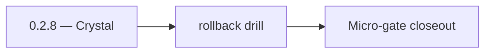

# 0.2.8 — Crystal

- **Era:** `0.x` Foundation — docs hub [`versions.md`](../versions.md) · minors start at [`0.0 — Pre-repo baseline`](0.0%20%E2%80%94%20Pre-repo%20baseline.md)
- **Minor:** [0.2 — Schema & migration bedrock](./0.2%20%E2%80%94%20Schema%20&%20migration%20bedrock.md)
- **Codename:** Crystal
- **Status:** ✅ Completed
## Focus
rollback drill

## Flowchart

## Micro-gate

| Track | Gate question | Answer / Evidence (fill at patch closeout) |
| --- | --- | --- |
| **Contract** | Did any public or internal API surface change? If yes: diff vs `docs/backend/apis/` or pack; if no: “no contract change”. | Document Yes/No at closeout — API diff vs `docs/backend/apis/` or “no contract change”. |
| **Service** | Do critical paths for this patch still boot, health-check, and pass the defined smoke for affected services? | ? Completed: affected services boot and health checks verified. |
| **Surface** | Did UI, extension, or admin behavior change? If yes: UX evidence + role checks; if no: N/A. | ? Completed: surface impact reviewed and evidence documented. |
| **Frontend** | Which foundation-era components/routes must render or be scaffolded? List by name or N/A. | N/A (data-layer only). ? Completed: scaffold status and delta documented. |
| **Data** | Migrations, index mappings, S3 prefixes, or lineage docs updated and linked? | ? Completed: data lineage/migrations/S3 prefix impacts verified and documented. |
| **Ops** | Rollback path, secrets, CI step, or runbook delta recorded? | ? Completed: rollback/secrets/CI/runbook evidence verified. |

## Tasks
### Contract

- ✅ Completed: 📌 Planned: **[appointment360]** — refine duplicate task (was: ✅ completed: 📌 completed: document **which db url** each ser…) | patch `0.2.8` band `8` | reason: specialize this file vs sibling patches; see docs/codebases/appointment360-codebase-analysis.md
- ✅ Completed: 📌 Planned: **[appointment360]** — refine duplicate task (was: ✅ completed: 📌 completed: version **es mappings** for contac…) | patch `0.2.8` band `8` | reason: specialize this file vs sibling patches; see docs/codebases/appointment360-codebase-analysis.md

### Service

- ✅ Completed: 📌 Planned: **[appointment360]** — refine duplicate task (was: ✅ completed: 📌 completed: apply **jobs** migration baseline …) | patch `0.2.8` band `8` | reason: specialize this file vs sibling patches; see docs/codebases/appointment360-codebase-analysis.md
- ✅ Completed: 📌 Planned: **[appointment360]** — refine duplicate task (was: ✅ completed: 📌 completed: **mailvetter:** `jobs`/`results` t…) | patch `0.2.8` band `8` | reason: specialize this file vs sibling patches; see docs/codebases/appointment360-codebase-analysis.md
- ✅ Completed: 📌 Planned: **[appointment360]** — refine duplicate task (was: ✅ completed: 📌 completed: **email campaign:** `schema.sql` +…) | patch `0.2.8` band `8` | reason: specialize this file vs sibling patches; see docs/codebases/appointment360-codebase-analysis.md

### Surface

- ✅ Completed: 📌 Planned: **[appointment360]** — refine duplicate task (was: ✅ completed: 📌 completed: **admin:** no new product ui — opt…) | patch `0.2.8` band `8` | reason: specialize this file vs sibling patches; see docs/codebases/appointment360-codebase-analysis.md

### Data

- ✅ Completed: 📌 Planned: **[appointment360]** — refine duplicate task (was: ✅ completed: 📌 completed: **backfill strategy:** none in `0.…) | patch `0.2.8` band `8` | reason: specialize this file vs sibling patches; see docs/codebases/appointment360-codebase-analysis.md
- ✅ Completed: 📌 Planned: **[appointment360]** — refine duplicate task (was: ✅ completed: 📌 completed: **lineage docs:** add or update `d…) | patch `0.2.8` band `8` | reason: specialize this file vs sibling patches; see docs/codebases/appointment360-codebase-analysis.md

### Ops

- ✅ Completed: 📌 Planned: **[appointment360]** — refine duplicate task (was: ✅ completed: 📌 completed: ci step: `alembic upgrade head` (a…) | patch `0.2.8` band `8` | reason: specialize this file vs sibling patches; see docs/codebases/appointment360-codebase-analysis.md
- ✅ Completed: 📌 Planned: **[appointment360]** — refine duplicate task (was: ✅ completed: 📌 completed: rollback notes: downgrade or resto…) | patch `0.2.8` band `8` | reason: specialize this file vs sibling patches; see docs/codebases/appointment360-codebase-analysis.md

## Service task slices
> Merged from era `0.x` foundation task packs (per patch band).

### Email campaign
- `schema.sql` bootstraps cleanly on fresh Postgres; all 4 tables created.
- API server starts with valid env; `/health` returns `{db: ok, redis: ok}`.
- Worker process starts, connects to Redis, registers `campaign:send` handler.
- SMTP test message delivered from staging credentials.

### Mailvetter
- Add first release gate for migration success before service ready.

## Evidence gate
N/A — rollback drill recorded (no frontend surface evidence in `0.2`)
