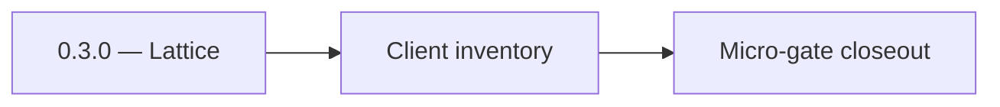

# 0.3.0 — Lattice

- **Era:** `0.x` Foundation — docs hub [`versions.md`](../versions.md) · minors start at [`0.0 — Pre-repo baseline`](0.0%20%E2%80%94%20Pre-repo%20baseline.md)
- **Minor:** [0.3 — Service mesh contracts](./0.3%20%E2%80%94%20Service%20mesh%20contracts.md)
- **Codename:** Lattice
- **Status:** ✅ Completed
## Focus
Client inventory

## Flowchart

## Micro-gate

| Track | Gate question | Answer / Evidence (fill at patch closeout) |
| --- | --- | --- |
| **Contract** | Did any public or internal API surface change? If yes: diff vs `docs/backend/apis/` or pack; if no: “no contract change”. | Document Yes/No at closeout — API diff vs `docs/backend/apis/` or “no contract change”. |
| **Service** | Do critical paths for this patch still boot, health-check, and pass the defined smoke for affected services? | ? Completed: affected services boot and health checks verified. |
| **Surface** | Did UI, extension, or admin behavior change? If yes: UX evidence + role checks; if no: N/A. | ? Completed: surface impact reviewed and evidence documented. |
| **Frontend** | Which foundation-era components/routes must render or be scaffolded? List by name or N/A. | `lib/toast.ts`, `lib/apiErrorHandler.ts`, error `Alert` pattern. ? Completed: scaffold status and delta documented. |
| **Data** | Migrations, index mappings, S3 prefixes, or lineage docs updated and linked? | ? Completed: data lineage/migrations/S3 prefix impacts verified and documented. |
| **Ops** | Rollback path, secrets, CI step, or runbook delta recorded? | ? Completed: rollback/secrets/CI/runbook evidence verified. |

## Tasks
### Contract

- 📌 Planned: **[appointment360]** — refine duplicate task (was: 📌 planned: **[appointment360]** — refine duplicate task (was…) | patch `0.3.0` band `0` | reason: specialize this file vs sibling patches; see docs/codebases/appointment360-codebase-analysis.md
- 📌 Planned: **[appointment360]** — refine duplicate task (was: 📌 planned: **[appointment360]** — refine duplicate task (was…) | patch `0.3.0` band `0` | reason: specialize this file vs sibling patches; see docs/codebases/appointment360-codebase-analysis.md
- 📌 Planned: **[appointment360]** — refine duplicate task (was: 📌 planned: **[appointment360]** — refine duplicate task (was…) | patch `0.3.0` band `0` | reason: specialize this file vs sibling patches; see docs/codebases/appointment360-codebase-analysis.md

### Service

- 📌 Planned: **[appointment360]** — refine duplicate task (was: 📌 planned: **[appointment360]** — refine duplicate task (was…) | patch `0.3.0` band `0` | reason: specialize this file vs sibling patches; see docs/codebases/appointment360-codebase-analysis.md
- 📌 Planned: **[appointment360]** — refine duplicate task (was: 📌 planned: **[appointment360]** — refine duplicate task (was…) | patch `0.3.0` band `0` | reason: specialize this file vs sibling patches; see docs/codebases/appointment360-codebase-analysis.md
- 📌 Planned: **[appointment360]** — refine duplicate task (was: 📌 planned: **[appointment360]** — refine duplicate task (was…) | patch `0.3.0` band `0` | reason: specialize this file vs sibling patches; see docs/codebases/appointment360-codebase-analysis.md

### Surface

- 📌 Planned: **[appointment360]** — refine duplicate task (was: 📌 planned: **[appointment360]** — refine duplicate task (was…) | patch `0.3.0` band `0` | reason: specialize this file vs sibling patches; see docs/codebases/appointment360-codebase-analysis.md

### Data

- 📌 Planned: **[appointment360]** — refine duplicate task (was: 📌 planned: **[appointment360]** — refine duplicate task (was…) | patch `0.3.0` band `0` | reason: specialize this file vs sibling patches; see docs/codebases/appointment360-codebase-analysis.md

### Ops

- 📌 Planned: **[appointment360]** — refine duplicate task (was: 📌 planned: **[appointment360]** — refine duplicate task (was…) | patch `0.3.0` band `0` | reason: specialize this file vs sibling patches; see docs/codebases/appointment360-codebase-analysis.md

## Service task slices
> Merged from era `0.x` foundation task packs (per patch band).

### contact.ai
- Define `contact.ai` OpenAPI spec stub (paths, auth headers, version prefix `/api/v1`).
- Document `X-API-Key` and `X-User-ID` header contracts in `docs/backend/apis/17_AI_CHATS_MODULE.md`.
- Stub health endpoint contract: `GET /health` → `{"status":"ok"}`, `GET /health/db` → DB connectivity.
- Scaffold FastAPI app in `backend(dev)/contact.ai/app/main.py` with Mangum Lambda handler.
- Wire `app/core/config.py` for all env vars (`DATABASE_URL`, `API_KEY`, `HF_API_KEY`, `GEMINI_API_KEY`, `HF_CHAT_MODEL`).
- Implement `GET /health` and `GET /health/db` endpoints.
- When falling back across inference providers, emit **structured log** + user-visible degraded flag where product allows

### emailapis / emailapigo
- Define and freeze **`0.x`** email endpoint and payload compatibility notes (finder, verifier, pattern, health).
- Update endpoint/reference matrix in `docs/backend/endpoints/emailapis_endpoint_era_matrix.json`.
- Align error envelope and auth header contract with `appointment360` GraphQL clients that call these Lambdas.
- Implement/validate runtime behavior for **`0.x`** finder, verifier, pattern, and fallback paths.
- Verify auth, provider routing, error envelope, and health diagnostics behavior.
- Confirm `lambda/emailapigo` parity with shared models / expectations documented for `lambda/emailapis` where both are in scope.
- Document `email_finder_cache` and `email_patterns` lineage impact for **`0.x`**.
- Record provider, status, and traceability expectations for this era.
- Maintain matrix: endpoint × field × Python vs Go behavior (finder, verifier, pattern, bulk)
- Document **which** runtime is canonical for each route in `0.x`
- Single table: provider raw status → **platform** status enum (per finder/verifier)
- GraphQL mapping doc for Appointment360 consumers
- Golden bulk fixture: N≥100 emails — compare counts, ordering guarantees, partial failure behavior
- Idempotency: repeat submission policy documented
- Accept propagate **`X-Request-ID`** (and optional traceparent) from gateway
- Include id in **all** provider call logs and error envelopes

### logs.api
- Define and freeze **`0.x`** log **event envelope** (required fields, optional metadata, versioning if any).
- Update **`docs/backend/endpoints/logsapi_endpoint_era_matrix.json`** for `0.x` read/write/query routes.
- Confirm **auth** model for write vs query (API key, internal network, future tenant scope) and document in `lambda/logs.api/docs/api.md`.
- Validate/implement service behavior for **`0.x`** event sources (gateway, jobs, selected Lambdas) and minimal query filters.
- Verify **error envelope** and **health** behavior for consumers (`/health` or equivalent).
- Align with **correlation**: `request_id`, `trace_id` propagation expectations from `contact360.io/api` middleware where applicable.
- Document **S3 CSV** layout, **prefix** (`logs/` or as implemented), **retention** policy target for `0.x`.
- Record **query window** defaults (e.g. last N days) and performance expectations.
- Cross-link **`docs/backend/database/logsapi_data_lineage.md`**; explicitly **no MongoDB** as canonical logs store.
- Add **observability**: error rate, write lag, S3 upload failures (whatever is available in `0.x`).
- Purge stale **MongoDB** references from internal docs / READMEs
- Cross-link [`docs/backend/database/logsapi_data_lineage.md`](../backend/database/logsapi_data_lineage.md) and `lambda/logs.api/docs/api.md` in PR template
- Writer path: explicit **bucket + prefix** per env in `.env.example`
- Document single writer vs reader keys if split
- Rotation runbook: dual-key acceptance window → retire old key
- No key in client-side dashboard bundles
- Pagination contract: `limit` / `cursor` / `next_page_token` — **hard caps**
- Default **time window** for queries; document Big-O / scan avoidance
- If in-memory cache used for reads: TTL + **invalidate on write** policy
- PII in log body fields — classification + redaction rules (`audit-compliance.md`)
- Tenant isolation: query filters must include tenant/service identifier where applicable

## Evidence gate
Primary charter artifact created and linked in the parent minor doc
