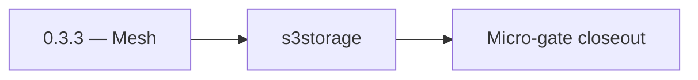

# 0.3.3 — Mesh

- **Era:** `0.x` Foundation — docs hub [`versions.md`](../versions.md) · minors start at [`0.0 — Pre-repo baseline`](0.0%20%E2%80%94%20Pre-repo%20baseline.md)
- **Minor:** [0.3 — Service mesh contracts](./0.3%20%E2%80%94%20Service%20mesh%20contracts.md)
- **Codename:** Mesh
- **Status:** ✅ Completed
## Focus
s3storage

## Flowchart

## Micro-gate

| Track | Gate question | Answer / Evidence (fill at patch closeout) |
| --- | --- | --- |
| **Contract** | Did any public or internal API surface change? If yes: diff vs `docs/backend/apis/` or pack; if no: “no contract change”. | Document Yes/No at closeout — API diff vs `docs/backend/apis/` or “no contract change”. |
| **Service** | Do critical paths for this patch still boot, health-check, and pass the defined smoke for affected services? | ? Completed: affected services boot and health checks verified. |
| **Surface** | Did UI, extension, or admin behavior change? If yes: UX evidence + role checks; if no: N/A. | ? Completed: surface impact reviewed and evidence documented. |
| **Frontend** | Which foundation-era components/routes must render or be scaffolded? List by name or N/A. | `lib/toast.ts`, `lib/apiErrorHandler.ts`, error `Alert` pattern. ? Completed: scaffold status and delta documented. |
| **Data** | Migrations, index mappings, S3 prefixes, or lineage docs updated and linked? | ? Completed: data lineage/migrations/S3 prefix impacts verified and documented. |
| **Ops** | Rollback path, secrets, CI step, or runbook delta recorded? | ? Completed: rollback/secrets/CI/runbook evidence verified. |

## Tasks
### Contract

- ✅ Completed: 📌 Planned: **[appointment360]** — refine duplicate task (was: ✅ completed: 📌 completed: document **base urls** and env var…) | patch `0.3.3` band `3` | reason: specialize this file vs sibling patches; see docs/codebases/appointment360-codebase-analysis.md
- ✅ Completed: 📌 Planned: **[appointment360]** — refine duplicate task (was: ✅ completed: 📌 completed: **error shape:** downstream `4xx/5…) | patch `0.3.3` band `3` | reason: specialize this file vs sibling patches; see docs/codebases/appointment360-codebase-analysis.md
- ✅ Completed: 📌 Planned: **[appointment360]** — refine duplicate task (was: ✅ completed: 📌 completed: **logs.api:** confirm **s3 csv** w…) | patch `0.3.3` band `3` | reason: specialize this file vs sibling patches; see docs/codebases/appointment360-codebase-analysis.md

### Service

- ✅ Completed: 📌 Planned: **[appointment360]** — refine duplicate task (was: ✅ completed: 📌 completed: implement **consistent timeouts** …) | patch `0.3.3` band `3` | reason: specialize this file vs sibling patches; see docs/codebases/appointment360-codebase-analysis.md
- ✅ Completed: 📌 Planned: **[appointment360]** — refine duplicate task (was: ✅ completed: 📌 completed: **contact.ai:** api key header con…) | patch `0.3.3` band `3` | reason: specialize this file vs sibling patches; see docs/codebases/appointment360-codebase-analysis.md
- ✅ Completed: 📌 Planned: **[appointment360]** — refine duplicate task (was: ✅ completed: 📌 completed: **emailapis / emailapigo:** status…) | patch `0.3.3` band `3` | reason: specialize this file vs sibling patches; see docs/codebases/appointment360-codebase-analysis.md

### Surface

- ✅ Completed: 📌 Planned: **[appointment360]** — refine duplicate task (was: ✅ completed: 📌 completed: **app:** display mapped errors (ne…) | patch `0.3.3` band `3` | reason: specialize this file vs sibling patches; see docs/codebases/appointment360-codebase-analysis.md

### Data

- ✅ Completed: 📌 Planned: **[appointment360]** — refine duplicate task (was: ✅ completed: 📌 completed: trace ids propagated to logs.api p…) | patch `0.3.3` band `3` | reason: specialize this file vs sibling patches; see docs/codebases/appointment360-codebase-analysis.md

### Ops

- ✅ Completed: 📌 Planned: **[appointment360]** — refine duplicate task (was: ✅ completed: 📌 completed: secret rotation playbook for api k…) | patch `0.3.3` band `3` | reason: specialize this file vs sibling patches; see docs/codebases/appointment360-codebase-analysis.md

## Service task slices
> Merged from era `0.x` foundation task packs (per patch band).

### contact.ai
- Lock base URL convention: `LAMBDA_AI_API_URL` env var in `appointment360`.
- Create `app/api/v1/router.py` with placeholder route mounts for `ai_chats` and `ai`.
- Add CORS, GZip compression, and `TokenBucketRateLimiter` middleware stubs.
- No UI surface in `0.x`; confirm no dashboard routes reference AI chat.
- Add `LAMBDA_AI_API_URL` to dashboard env config stub (unused in `0.x`).
- Metric counter: `ai_provider_fallback_total{from,to}`
- Honor incoming `X-Request-ID` / trace headers from Appointment360; emit on outbound calls
- Document header contract in `17_AI_CHATS_MODULE.md`

### emailapis / emailapigo
- Document impacted dashboard pages/tabs/buttons/inputs/components for **`0.x`** (minimal: health/finder/verifier entry points only if exposed).
- Document relevant hooks/services/contexts and UX states (loading/error/progress/checkbox/radio).
- Capture rollback and incident-runbook notes for email-impacting releases.
- CI check or periodic diff script: shared response model keys
- Deprecation policy for status renames
- Health endpoint returns build version / git sha

### logs.api
- Confirm that there is **no product log-query UI** in `0.x` (no dashboard routes for log browsing).
- Only provide health smoke via a `healthService` stub / wiring for logging service connectivity checks.
- If admin/DocsAI tooling exists in your repo, document it as “admin-only (0.x)” and defer customer UI to later minors.
- Capture **rollback** note: disabling new writers vs replaying failed batches.
- Optional index manifest if metadata DB or auxiliary index is introduced

## Evidence gate
N/A — contract/client-focused in this patch
