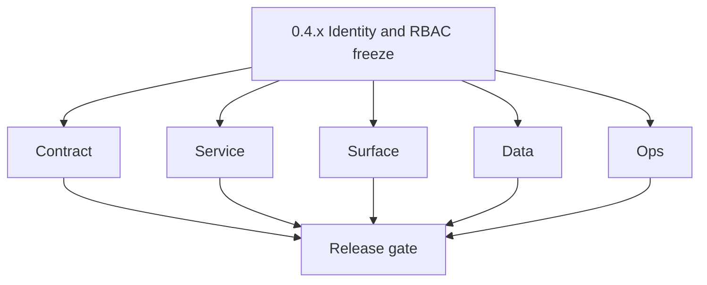
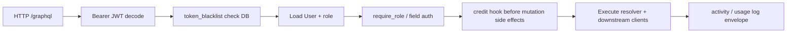

# Version 0.4 — Identity & RBAC freeze
> Foundation storage policy: All Contact360 codebases route file and artifact storage through `lambda/s3storage` as the canonical storage control plane.

- **Status:** ✅ Completed
- **Era:** 0.x (Foundation and pre-product stabilization)
- **Summary:** Freeze **JWT access + refresh**, **token blacklist** persistence, **role → resolver** enforcement, **credit deduction hooks**, and GraphQL-level guards (mutation abuse / rate limit defaults safe for prod intent). Align with [`docs/audit-compliance.md`](../audit-compliance.md) RBAC matrix.
- **Patch closure:** Each codenamed patch file includes **Micro-gate** + **Service task slices**. Era hub: [`versions.md`](../versions.md).

## Scope

- **Target:** `0.4.x` — deterministic authz for dashboard operations; no “open” mutations in staging-like envs without explicit flag.
- **In scope:** `@require_role` (or equivalent), user loader, entitlement checks before expensive downstream calls, **audit-friendly** activity logging hooks.
- **Out of scope:** Full billing SKU matrix (`1.3+`); enterprise SSO (`9.x` themes).
- **Risks (appointment360 analysis):** rate limit off by default; in-memory idempotency — document toggles and track Redis move.

## Flowchart

### Runtime focus (unique to this minor)

## Task tracks

### Contract

- 📌 Planned: **[appointment360]** — refine duplicate task (was: 📌 planned: **[appointment360]** — refine duplicate task (was…) | patch `0.4.0` band `0` | reason: specialize this file vs sibling patches; see docs/codebases/appointment360-codebase-analysis.md
- 📌 Planned: **[appointment360]** — refine duplicate task (was: 📌 planned: **[appointment360]** — refine duplicate task (was…) | patch `0.4.0` band `0` | reason: specialize this file vs sibling patches; see docs/codebases/appointment360-codebase-analysis.md

- 📌 Planned: **[appointment360]** — refine duplicate task (was: 📌 planned: **[architecture]** — product **graphql** remains …) | patch `0.4.0` band `0` | reason: specialize this file vs sibling patches; see docs/codebases/appointment360-codebase-analysis.md
### Service

- 📌 Planned: **[appointment360]** — refine duplicate task (was: 📌 planned: **[appointment360]** — refine duplicate task (was…) | patch `0.4.0` band `0` | reason: specialize this file vs sibling patches; see docs/codebases/appointment360-codebase-analysis.md
- 📌 Planned: **[appointment360]** — refine duplicate task (was: 📌 planned: **[appointment360]** — refine duplicate task (was…) | patch `0.4.0` band `0` | reason: specialize this file vs sibling patches; see docs/codebases/appointment360-codebase-analysis.md
- 📌 Planned: **[appointment360]** — refine duplicate task (was: 📌 planned: **[appointment360]** — refine duplicate task (was…) | patch `0.4.0` band `0` | reason: specialize this file vs sibling patches; see docs/codebases/appointment360-codebase-analysis.md

- 📌 Planned: **[appointment360]** — refine duplicate task (was: 📌 planned: **[architecture]** — **go/gin satellites** in sco…) | patch `0.4.0` band `0` | reason: specialize this file vs sibling patches; see docs/codebases/appointment360-codebase-analysis.md
### Surface

- 📌 Planned: **[appointment360]** — refine duplicate task (was: 📌 planned: **[appointment360]** — refine duplicate task (was…) | patch `0.4.0` band `0` | reason: specialize this file vs sibling patches; see docs/codebases/appointment360-codebase-analysis.md
- 📌 Planned: **[appointment360]** — refine duplicate task (was: 📌 planned: **[appointment360]** — refine duplicate task (was…) | patch `0.4.0` band `0` | reason: specialize this file vs sibling patches; see docs/codebases/appointment360-codebase-analysis.md

### Data

- 📌 Planned: **[appointment360]** — refine duplicate task (was: 📌 planned: **[appointment360]** — refine duplicate task (was…) | patch `0.4.0` band `0` | reason: specialize this file vs sibling patches; see docs/codebases/appointment360-codebase-analysis.md

- 📌 Planned: **[appointment360]** — refine duplicate task (was: 📌 planned: **[architecture]** — **postgresql-first** per `do…) | patch `0.4.0` band `0` | reason: specialize this file vs sibling patches; see docs/codebases/appointment360-codebase-analysis.md
### Ops

- ✅ Completed: ✅ Completed: 📌 Completed: FEATURE flags documented: `GRAPHQL_RATE_LIMIT_ENABLED` (currently `false` by default in `0.x`), etc.

- 📌 Planned: **[appointment360]** — refine duplicate task (was: 📌 planned: **[architecture]** — **observability**: correlate…) | patch `0.4.0` band `0` | reason: specialize this file vs sibling patches; see docs/codebases/appointment360-codebase-analysis.md
- 📌 Planned: **[appointment360]** — refine duplicate task (was: 📌 planned: **[architecture]** — **django docsai** (`contact3…) | patch `0.4.0` band `0` | reason: specialize this file vs sibling patches; see docs/codebases/appointment360-codebase-analysis.md
## Task Breakdown

| Area | Tasks |
| --- | --- |
| Gateway | JWT, context, guards, credit hooks |
| App | Route guards, session refresh UX |
| Admin | DocsAI login + role decorators (see admin codebase analysis gaps) |
| Audit | Event schema for login, credit spend, admin actions |

## Immediate next execution queue

- 📌 Completed: RBAC matrix row for **each** GraphQL module touched in MVP (`docs/audit-compliance.md`).
- 📌 Completed: Pen-test checklist: IDOR on jobs/contacts mutations via gateway.

## Cross-service ownership

| Service | RBAC / identity |
| --- | --- |
| `contact360.io/api` | Primary — JWT, roles, credits |
| `contact360.io/app` | UI gates |
| `contact360.io/admin` | Staff vs superuser |
| `contact360.io/sync` | API key remains service-to-service |

## References

- Per-patch **Service task slices**: [`0.4.0 — Keystone.md`](0.4.0%20%E2%80%94%20Keystone.md) … [`0.4.9 — Freeze.md`](0.4.9%20%E2%80%94%20Freeze.md)
- [`../codebases/appointment360-codebase-analysis.md`](../codebases/appointment360-codebase-analysis.md), [`../codebases/app-codebase-analysis.md`](../codebases/app-codebase-analysis.md), [`../codebases/admin-codebase-analysis.md`](../codebases/admin-codebase-analysis.md)

## Backend API and Endpoint Scope

- **GraphQL:** `auth`, `users`, `profile`, role-gated `contacts`/`companies`/`email` entry points as exists in schema.
- **HTTP:** Health unchanged; optional `2FA` modules if present.

## Database and Data Lineage Scope

- **PostgreSQL:** users, blacklist, credits/usage — migration evidence in `0.2` chain extended here.

## Frontend UX Surface Scope

- Frontend UX surface (0.4 evidence):
  - Routes:
    - `/login`
    - `/register`
    - `/dashboard` (guarded)
  - Files:
    - `context/RoleContext.tsx`
    - `hooks/useSessionGuard.ts`
    - `hooks/useLoginForm.ts`
    - `hooks/useRegisterForm.ts`
    - `lib/authValidation.ts`
    - `lib/featureAccess.ts`

## UI Elements Checklist

- 📌 Completed: `RoleContext` present and used by gates (role → UI visibility)
- 📌 Completed: Logout button in Sidebar user menu
- 📌 Completed: Session expiry redirect to `/login` (useSessionGuard)
- 📌 Completed: 403 page renders for denied routes
- 📌 Completed: Role-gated admin/sidebar item hides for non-admin users
- 📌 Completed: Rate-limit toast visible for abuse/limit responses
- 📌 Completed: `CreditBudgetAlerts` stub scaffolded (displays but no live credit/billing data in `0.x`)
- 📌 Completed: `useLoginForm` / `useRegisterForm` validation passes

## Flow / Graph Delta for This Minor

- **Delta:** Every privileged path passes through **context + explicit guard**; removes implicit trust from earlier bootstrap.

## Audit and Compliance Notes

- Wire **audit events** for authentication failures, role denials, credit burns; tenant isolation rules from `audit-compliance.md`.

## Patch ladder (`0.4.0` – `0.4.9`)

### Micro-gate reference (apply at every `0.4.P`)

| Track | Gate question (must answer Yes or document waiver) |
| --- | --- |
| **Contract** | Did any public or internal API surface change? If yes: diff vs `docs/backend/apis/` or pack; if no: attach “no contract change” note. |
| **Service** | Do critical paths for this patch still boot, health-check, and pass the defined smoke for affected services? |
| **Surface** | Did UI, extension, or admin behavior change? If yes: UX evidence + role checks; if no: note N/A. |
| **Frontend** | Which foundation-era components/routes must render or be scaffolded? List by name or mark N/A. |
| **Data** | Migrations, index mappings, S3 prefixes, or lineage docs updated and linked? |
| **Ops** | Rollback path, secrets, CI step, or runbook delta recorded? |

**Patch intent bands (typical):** `.0` charter · `.1`–`.2` scaffold · `.3`–`.5` hardening · `.6`–`.8` integration/drift · `.9` minor freeze / handoff to `0.(N+1).0`.

Theme: **Locksmith**. Per-patch tables: each `0.4.P — … .md` file.

| Patch | Codename | Focus | Evidence gate |
| --- | --- | --- | --- |
| `0.4.0` | Keystone | RBAC charter | N/A — charter/frontier planning |
| `0.4.1` | Cipher | JWT + blacklist | JWT decode smoke in `lib/tokenManager.ts` |
| `0.4.2` | Badge | Context loaders | N/A — context loader wiring only |
| `0.4.3` | Guard | Resolver decorators | Role-gated sidebar item renders null for non-admin |
| `0.4.4` | Vault | Credit hook | N/A — credit hook contract |
| `0.4.5` | Token | Rate limit defaults | N/A — wiring/config evidence (UI toast in `.7`/`.8` gates) |
| `0.4.6` | Shield | Abuse guard plan | N/A — guard plan executed |
| `0.4.7` | Sentinel | App route parity | App route parity smoke (2 roles) |
| `0.4.8` | Lock | Admin RBAC | Admin Django login works |
| `0.4.9` | Freeze | Handoff `0.5` | N/A — handoff preparation |

## Release Gate and Evidence

### Master Task Checklist

- 📌 Completed: RBAC doc + implementation reviewed together

### Backend API and Endpoints

- 📌 Completed: Matrix: operation → roles

### Database and Data Lineage

- 📌 Completed: Credit usage rows traceable

### Frontend UX

- 📌 Completed: Role visibility tests

### UI Elements

- 📌 Completed: Checklist done

### Flow and Graph

- 📌 Completed: Auth lifecycle diagram matches code

### Validation

- 📌 Completed: Automated tests for denied/unauth paths

### Release Gate

- 📌 Completed: Sign-off for **0.5 Object storage plane**

## Patches

| Patch | Codename | Doc |
| --- | --- | --- |
| `0.4.0` | Keystone | [`0.4.0` — Keystone](0.4.0%20%E2%80%94%20Keystone.md) |
| `0.4.1` | Cipher | [`0.4.1` — Cipher](0.4.1%20%E2%80%94%20Cipher.md) |
| `0.4.2` | Badge | [`0.4.2` — Badge](0.4.2%20%E2%80%94%20Badge.md) |
| `0.4.3` | Guard | [`0.4.3` — Guard](0.4.3%20%E2%80%94%20Guard.md) |
| `0.4.4` | Vault | [`0.4.4` — Vault](0.4.4%20%E2%80%94%20Vault.md) |
| `0.4.5` | Token | [`0.4.5` — Token](0.4.5%20%E2%80%94%20Token.md) |
| `0.4.6` | Shield | [`0.4.6` — Shield](0.4.6%20%E2%80%94%20Shield.md) |
| `0.4.7` | Sentinel | [`0.4.7` — Sentinel](0.4.7%20%E2%80%94%20Sentinel.md) |
| `0.4.8` | Lock | [`0.4.8` — Lock](0.4.8%20%E2%80%94%20Lock.md) |
| `0.4.9` | Freeze | [`0.4.9` — Freeze](0.4.9%20%E2%80%94%20Freeze.md) |
