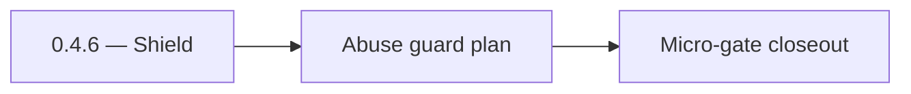

# 0.4.6 — Shield

- **Era:** `0.x` Foundation — docs hub [`versions.md`](../versions.md) · minors start at [`0.0 — Pre-repo baseline`](0.0%20%E2%80%94%20Pre-repo%20baseline.md)
- **Minor:** [0.4 — Identity & RBAC freeze](./0.4%20%E2%80%94%20Identity%20&%20RBAC%20freeze.md)
- **Codename:** Shield
- **Status:** ✅ Completed
## Focus
Abuse guard plan

## Flowchart

## Micro-gate

| Track | Gate question | Answer / Evidence (fill at patch closeout) |
| --- | --- | --- |
| **Contract** | Did any public or internal API surface change? If yes: diff vs `docs/backend/apis/` or pack; if no: “no contract change”. | Document Yes/No at closeout — API diff vs `docs/backend/apis/` or “no contract change”. |
| **Service** | Do critical paths for this patch still boot, health-check, and pass the defined smoke for affected services? | ? Completed: affected services boot and health checks verified. |
| **Surface** | Did UI, extension, or admin behavior change? If yes: UX evidence + role checks; if no: N/A. | ? Completed: surface impact reviewed and evidence documented. |
| **Frontend** | Which foundation-era components/routes must render or be scaffolded? List by name or N/A. | `RoleContext`, logout, session redirect, 403 page, rate-limit toast. ? Completed: scaffold status and delta documented. |
| **Data** | Migrations, index mappings, S3 prefixes, or lineage docs updated and linked? | ? Completed: data lineage/migrations/S3 prefix impacts verified and documented. |
| **Ops** | Rollback path, secrets, CI step, or runbook delta recorded? | ? Completed: rollback/secrets/CI/runbook evidence verified. |

## Tasks
### Contract

- ✅ Completed: 📌 Planned: **[appointment360]** — refine duplicate task (was: ✅ completed: 📌 completed: graphql **error codes** for `unaut…) | patch `0.4.6` band `6` | reason: specialize this file vs sibling patches; see docs/codebases/appointment360-codebase-analysis.md
- ✅ Completed: 📌 Planned: **[appointment360]** — refine duplicate task (was: ✅ completed: 📌 completed: **connectra / jobs** — document th…) | patch `0.4.6` band `6` | reason: specialize this file vs sibling patches; see docs/codebases/appointment360-codebase-analysis.md

### Service

- ✅ Completed: 📌 Planned: **[appointment360]** — refine duplicate task (was: ✅ completed: 📌 completed: enforce **blacklist** on refresh/l…) | patch `0.4.6` band `6` | reason: specialize this file vs sibling patches; see docs/codebases/appointment360-codebase-analysis.md
- ✅ Completed: 📌 Planned: **[appointment360]** — refine duplicate task (was: ✅ completed: 📌 completed: **credit deduction:** atomic with …) | patch `0.4.6` band `6` | reason: specialize this file vs sibling patches; see docs/codebases/appointment360-codebase-analysis.md
- ✅ Completed: 📌 Planned: **[appointment360]** — refine duplicate task (was: ✅ completed: 📌 completed: production readiness: **rate limit…) | patch `0.4.6` band `6` | reason: specialize this file vs sibling patches; see docs/codebases/appointment360-codebase-analysis.md

### Surface

- ✅ Completed: 📌 Planned: **[appointment360]** — refine duplicate task (was: ✅ completed: 📌 completed: **app:** role-based page visibilit…) | patch `0.4.6` band `6` | reason: specialize this file vs sibling patches; see docs/codebases/appointment360-codebase-analysis.md
- ✅ Completed: 📌 Planned: **[appointment360]** — refine duplicate task (was: ✅ completed: 📌 completed: **admin:** operator roles vs tenan…) | patch `0.4.6` band `6` | reason: specialize this file vs sibling patches; see docs/codebases/appointment360-codebase-analysis.md

### Data

- ✅ Completed: 📌 Planned: **[appointment360]** — refine duplicate task (was: ✅ completed: 📌 completed: `users`, `token_blacklist`, usage/…) | patch `0.4.6` band `6` | reason: specialize this file vs sibling patches; see docs/codebases/appointment360-codebase-analysis.md

### Ops

- ✅ Completed: 📌 Planned: **[appointment360]** — refine duplicate task (was: ✅ completed: 📌 completed: feature flags documented: `graphql…) | patch `0.4.6` band `6` | reason: specialize this file vs sibling patches; see docs/codebases/appointment360-codebase-analysis.md

## Service task slices
> Merged from era `0.x` foundation task packs (RBAC/auth track).

### Appointment360 (gateway auth/RBAC)
- Freeze GraphQL auth error envelope: `UNAUTHENTICATED`, `FORBIDDEN`, and credit insufficiency mapping.
- Enforce token blacklist checks on refresh/logout and protected resolver paths.
- Ensure role claims and tenant scope pass through context resolution consistently.
- Add request-id propagation in auth failures for audit traceability.

### Connectra / Jobs integration boundary
- Document identity propagation rules from gateway to downstream services.
- Verify no browser exposure of internal service API keys.
- Confirm rate-limit and abuse-guard defaults are explicitly configured or waived with ticket.

### Data and compliance
- Validate baseline tables used by auth flow: `users`, `token_blacklist`, usage/credit tables.
- Cross-link RBAC and audit controls to `docs/audit-compliance.md` and parent minor packet.

## Evidence gate
N/A — guard plan executed
