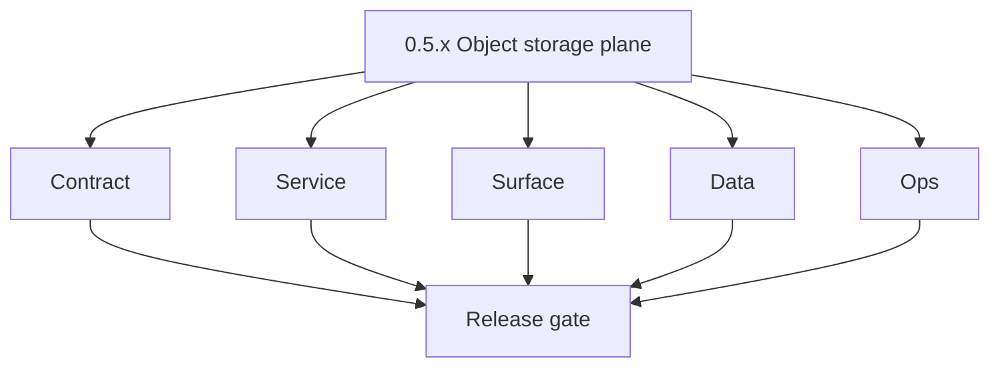
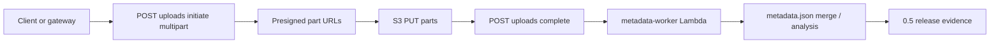

# Version 0.5 — Object storage plane
> Foundation storage policy: All Contact360 codebases route file and artifact storage through `lambda/s3storage` as the canonical storage control plane.

- **Status:** ✅ Completed
- **Era:** 0.x (Foundation and pre-product stabilization)
- **Summary:** Harden [`lambda/s3storage`](../../lambda/s3storage/) — logical buckets/prefixes, **multipart CSV** initiate → presign → complete, **metadata worker** invocation, `metadata.json` lifecycle, CORS/auth alignment, and GraphQL `s3` / `upload` module integration via Appointment360. See [`../codebases/s3storage-codebase-analysis.md`](../codebases/s3storage-codebase-analysis.md).
- **Patch closure:** Each codenamed patch file includes **Micro-gate** + **Service task slices**. Era hub: [`versions.md`](../versions.md).

## Scope

- **Target:** `0.5.x` — reliable large-file uploads for imports/exports; worker produces **durable** metadata.
- **In scope:** `S3Backend` vs `FilesystemBackend` parity for upload paths used by gateway/jobs; presigned URL TTL policy.
- **Gaps to burn:** idempotency keys + session-bucket binding; quota/settings parity (`STORAGE_QUOTA_BYTES`); worker key normalization; filesystem upload parity; direct-backend bypass in some routes; SAM CORS vs runtime allowlist; `samconfig` hygiene; test depth beyond smoke.

> [!NOTE]
> **Multipart session durability:** `lambda/s3storage` now persists multipart session state in **S3** under `_multipart_sessions/{upload_id}.json` (not in-memory). Keep this path and IAM scoped in SAM; see [`../codebases/s3storage-codebase-analysis.md`](../codebases/s3storage-codebase-analysis.md).

## Flowchart

### Runtime focus (unique to this minor)

## Task tracks

### Contract

- ✅ Completed: 📌 Planned: **[appointment360]** — refine duplicate task (was: 📌 planned: **[appointment360]** — refine duplicate task (was…) | patch `0.5.0` band `0` | reason: specialize this file vs sibling patches; see docs/codebases/appointment360-codebase-analysis.md
- ✅ Completed: 📌 Planned: **[appointment360]** — refine duplicate task (was: 📌 planned: **[appointment360]** — refine duplicate task (was…) | patch `0.5.0` band `0` | reason: specialize this file vs sibling patches; see docs/codebases/appointment360-codebase-analysis.md
- ✅ Completed: ✅ Completed: 📌 Planned: Add `X-Idempotency-Key` enforcement for initiate/complete/abort upload lifecycle (S3S-0.5) — define idempotency contract per `LOG_EVENT_CONTRACT.md` pattern; ensure duplicate calls are safe.
- ✅ Completed: ✅ Completed: 📌 Planned: Enforce session-bound bucket validation (S3S-0.7) — server-side check that `bucket_id` in complete request matches `bucket_id` recorded at initiate time.

- ✅ Completed: 📌 Planned: **[appointment360]** — refine duplicate task (was: 📌 planned: **[architecture]** — product **graphql** remains …) | patch `0.5.0` band `0` | reason: specialize this file vs sibling patches; see docs/codebases/appointment360-codebase-analysis.md
### Service

- ✅ Completed: 📌 Planned: **[appointment360]** — refine duplicate task (was: 📌 planned: **[appointment360]** — refine duplicate task (was…) | patch `0.5.0` band `0` | reason: specialize this file vs sibling patches; see docs/codebases/appointment360-codebase-analysis.md
- ✅ Completed: 📌 Planned: **[appointment360]** — refine duplicate task (was: 📌 planned: **[appointment360]** — refine duplicate task (was…) | patch `0.5.0` band `0` | reason: specialize this file vs sibling patches; see docs/codebases/appointment360-codebase-analysis.md
- ✅ Completed: 📌 Planned: **[appointment360]** — refine duplicate task (was: 📌 planned: **[appointment360]** — refine duplicate task (was…) | patch `0.5.0` band `0` | reason: specialize this file vs sibling patches; see docs/codebases/appointment360-codebase-analysis.md
- ✅ Completed: ✅ Completed: ⬜ Incomplete: Fix `NameError` in `lambda/s3storage/app/api/v1/endpoints/uploads.py` — declare `x_idempotency_key = Header(None)` so initiate-csv route does not crash at runtime.
- ✅ Completed: ✅ Completed: ⬜ Incomplete: Add `STORAGE_QUOTA_BYTES` field to `lambda/s3storage/app/core/config.py` (`Settings`) — currently referenced in `storage_service.py` `initiate_multipart_upload` but missing from `Settings` definition (`AttributeError` at runtime).
- ✅ Completed: ✅ Completed: ⬜ Incomplete: Fix worker double-prefix bug: `storage_backends.py` `complete_multipart_upload` returns full S3 key; `metadata_job.py` then prepends `bucket_id/` again — normalize `fileKey` before Lambda invoke.
- ✅ Completed: ✅ Completed: ⬜ Incomplete: Implement `FilesystemBackend.upload_file` — currently absent; `POST /api/v1/uploads/csv` and `/photo` fail on filesystem backend.
- ✅ Completed: ✅ Completed: ⬜ Incomplete: Remove direct backend instantiation from `avatars.py` and `schema.py` endpoints — both bypass `StorageService` facade; route through `StorageService._backend` or add dedicated service methods.

- ✅ Completed: 📌 Planned: **[appointment360]** — refine duplicate task (was: 📌 planned: **[architecture]** — **go/gin satellites** in sco…) | patch `0.5.0` band `0` | reason: specialize this file vs sibling patches; see docs/codebases/appointment360-codebase-analysis.md
### Surface

- ✅ Completed: 📌 Planned: **[appointment360]** — refine duplicate task (was: 📌 planned: **[appointment360]** — refine duplicate task (was…) | patch `0.5.0` band `0` | reason: specialize this file vs sibling patches; see docs/codebases/appointment360-codebase-analysis.md

### Data

- ✅ Completed: 📌 Planned: **[appointment360]** — refine duplicate task (was: 📌 planned: **[appointment360]** — refine duplicate task (was…) | patch `0.5.0` band `0` | reason: specialize this file vs sibling patches; see docs/codebases/appointment360-codebase-analysis.md
- ✅ Completed: 📌 Planned: **[appointment360]** — refine duplicate task (was: 📌 planned: **[appointment360]** — refine duplicate task (was…) | patch `0.5.0` band `0` | reason: specialize this file vs sibling patches; see docs/codebases/appointment360-codebase-analysis.md
- ✅ Completed: ✅ Completed: ⬜ Incomplete: Create `lambda/logs.api/.env.example` from `Settings` in `app/core/config.py` (`API_KEY`, `S3_BUCKET_NAME`, `AWS_REGION`, `LOG_LEVEL`, `LOG_TTL_DAYS`, caching/monitoring knobs).

- ✅ Completed: 📌 Planned: **[appointment360]** — refine duplicate task (was: 📌 planned: **[architecture]** — **postgresql-first** per `do…) | patch `0.5.0` band `0` | reason: specialize this file vs sibling patches; see docs/codebases/appointment360-codebase-analysis.md
### Ops

- ✅ Completed: 📌 Planned: **[appointment360]** — refine duplicate task (was: 📌 planned: **[appointment360]** — refine duplicate task (was…) | patch `0.5.0` band `0` | reason: specialize this file vs sibling patches; see docs/codebases/appointment360-codebase-analysis.md
- ✅ Completed: ✅ Completed: ⬜ Incomplete: Sanitize `lambda/s3storage/samconfig.toml` — replace real-looking bucket/stack values with `{{PLACEHOLDER}}` or environment-variable references; document rotation procedure.
- ✅ Completed: ✅ Completed: ⬜ Incomplete: Fix SAM template `HttpApi` CORS wildcard (`*`) in `lambda/s3storage/template.yaml` — replace with explicit allowed-origin list matching runtime `config.py` allowlist.
- ✅ Completed: ✅ Completed: ⬜ Incomplete: Create root `README.md` for `lambda/s3storage` documenting service purpose, local run, SAM deploy steps, and env var reference.
- ✅ Completed: ✅ Completed: ⬜ Incomplete: Expand test suite: add multipart lifecycle test (initiate → part URL → register → complete → worker invocation mock); add failure-path tests (duplicate complete, missing parts, worker timeout); fix `test_upload_failure.py` import/route issues.
- ✅ Completed: ✅ Completed: ⬜ Incomplete: Align `lambda/logs.api/docs/INTEGRATION.md` and `LAMBDA_DEPLOYMENT.md` — remove MongoDB narrative; document S3 CSV canonical storage per `LOG_EVENT_CONTRACT.md` and `app/core/config.py`.

- ✅ Completed: 📌 Planned: **[appointment360]** — refine duplicate task (was: 📌 planned: **[architecture]** — **observability**: correlate…) | patch `0.5.0` band `0` | reason: specialize this file vs sibling patches; see docs/codebases/appointment360-codebase-analysis.md
- ✅ Completed: 📌 Planned: **[appointment360]** — refine duplicate task (was: 📌 planned: **[architecture]** — **django docsai** (`contact3…) | patch `0.5.0` band `0` | reason: specialize this file vs sibling patches; see docs/codebases/appointment360-codebase-analysis.md
## Task Breakdown

| Track | Tasks from s3storage analysis |
| --- | --- |
| Contract | Parity doc vs `lambda/s3storage/docs` or `docs/API.md` |
| Service | Backend abstraction + error codes |
| Ops | Worker deploy + IAM |

## Immediate next execution queue

- 📌 Completed: E2E: multipart complete → worker → `metadata.json` readable.
- 📌 Completed: Failure paths: broken part upload, worker timeout.

## Cross-service ownership

| Service | Role |
| --- | --- |
| `lambda/s3storage` | Control plane + worker |
| `EC2/s3storage.server` | Go Gin satellite: `/api/v1/*` storage API, Postgres-backed metadata job queue (`s3storage_metadata_jobs`), Docker + compose in repo |
| `contact360.io/api` | GraphQL upload/s3 modules |
| `contact360.io/jobs` | Import processors reading artifacts |

### Service (EC2 satellite evidence — 0.5.10)

- ✅ **EC2 `s3storage.server`**: `go build ./cmd/api ./cmd/worker`, `docker build` (with `GOTOOLCHAIN=auto` in Dockerfile), `docker-compose.yml` (Postgres + api + worker).
- ✅ **Router**: `X-Request-ID`, multipart session TTL cleanup (2h), avatar `GET /avatars/:user?ext=`, queue failure on complete returns `202` and still clears session.
- ✅ **Worker**: SIGINT/SIGTERM cancels context; goroutines exit cleanly.

### Ops (EC2 satellite evidence — 0.5.10)

- ✅ **Secrets**: `.gitignore` excludes `.env`; `.env.example` documents required variables (no live credentials in git).
- ✅ **Smoke**: `EC2/s3storage.server/scripts/api_tester.py` → `scripts/output/api_test_results.json`; `scripts/sql_cli.py` for job rows.

## References

- Per-patch **Service task slices**: [`0.5.0 — Bucket.md`](0.5.0%20%E2%80%94%20Bucket.md) … [`0.5.9 — Harbor.md`](0.5.9%20%E2%80%94%20Harbor.md)
- [`../codebases/s3storage-codebase-analysis.md`](../codebases/s3storage-codebase-analysis.md)

## Backend API and Endpoint Scope

- **s3storage:** multipart and analysis endpoints; health.
- **Gateway:** mutations/queries mapping to storage client.

Cross-reference: `docs/backend/endpoints/s3storage_endpoint_era_matrix.json` (era `0.x`).

## Database and Data Lineage Scope

- **S3:** primary artifact store; optional **Postgres** only for gateway bookkeeping if any — document.

Cross-reference: `docs/backend/database/s3storage_data_lineage.md` (era `0.x`).

## Frontend UX Surface Scope

- Bulk upload flows, drag-drop, progress bar, presign expiry handling.

Frontend UX surface (storage upload evidence):

- Route:
  - `/files` page stub
- Files/components:
  - `components/files/FilesUploadModal.tsx`
  - `components/files/FilesUploadPanel.tsx`
- Hooks:
  - `hooks/useCsvUpload.ts`
  - `hooks/useFiles.ts`
- Services/lib:
  - `services/graphql/s3Service.ts`
  - `lib/s3/s3TreeUtils.ts`

Cross-reference: `docs/frontend/s3storage-ui-bindings.md` (era `0.x` upload rows).

## UI Elements Checklist

- 📌 Completed: `FilesUploadModal` stub present (drag-drop zone renders)
- 📌 Completed: `FilesUploadPanel` renders
- 📌 Completed: `useCsvUpload` hook scaffolded
- 📌 Completed: `s3Service.GetPresignedUploadUrl` stub present (service contract for presign)
- 📌 Completed: Upload progress bar animates during upload (mock/multipart simulation ok)
- 📌 Completed: Error: TTL expired → re-initiate message shown

## Flow / Graph Delta for This Minor

- **Delta:** Introduces **multipart + async metadata** as first-class path — replaces incorrect “email orchestration” diagrams for this minor.

## Audit and Compliance Notes

- Files may contain **PII** (CSV) — bucket policies, encryption, access logging; align with `audit-compliance.md` for data handling.

## Patch ladder (`0.5.0` – `0.5.9`)

### Micro-gate reference (apply at every `0.5.P`)

| Track | Gate question (must answer Yes or document waiver) |
| --- | --- |
| **Contract** | Did any public or internal API surface change? If yes: diff vs `docs/backend/apis/` or pack; if no: attach “no contract change” note. |
| **Service** | Do critical paths for this patch still boot, health-check, and pass the defined smoke for affected services? |
| **Surface** | Did UI, extension, or admin behavior change? If yes: UX evidence + role checks; if no: note N/A. |
| **Frontend** | Which foundation-era components/routes must render or be scaffolded? List by name or mark N/A. |
| **Data** | Migrations, index mappings, S3 prefixes, or lineage docs updated and linked? |
| **Ops** | Rollback path, secrets, CI step, or runbook delta recorded? |

**Patch intent bands (typical):** `.0` charter · `.1`–`.2` scaffold · `.3`–`.5` hardening · `.6`–`.8` integration/drift · `.9` minor freeze / handoff to `0.(N+1).0`.

Theme: **Maritime**. Per-patch tables: each `0.5.P — … .md` file.

| Patch | Codename | Focus | Evidence gate |
| --- | --- | --- | --- |
| `0.5.0` | Bucket | Prefix + bucket policy | N/A — backend/storage policy focus |
| `0.5.1` | Upload | Single-part upload | `FilesUploadModal` renders (drag-drop zone visible) |
| `0.5.2` | Stream | Multipart initiate | Multipart progress bar renders (mock data ok) |
| `0.5.3` | Archive | Complete + verify | N/A — completion contract evidence only |
| `0.5.4` | Shelf | metadata.json v1 | `DatasetInfoPanel` stub renders (shelf/info panel) |
| `0.5.5` | Cache | Worker env + IAM | N/A — worker/env evidence only |
| `0.5.6` | Mirror | Backend parity fs/s3 | N/A — parity backend evidence only |
| `0.5.7` | Index | Analysis endpoints | N/A — analysis endpoints evidence only |
| `0.5.8` | Purge | CORS/auth tighten | Auth-guarded upload smoke (upload button works/blocks correctly) |
| `0.5.9` | Harbor | Freeze → `0.6` | N/A — handoff prep |

## Release Gate and Evidence

### Master Task Checklist

- 📌 Completed: Pack release gate items satisfied

### Backend API and Endpoints

- 📌 Completed: Contract excerpt + diff

### Database and Data Lineage

- 📌 Completed: S3 key examples + lifecycle

### Frontend UX

- 📌 Completed: Upload smoke evidence

### UI Elements

- 📌 Completed: Checklist

### Flow and Graph

- 📌 Completed: Multipart mermaid reviewed

### Validation

- 📌 Completed: Automated or signed manual E2E

### Release Gate

- 📌 Completed: Sign-off for **0.6 Async job spine**

## Patches

| Patch | Codename | Doc |
| --- | --- | --- |
| `0.5.0` | Bucket | [`0.5.0` — Bucket](0.5.0%20%E2%80%94%20Bucket.md) |
| `0.5.1` | Upload | [`0.5.1` — Upload](0.5.1%20%E2%80%94%20Upload.md) |
| `0.5.2` | Stream | [`0.5.2` — Stream](0.5.2%20%E2%80%94%20Stream.md) |
| `0.5.3` | Archive | [`0.5.3` — Archive](0.5.3%20%E2%80%94%20Archive.md) |
| `0.5.4` | Shelf | [`0.5.4` — Shelf](0.5.4%20%E2%80%94%20Shelf.md) |
| `0.5.5` | Cache | [`0.5.5` — Cache](0.5.5%20%E2%80%94%20Cache.md) |
| `0.5.6` | Mirror | [`0.5.6` — Mirror](0.5.6%20%E2%80%94%20Mirror.md) |
| `0.5.7` | Index | [`0.5.7` — Index](0.5.7%20%E2%80%94%20Index.md) |
| `0.5.8` | Purge | [`0.5.8` — Purge](0.5.8%20%E2%80%94%20Purge.md) |
| `0.5.9` | Harbor | [`0.5.9` — Harbor](0.5.9%20%E2%80%94%20Harbor.md) |
| `0.5.10` | Satellite | [`0.5.10` — Satellite](0.5.10%20%E2%80%94%20Satellite.md) |
