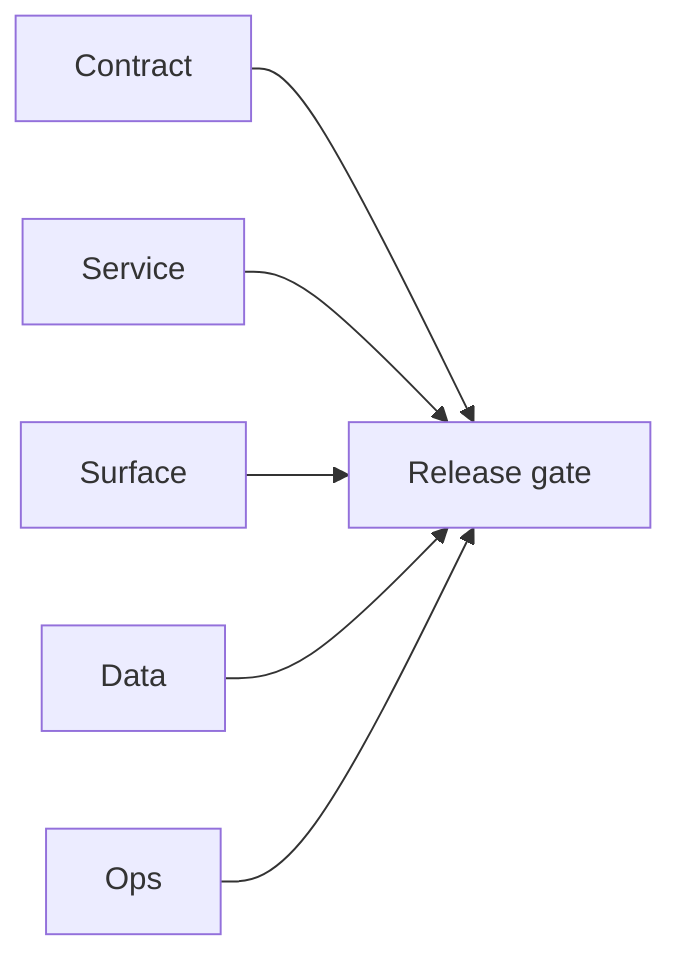

# Version 0.5.10 — Satellite

- **Status:** ✅ Completed
- **Era:** 0.x (Foundation)
- **Codename:** Satellite
- **Summary:** Align **EC2 `s3storage.server`** (Go Gin) with the object-storage plane: build fixes, `.env.example` + `.gitignore`, config fallbacks (`S3_BUCKET_NAME`), in-memory multipart session TTL cleanup, `X-Request-ID` on responses, avatar `?ext=`, worker SIGINT/SIGTERM shutdown, removal of unused Asynq stub, `docker-compose.yml`, and `scripts/api_tester.py` / `scripts/sql_cli.py` for smoke and queue inspection.

## Micro-gate (quick)

| Track | Gate |
| --- | --- |
| **Contract** | `EC2_GO_SATELLITE_ROUTES.md` s3storage row notes **pgqueue (Postgres)**, not Asynq. |
| **Service** | `go build ./cmd/api ./cmd/worker`; Docker image builds. |
| **Ops** | `.env` not committed; `.env.example` lists required vars. |

## Task tracks

### Contract

- Documented s3storage satellite queue: Postgres `s3storage_metadata_jobs` via `internal/pgqueue` (not Redis/Asynq).

### Service

- `go.mod` toolchain line + `golang:1.23-alpine` with `GOTOOLCHAIN=auto` in Dockerfile so `go mod download` / build can use the required Go version.
- `internal/api/router.go`: `X-Request-ID`, session TTL sweeper, avatar `ext` query, complete-on-queue-error still removes upload session.
- `cmd/worker/main.go`: graceful shutdown on SIGINT/SIGTERM.

### Ops

- `docker-compose.yml` for local Postgres + api + worker; uses **`.env.compose`** (gitignored, copy from `.env.compose.example`) so `docker compose config` does not load a full production `.env`.
- `scripts/api_tester.py` (stdlib) and `scripts/sql_cli.py` (psycopg2-binary).

## Evidence

- Runbook: [`EC2/s3storage.server/README.md`](../../EC2/s3storage.server/README.md) (Docker, `api_tester.py`, S3/IAM troubleshooting).
- With API up: load `.env.compose` (or set env vars), then `python scripts/api_tester.py` — all steps **OK** is the service gate (requires valid IAM + bucket).
- Queue: `python scripts/sql_cli.py jobs --limit 20`.

## Flowchart

Five-track delivery (contract / service / surface / data / ops) for this doc:

**Master hub:** [`docs/docs/flowchart.md`](../docs/flowchart.md) — cross-system diagrams and era strip (`0.x` → `10.x`).
