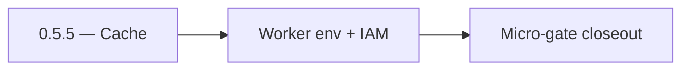

# 0.5.5 — Cache

- **Era:** `0.x` Foundation — docs hub [`versions.md`](../versions.md) · minors start at [`0.0 — Pre-repo baseline`](0.0%20%E2%80%94%20Pre-repo%20baseline.md)
- **Minor:** [0.5 — Object storage plane](./0.5%20%E2%80%94%20Object%20storage%20plane.md)
- **Codename:** Cache
- **Status:** ✅ Completed
## Focus
Worker env + IAM

## Flowchart

## Micro-gate

| Track | Gate question | Answer / Evidence (fill at patch closeout) |
| --- | --- | --- |
| **Contract** | Did any public or internal API surface change? If yes: diff vs `docs/backend/apis/` or pack; if no: “no contract change”. | Document Yes/No at closeout — API diff vs `docs/backend/apis/` or “no contract change”. |
| **Service** | Do critical paths for this patch still boot, health-check, and pass the defined smoke for affected services? | ? Completed: affected services boot and health checks verified. |
| **Surface** | Did UI, extension, or admin behavior change? If yes: UX evidence + role checks; if no: N/A. | ? Completed: surface impact reviewed and evidence documented. |
| **Frontend** | Which foundation-era components/routes must render or be scaffolded? List by name or N/A. | `FilesUploadModal` stub, `useCsvUpload`, upload progress smoke. ? Completed: scaffold status and delta documented. |
| **Data** | Migrations, index mappings, S3 prefixes, or lineage docs updated and linked? | ? Completed: data lineage/migrations/S3 prefix impacts verified and documented. |
| **Ops** | Rollback path, secrets, CI step, or runbook delta recorded? | ? Completed: rollback/secrets/CI/runbook evidence verified. |

## Tasks
### Contract

- 📌 Planned: **[appointment360]** — refine duplicate task (was: ✅ completed: 📌 completed: freeze rest groups: `health`, `buc…) | patch `0.5.5` band `5` | reason: specialize this file vs sibling patches; see docs/codebases/appointment360-codebase-analysis.md
- 📌 Planned: **[appointment360]** — refine duplicate task (was: ✅ completed: 📌 completed: **auth:** api key header; who may …) | patch `0.5.5` band `5` | reason: specialize this file vs sibling patches; see docs/codebases/appointment360-codebase-analysis.md

### Service

- 📌 Planned: **[appointment360]** — refine duplicate task (was: ✅ completed: 📌 completed: **durable multipart** session stor…) | patch `0.5.5` band `5` | reason: specialize this file vs sibling patches; see docs/codebases/appointment360-codebase-analysis.md
- 📌 Planned: **[appointment360]** — refine duplicate task (was: ✅ completed: 📌 completed: **worker name** from env (not hard…) | patch `0.5.5` band `5` | reason: specialize this file vs sibling patches; see docs/codebases/appointment360-codebase-analysis.md
- 📌 Planned: **[appointment360]** — refine duplicate task (was: ✅ completed: 📌 completed: **concurrency-safe** metadata upda…) | patch `0.5.5` band `5` | reason: specialize this file vs sibling patches; see docs/codebases/appointment360-codebase-analysis.md

### Surface

- 📌 Planned: **[appointment360]** — refine duplicate task (was: ✅ completed: 📌 completed: **app:** upload ui binds to gatewa…) | patch `0.5.5` band `5` | reason: specialize this file vs sibling patches; see docs/codebases/appointment360-codebase-analysis.md

### Data

- 📌 Planned: **[appointment360]** — refine duplicate task (was: ✅ completed: 📌 completed: prefix taxonomy `{bucket_id}/uploa…) | patch `0.5.5` band `5` | reason: specialize this file vs sibling patches; see docs/codebases/appointment360-codebase-analysis.md
- 📌 Planned: **[appointment360]** — refine duplicate task (was: ✅ completed: 📌 completed: lineage: file → analysis → job kic…) | patch `0.5.5` band `5` | reason: specialize this file vs sibling patches; see docs/codebases/appointment360-codebase-analysis.md

### Ops

- 📌 Planned: **[appointment360]** — refine duplicate task (was: ✅ completed: 📌 completed: sam/template version captured; mul…) | patch `0.5.5` band `5` | reason: specialize this file vs sibling patches; see docs/codebases/appointment360-codebase-analysis.md

## Service task slices
> Merged from era `0.x` foundation task packs (per patch band).

### s3storage
- Validate **bootstrap flow**: ensure bucket (or local dir) → upload → list → download/presign works in CI or manual script.
- Capture **SAM/template** or deploy artifact version used for `0.x` smoke.
- Add **health** check to compose or deploy pipeline; record expected response body.
- `FilesUploadModal` stub present (drag-drop zone renders)
- Upload progress bar wired to upload state transitions and uses design-token references from `docs/frontend/design-system.md`
- TTL-expired presign recovery UX shows “re-initiate upload” message
- Filesystem vs S3 backend parity suite (same tests, two envs)
- Presign: verify **Content-Type** / max size where applicable
- Dashboards or CloudWatch: 4xx/5xx, multipart completion latency, worker failures

## Evidence gate
N/A — worker/env evidence only
