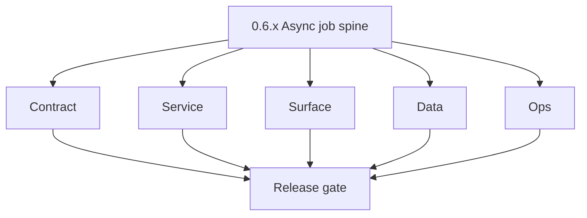

# Version 0.6 — Async job spine
> Foundation storage policy: All Contact360 codebases route file and artifact storage through `lambda/s3storage` as the canonical storage control plane.

- **Status:** ✅ Completed
- **Era:** 0.x (Foundation and pre-product stabilization)
- **Summary:** Stabilize [`contact360.io/jobs`](../../contact360.io/jobs/) — **Kafka** topic contract, scheduler + consumer + worker pool, **DAG** (`job_node`, `edges`), processor registry, **`job_events` timeline**, stale `processing` recovery, and gateway `TkdjobClient` integration. See [`../codebases/jobs-codebase-analysis.md`](../codebases/jobs-codebase-analysis.md).  
- **Patch closure:** Each codenamed patch file includes **Micro-gate** + **Service task slices**. Era hub: [`versions.md`](../versions.md).

## Scope

- **Target:** `0.6.x` — create → enqueue → process → terminal state → readable timeline.
- **In scope:** `JOBS_TOPIC`, auth middleware on job APIs, processor types in registry (email export/verify/import stubs as implemented).
- **Gaps:** stale processing timeout, DAG degree-decrement edge cases, shared API key rotation story.

## Flowchart

### Runtime focus (unique to this minor)

```mermaid
flowchart LR
    create["POST create job DAG"] --> kafka["Produce to JOBS_TOPIC"]
    kafka --> consumer["Consumer / scheduler"]
    consumer --> worker["Worker pool + processor"]
    worker --> state["job_node status transitions"]
    state --> events["job_events append"]
    events --> timeline["GET timeline API"]
    timeline --> gate["0.6 release gate"]
```

## Task tracks

### Contract

- ✅ Completed: 📌 Planned: **[appointment360]** — refine duplicate task (was: ✅ completed: 📌 completed: freeze **job create / status / tim…) | patch `0.6.0` band `0` | reason: specialize this file vs sibling patches; see docs/codebases/appointment360-codebase-analysis.md
- ✅ Completed: 📌 Planned: **[appointment360]** — refine duplicate task (was: ✅ completed: 📌 completed: document **kafka** topic, consumer…) | patch `0.6.0` band `0` | reason: specialize this file vs sibling patches; see docs/codebases/appointment360-codebase-analysis.md
- ✅ Completed: ⬜ Incomplete: **contact360.io/jobs** — `app/contact360/vql.py` module is documented in comments as "VQL (Vivek Query Language)" — a personal developer alias embedded in production code; rename all VQL doc-comments to "BQL (Boolean Query Language)" or "CQL (Contact Query Language)" to reflect its actual purpose as a domain-specific contact/company filter DSL.
- ✅ Completed: ⬜ Incomplete: **contact360.io/jobs** — `PUT /v1/jobs/{uuid}/cancel` endpoint does not exist; jobs in `processing` state cannot be stopped — a `cancel` endpoint must mark `processing` → `failed` with `cancellation_reason` in `job_response` and emit a `cancelled` event to `job_events`.
- ✅ Completed: 📌 Planned: **contact360.io/jobs** — freeze `job_node` and `job_events` schema contract with `docs/backend/database/jobs_data_lineage.md` — document all JSONB `data` shape variants per job_type (`email_finder_export_stream`, `contact360_export_stream`, etc.) so consumers can introspect job payloads without reading source code.
- ✅ Completed: 📌 Planned: **contact360.io/jobs** — add `POST /v1/jobs/{uuid}/webhook` endpoint (or `callback_url` field in job creation requests) to enable async push notifications when a job reaches terminal status (`completed` / `failed`), eliminating the need for clients to poll `/status`.
- ✅ Completed: 📌 Planned: **contact360.io/jobs** — add `tenant_id` / `workspace_id` field to `job_node` table and enforce per-tenant isolation in `GET /v1/jobs/` list query so jobs from one tenant are never visible to another.

### Service

- ✅ Completed: 📌 Planned: **[appointment360]** — refine duplicate task (was: ✅ completed: 📌 completed: ordered startup: db → kafka → work…) | patch `0.6.0` band `0` | reason: specialize this file vs sibling patches; see docs/codebases/appointment360-codebase-analysis.md
- ✅ Completed: 📌 Planned: **[appointment360]** — refine duplicate task (was: ✅ completed: 📌 completed: **stale recovery:** `processing_ti…) | patch `0.6.0` band `0` | reason: specialize this file vs sibling patches; see docs/codebases/appointment360-codebase-analysis.md
- ✅ Completed: 📌 Planned: **[appointment360]** — refine duplicate task (was: ✅ completed: 📌 completed: **dag validation:** cycle detectio…) | patch `0.6.0` band `0` | reason: specialize this file vs sibling patches; see docs/codebases/appointment360-codebase-analysis.md
- ✅ Completed: ⬜ Incomplete: **contact360.io/jobs** — `workers/scheduler.py` `_recovery_loop` uses the same `TICKER_INTERVAL` (default 30s) for both the main scheduling loop and the stale job recovery; when a stale recovery fires more than 3 times for the same job there is no alert or escalation — add a stale recovery threshold alert: if `stale_recovery_count` in `job_response` exceeds a configurable max (e.g., 5), mark the job `failed` with `stale_recovery_limit_exceeded` reason.
- ✅ Completed: ⬜ Incomplete: **contact360.io/jobs** — `workers/worker_pool.py` `WorkerPool.enqueue()` returns `False` when the async queue is full but the Kafka consumer only logs a warning; the job remains in `in_queue` status and will be re-delivered on the next Kafka consumer restart — implement backpressure: when the queue is full, pause Kafka consumption (don't commit offset) and retry until there is capacity.
- ✅ Completed: ⬜ Incomplete: **contact360.io/jobs** — `processors/contact360_import_prepare.py` emits child chunk jobs by directly writing to the PostgreSQL job_node table without going through Kafka; the scheduler's next tick must fire before these child jobs are picked up — consider emitting child jobs directly to Kafka for immediate pickup or reduce TICKER_INTERVAL for child-job scenarios.
- ✅ Completed: 📌 Planned: **contact360.io/jobs** — implement **Dead Letter Queue (DLQ)**: when a job's `try_count` reaches 0 and `status` is set to `failed`, emit to a `jobs-dlq` Kafka topic (or insert into a `dead_letter_jobs` DB table) so failed jobs can be inspected and manually re-queued without losing context.
- ✅ Completed: 📌 Planned: **contact360.io/jobs** — implement **job TTL sweeper**: add a background task that archives or deletes `completed` / `failed` job records older than a configurable TTL (e.g., `JOB_RECORD_TTL_DAYS=30`) to prevent unbounded growth of the `job_node` table.
- ✅ Completed: 📌 Planned: **contact360.io/jobs** — implement **priority-based scheduling**: migration `20260122_0002_add_job_priority.py` adds a `priority` column but `scheduler.py` queries `ORDER BY run_after ASC` only; update the query to `ORDER BY priority DESC, run_after ASC` so higher-priority jobs (e.g., `priority=10`) are enqueued before lower-priority ones.

### Surface

- ✅ Completed: 📌 Planned: **[appointment360]** — refine duplicate task (was: ✅ completed: 📌 completed: **app:** job list/detail ui contra…) | patch `0.6.0` band `0` | reason: specialize this file vs sibling patches; see docs/codebases/appointment360-codebase-analysis.md

### Data

- ✅ Completed: 📌 Planned: **[appointment360]** — refine duplicate task (was: ✅ completed: 📌 completed: migrations for `job_node`, `edges`…) | patch `0.6.0` band `0` | reason: specialize this file vs sibling patches; see docs/codebases/appointment360-codebase-analysis.md
- ✅ Completed: ⬜ Incomplete: **contact360.io/jobs** — `example.env` documents `JOB_IN_QUEUE_SIZE`, `PARALLEL_JOBS`, `TICKER_INTERVAL`, `JOB_EXECUTION_TIMEOUT` but is missing worker-pool tuning variables that are defined in `Settings`: `SHUTDOWN_TIMEOUT`, `THREAD_POOL_SIZE`, `PROCESS_POOL_SIZE`, `MAX_WORKERS_IO`, `MAX_WORKERS_CPU`, `WORKER_POOL_SIZE`, `WORKER_POOL_SIZE_FIRST_TIME`, `WORKER_POOL_SIZE_RETRY`, `JOB_CHANNEL_SIZE`; add all missing vars to `example.env` with descriptions.
- ✅ Completed: 📌 Planned: **contact360.io/jobs** — add `tenant_id` migration (`20260123_0001_add_tenant_id_to_job_node.py`) adding a nullable `tenant_id UUID` column with an index on `(tenant_id, status, run_after)` to support multi-tenant job isolation.
- ✅ Completed: 📌 Planned: **contact360.io/jobs** — document `job_node.data` JSONB shapes per `job_type` in `docs/backend/database/jobs_data_lineage.md`; every processor has a different payload shape but there is no contract document — create the reference table.

### Ops

- ✅ Completed: 📌 Planned: **[appointment360]** — refine duplicate task (was: ✅ completed: 📌 completed: runbook: restart order, “stuck pro…) | patch `0.6.0` band `0` | reason: specialize this file vs sibling patches; see docs/codebases/appointment360-codebase-analysis.md

- ✅ Completed: ⬜ Incomplete: **contact360.io/jobs** — `docker-compose.yml` healthcheck for `scheduler-first-time`, `scheduler-retry`, and `consumer` services uses `python -c "import sys; sys.exit(0)"` which always succeeds regardless of actual service state -- replace with a meaningful liveness check (e.g., verify the process PID or hit a sidecar `localhost:8081/health/live` endpoint) so Docker can restart unhealthy containers.
- ✅ Completed: ⬜ Incomplete: **contact360.io/jobs** — `docker-compose.yml` healthcheck for the `api` service tests `http://localhost:8000/docs` (Swagger UI) rather than `http://localhost:8000/health/ready`; replace with the readiness check endpoint so Docker confirms database + Kafka connectivity before routing traffic.
- ✅ Completed: ⬜ Incomplete: **contact360.io/jobs** — `S3_UPLOAD_FILE_PATH_PRIFIX` is a typo (should be `S3_UPLOAD_FILE_PATH_PREFIX`); the typo appears in `config.py`, `example.env`, and `docker-compose.yml` -- fix everywhere and add a backward-compatible alias for the old misspelled env var to avoid breaking live deployments.
- ✅ Completed: 📌 Planned: **contact360.io/jobs** — add multi-stage `Dockerfile` (builder stage with full Python toolchain → slim `python:3.12-slim` runtime image) to reduce production image size; update `docker-compose.yml` to reference the optimized image.

## Task Breakdown

| Processor | Foundation goal |
| --- | --- |
| email export / verify / pattern import | Register + one E2E each when in codebase |
| contact360 import/export | Checkpoint fields validated |

## Immediate next execution queue

- 📌 Completed: One **E2E** job with **10+ job_events** captured.
- 📌 Completed: Load test **not** required — single-worker correctness first.

## Cross-service ownership

| Service | Jobs |
| --- | --- |
| `contact360.io/jobs` | Core |
| `contact360.io/api` | Client + GraphQL `jobs` module |
| `contact360.io/sync` | Import targets |

## References

- Per-patch **Service task slices**: [`0.6.0 — Queue.md`](0.6.0%20%E2%80%94%20Queue.md) … [`0.6.9 — Spine.md`](0.6.9%20%E2%80%94%20Spine.md)
- [`../codebases/jobs-codebase-analysis.md`](../codebases/jobs-codebase-analysis.md)

## Backend API and Endpoint Scope

- **Jobs:** `/api/v1/jobs/*` routes per analysis; health routes.
- **Gateway:** Mutations creating jobs — list in release notes.

Cross-reference: `docs/backend/endpoints/jobs_endpoint_era_matrix.json` (era `0.x`).

## Database and Data Lineage Scope

- **PostgreSQL:** scheduler-owned schema only; JSONB `data` / `job_response` shapes documented.

Cross-reference: `docs/backend/database/jobs_data_lineage.md` (era `0.x`).

## Frontend UX Surface Scope

- Jobs dashboard cards, timeline, error surfaces.

Frontend UX surface (jobs evidence):

- Route:
  - `/jobs` page stub
- Components:
  - `components/jobs/JobsCard.tsx`
  - `components/jobs/JobsPipelineStats.tsx`
  - `components/jobs/JobsRetryModal.tsx`
- Hook:
  - `hooks/useJobs.ts`
- Services/lib:
  - `services/graphql/jobsService.ts`
  - `lib/jobs/jobsUtils.ts`
  - `lib/jobs/jobsConstants.ts`

Cross-reference: `docs/frontend/jobs-ui-bindings.md` (era `0.x` rows).

## UI Elements Checklist

- 📌 Completed: `JobsCard` stub renders with status badge
- 📌 Completed: `JobsPipelineStats` renders processed/failed/pending segments
- 📌 Completed: Status badge mapping smoke (open/in_queue/processing/completed/failed)
- 📌 Completed: Retry button present in `JobsCard`
- 📌 Completed: `useJobs` hook polls every 15s (or documented polling interval)
- 📌 Completed: Empty state card renders when no jobs

## Flow / Graph Delta for This Minor

- **Delta:** Introduces **durable async spine** between gateway and workers — not email-provider orchestration.

## Audit and Compliance Notes

- Job payloads may contain PII — access controlled via gateway auth; log redaction in worker logs.

## Patch ladder (`0.6.0` – `0.6.9`)

### Micro-gate reference (apply at every `0.6.P`)

| Track | Gate question (must answer Yes or document waiver) |
| --- | --- |
| **Contract** | Did any public or internal API surface change? If yes: diff vs `docs/backend/apis/` or pack; if no: attach “no contract change” note. |
| **Service** | Do critical paths for this patch still boot, health-check, and pass the defined smoke for affected services? |
| **Surface** | Did UI, extension, or admin behavior change? If yes: UX evidence + role checks; if no: note N/A. |
| **Frontend** | Which foundation-era components/routes must render or be scaffolded? List by name or mark N/A. |
| **Data** | Migrations, index mappings, S3 prefixes, or lineage docs updated and linked? |
| **Ops** | Rollback path, secrets, CI step, or runbook delta recorded? |

**Patch intent bands (typical):** `.0` charter · `.1`–`.2` scaffold · `.3`–`.5` hardening · `.6`–`.8` integration/drift · `.9` minor freeze / handoff to `0.(N+1).0`.

Theme: **Industrial**. Per-patch tables: each `0.6.P — … .md` file.

| Patch | Codename | Focus | Evidence gate |
| --- | --- | --- | --- |
| `0.6.0` | Queue | Topic + consumer | `/jobs` page stub renders |
| `0.6.1` | Worker | Pool bootstrap | `JobsCard` renders without crash |
| `0.6.2` | DAG | Insert + validate | N/A — contract/data only |
| `0.6.3` | Retry | Retry semantics | `JobsRetryModal` opens |
| `0.6.4` | Timer | Stale processing | N/A — worker semantics only |
| `0.6.5` | Drain | Processor registry | N/A — registry evidence only |
| `0.6.6` | Heartbeat | Progress checkpoints | Progress checkpoints move on mock data |
| `0.6.7` | Chain | Multi-step DAG | N/A — DAG multi-step evidence only |
| `0.6.8` | Trace | Timeline API | Timeline API response renders (events timeline) |
| `0.6.9` | Spine | Freeze → `0.7` | N/A — handoff prep |

## Release Gate and Evidence

### Master Task Checklist

- 📌 Completed: Pack evidence + timeline export

### Backend API and Endpoints

- 📌 Completed: OpenAPI or markdown for job routes

### Database and Data Lineage

- 📌 Completed: ERD or table list

### Frontend UX

- 📌 Completed: Job UI smoke

### UI Elements

- 📌 Completed: Checklist

### Flow and Graph

- 📌 Completed: State machine diagram matches code

### Validation

- 📌 Completed: E2E job completion

### Release Gate

- 📌 Completed: Sign-off for **0.7 Search & dual-write substrate**

## Patches

| Patch | Codename | Doc |
| --- | --- | --- |
| `0.6.0` | Queue | [`0.6.0` — Queue](0.6.0%20%E2%80%94%20Queue.md) |
| `0.6.1` | Worker | [`0.6.1` — Worker](0.6.1%20%E2%80%94%20Worker.md) |
| `0.6.2` | DAG | [`0.6.2` — DAG](0.6.2%20%E2%80%94%20DAG.md) |
| `0.6.3` | Retry | [`0.6.3` — Retry](0.6.3%20%E2%80%94%20Retry.md) |
| `0.6.4` | Timer | [`0.6.4` — Timer](0.6.4%20%E2%80%94%20Timer.md) |
| `0.6.5` | Drain | [`0.6.5` — Drain](0.6.5%20%E2%80%94%20Drain.md) |
| `0.6.6` | Heartbeat | [`0.6.6` — Heartbeat](0.6.6%20%E2%80%94%20Heartbeat.md) |
| `0.6.7` | Chain | [`0.6.7` — Chain](0.6.7%20%E2%80%94%20Chain.md) |
| `0.6.8` | Trace | [`0.6.8` — Trace](0.6.8%20%E2%80%94%20Trace.md) |
| `0.6.9` | Spine | [`0.6.9` — Spine](0.6.9%20%E2%80%94%20Spine.md) |
