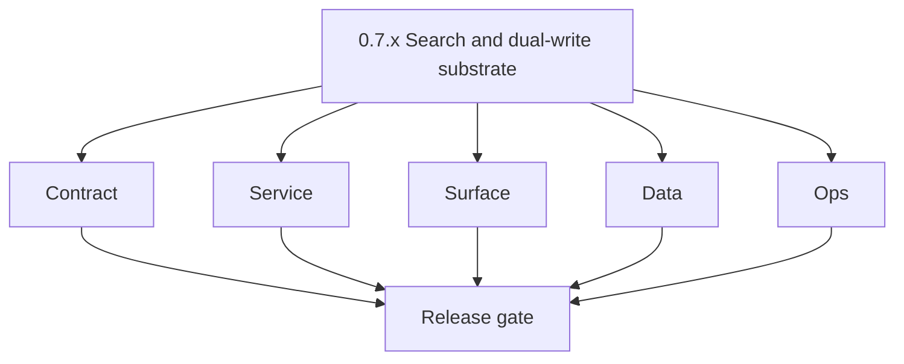
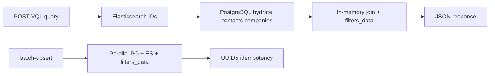

# Version 0.7 — Search & dual-write substrate
> Foundation storage policy: All Contact360 codebases route file and artifact storage through `lambda/s3storage` as the canonical storage control plane.

- **Status:** ✅ Completed
- **Era:** 0.x (Foundation and pre-product stabilization)
- **Summary:** Harden [`contact360.io/sync`](../../contact360.io/sync/) (Connectra) — **VQL** contract, Elasticsearch query + PostgreSQL hydrate path, **parallel dual-write** upserts, `/common/jobs` buffered engine, filter/facet model, and **ES vs PG drift** detection strategy. See [`../codebases/connectra-codebase-analysis.md`](../codebases/connectra-codebase-analysis.md).  
- **Patch closure:** Each codenamed patch file includes **Micro-gate** + **Service task slices**. Era hub: [`versions.md`](../versions.md).

## Scope

- **Target:** `0.7.x` — deterministic search + import backbone for `3.x` and extension/SN paths.
- **In scope:** Route groups `/contacts`, `/companies`, `/common`, VQL modes (`exact`, `shuffle`, `substring`, etc.), UUID5 dedup keys.
- **Gaps:** in-memory job queue durability; `AllowAllOrigins` CORS; rate limit + API key policy; ES/PG reconciliation automation.

## Flowchart

### Runtime focus (unique to this minor)

## Task tracks

### Contract

- 📌 Planned: **[appointment360]** — refine duplicate task (was: ✅ completed: 📌 completed: freeze **batch-upsert** payload an…) | patch `0.7.0` band `0` | reason: specialize this file vs sibling patches; see docs/codebases/appointment360-codebase-analysis.md
- 📌 Planned: **[appointment360]** — refine duplicate task (was: ✅ completed: 📌 completed: vql **json schema** or exemplar li…) | patch `0.7.0` band `0` | reason: specialize this file vs sibling patches; see docs/codebases/appointment360-codebase-analysis.md

### Service

- 📌 Planned: **[appointment360]** — refine duplicate task (was: ✅ completed: 📌 completed: replace or supplement **in-memory …) | patch `0.7.0` band `0` | reason: specialize this file vs sibling patches; see docs/codebases/appointment360-codebase-analysis.md
- 📌 Planned: **[appointment360]** — refine duplicate task (was: ✅ completed: 📌 completed: **rate limit + api key** policy — …) | patch `0.7.0` band `0` | reason: specialize this file vs sibling patches; see docs/codebases/appointment360-codebase-analysis.md

### Surface

- 📌 Planned: **[appointment360]** — refine duplicate task (was: ✅ completed: 📌 completed: **app:** search ui uses gateway → …) | patch `0.7.0` band `0` | reason: specialize this file vs sibling patches; see docs/codebases/appointment360-codebase-analysis.md

### Data

- 📌 Planned: **[appointment360]** — refine duplicate task (was: ✅ completed: 📌 completed: **reconciliation job** or playbook…) | patch `0.7.0` band `0` | reason: specialize this file vs sibling patches; see docs/codebases/appointment360-codebase-analysis.md

### Ops

- 📌 Planned: **[appointment360]** — refine duplicate task (was: ✅ completed: 📌 completed: es index aliases, reindex procedur…) | patch `0.7.0` band `0` | reason: specialize this file vs sibling patches; see docs/codebases/appointment360-codebase-analysis.md

## Task Breakdown

| Area | Deliverable |
| --- | --- |
| Read path | VQL golden tests |
| Write path | Idempotent upsert tests |
| Jobs | Connectra internal job states documented |

## Immediate next execution queue

- 📌 Completed: Batch-upsert **idempotency** release gate (same payload twice → stable IDs).
- 📌 Completed: Document **facet** UUID5 key rules for filters.

## Cross-service ownership

| Service | Connectra |
| --- | --- |
| `contact360.io/sync` | Core |
| `contact360.io/api` | ConnectraClient |
| `backend(dev)/salesnavigator` | Upsert consumer (later `0.9`) |

## References

- Per-patch **Service task slices**: [`0.7.0 — Shard.md`](0.7.0%20%E2%80%94%20Shard.md) … [`0.7.9 — Substrate.md`](0.7.9%20%E2%80%94%20Substrate.md)
- [`../codebases/connectra-codebase-analysis.md`](../codebases/connectra-codebase-analysis.md)

## Backend API and Endpoint Scope

- **Connectra:** routes listed in analysis (`/contacts`, `/companies`, `/common/...`, `/health`).
- **Gateway:** GraphQL modules `contacts`, `companies`, `savedSearches` as wired.

Cross-reference: `docs/backend/endpoints/connectra_endpoint_era_matrix.json` (era `0.x`).

## Database and Data Lineage Scope

- **PostgreSQL:** `contacts`, `companies`, `jobs`, `filters`, `filters_data`.
- **Elasticsearch:** `contacts_index`, `companies_index` (names per deployment).

Cross-reference: `docs/backend/database/connectra_data_lineage.md` (era `0.x`).

## Frontend UX Surface Scope

- Search results, column mapping, facet filters (as product allows in foundation).

Frontend UX surface (search evidence):

- Route:
  - `/contacts` page stub
- Components:
  - `components/contacts/ContactsFilters.tsx` (stub)
  - `components/contacts/VQLQueryBuilder.tsx` (stub)
  - `components/shared/FilterSection.tsx`
- Hook:
  - `hooks/contacts/useContactsFilters.ts` (stub)
- Service/GraphQL layer:
  - `services/graphql/contactsService.ts` (stub)

## UI Elements Checklist

- 📌 Completed: Search text input renders in `DataToolbar`
- 📌 Completed: Filter chips render for active VQL conditions
- 📌 Completed: Loading skeleton for ES round-trip (e.g., `ContactsTable`)
- 📌 Completed: Empty state: no contacts found
- 📌 Completed: `VQLQueryBuilder` condition rows render (field/operator/value)

## Flow / Graph Delta for This Minor

- **Delta:** Makes **VQL→ES→PG** the canonical read path narrative for data era — distinct from mail/email verify flows.

## Audit and Compliance Notes

- Search/export may expose tenant data — enforce **tenant scoping** at gateway before Connectra calls; log access (`audit-compliance.md`).

## Patch ladder (`0.7.0` – `0.7.9`)

### Micro-gate reference (apply at every `0.7.P`)

| Track | Gate question (must answer Yes or document waiver) |
| --- | --- |
| **Contract** | Did any public or internal API surface change? If yes: diff vs `docs/backend/apis/` or pack; if no: attach “no contract change” note. |
| **Service** | Do critical paths for this patch still boot, health-check, and pass the defined smoke for affected services? |
| **Surface** | Did UI, extension, or admin behavior change? If yes: UX evidence + role checks; if no: note N/A. |
| **Frontend** | Which foundation-era components/routes must render or be scaffolded? List by name or mark N/A. |
| **Data** | Migrations, index mappings, S3 prefixes, or lineage docs updated and linked? |
| **Ops** | Rollback path, secrets, CI step, or runbook delta recorded? |

**Patch intent bands (typical):** `.0` charter · `.1`–`.2` scaffold · `.3`–`.5` hardening · `.6`–`.8` integration/drift · `.9` minor freeze / handoff to `0.(N+1).0`.

Theme: **Data layers**. Per-patch tables: each `0.7.P — … .md` file.

| Patch | Codename | Focus | Evidence gate |
| --- | --- | --- | --- |
| `0.7.0` | Shard | Index mapping | Contacts route stub renders |
| `0.7.1` | Query | VQL exact/shuffle | VQL text sends to gateway (request smoke) |
| `0.7.2` | Write | Dual-write fanout | N/A — write-path evidence handled later |
| `0.7.3` | Scroll | Pagination / limits | N/A — pagination limits evidence only if UI pagination used |
| `0.7.4` | Facet | filters_data | Filter chips from API render |
| `0.7.5` | Rank | Scoring tuning | N/A — scoring evidence only |
| `0.7.6` | Delta | Drift detection stub | Drift report link in admin renders |
| `0.7.7` | Reindex | Reindex playbook | N/A — ops/playbook |
| `0.7.8` | Drift | Automated reconcile MVP | N/A — drift automation |
| `0.7.9` | Substrate | Freeze → `0.8` | N/A — handoff prep |

## Release Gate and Evidence

### Master Task Checklist

- 📌 Completed: VQL + upsert tests archived

### Backend API and Endpoints

- 📌 Completed: Route catalog updated

### Database and Data Lineage

- 📌 Completed: PG + ES mapping links

### Frontend UX

- 📌 Completed: Search smoke

### UI Elements

- 📌 Completed: Checklist

### Flow and Graph

- 📌 Completed: Read/write diagrams

### Validation

- 📌 Completed: Drift report sample or waiver

### Release Gate

- 📌 Completed: Sign-off for **0.8 UX shell & docs mirror**

## Patches

| Patch | Codename | Doc |
| --- | --- | --- |
| `0.7.0` | Shard | [`0.7.0` — Shard](0.7.0%20%E2%80%94%20Shard.md) |
| `0.7.1` | Query | [`0.7.1` — Query](0.7.1%20%E2%80%94%20Query.md) |
| `0.7.2` | Write | [`0.7.2` — Write](0.7.2%20%E2%80%94%20Write.md) |
| `0.7.3` | Scroll | [`0.7.3` — Scroll](0.7.3%20%E2%80%94%20Scroll.md) |
| `0.7.4` | Facet | [`0.7.4` — Facet](0.7.4%20%E2%80%94%20Facet.md) |
| `0.7.5` | Rank | [`0.7.5` — Rank](0.7.5%20%E2%80%94%20Rank.md) |
| `0.7.6` | Delta | [`0.7.6` — Delta](0.7.6%20%E2%80%94%20Delta.md) |
| `0.7.7` | Reindex | [`0.7.7` — Reindex](0.7.7%20%E2%80%94%20Reindex.md) |
| `0.7.8` | Drift | [`0.7.8` — Drift](0.7.8%20%E2%80%94%20Drift.md) |
| `0.7.9` | Substrate | [`0.7.9` — Substrate](0.7.9%20%E2%80%94%20Substrate.md) |
