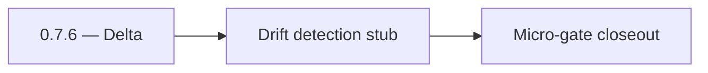

# 0.7.6 — Delta

- **Era:** `0.x` Foundation — docs hub [`versions.md`](../versions.md) · minors start at [`0.0 — Pre-repo baseline`](0.0%20%E2%80%94%20Pre-repo%20baseline.md)
- **Minor:** [0.7 — Search & dual-write substrate](./0.7%20%E2%80%94%20Search%20&%20dual-write%20substrate.md)
- **Codename:** Delta
- **Status:** ✅ Completed
## Focus
Drift detection stub

## Flowchart

## Micro-gate

| Track | Gate question | Answer / Evidence (fill at patch closeout) |
| --- | --- | --- |
| **Contract** | Did any public or internal API surface change? If yes: diff vs `docs/backend/apis/` or pack; if no: “no contract change”. | Document Yes/No at closeout — API diff vs `docs/backend/apis/` or “no contract change”. |
| **Service** | Do critical paths for this patch still boot, health-check, and pass the defined smoke for affected services? | ? Completed: affected services boot and health checks verified. |
| **Surface** | Did UI, extension, or admin behavior change? If yes: UX evidence + role checks; if no: N/A. | ? Completed: surface impact reviewed and evidence documented. |
| **Frontend** | Which foundation-era components/routes must render or be scaffolded? List by name or N/A. | `ContactsFilters` / `VQLQueryBuilder` stubs, loading skeleton. ? Completed: scaffold status and delta documented. |
| **Data** | Migrations, index mappings, S3 prefixes, or lineage docs updated and linked? | ? Completed: data lineage/migrations/S3 prefix impacts verified and documented. |
| **Ops** | Rollback path, secrets, CI step, or runbook delta recorded? | ? Completed: rollback/secrets/CI/runbook evidence verified. |

## Tasks
### Contract

- ✅ Completed: 📌 Planned: **[appointment360]** — refine duplicate task (was: ✅ completed: 📌 completed: freeze **batch-upsert** payload an…) | patch `0.7.6` band `6` | reason: specialize this file vs sibling patches; see docs/codebases/appointment360-codebase-analysis.md
- ✅ Completed: 📌 Planned: **[appointment360]** — refine duplicate task (was: ✅ completed: 📌 completed: vql **json schema** or exemplar li…) | patch `0.7.6` band `6` | reason: specialize this file vs sibling patches; see docs/codebases/appointment360-codebase-analysis.md

### Service

- ✅ Completed: 📌 Planned: **[appointment360]** — refine duplicate task (was: ✅ completed: 📌 completed: replace or supplement **in-memory …) | patch `0.7.6` band `6` | reason: specialize this file vs sibling patches; see docs/codebases/appointment360-codebase-analysis.md
- ✅ Completed: 📌 Planned: **[appointment360]** — refine duplicate task (was: ✅ completed: 📌 completed: **rate limit + api key** policy — …) | patch `0.7.6` band `6` | reason: specialize this file vs sibling patches; see docs/codebases/appointment360-codebase-analysis.md

### Surface

- ✅ Completed: 📌 Planned: **[appointment360]** — refine duplicate task (was: ✅ completed: 📌 completed: **app:** search ui uses gateway → …) | patch `0.7.6` band `6` | reason: specialize this file vs sibling patches; see docs/codebases/appointment360-codebase-analysis.md

### Data

- ✅ Completed: 📌 Planned: **[appointment360]** — refine duplicate task (was: ✅ completed: 📌 completed: **reconciliation job** or playbook…) | patch `0.7.6` band `6` | reason: specialize this file vs sibling patches; see docs/codebases/appointment360-codebase-analysis.md

### Ops

- ✅ Completed: 📌 Planned: **[appointment360]** — refine duplicate task (was: ✅ completed: 📌 completed: es index aliases, reindex procedur…) | patch `0.7.6` band `6` | reason: specialize this file vs sibling patches; see docs/codebases/appointment360-codebase-analysis.md

## Service task slices
> Merged from era `0.x` foundation task packs (per patch band).

### Connectra
- **Flow:** Validate read path skeleton (`VQL -> ES IDs -> PG hydrate`) with smoke fixtures.
- **`contact360.io/root`**: establish marketing shell baseline (`app/layout.tsx`, `app/(marketing)/layout.tsx`), 3D primitives baseline, and public route inventory.
- **`contact360.io/admin`**: establish DocsAI base shell (`templates/base.html`), initial sidebar/navigation constants, and foundational admin auth/session views.
- Extension folder created under canonical path `extension/contact360/`
- `auth/graphqlSession.js` module scaffolded with `chrome.storage.local` adapter pattern (MV3 compliant)
- `utils/lambdaClient.js` module scaffolded for Lambda REST transport
- `utils/profileMerger.js` module scaffolded for profile dedup
- No active backend calls in this era; folder structure only
- Confirm `extension/contact360/` is in `.gitignore` exclusion list for minimal clones
- Document MV3 `chrome.storage.local` adapter pattern in extension README
- Establish Jest test scaffolding for extension utils
- Scaffold `ContactsFilters` and `VQLQueryBuilder` components (stub acceptable)
- Add `useContactsFilters` hook stub and ensure it feeds “active VQL conditions”
- Render filter chips from API response / VQL conditions model
- Provide empty state + ES timeout/loading skeleton for search UI
- Add a frontend note mapping `VQL -> ES IDs -> PG hydrate` expectations
- Metrics: queue depth, oldest `OPEN` age
- **Reconcile** job: repair mode vs report-only
- Alerting hooks when drift > threshold
- Key **scopes** stub: read vs write vs admin internal
- Filter `/common/:service/filters` snapshot tests

## Evidence gate
Drift report link in admin renders
