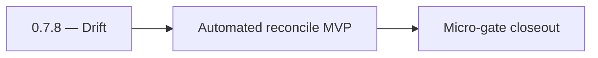

# 0.7.8 — Drift

- **Era:** `0.x` Foundation — docs hub [`versions.md`](../versions.md) · minors start at [`0.0 — Pre-repo baseline`](0.0%20%E2%80%94%20Pre-repo%20baseline.md)
- **Minor:** [0.7 — Search & dual-write substrate](./0.7%20%E2%80%94%20Search%20&%20dual-write%20substrate.md)
- **Codename:** Drift
- **Status:** ✅ Completed
## Focus
> [!NOTE]
> Codename collision: "Drift" is also used in patch `0.10.4`.

Automated reconcile MVP

## Flowchart

## Micro-gate

| Track | Gate question | Answer / Evidence (fill at patch closeout) |
| --- | --- | --- |
| **Contract** | Did any public or internal API surface change? If yes: diff vs `docs/backend/apis/` or pack; if no: “no contract change”. | Document Yes/No at closeout — API diff vs `docs/backend/apis/` or “no contract change”. |
| **Service** | Do critical paths for this patch still boot, health-check, and pass the defined smoke for affected services? | ? Completed: affected services boot and health checks verified. |
| **Surface** | Did UI, extension, or admin behavior change? If yes: UX evidence + role checks; if no: N/A. | ? Completed: surface impact reviewed and evidence documented. |
| **Frontend** | Which foundation-era components/routes must render or be scaffolded? List by name or N/A. | `ContactsFilters` / `VQLQueryBuilder` stubs, loading skeleton. ? Completed: scaffold status and delta documented. |
| **Data** | Migrations, index mappings, S3 prefixes, or lineage docs updated and linked? | ? Completed: data lineage/migrations/S3 prefix impacts verified and documented. |
| **Ops** | Rollback path, secrets, CI step, or runbook delta recorded? | ? Completed: rollback/secrets/CI/runbook evidence verified. |

## Tasks
### Contract

- 📌 Planned: **[appointment360]** — refine duplicate task (was: ✅ completed: 📌 completed: freeze **batch-upsert** payload an…) | patch `0.7.8` band `8` | reason: specialize this file vs sibling patches; see docs/codebases/appointment360-codebase-analysis.md
- 📌 Planned: **[appointment360]** — refine duplicate task (was: ✅ completed: 📌 completed: vql **json schema** or exemplar li…) | patch `0.7.8` band `8` | reason: specialize this file vs sibling patches; see docs/codebases/appointment360-codebase-analysis.md

### Service

- 📌 Planned: **[appointment360]** — refine duplicate task (was: ✅ completed: 📌 completed: replace or supplement **in-memory …) | patch `0.7.8` band `8` | reason: specialize this file vs sibling patches; see docs/codebases/appointment360-codebase-analysis.md
- 📌 Planned: **[appointment360]** — refine duplicate task (was: ✅ completed: 📌 completed: **rate limit + api key** policy — …) | patch `0.7.8` band `8` | reason: specialize this file vs sibling patches; see docs/codebases/appointment360-codebase-analysis.md

### Surface

- 📌 Planned: **[appointment360]** — refine duplicate task (was: ✅ completed: 📌 completed: **app:** search ui uses gateway → …) | patch `0.7.8` band `8` | reason: specialize this file vs sibling patches; see docs/codebases/appointment360-codebase-analysis.md

### Data

- 📌 Planned: **[appointment360]** — refine duplicate task (was: ✅ completed: 📌 completed: **reconciliation job** or playbook…) | patch `0.7.8` band `8` | reason: specialize this file vs sibling patches; see docs/codebases/appointment360-codebase-analysis.md

### Ops

- 📌 Planned: **[appointment360]** — refine duplicate task (was: ✅ completed: 📌 completed: es index aliases, reindex procedur…) | patch `0.7.8` band `8` | reason: specialize this file vs sibling patches; see docs/codebases/appointment360-codebase-analysis.md

## Service task slices
> Merged from era `0.x` foundation task packs (per patch band).

### Connectra
- **Release gate evidence:** Health checks, seed/load scripts, and contract doc links recorded in `docs/architecture.md` and `docs/versions.md`.
- Same payload twice → **stable** UUID5 + no duplicate business rows (contacts/companies).
- Parallel upsert stress: **no** deadlocks; deterministic ordering documented or accepted.
- Partial failure semantics **explicit** in API response (per-field or per-record errors).
- Evidence: test output + link from `docs/versions.md` when closing **`0.7.x`** patches.

## Evidence gate
N/A — drift automation
