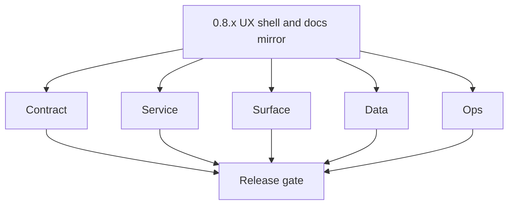
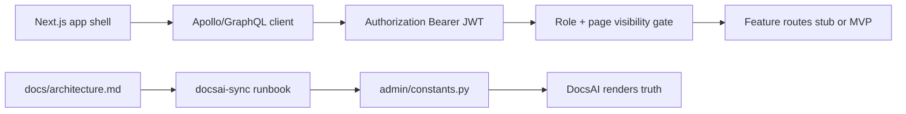

# Version 0.8 — UX shell & docs mirror
> Foundation storage policy: All Contact360 codebases route file and artifact storage through `lambda/s3storage` as the canonical storage control plane.

- **Status:** ✅ Completed
- **Era:** 0.x (Foundation and pre-product stabilization)
- **Summary:** Solidify [`contact360.io/app`](../../contact360.io/app/) authenticated shell — GraphQL client, **JWT** session, **role-based page visibility**, loading/error patterns, and marketing [`contact360.io/root`](../../contact360.io/root/) layout baseline; synchronize **DocsAI** so [`docs/architecture.md`](../architecture.md) + [`docs/roadmap.md`](../roadmap.md) match Django constants per [`docs/docsai-sync.md`](../docsai-sync.md). Address **admin** sidebar/`SIDEBAR_MENU` drift risks from codebase analysis.
- **Patch closure:** Each codenamed patch file includes **Micro-gate** + **Service task slices**. Era hub: [`versions.md`](../versions.md).

## Scope

- **Target:** `0.8.x` — every dashboard route intended for foundation era renders under correct role; docs visible in admin match monorepo markdown.
- **In scope:** `app` API modules mapping, context providers, `admin` templates, **no** full feature completeness for `1.x` billing.

## Flowchart

### Runtime focus (unique to this minor)

## Task tracks

### Contract

- 📌 Planned: **[appointment360]** — refine duplicate task (was: 📌 planned: **[appointment360]** — refine duplicate task (was…) | patch `0.8.0` band `0` | reason: specialize this file vs sibling patches; see docs/codebases/appointment360-codebase-analysis.md

- 📌 Planned: **[appointment360]** — refine duplicate task (was: 📌 planned: **[architecture]** — product **graphql** remains …) | patch `0.8.0` band `0` | reason: specialize this file vs sibling patches; see docs/codebases/appointment360-codebase-analysis.md
### Service

- 📌 Planned: **[appointment360]** — refine duplicate task (was: 📌 planned: **[appointment360]** — refine duplicate task (was…) | patch `0.8.0` band `0` | reason: specialize this file vs sibling patches; see docs/codebases/appointment360-codebase-analysis.md

- 📌 Planned: **[appointment360]** — refine duplicate task (was: 📌 planned: **[architecture]** — **go/gin satellites** in sco…) | patch `0.8.0` band `0` | reason: specialize this file vs sibling patches; see docs/codebases/appointment360-codebase-analysis.md
### Surface

- ✅ Completed: ✅ Completed: 📌 Completed: DocsAI constants and admin mirror entries are synchronized with frontend route and component docs.

- 📌 Planned: **[appointment360]** — refine duplicate task (was: 📌 planned: **[appointment360]** — refine duplicate task (was…) | patch `0.8.0` band `0` | reason: specialize this file vs sibling patches; see docs/codebases/appointment360-codebase-analysis.md
- 📌 Planned: **[appointment360]** — refine duplicate task (was: 📌 planned: **[appointment360]** — refine duplicate task (was…) | patch `0.8.0` band `0` | reason: specialize this file vs sibling patches; see docs/codebases/appointment360-codebase-analysis.md
- ✅ Completed: ⬜ Incomplete: **contact360.io/root (marketing)** — every marketing page including the landing page is annotated `"use client"` which disables server-side rendering; Next.js cannot produce SEO-friendly static HTML for search crawlers — audit each page and convert to Server Components (remove `"use client"`) or use `generateStaticParams` / `generateMetadata` for static generation at build time.
- ✅ Completed: ⬜ Incomplete: **contact360.io/root (marketing)** — no per-page `<head>` metadata is set on any marketing route (`/products/email-finder`, `/products/email-verifier`, etc.); root `layout.tsx` only sets a single global `title`/`description` — add `generateMetadata()` or static `export const metadata` to each product page with unique `title`, `description`, `openGraph`, and `twitter` fields.
- ✅ Completed: ⬜ Incomplete: **contact360.io/root (marketing)** — no `app/sitemap.ts` or `app/robots.ts` file exists; Next.js 13+ supports automatic sitemap/robots generation — add `sitemap.ts` listing all marketing routes and `robots.ts` allowing all crawlers with `sitemap` reference.
- ✅ Completed: 📌 Planned: **contact360.io/root (marketing)** — add Schema.org JSON-LD structured data (`Product`, `SoftwareApplication`, `Organization`) to product pages (`/products/email-finder`, `/products/email-verifier`, `/products/prospect-finder`, `/products/ai-email-writer`) to improve rich-result eligibility in Google search.
- ✅ Completed: 📌 Planned: **contact360.io/root (marketing)** — migrate font loading from `globals.css` `@import` to `next/font` (Google Fonts or local) to eliminate render-blocking font requests and reduce CLS (Cumulative Layout Shift).
- 📌 Planned: **[appointment360]** — refine duplicate task (was: 📌 planned: **[appointment360]** — refine duplicate task (was…) | patch `0.8.0` band `0` | reason: specialize this file vs sibling patches; see docs/codebases/appointment360-codebase-analysis.md
- ✅ Completed: ⬜ Incomplete: **contact360.io/email (Mailhub)** — `src/app/layout.tsx` has `title: "Create Next App"` and `description: "Generated by create next app"` — these are Next.js boilerplate placeholders; update metadata to `title: "Mailhub — Email Reimagined"` and a real product description before any user-facing deployment.
- ✅ Completed: ⬜ Incomplete: **contact360.io/email (Mailhub)** — `src/components/LayoutClient.tsx` does not implement an authentication guard; any unauthenticated request to `/inbox`, `/sent`, `/spam`, `/draft` renders the full sidebar shell (with error or empty states) instead of redirecting to `/auth/login` — implement a `useEffect`-based session check (read `userId` from `localStorage`, verify with `GET /auth/user/:userId`, redirect if missing) or use middleware-based route protection.
- ✅ Completed: ⬜ Incomplete: **contact360.io/email (Mailhub)** — `src/app/data.json` is a 600-line mock data file from a component library template (shadcn/ui data-table example) that is not related to email data and is checked into the repository; remove this file and replace any template references in `DataTable` with actual email data types.
- ✅ Completed: 📌 Planned: **contact360.io/email (Mailhub)** — implement a `ComposeEmail` component and route (`/compose` or modal sheet) with `To`, `Subject`, `Body` fields and a `Send` button that calls `POST ${BACKEND_URL}/api/emails/send`; the sidebar "Send" FAB and the sent/draft folder structure imply compose functionality is expected but no compose UI exists.
- ✅ Completed: ✅ Completed: **contact360.io/app (Dashboard)** — authenticated shell is production-quality: `app/(dashboard)/layout.tsx` gates all dashboard routes behind `useAuth()` + redirect to `/login`; `DashboardAccessGate` component adds per-page role/plan gating with loading state; `useSessionGuard` hook provides reusable role-aware redirect logic.
- ✅ Completed: ✅ Completed: **contact360.io/app (Dashboard)** — JWT session management is fully implemented: `tokenManager.ts` stores access/refresh tokens in `localStorage`, `AuthContext` performs auto-refresh every 60s and on load, `graphqlClient.ts` handles 401 token refresh with retry queue, `useAuthRedirect` redirects authenticated users away from login page.
- ✅ Completed: ⬜ Incomplete: **contact360.io/app (Dashboard)** — `app/(dashboard)/appointments` route directory is empty (no `page.tsx`); the route is referenced in the sidebar navigation structure but renders a 404 — either implement the appointments page or remove the route and sidebar entry until the appointments feature is built.
- ✅ Completed: ⬜ Incomplete: **contact360.io/app (Dashboard)** — `app/(dashboard)/settings/page.tsx` is a stub that immediately redirects to `/profile` using `useRouter().replace("/profile")`; the settings route has no content of its own; decide whether to merge settings into profile or build a dedicated settings page with notification preferences, API keys, and connected apps that are currently buried in profile tabs.
- ✅ Completed: ⬜ Incomplete: **contact360.io/app (Dashboard)** — `app/(dashboard)/admin/page.tsx` does the `SuperAdmin` role check in a `useEffect` (client-side after render); a `SuperAdmin`-gated page momentarily renders for non-admin users before redirect — move role gating to `DashboardAccessGate` or middleware so the page content never renders for unauthorized users.

### Data

- 📌 Planned: **[appointment360]** — refine duplicate task (was: 📌 planned: **[appointment360]** — refine duplicate task (was…) | patch `0.8.0` band `0` | reason: specialize this file vs sibling patches; see docs/codebases/appointment360-codebase-analysis.md

- 📌 Planned: **[appointment360]** — refine duplicate task (was: 📌 planned: **[architecture]** — **postgresql-first** per `do…) | patch `0.8.0` band `0` | reason: specialize this file vs sibling patches; see docs/codebases/appointment360-codebase-analysis.md
### Ops

- 📌 Planned: **[appointment360]** — refine duplicate task (was: 📌 planned: **[appointment360]** — refine duplicate task (was…) | patch `0.8.0` band `0` | reason: specialize this file vs sibling patches; see docs/codebases/appointment360-codebase-analysis.md

- 📌 Planned: **[appointment360]** — refine duplicate task (was: 📌 planned: **[architecture]** — **observability**: correlate…) | patch `0.8.0` band `0` | reason: specialize this file vs sibling patches; see docs/codebases/appointment360-codebase-analysis.md
- 📌 Planned: **[appointment360]** — refine duplicate task (was: 📌 planned: **[architecture]** — **django docsai** (`contact3…) | patch `0.8.0` band `0` | reason: specialize this file vs sibling patches; see docs/codebases/appointment360-codebase-analysis.md
## Task Breakdown

| Surface | Tasks |
| --- | --- |
| app | Route guard parity with backend roles |
| admin | Constants mirrored |
| root | Public pages build |

## Immediate next execution queue

- 📌 Completed: Run **DocsAI sync** in same PR as doc edits.
- 📌 Completed: Snapshot **sidebar** config vs actual routes.

## Cross-service ownership

| Team | Surface |
| --- | --- |
| Frontend | app, root |
| Platform + Governance | admin, DocsAI |
| Platform API | GraphQL auth errors |

## References

- [`../codebases/app-codebase-analysis.md`](../codebases/app-codebase-analysis.md), [`../codebases/root-codebase-analysis.md`](../codebases/root-codebase-analysis.md), [`../codebases/admin-codebase-analysis.md`](../codebases/admin-codebase-analysis.md)
- [`docs/frontend.md`](../frontend.md), [`docs/docsai-sync.md`](../docsai-sync.md)

## Backend API and Endpoint Scope

- GraphQL modules consumed by shell: `auth`, `users`, `profile`, `pages`, etc.

## Database and Data Lineage Scope

- User/session display fields only; no new business tables required for shell alone.

## Frontend UX Surface Scope

- Primary: dashboard layout, nav, auth flow, role-gated destinations.

Frontend UX surface (full shell evidence):

- Routes:
  - `/dashboard`
  - `/profile`
  - `/billing`
  - `/settings`
- Components:
  - Full `MainLayout` (sidebar + topbar + content)
  - Full `Sidebar` navigation
  - `CreditBudgetAlerts`
- Context:
  - `RoleContext` fully populated
- Hooks:
  - `useDashboardPage`
  - `useSidebar`
- Admin/templates:
  - `templates/base.html`
  - `SIDEBAR_MENU` constants mirrored

Cross-reference: `docs/docsai-sync.md` (shell + constants sync requirements).

## UI Elements Checklist

- 📌 Completed: `MainLayout` full — sidebar + topbar + content renders
- 📌 Completed: `Sidebar` nav links gated by `RoleContext`
- 📌 Completed: Global error boundary catches page crashes
- 📌 Completed: `toast.success` / `toast.error` system wired
- 📌 Completed: Loading states for GraphQL queries (skeletons)
- 📌 Completed: `admin` constants mirror `docs/architecture.md` + `docs/roadmap.md`
- 📌 Completed: `root/` marketing layout builds without error
- 📌 Completed: `useForceLightTheme` applied on marketing routes

## Flow / Graph Delta for This Minor

- **Delta:** Ties **user-visible navigation** to **backend roles** and **documentation truth** in admin.

## Audit and Compliance Notes

- Admin/docs surfaces may expose internal roadmap — RBAC for staff; no customer PII in DocsAI content.

## Patch ladder (`0.8.0` – `0.8.9`)

### Micro-gate reference (apply at every `0.8.P`)

| Track | Gate question (must answer Yes or document waiver) |
| --- | --- |
| **Contract** | Did any public or internal API surface change? If yes: diff vs `docs/backend/apis/` or pack; if no: attach “no contract change” note. |
| **Service** | Do critical paths for this patch still boot, health-check, and pass the defined smoke for affected services? |
| **Surface** | Did UI, extension, or admin behavior change? If yes: UX evidence + role checks; if no: note N/A. |
| **Frontend** | Which foundation-era components/routes must render or be scaffolded? List by name or mark N/A. |
| **Data** | Migrations, index mappings, S3 prefixes, or lineage docs updated and linked? |
| **Ops** | Rollback path, secrets, CI step, or runbook delta recorded? |

**Patch intent bands (typical):** `.0` charter · `.1`–`.2` scaffold · `.3`–`.5` hardening · `.6`–`.8` integration/drift · `.9` minor freeze / handoff to `0.(N+1).0`.

Theme: **Glass**. Per-patch tables: each `0.8.P — … .md` file.

| Patch | Codename | Focus | Evidence gate |
| --- | --- | --- | --- |
| `0.8.0` | Shell | App layout | `MainLayout` full render (sidebar + content) |
| `0.8.1` | Nav | Sidebar routes | N/A — nav wiring within shell |
| `0.8.2` | Portal | Auth flow | Auth flow end-to-end smoke (portal) |
| `0.8.3` | Canvas | Dashboard home | N/A — dashboard home stub only |
| `0.8.4` | Mirror | DocsAI sync | DocsAI sync evidence attached (admin constants match markdown) |
| `0.8.5` | Panel | Roadmap view | N/A — view stubbing evidence only |
| `0.8.6` | Card | Feature overview stub | N/A — feature overview card stub |
| `0.8.7` | Toast | Error policy | Error → toast smoke (mapped error path) |
| `0.8.8` | Route | 403/404 | 403/404 pages render for denied/unknown routes |
| `0.8.9` | Glass | Freeze → `0.9` | N/A — handoff prep |

## Release Gate and Evidence

### Master Task Checklist

- 📌 Completed: DocsAI sync evidence attached when docs changed

### Backend API and Endpoints

- 📌 Completed: List GraphQL operations used by shell
- ✅ Completed: **contact360.io/api** — `app/graphql/modules/pages/` exposes `PagesQuery` (DocsAI-backed pages lookup) and `PageSummary` type; on successful login the `login` mutation auto-fetches pages by role via `PagesService` and returns them in `AuthPayload`.
- ⬜ Incomplete: **contact360.io/api** — `docker-compose.yml` service names (`appointment-backend`, `appointment-postgres`) and MongoDB service (`appointment-mongodb`) are stale from pre-rename; MongoDB is not used anywhere in the codebase (PostgreSQL only) — remove MongoDB service from compose and rename all containers to `contact360-*`.
- 📌 Planned: **contact360.io/api** — `PROJECT_NAME` in `config.py` still reads `"Appointment GraphQL API"` and `DESCRIPTION` still reads `"Appointment360"` — rename to `Contact360 GraphQL API` throughout config + Swagger/OpenAPI metadata.
- ✅ Completed: **contact360.io/admin** — Django admin shell fully implemented: `core/views.py` has `login_view` (IP-rate-limited, cookie-based auth), `dashboard_view`, `logout_view`; all routes protected by `@require_super_admin` decorator; HttpOnly cookies store JWT tokens (`access_token` + `refresh_token`).
- ✅ Completed: **contact360.io/admin** — GitHub Actions CI/CD pipeline exists: `.github/workflows/ci.yml` runs Ruff format check, Ruff lint, isort, mypy, pytest; `.github/workflows/deploy.yml` handles deployment — CI gates on lint/format/test.
- ⬜ Incomplete: **contact360.io/admin** — `analytics/views.py` only counts DocsAI documentation pages (total, published, draft, page-type distribution) — there are no user-facing analytics (user signup rate, active users, billing events, credit consumption) in the admin shell; implement real business analytics queries via Appointment360 GraphQL.
- ⬜ Incomplete: **contact360.io/admin** — `mypy` type checking is `continue-on-error: true` in `ci.yml` — type errors do not block CI; remove `continue-on-error` after fixing existing type errors to enforce strict typing as a gate.
- 📌 Planned: **contact360.io/admin** — `USE_LOCAL_JSON_FILES=True` in `.env` means documentation is served from local JSON files, not S3 or GraphQL — set `USE_LOCAL_JSON_FILES=False` and `S3_AUTH_STORAGE_ENABLED=True` in production so the admin reads live documentation from S3.

### Database and Data Lineage

- 📌 Completed: N/A or user table note

### Frontend UX

- 📌 Completed: Screenshots or Loom for core routes

### UI Elements

- 📌 Completed: Checklist signed

### Flow and Graph

- 📌 Completed: Shell diagram updated

### Validation

- 📌 Completed: Role matrix smoke (at least 2 roles)

### Release Gate

- 📌 Completed: Sign-off for **0.9 Extension channel scaffold**

## Patches

| Patch | Codename | Doc |
| --- | --- | --- |
| `0.8.0` | Shell | [`0.8.0` — Shell](0.8.0%20%E2%80%94%20Shell.md) |
| `0.8.1` | Nav | [`0.8.1` — Nav](0.8.1%20%E2%80%94%20Nav.md) |
| `0.8.2` | Portal | [`0.8.2` — Portal](0.8.2%20%E2%80%94%20Portal.md) |
| `0.8.3` | Canvas | [`0.8.3` — Canvas](0.8.3%20%E2%80%94%20Canvas.md) |
| `0.8.4` | Mirror | [`0.8.4` — Mirror](0.8.4%20%E2%80%94%20Mirror.md) |
| `0.8.5` | Panel | [`0.8.5` — Panel](0.8.5%20%E2%80%94%20Panel.md) |
| `0.8.6` | Card | [`0.8.6` — Card](0.8.6%20%E2%80%94%20Card.md) |
| `0.8.7` | Toast | [`0.8.7` — Toast](0.8.7%20%E2%80%94%20Toast.md) |
| `0.8.8` | Route | [`0.8.8` — Route](0.8.8%20%E2%80%94%20Route.md) |
| `0.8.9` | Glass | [`0.8.9` — Glass](0.8.9%20%E2%80%94%20Glass.md) |
