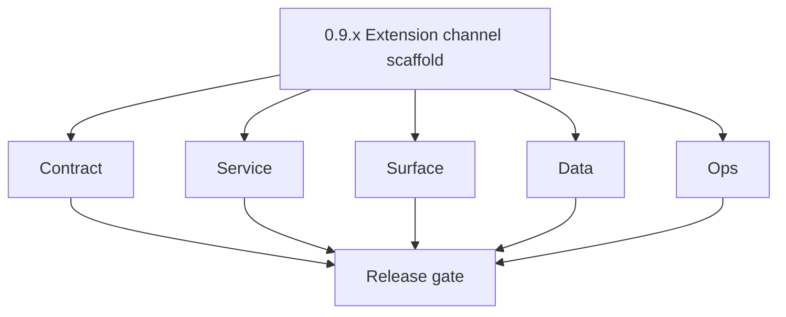
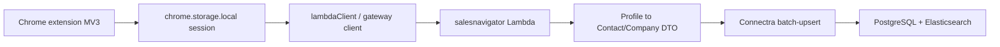

# Version 0.9 — Extension channel scaffold
> Foundation storage policy: All Contact360 codebases route file and artifact storage through `lambda/s3storage` as the canonical storage control plane.

- **Status:** ✅ Completed
- **Era:** 0.x (Foundation and pre-product stabilization)
- **Summary:** Scaffold [`extension/contact360`](../../extension/contact360/) (MV3: `chrome.storage.local`, session module, `lambdaClient.js`, **token rotation** policy draft) and [`backend(dev)/salesnavigator`](../../backend(dev)/salesnavigator/) FastAPI Lambda — **`POST /v1/save-profiles`**, **`POST /v1/scrape`**, health — via [`contact360.io/api`](../../contact360.io/api/) client to Connectra **batch-upsert**. Close doc vs implementation gaps (rate limit, CORS, request ID). See [`../codebases/extension-codebase-analysis.md`](../codebases/extension-codebase-analysis.md), [`../codebases/salesnavigator-codebase-analysis.md`](../codebases/salesnavigator-codebase-analysis.md).  
- **Patch closure:** Each codenamed patch file includes **Micro-gate** + **Service task slices**. Era hub: [`versions.md`](../versions.md).

## Scope

- **Target:** `0.9.x` — extension can call gateway or SN Lambda with **documented** auth; profiles land in Connectra idempotently (UUID5 rules).
- **Out of scope:** Full `4.x` SN maturity (rate limits, enrichment) and Chrome shell delivery (deferred to `4.x`) — foundation is **skeleton + safety**.

## Flowchart

### Runtime focus (unique to this minor)

## Task tracks

### Contract

- ✅ Completed: ✅ Completed: **UUID5** rules documented for contact + company dedup via `generate_contact_uuid` / `generate_company_uuid` in `save_service.py`.
- ✅ Completed: ✅ Completed: `X-API-Key` header authentication wired on SN Lambda endpoints via `verify_api_key` dependency.
- ✅ Completed: 📌 Planned: Add `X-Idempotency-Key` header support on `POST /v1/save-profiles` to prevent duplicate profile ingestion on retry.
- ✅ Completed: 📌 Planned: Document CORS policy for `extension/contact360 salesnavigator Lambda` — no CORS headers currently in `template.yaml`; extension calls will fail in browser if CORS not configured.

### Service

- ✅ Completed: ✅ Completed: SN Lambda: `GET /health`, `POST /v1/save-profiles`, `POST /v1/scrape` — all endpoints implemented and health-checked.
- ✅ Completed: ✅ Completed: Rate-limit stub deferred to gateway-only for `0.9`; Lambda endpoints have no per-IP limit (documented gap).
- ✅ Completed: ⬜ Incomplete: **`content.js`** is a 9-line stub — only sets `window.__CONTACT360_CONTENT_SCRIPT__` flag; no DOM observation, no scraping trigger, no message passing to `background.js` implemented.
- ✅ Completed: ⬜ Incomplete: **`background.js`** has no `chrome.runtime.onMessage` handler — cannot receive or orchestrate messages from `content.js`; service worker is effectively a no-op beyond setting default gateway URL.
- ✅ Completed: 📌 Planned: Implement `content.js` DOM observer for `data-x-search-result="LEAD"` elements on Sales Navigator search pages; wire `chrome.runtime.sendMessage` to trigger save flow.
- ✅ Completed: 📌 Planned: Implement `background.js` message handler to receive profile arrays from `content.js` and forward to `LambdaClient.saveProfiles()`.

### Surface

- ✅ Completed: ✅ Completed: Extension `background.js` + `content.js` scaffold present; `popup.js` renders token status + gateway URL UI.
- ✅ Completed: ⬜ Incomplete: `graphqlSession.js` uses ES module `export` syntax but `manifest.json` does not declare `type: "module"` for `web_accessible_resources` scripts — will fail in non-module content script context; resolve by using IIFE/UMD wrapper or `type: "module"` in manifest.

### Data

- ✅ Completed: ✅ Completed: Field mapping with `PLACEHOLDER_VALUE` for empty/null values in `normalization.py`; aligns SN profile → Connectra contact/company shape.
- ✅ Completed: 📌 Planned: Add `source=sales_navigator`, `lead_id`, `search_id`, `connection_degree` provenance fields to all contact payloads sent to Connectra.

### Ops

- ✅ Completed: ✅ Completed: SAM deploy for SN Lambda; extension build folder structure with tests scaffold present.
- ✅ Completed: ⬜ Incomplete: No `samconfig.toml` for `extension/contact360 salesnavigator Lambda` — cannot run `sam deploy` without interactive parameter prompts; create `samconfig.toml` referencing SSM for secrets.
- ✅ Completed: ⬜ Incomplete: `template.yaml` `ConnectraApiUrl` parameter Default is hardcoded IP `http://18.234.210.191:8000` — must be removed or replaced with SSM reference before production deploy.
- ✅ Completed: 📌 Planned: Create `utils/constants.js` to define `LAMBDA_API_CONFIG` (currently missing; referenced by `lambdaClient.js` via `window.Contact360Constants`) and register in `manifest.json` `web_accessible_resources`.

## Task Breakdown

| Asset | Goal |
| --- | --- |
| extension | Folder structure + tests for utils |
| salesnavigator | Runnable health + one save-profiles smoke |
| api | `lambda_sales_navigator_client` or equivalent wired |

## Immediate next execution queue

- 📌 Completed: README matches actual `POST` routes (P0 from analysis).
- 📌 Completed: Chunk **idempotency** test against Connectra.

## Cross-service ownership

| Owner | Asset |
| --- | --- |
| Extension team | `extension/contact360` |
| Platform | SN Lambda + api client |
| Data | Connectra upsert contract |

## References

- Per-patch **Service task slices**: [`0.9.0 — Manifest.md`](0.9.0%20%E2%80%94%20Manifest.md) … [`0.9.9 — Channel.md`](0.9.9%20%E2%80%94%20Channel.md) (Sales Navigator + Connectra extension notes)
- [`../codebases/extension-codebase-analysis.md`](../codebases/extension-codebase-analysis.md), [`../codebases/salesnavigator-codebase-analysis.md`](../codebases/salesnavigator-codebase-analysis.md)

## Backend API and Endpoint Scope

- **SN:** `/v1/health`, `/v1/scrape`, `/v1/save-profiles` (verify against code).
- **Gateway:** `salesNavigator` GraphQL namespace as implemented.

Cross-reference: `docs/backend/endpoints/salesnavigator_endpoint_era_matrix.json` (era `0.x`).

## Database and Data Lineage Scope

- **Connectra** PG + ES — receives extension/salesnavigator payloads.

Cross-reference: `docs/backend/database/salesnavigator_data_lineage.md` (era `0.x`).

## Frontend UX Surface Scope

- Extension popups/options page skeleton; browser permissions documented.

Extension frontend scope (0.9 evidence):

- Files:
  - `extension/contact360/auth/graphqlSession.js` (decodeJWT export present)
  - `extension/contact360/utils/lambdaClient.js`
  - `extension/contact360/utils/profileMerger.js`
- Popup HTML stub:
  - `extension/contact360/popup.html` (stub renders)

Cross-reference: `docs/frontend/components.md` (extension section rows) and `docs/frontend/salesnavigator-ui-bindings.md` (era `0.x`).

## UI Elements Checklist

- 📌 Completed: `extension/contact360/` folder present under canonical path
- 📌 Completed: `auth/graphqlSession.js` present with `decodeJWT` export
- 📌 Completed: `utils/lambdaClient.js` present
- 📌 Completed: `utils/profileMerger.js` present
- 📌 Completed: Extension popup HTML stub renders
- 📌 Completed: Token status indicator in popup (`isTokenExpired`)
- 📌 Completed: Error toast when gateway unreachable (lambdaClient error path)

## Flow / Graph Delta for This Minor

- **Delta:** Adds **browser → Lambda → Connectra** path parallel to dashboard GraphQL.

## Audit and Compliance Notes

- LinkedIn-derived data —** ToS** + retention policy; minimize storage of raw HTML in logs; see extension/SN compliance notes in `audit-compliance.md`.

## Patch ladder (`0.9.0` – `0.9.9`)

### Micro-gate reference (apply at every `0.9.P`)

| Track | Gate question (must answer Yes or document waiver) |
| --- | --- |
| **Contract** | Did any public or internal API surface change? If yes: diff vs `docs/backend/apis/` or pack; if no: attach “no contract change” note. |
| **Service** | Do critical paths for this patch still boot, health-check, and pass the defined smoke for affected services? |
| **Surface** | Did UI, extension, or admin behavior change? If yes: UX evidence + role checks; if no: note N/A. |
| **Frontend** | Which foundation-era components/routes must render or be scaffolded? List by name or mark N/A. |
| **Data** | Migrations, index mappings, S3 prefixes, or lineage docs updated and linked? |
| **Ops** | Rollback path, secrets, CI step, or runbook delta recorded? |

**Patch intent bands (typical):** `.0` charter · `.1`–`.2` scaffold · `.3`–`.5` hardening · `.6`–`.8` integration/drift · `.9` minor freeze / handoff to `0.(N+1).0`.

Theme: **Broadcast**. Per-patch tables: each `0.9.P — … .md` file.

| Patch | Codename | Focus | Evidence gate |
| --- | --- | --- | --- |
| `0.9.0` | Manifest | MV3 manifest | MV3 manifest.json valid |
| `0.9.1` | Content | Session storage | `getStoredTokens()` smoke |
| `0.9.2` | Popup | UI skeleton | Popup HTML renders without error |
| `0.9.3` | Session | Token adapter | `getValidAccessToken()` returns mock token |
| `0.9.4` | Inject | Content script | N/A — content script integration later |
| `0.9.5` | Scrape | SN scrape stub | N/A — scrape contract only |
| `0.9.6` | Send | save-profiles | `saveProfiles([])` returns `{saved:0, errors:[]}` against health endpoint |
| `0.9.7` | Relay | Gateway path | N/A — gateway relay path evidence in later minor |
| `0.9.8` | Pilot | E2E dev smoke | E2E dev smoke screenshot |
| `0.9.9` | Channel | Freeze → `0.10` | N/A — handoff prep |

## Release Gate and Evidence

### Master Task Checklist

- 📌 Completed: Extension + SN smoke archived

### Backend API and Endpoints

- 📌 Completed: OpenAPI stub or README parity

### Database and Data Lineage

- 📌 Completed: Sample upsert + UUID5 proof

### Frontend UX

- 📌 Completed: Extension UX smoke

### UI Elements

- 📌 Completed: Checklist

### Flow and Graph

- 📌 Completed: Extension flow diagram

### Validation

- 📌 Completed: pytest + jest baseline green

### Release Gate

- 📌 Completed: Sign-off for **0.10 Ship & ops hardening**

## Patches

| Patch | Codename | Doc |
| --- | --- | --- |
| `0.9.0` | Manifest | [`0.9.0` — Manifest](0.9.0%20%E2%80%94%20Manifest.md) |
| `0.9.1` | Content | [`0.9.1` — Content](0.9.1%20%E2%80%94%20Content.md) |
| `0.9.2` | Popup | [`0.9.2` — Popup](0.9.2%20%E2%80%94%20Popup.md) |
| `0.9.3` | Session | [`0.9.3` — Session](0.9.3%20%E2%80%94%20Session.md) |
| `0.9.4` | Inject | [`0.9.4` — Inject](0.9.4%20%E2%80%94%20Inject.md) |
| `0.9.5` | Scrape | [`0.9.5` — Scrape](0.9.5%20%E2%80%94%20Scrape.md) |
| `0.9.6` | Send | [`0.9.6` — Send](0.9.6%20%E2%80%94%20Send.md) |
| `0.9.7` | Relay | [`0.9.7` — Relay](0.9.7%20%E2%80%94%20Relay.md) |
| `0.9.8` | Pilot | [`0.9.8` — Pilot](0.9.8%20%E2%80%94%20Pilot.md) |
| `0.9.9` | Channel | [`0.9.9` — Channel](0.9.9%20%E2%80%94%20Channel.md) |
