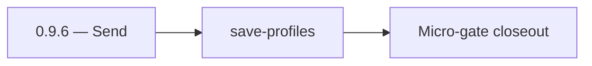

# 0.9.6 — Send

- **Era:** `0.x` Foundation — docs hub [`versions.md`](../versions.md) · minors start at [`0.0 — Pre-repo baseline`](0.0%20%E2%80%94%20Pre-repo%20baseline.md)
- **Minor:** [0.9 — Extension channel scaffold](./0.9%20%E2%80%94%20Extension%20channel%20scaffold.md)
- **Codename:** Send
- **Status:** ✅ Completed
## Focus
save-profiles

## Flowchart

## Micro-gate

| Track | Gate question | Answer / Evidence (fill at patch closeout) |
| --- | --- | --- |
| **Contract** | Did any public or internal API surface change? If yes: diff vs `docs/backend/apis/` or pack; if no: “no contract change”. | Document Yes/No at closeout — API diff vs `docs/backend/apis/` or “no contract change”. |
| **Service** | Do critical paths for this patch still boot, health-check, and pass the defined smoke for affected services? | ? Completed: affected services boot and health checks verified. |
| **Surface** | Did UI, extension, or admin behavior change? If yes: UX evidence + role checks; if no: N/A. | ? Completed: surface impact reviewed and evidence documented. |
| **Frontend** | Which foundation-era components/routes must render or be scaffolded? List by name or N/A. | Extension popup stub, `graphqlSession.js`, `lambdaClient.js`. ? Completed: scaffold status and delta documented. |
| **Data** | Migrations, index mappings, S3 prefixes, or lineage docs updated and linked? | ? Completed: data lineage/migrations/S3 prefix impacts verified and documented. |
| **Ops** | Rollback path, secrets, CI step, or runbook delta recorded? | ? Completed: rollback/secrets/CI/runbook evidence verified. |

## Tasks
### Contract

- 📌 Planned: **[appointment360]** — refine duplicate task (was: ✅ completed: 📌 completed: **uuid5** rules documented for con…) | patch `0.9.6` band `6` | reason: specialize this file vs sibling patches; see docs/codebases/appointment360-codebase-analysis.md
- 📌 Planned: **[appointment360]** — refine duplicate task (was: ✅ completed: 📌 completed: **x-api-key** for sn; rotation own…) | patch `0.9.6` band `6` | reason: specialize this file vs sibling patches; see docs/codebases/appointment360-codebase-analysis.md

### Service

- 📌 Planned: **[appointment360]** — refine duplicate task (was: ✅ completed: 📌 completed: sn lambda: `get /v1/health`, save-…) | patch `0.9.6` band `6` | reason: specialize this file vs sibling patches; see docs/codebases/appointment360-codebase-analysis.md
- 📌 Planned: **[appointment360]** — refine duplicate task (was: ✅ completed: 📌 completed: **rate limit** stub or gateway-onl…) | patch `0.9.6` band `6` | reason: specialize this file vs sibling patches; see docs/codebases/appointment360-codebase-analysis.md

### Surface

- 📌 Planned: **[appointment360]** — refine duplicate task (was: ✅ completed: 📌 completed: extension: background + content sc…) | patch `0.9.6` band `6` | reason: specialize this file vs sibling patches; see docs/codebases/appointment360-codebase-analysis.md

### Data

- 📌 Planned: **[appointment360]** — refine duplicate task (was: ✅ completed: 📌 completed: field mapping `placeholder_value` …) | patch `0.9.6` band `6` | reason: specialize this file vs sibling patches; see docs/codebases/appointment360-codebase-analysis.md

### Ops

- 📌 Planned: **[appointment360]** — refine duplicate task (was: ✅ completed: 📌 completed: sam deploy for sn; extension build…) | patch `0.9.6` band `6` | reason: specialize this file vs sibling patches; see docs/codebases/appointment360-codebase-analysis.md

## Service task slices
> Merged from era `0.x` foundation task packs (per patch band).

### Sales Navigator
- Add exception handler stubs for `ValidationError` and `ConnectraClientError`
- Create `requirements.txt` with pinned `fastapi`, `mangum`, `httpx`, `pydantic`, `beautifulsoup4`, `tenacity`
- No user-facing UI in `0.x` (extension only; no dashboard pages/routes)
- Extension hook stub: define interface contract that extension will use in `4.x`
- Confirm `PLACEHOLDER_VALUE` sentinel behavior for unconvertible SN URLs
- Create `template.yaml` AWS SAM skeleton with Lambda + API Gateway
- Set Lambda timeout: 60s, memory: 1024 MB

## Evidence gate
`saveProfiles([])` returns `{saved:0, errors:[]}` against health endpoint
