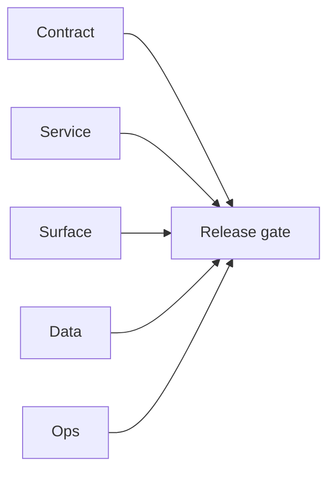

# 0.x Foundation Era Docs

Execution guide for Contact360 `0.x.x` foundation and pre-product stabilization.

## Era objective

- Build a stable baseline before feature expansion.
- Freeze foundational contracts for auth, schema, mesh, storage, jobs, and release operations.
- Ensure every patch (`0.N.P`) has traceable micro-gate evidence before handoff to `1.x`.

## Hard gates before `1.x`

- Core services boot and health contracts are stable.
- Migration and schema baselines are reproducible.
- Storage and jobs baseline behavior is validated in normal and failure paths.
- Docs, governance, and release evidence are consistent across `docs/versions.md` and era packets.

## Minor index (`0.0` - `0.10`)

| Minor | Theme | Status | Doc |
| --- | --- | --- | --- |
| `0.0` | Pre-repo baseline | ✅ Completed | [`0.0 — Pre-repo baseline`](0.0%20%E2%80%94%20Pre-repo%20baseline.md) |
| `0.1` | Monorepo bootstrap | ✅ Completed | [`0.1 — Monorepo bootstrap`](0.1%20%E2%80%94%20Monorepo%20bootstrap.md) |
| `0.2` | Schema & migration bedrock | ✅ Completed | [`0.2 — Schema & migration bedrock`](0.2%20%E2%80%94%20Schema%20&%20migration%20bedrock.md) |
| `0.3` | Service mesh contracts | ✅ Completed | [`0.3 — Service mesh contracts`](0.3%20%E2%80%94%20Service%20mesh%20contracts.md) |
| `0.4` | Identity & RBAC freeze | ✅ Completed | [`0.4 — Identity & RBAC freeze`](0.4%20%E2%80%94%20Identity%20&%20RBAC%20freeze.md) |
| `0.5` | Object storage plane | ✅ Completed | [`0.5 — Object storage plane`](0.5%20%E2%80%94%20Object%20storage%20plane.md) |
| `0.6` | Async job spine | ✅ Completed | [`0.6 — Async job spine`](0.6%20%E2%80%94%20Async%20job%20spine.md) |
| `0.7` | Search & dual-write substrate | ✅ Completed | [`0.7 — Search & dual-write substrate`](0.7%20%E2%80%94%20Search%20&%20dual-write%20substrate.md) |
| `0.8` | UX shell & docs mirror | ✅ Completed | [`0.8 — UX shell & docs mirror`](0.8%20%E2%80%94%20UX%20shell%20&%20docs%20mirror.md) |
| `0.9` | Extension channel scaffold | ✅ Completed | [`0.9 — Extension channel scaffold`](0.9%20%E2%80%94%20Extension%20channel%20scaffold.md) |
| `0.10` | Ship & ops hardening | ✅ Completed | [`0.10 — Ship & ops hardening`](0.10%20%E2%80%94%20Ship%20&%20ops%20hardening.md) |

## Service coverage matrix

| Service / Surface | 0.1 | 0.2 | 0.3 | 0.4 | 0.5 | 0.6 | 0.7 | 0.8 | 0.9 | 0.10 |
| --- | --- | --- | --- | --- | --- | --- | --- | --- | --- | --- |
| Appointment360 gateway (`contact360.io/api`) | X | X | X | X | X | X | X | X | X | X |
| Connectra (`contact360.io/sync`) | X | X | X | X | X | X | X | X | X | X |
| Jobs (`contact360.io/jobs`) | X | X | X | X | X | X | X | X | X | X |
| S3 Storage (`lambda/s3storage`) |  | X | X | X | X | X | X | X | X | X |
| Email APIs (`lambda/emailapis`, `lambda/emailapigo`) | X | X | X | X | X | X | X | X | X | X |
| Mailvetter (`backend(dev)/mailvetter`) |  | X | X | X | X | X | X | X | X | X |
| Email Campaign (`backend(dev)/email campaign`) |  | X | X | X | X | X | X | X | X | X |
| Logs API (`lambda/logs.api`) | X | X | X | X | X | X | X | X | X | X |
| Contact AI (`backend(dev)/contact.ai`) | X | X | X | X | X | X | X | X | X | X |
| Resume AI (`backend(dev)/resumeai`) |  |  |  |  |  |  | X | X | X | X |
| Sales Navigator (`backend(dev)/salesnavigator`) |  |  |  |  |  |  | X | X | X | X |
| Frontend app/admin/root | X | X | X | X | X | X | X | X | X | X |
| Extension (`extension/contact360`) |  |  |  |  |  |  |  | X | X | X |

## Patch ladder overview

Each minor has 10 patch packets (`.0` through `.9`) and each patch packet must include:

- `## Focus`
- `## Flowchart`
- `## Micro-gate`
- `## Tasks` (Contract / Service / Surface / Data / Ops)
- `## Evidence gate`

Patch packet links:

- `0.0.x`: Void, Seed, Sprout, Roots, Soil, Rain, Stem, Branch, Leaf, Bloom
- `0.1.x`: Assembly, Scaffold, Forge, Ignite, Link, Key, Bridge, Pulse, Sync, Seal
- `0.2.x`: Quarry, Chisel, Carve, Layer, Stratum, Fossil, Bedrock, Mineral, Crystal, Stone
- `0.3.x`: Lattice, Thread, Weave, Mesh, Knot, Fiber, Twine, Cord, Net, Web
- `0.4.x`: Keystone, Cipher, Badge, Guard, Vault, Token, Shield, Sentinel, Lock, Freeze
- `0.5.x`: Bucket, Upload, Stream, Archive, Shelf, Cache, Mirror, Index, Purge, Harbor
- `0.6.x`: Queue, Worker, DAG, Retry, Timer, Drain, Heartbeat, Chain, Trace, Spine
- `0.7.x`: Shard, Query, Write, Scroll, Facet, Rank, Delta, Reindex, Drift, Substrate
- `0.8.x`: Shell, Nav, Portal, Canvas, Mirror, Panel, Card, Toast, Route, Glass
- `0.9.x`: Manifest, Content, Popup, Session, Inject, Scrape, Send, Relay, Pilot, Channel
- `0.10.x`: Dock, Probe, Gate, Vault, Drift, Log, Rehearse, Rewind, Sight, Handoff

## Small-task breakdown (universal)

- `Task 1 - Contract`: freeze environment, auth boundary, and health envelopes.
- `Task 2 - Service`: harden service skeletons and integration clients.
- `Task 3 - Surface`: verify dashboard/admin/extension scaffolding.
- `Task 4 - Data`: validate migration scripts, table ownership, lineage, and seed paths.
- `Task 5 - Ops`: validate CI checks, deploy smoke tests, rollback and runbook notes.
- `Task 6 - Evidence`: update `docs/versions.md` + attach micro-gate closeout proof.

## Suggested execution order

1. `0.1` bootstrap and structure checks.
2. `0.2` schema and migration bedrock.
3. `0.3` service mesh contracts.
4. `0.5` storage baseline.
5. `0.6` async jobs baseline.
6. `0.10` foundation exit hardening.

## Stack references

Framework and stack reference material (rename-safe paths under `docs/tech/`):

- [Go/Gin — why & practices](../tech/tech-go-gin-why-practices.md)
- [Next.js — why & practices](../tech/tech-nextjs-why-practices.md)

## Cross-links

- [`docs/README.md`](../README.md)
- [`docs/version-policy.md`](../version-policy.md)
- [`docs/roadmap.md`](../roadmap.md)
- [`docs/versions.md`](../versions.md)
- [`docs/architecture.md`](../architecture.md)
- [`contact360.io/root/docs/imported/analysis/0.x-master-checklist.md`](../../contact360.io/root/docs/imported/analysis/0.x-master-checklist.md)
## Tasks

### Contract

- ✅ Completed: ✅ Completed: 📌 Planned: **[appointment360]** — Diff and document schema for operations like ConnectraClient, LAMBDA_AI_API_URL, LAMBDA_CONNECTRA_API_URL; align with roadmap | area: `backend-api` | files: `docs/backend/apis/*.md`, `contact360.io/api/app/graphql/schema.py` | reason: Keep GraphQL/REST contracts aligned for era 0.0 patch 0.0.0

### Service

- ✅ Completed: ✅ Completed: 📌 Planned: **[appointment360]** — Service slice: - [x] ✅ Completed: gateway bootstrap, middleware baseline, context/session lifecycle, and schema composition are impleme | area: `backend-api` | files: `contact360.io/api/app/graphql/modules/`, `contact360.io/api/app/clients/` | reason: Implement or verify runtime behavior for - [x] ✅ Completed: gateway bootstrap, middleware baseline, context/session lifec
- ✅ Completed: ✅ Completed: 📌 Planned: **[emailapis]** — Harden primary worker/gateway integration and failure envelopes | area: `backend-api` | files: `docs/codebases/emailapis-codebase-analysis.md` | reason: P0 band: critical path and idempotency

### Surface

- ✅ Completed: ✅ Completed: 📌 Planned: **[connectra]** — Verify UX for route `/email` and bindings (patch 0.0.0 band 0) | area: `frontend-page` | files: `contact360.io/app/...` | reason: Dashboard/extension surface for era 0 must match gateway contracts

### Data

- ✅ Completed: ✅ Completed: 📌 Planned: **[appointment360]** — Update PostgreSQL/ES/S3 lineage notes if this patch touches persistence or exports | area: `data-lineage` | files: `docs/backend/database/`, `migrations/` | reason: Migrations, indexes, and lineage evidence for this patch

### Ops

- ✅ Completed: ✅ Completed: 📌 Planned: **[platform]** — Record smoke evidence, rollback, and alerts (patch band 0: charter/P0) | area: `ops` | files: `docs/commands/`, `.github/workflows/` | reason: Smoke, rollback, and observability for patch 0.0.0

## Flowchart

Five-track delivery (contract / service / surface / data / ops) for this doc:

**Master hub:** [`docs/docs/flowchart.md`](../docs/flowchart.md) — cross-system diagrams and era strip (`0.x` → `10.x`).
