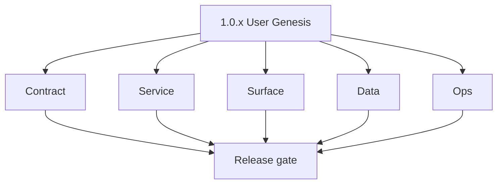
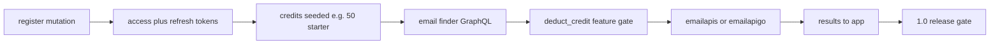

# Version 1.0 — User Genesis

- **Status:** released  
- **Codename:** User Genesis  
- **Era:** 1.x (Contact360 user and billing and credit system)  
- **Roadmap:** Stages **1.1** (user & auth), **1.2** (credit management) — ships as **`1.0.0` MVP** per [`docs/versions.md`](../versions.md)  
- **Summary:** Core journey from **signup/login** through **starter credits**, **JWT session**, **finder** (credit deduction per product policy), **verifier/results** surfaces.  
- **Scope note:** Dedicated dashboard settings route is still pending (`/settings` currently redirects to `/profile`).
- **Patch closure:** Every codenamed patch file includes **Micro-gate** + **Service task slices**. Era hub: [`versions.md`](../versions.md).

## Scope

- **Target:** `1.0.x` patches — stable auth + credit entitlement before billing maturity (`1.1+`).  
- **In scope:** `AuthMutation`/`AuthQuery`, `UsageQuery`/`usage` alignment, email finder/verifier GraphQL → Lambdas, zero-balance behavior.  
- **Out of scope:** Full payment automation maturity (stage **1.3** — see `1.1`/`1.3` minors).  
- **Owners:** Product + Core Engineering.

## Flowchart

### Runtime focus (unique to this minor)

## Task tracks

### Contract

- 📌 Planned: Freeze **auth** types: `login`, `register`, `logout`, `refresh_token`, `me` — see **Service task slices** in `1.0.P` patch files (scope from former `appointment360-user-billing-task-pack.md`).  
- 📌 Planned: Document **finder credit cost** vs verifier (per roadmap 1.2 policy).  
- 📌 Planned: `usage(feature)` response shape for header credits counter.

### Service

- 📌 Planned: Implement **password hash**, **JWT HS256**, **token_blacklist** on logout.  
- 📌 Planned: **`deduct_credit(user_uuid, feature, amount)`** before expensive email operations.  
- 📌 Planned: **`require_auth`** on protected resolvers; block at zero balance with explicit error.

### Surface

- 📌 Planned: **app:** `/login`, `/register`, profile stub, finder/verifier entry pages, credits in header.  
- 📌 Planned: **root:** marketing CTAs to auth (per connectra pack).
- 📌 Planned: **app:** `SessionContext` and `RoleContext` providers wired into app layout for auth gating.
- 📌 Planned: **app:** `UpiPaymentModal` integration reference for credit top-up (delivery in `1.3`).

> [!NOTE]
> **Status Note:** `1.0` is marked `released` for the MVP auth flow, but many task track items remain `📌 Planned` because they represent the **full** 1.0 scope. Items that shipped with the MVP should be updated to `✅ Completed` as they are verified.

### Data

- 📌 Planned: **`users`**, **`credits`** (or equivalent), **`token_blacklist`** migrations applied.  
- 📌 Planned: Lineage: user uuid as foreign key for usage rows.

### Ops

- 📌 Planned: Smoke: signup → first finder → ledger decrement trace.  
- 📌 Planned: Document rollback: feature flag to disable finder if credit bug.
- ⬜ Incomplete: **contact360.io/email (Mailhub)** — `src/components/login-form.tsx` stores `data.id` (`userId`) in `localStorage` after login (`localStorage.setItem("userId", data.id)`) but does NOT store a JWT or session token; all `Authorization: Bearer` headers in subsequent API calls (`account/[userId]/page.tsx`, `email-list.tsx`, `email/[mailId]/page.tsx`) are commented out — complete the auth flow: store the JWT returned by `POST /auth/login`, include it as `Authorization: Bearer <token>` on all protected API calls, and implement token refresh / logout.
- ⬜ Incomplete: **contact360.io/email (Mailhub)** — `src/app/account/[userId]/page.tsx` declares `const [token, setToken] = useState<string | null>(null)` and reads `localStorage.getItem("token")` but `login-form.tsx` never sets a `"token"` key in localStorage (it sets `"userId"`); the token is never available for authenticated API calls — align the localStorage key: either store `token` in `login-form.tsx` or use `"userId"` consistently.
- 📌 Planned: **contact360.io/email (Mailhub)** — implement session expiry handling: when any API call returns `401 Unauthorized`, clear `localStorage` (`mailhub_active_account`, `userId`, `token`), set context state to null, and redirect to `/auth/login`; currently a `401` just returns an empty email list with no user feedback.
- 📌 Planned: **contact360.io/email (Mailhub)** — add `GET /auth/me` (or `GET /auth/user/:userId`) session validation to `LayoutClient.tsx`; on first mount, verify the stored session is still valid before rendering the email shell; this prevents stale `userId` values from causing confusing UX after backend token expiry.
- ✅ Completed: **contact360.io/app (Dashboard)** — full JWT auth flow implemented: `authService.ts` calls `mutation Login/Register/RefreshToken` via GraphQL; `AuthContext` stores tokens via `tokenManager.ts`, auto-refreshes every 60s, maps backend role strings to `UserRole` enum (`FreeUser`, `ProUser`, `Admin`, `SuperAdmin`), and exposes `login`, `register`, `logout`, `refreshUser` hooks.
- ✅ Completed: **contact360.io/app (Dashboard)** — role-based access control implemented via `RoleContext` + `featureAccess.ts`; features (`AI_CHAT`, `BULK_EXPORT`, `API_KEYS`, `TEAM_MANAGEMENT`, `EMAIL_FINDER`, `VERIFIER`, `LINKEDIN`, `DATA_SEARCH`, `ADVANCED_FILTERS`, `SAVE_SEARCHES`, `BULK_VERIFICATION`, `IMPORT`) are mapped to minimum role and free-tier limits.
- ⬜ Incomplete: **contact360.io/app (Dashboard)** — `billing/page.tsx` defines local `FALLBACK_PLANS` and `FALLBACK_ADDONS` arrays with hardcoded prices (Starter $29, Pro $99, Enterprise "Custom") that are shown when the `useBilling` API call fails; these fallback values may go stale — replace with a skeleton loading state and a retry button instead of silently showing outdated pricing.
- ⬜ Incomplete: **contact360.io/app (Dashboard)** — `billingService.ts` `subscribe()` and `purchaseAddon()` mutations submit payment intent but actual UPI payment verification is handled by `submitPaymentProof` uploading a screenshot S3 key — there is no automated payment verification; the billing flow depends on manual admin review of uploaded screenshots — document this process and add an `Invoice` status indicator so users know their payment is pending review.
- 📌 Planned: **contact360.io/app (Dashboard)** — complete 2FA setup/teardown flow in `ProfileTabSecurity`: `twoFactorService.ts` exists in the services directory but the enable/verify-TOTP-code/disable UI flow in the profile security tab needs to be audited and completed.
- 📌 Planned: **contact360.io/app (Dashboard)** — wire S3 upload step in `UpiPaymentModal`: `billingService.submitPaymentProof` accepts `screenshotS3Key` but the modal's proof upload button needs to call `s3Service.ts` upload first before submitting — wire the full upload → submit flow end-to-end.

## Task Breakdown

| Slice | Outcome |
| --- | --- |
| Gateway | Auth + usage + email module wiring |
| emailapis | Finder path stable under gateway auth |
| App | Auth hooks + credit display |
| audit | Login + credit-spend events where required |

## Immediate next execution queue

- 📌 Planned: Golden path test artifact archived.  
- 📌 Planned: Align **status truth** for finder with **Service task slices** in `1.0.P` patch files (scope from former `emailapis-user-billing-credit-task-pack.md`).

## Cross-service ownership

| Service | Focus |
| --- | --- |
| `contact360.io/api` | Auth, credits, GraphQL email |
| `contact360.io/app` | Auth UI, credits UX |
| `lambda/emailapis` | Finder execution |
| `contact360.io/jobs` | Optional — not primary for `1.0.0` MVP core |

## References

- [`docs/roadmap.md`](../roadmap.md) — stages 1.1, 1.2  
- [`docs/codebases/appointment360-codebase-analysis.md`](../codebases/appointment360-codebase-analysis.md)  
- [`docs/codebases/app-codebase-analysis.md`](../codebases/app-codebase-analysis.md)  
- **Service task slices** in `1.0.P` patch files (scope from former `appointment360-user-billing-task-pack.md`)

## Backend API and Endpoint Scope

- **GraphQL:** `auth`, `users`, `usage`, `email` (finder/verifier), `profile` as implemented.  
- **Internal:** Lambda email; no public REST email API to browser.

## Database and Data Lineage Scope

- **PostgreSQL (gateway):** users, credits, token_blacklist; usage/activity as per schema.  
- **S3:** optional — not required for core `1.0.0` auth path.

## Frontend UX Surface Scope

- Auth pages, dashboard shell, finder/verifier flows, credits display.

## UI Elements Checklist

- 📌 Planned: Login / register forms + validation errors  
- 📌 Planned: Logout  
- 📌 Planned: Credits badge / low balance hint  
- 📌 Planned: Finder input + results list

## Flow / Graph Delta for This Minor

- **Delta:** Productized **user + credit + email core** on top of `0.x` foundation; replaces generic “bulk finder pipeline” boilerplate as the narrative spine for `1.0`.

## Audit and Compliance Notes

- Log **authentication** and **credit deduction** per [`docs/audit-compliance.md`](../audit-compliance.md); no admin billing mutations in baseline `1.0`.

## Patch ladder (`1.0.0` – `1.0.9`)

### Micro-gate reference (apply at every `1.N.P`)

| Track | Gate question (must answer Yes or document waiver) |
| --- | --- |
| **Contract** | Did any GraphQL / REST contract change? Diff vs `docs/backend/apis/`; billing idempotency keys documented? |
| **Service** | Auth, credit deduction, and billing paths still smoke for affected services? |
| **Surface** | App, admin, root, or extension billing UX changed? Role + entitlement checks? |
| **Frontend** | Which routes/components apply for this minor (see **Frontend UX Surface Scope**)? |
| **Data** | Migrations or lineage for credits, subscriptions, usage/ledger, payment proofs? |
| **Ops** | Observability, rollback, secrets; fraud/abuse runbooks where relevant? |

**Patch intent bands:** `.0` charter · `.1`–`.2` P0-heavy **Service task slices** · `.3`–`.6` P1 / surface-data · `.7`–`.9` ops + minor freeze.

Theme: **Ignition** — names in per-patch `1.0.P — *.md` files.

| Patch | Codename | Focus |
| --- | --- | --- |
| `1.0.0` | Genesis | Shipped MVP baseline |
| `1.0.1` | Spark | Auth edge cases |
| `1.0.2` | Flame | Credit deduction correctness |
| `1.0.3` | Kindle | Finder contract |
| `1.0.4` | Blaze | Verifier / results |
| `1.0.5` | Torch | Token refresh |
| `1.0.6` | Ember | Usage query |
| `1.0.7` | Fuel | Error envelopes |
| `1.0.8` | Flare | Extension token buffer (if applicable) |
| `1.0.9` | Ignite | Patch freeze → `1.1` |

### 1.0.0 — Genesis (Shipped MVP baseline)

**Contract**

- Freeze auth contract: `AuthMutation { login, register, logout, refreshToken }` and `AuthQuery { me, session }` per [`docs/backend/apis/01_AUTH_MODULE.md`](../backend/apis/01_AUTH_MODULE.md).
- Freeze usage contract: `UsageQuery { usage(feature) }` returning `UsageResponse.features[]` with `used/limit/remaining/resetAt` per [`docs/backend/apis/09_USAGE_MODULE.md`](../backend/apis/09_USAGE_MODULE.md).
- Freeze email contract: Email `findEmails` → POST `/email/finder/` and `verifySingleEmail` → POST `/email/single/verifier/` per [`docs/backend/apis/15_EMAIL_MODULE.md`](../backend/apis/15_EMAIL_MODULE.md).
- Credit spend policy for email finder/verifier is documented in email module (“1 per find/verify for FreeUser/ProUser”).

**Service**

- JWT HS256 issuance uses `ACCESS_TOKEN_EXPIRE_MINUTES` and `REFRESH_TOKEN_EXPIRE_DAYS`; refresh respects blacklist rules per Appointment360 auth docs.
- Logout writes revocation into `token_blacklist` (token hashed, checked on request context extraction).
- Credit deduction gate runs before invoking Lambda Email provider; zero-balance requests are rejected explicitly.
- Email finder/verifier resolvers map GraphQL types to lambda endpoints and return `EmailFinderResponse` / `SingleEmailVerifierResponse` fields without drift.

**Surface**

- `/login` binds `graphql/Login` → `authService` and `useLoginForm` (UI: `AuthTabs`, `AuthSubmitButton`, `AuthErrorBanner`).
- `/register` binds `graphql/Register` → `authService` and `useRegisterForm` (UI: `NameField`, `PasswordField`, `AuthSubmitButton`).
- Finder/verifier authenticated UI is reachable from the email dashboard area (UI: `FinderSingleSearch` calling GraphQL `findEmails` and verifier calling `verifySingleEmail`).
- Credits badge/header uses usage read path (UI should display remaining/limit from `UsageResponse`).

**Data**

- Ensure migrations/lineage for:
  - `users` (identity, role, active state; password hash stored, not returned),
  - `token_blacklist` (`token_hash`, `expires_at`),
  - `credits` (`user_uuid`, `feature`, `total`, `consumed`, `reset_at`) per [`docs/backend/database/appointment360_data_lineage.md`](../backend/database/appointment360_data_lineage.md).

**Ops**

- Smoke: `register → (authenticated) findEmails → verifySingleEmail` with a ledger trace showing `credits.consumed` increments once per successful request.
- Validate logout: after logout, `me` and subsequent refresh behavior fail for blacklisted tokens.
- Record rollback evidence: disable finder/verifier endpoints via feature flag if credit deduction regresses.

Codebases: `[appointment360][emailapis][app][connectra]`

### 1.0.1 — Spark (Auth edge cases)

**Contract**

- Validate GraphQL variable shape:
  - `refreshToken` uses `RefreshTokenInput.refreshToken` (camelCase) and returns `AuthPayload.accessToken/refreshToken/user/pages` per [`docs/backend/apis/01_AUTH_MODULE.md`](../backend/apis/01_AUTH_MODULE.md).
- Define expected error surface for:
  - wrong password on `login`,
  - duplicate email on `register`,
  - blacklisted refresh token on `refreshToken`.

**Service**

- Auth mutation errors are raised as GraphQL errors (using Appointment360 error handling).
- Refresh flow rejects blacklisted tokens by checking `token_blacklist` against `token_hash` + `expires_at`.
- Ensure `get_context()` builds `Context.user_uuid` only after blacklist pass.

**Surface**

- Login/register pages render structured errors via `AuthErrorBanner` instead of generic failures.
- `useAuth` (login/logout/refresh) differentiates “invalid credentials” vs “session revoked” and triggers refresh retry only when safe.

**Data**

- Confirm `token_blacklist.expires_at` aligns with JWT `exp` and that cleanup policy exists (even if minimal for MVP).

**Ops**

- Negative tests:
  - `login` with invalid password returns error without JWT issuance.
  - `register` for existing email returns deterministic error.
  - `logout → refreshToken` returns auth failure.

Codebases: `[appointment360][app]`

### 1.0.2 — Flame (Credit deduction correctness)

**Contract**

- Finder/verifier operations document credit cost (“1 per find/verify for FreeUser/ProUser”) per [`docs/backend/apis/15_EMAIL_MODULE.md`](../backend/apis/15_EMAIL_MODULE.md).
- Contract must ensure “deduct then call provider” ordering is reflected by gateway behavior (no partial successes without ledger updates).

**Service**

- Deduct logic (`deduct_credit(user_uuid, feature, amount)`) runs before invoking Lambda Email API and increments `credits.consumed` in a single transaction.
- Retries must not double-charge:
  - ensure idempotency middleware coverage for relevant gateway mutations/paths,
  - or ensure resolvers dedupe via request correlation keys (if configured for 1.x).
- On provider failure, ensure credit deduction is either rolled back or classified per policy (must be explicit).

**Surface**

- UI disables repeated submit when request is pending; if credit spend fails, it shows an “insufficient credits” / “request failed” message clearly.
- Credits badge updates after successful deduction (from the usage read path or optimistic sync).

**Data**

- Verify `credits.total/consumed/reset_at` math:
  - remaining = total - consumed (or `-1` for unlimited as per usage module semantics),
  - feature mapping uses the same feature enum/name between deduction and `usage(feature)`.

**Ops**

- Failure injection:
  - duplicate request replay to finder/verifier endpoint must result in exactly one ledger decrement.
  - retry after transient provider errors must not double-charge.

Codebases: `[appointment360][emailapis]`

### 1.0.3 — Kindle (Finder contract)

**Contract**

- Email finder query fields:
  - GraphQL: `findEmails(input: EmailFinderInput!)`,
  - Lambda endpoint mapping: POST `/email/finder/`,
  - response: `EmailFinderResponse { emails[], total, success }`.
- Input contract for `EmailFinderInput` matches required fields (`firstName`, `lastName`, `domain`, optional `website`) per [`docs/backend/apis/15_EMAIL_MODULE.md`](../backend/apis/15_EMAIL_MODULE.md).

**Service**

- Normalize identity keys (case-insensitive domain; trimmed names) so cache keys don’t split logically identical inputs.
- Finder results map to `EmailResult { uuid, email, status, source }` and preserve `source` (“connectra”, “pattern”, “generator”).
- Ensure finder spends the correct feature bucket used by `UsageQuery` (`EMAIL_FINDER` / normalized equivalent).

**Surface**

- Finder UI `FinderSingleSearch` validates inputs, calls the finder request binding, and renders:
  - “Verified Contact Found”,
  - fields: Name, Company Domain, Email Address, Confidence Percentage.
- Copy action uses the found email result.

**Data**

- Ensure usage rows are created/updated for `EMAIL_FINDER` on first successful finder.
- Ensure credits update lineage ties `user_uuid` → `credits.feature`.

**Ops**

- Contract tests:
  - finder returns `success=true` and populated `emails` list,
  - finder failure returns structured GraphQL errors without leaking provider internals.

Codebases: `[appointment360][emailapis][connectra][app]`

### 1.0.4 — Blaze (Verifier / results)

**Contract**

- Email verifier query fields:
  - GraphQL: `verifySingleEmail(input: SingleEmailVerifierInput!)`,
  - Lambda endpoint mapping: POST `/email/single/verifier/`,
  - response types: `SingleEmailVerifierResponse { result: VerifiedEmailResult, success }`,
  - `VerifiedEmailResult` includes `status`, `emailState`, `emailSubState`, and `certainty` with documented status values (`valid/invalid/catchall/unknown`) per [`docs/backend/apis/15_EMAIL_MODULE.md`](../backend/apis/15_EMAIL_MODULE.md).

**Service**

- Verifier spends the correct feature bucket for usage tracking (`VERIFIER` / normalized equivalent).
- Verify results mapping is stable so UI can render consistent risk/status labels.
- Credit deduction ordering matches policy (deduct + verify, with explicit rollback/exception handling on failure).

**Surface**

- Verifier UI renders:
  - “Verify Email” CTA,
  - verified state presentation for single result,
  - error state when input email is invalid.

**Data**

- `credits` and usage rows increment for verifier feature bucket only after successful verification.

**Ops**

- Smoke:
  - run verifier successfully and confirm ledger increments,
  - run verifier with invalid input and confirm no credit spend (if policy is “deduct only on success”).

Codebases: `[appointment360][emailapis][app]`

### 1.0.5 — Torch (Token refresh)

**Contract**

- `AuthMutation refreshToken(input: RefreshTokenInput!)` must:
  - accept `refreshToken` variable,
  - return new `AuthPayload.accessToken` and `refreshToken`,
  - respect token expiration rules (`ACCESS_TOKEN_EXPIRE_MINUTES`, `REFRESH_TOKEN_EXPIRE_DAYS`).

**Service**

- Refresh flow rejects blacklisted refresh tokens (`token_blacklist`) even if `exp` claim not yet expired.
- Refresh issues HS256 access token and updates request context user fetch (`Context.user_uuid`).

**Surface**

- `useAuth` auto-retries on 401 in a controlled way (no infinite retry loops).
- UI surfaces “session expired” / “sign in again” when refresh fails.

**Data**

- Token blacklist and expiry semantics are consistent:
  - `token_blacklist.expires_at` derived from JWT `exp`.

**Ops**

- Tests:
  - `login → refreshToken → me` works,
  - `logout → refreshToken` fails reliably.

Codebases: `[appointment360][app]`

### 1.0.6 — Ember (Usage query)

**Contract**

- `UsageQuery usage(feature)` returns `UsageResponse.features[]` with `used`, `limit`, `remaining`, `resetAt` as documented in [`docs/backend/apis/09_USAGE_MODULE.md`](../backend/apis/09_USAGE_MODULE.md).
- Feature-name normalization behavior is consistent with deduction feature keys.

**Service**

- Usage aggregation is performant (avoid N+1):
  - ensure usage query reads from credits/ledger in a single path.
- `remaining` math matches credits (`total` minus `consumed`, and `999999/unlimited` conventions if applicable).

**Surface**

- `UsageOverview` page binds `graphql/GetUsage` and renders:
  - remaining/limit cards,
  - reset notice (resetAt).
- Credits badge/header refreshes after finder/verifier.

**Data**

- credits ledger consistency:
  - `credits.total`, `credits.consumed`, and `credits.reset_at` are the sources of truth.

**Ops**

- Reconciliation spot-check:
  - run N finder/verifier actions and compare ledger deltas to `usage(feature)` output.

Codebases: `[appointment360][app]`

### 1.0.7 — Fuel (Error envelopes)

**Contract**

- Define error mapping expectations for common 1.x user flows:
  - unauthorized auth failures (missing/invalid JWT),
  - insufficient credits (when zero-balance policy blocks).
- Ensure GraphQL error structure is consistent with Appointment360 error handling (`app/graphql/errors.py`).

**Service**

- Standardize error extensions (include a stable code and avoid sensitive information leakage).
- Ensure all credit-block errors are deterministic (same inputs → same envelope).

**Surface**

- UI renders credit-block and auth-block errors with actionable messaging:
  - upgrade CTA or “sign in again” depending on error class.

**Data**

- Audit tables/activities are written only for successful actions (no PII in error bodies).

**Ops**

- Edge tests:
  - zero-balance block behavior is validated via automated test or scripted trace.
  - provider failure returns proper error envelope with request correlation id.

Codebases: `[appointment360][app]`

### 1.0.8 — Flare (Extension token buffer, if applicable)

**Contract**

- Ensure JWT session is usable by extension-style clients:
  - Authorization header / token refresh flow remains consistent.
- Clarify whether extension client uses the same `refreshToken` contract as the app.

**Service**

- JWT context extraction is robust regardless of client (browser app vs extension).
- Refresh-to-access flow succeeds after token expiry mid-session.

**Surface**

- `AuthContext` behavior (token refresh + session state updates) supports extension call timing:
  - no “stuck logged out” state after refresh.

**Data**

- Token blacklist checks prevent revoked access from being accepted after refresh cycles.

**Ops**

- Simulate token expiry mid-flow and confirm:
  - refresh recovers session,
  - revoked tokens do not recover session.

Codebases: `[appointment360][app][root]`

### 1.0.9 — Ignite (Patch freeze → 1.1)

**Contract**

- Confirm no breaking public GraphQL schema changes beyond the 1.0 package scope.
- Add “no public API change” note for this patch if only internal wiring changed.

**Service**

- All 1.0 flows have green integration:
  - auth loop (`login → me → logout → me`),
  - finder/verifier credit spend loop,
  - usage query visibility loop.

**Surface**

- Final UX validation:
  - login/register success + errors,
  - credits badge correctness during edge-case transitions.

**Data**

- Migrations applied and ledger sample rows can be produced for evidence.

**Ops**

- Release readiness:
  - sign-off for the `1.1` billing maturity workstream,
  - ensure rollback steps are documented for any credit-spend regression.

Codebases: `[appointment360][app][emailapis][jobs]`

## Release Gate and Evidence

### Master Task Checklist

- 📌 Planned: `docs/versions.md` reflects `1.0.x`  
- 📌 Planned: Roadmap 1.1 / 1.2 criteria met for shipped cut

### Backend API and Endpoints

- 📌 Planned: GraphQL auth + usage + email smoke
- ✅ Completed: **contact360.io/api** — Full auth GraphQL module at `app/graphql/modules/auth/`: `login`, `register`, `logout`, `refreshToken`, `changePassword`, `forgotPassword`, `resetPassword` mutations + `me` query all wired to `services/users/auth.py`.
- ✅ Completed: **contact360.io/api** — Token blacklist repository (`repositories/token_blacklist.py`) blocks revoked refresh tokens; `get_context()` checks blacklist on every authenticated request.
- ✅ Completed: **contact360.io/api** — Billing module fully implemented: `subscribe`, `purchaseAddon`, `cancelSubscription`, `submitPaymentProof`, `approvePayment`, `declinePayment` mutations + plan/addon CRUD + `paymentInstructions` query — all in `app/graphql/modules/billing/`.
- ✅ Completed: **contact360.io/api** — `app/graphql/modules/usage/` exposes `usage` query backed by `UsageService.get_current_usage()` returning per-feature `used/limit/reset_at` counters.
- ⬜ Incomplete: **contact360.io/api** — `two_factor/mutations.py` `setup2FA` is a **placeholder**: generates a raw hex string as "TOTP secret" instead of using `pyotp.generate_secret()`, and the QR code field returns a placeholder URL — replace with `pyotp` + `qrcode` libraries to generate real TOTP secrets and scannable QR codes.
- ⬜ Incomplete: **contact360.io/api** — `two_factor/mutations.py` `verify2FA` checks a sha256 hash of backup codes but never validates the live TOTP window (time-based code) — the TOTP step is entirely unimplemented; `enable2FA` mutation is also absent; 2FA is effectively non-functional in production.
- 📌 Planned: **contact360.io/api** — `IDEMPOTENCY_ENFORCE_GRAPHQL_MUTATIONS=False` by default in `config.py` (even though `.env.example` recommends `true`) — enforce idempotency key requirement for billing mutations (`subscribe`, `purchaseAddon`, `submitPaymentProof`) in production to prevent duplicate charges.

### Database and Data Lineage

- 📌 Planned: Migrations + sample ledger row
- ✅ Completed: **contact360.io/api** — SQLAlchemy models for `users`, `user_profiles`, `token_blacklist`, `subscription_plans`, `plan_periods`, `addons`, `user_subscriptions`, `user_addon_purchases`, `payment_submissions`, `two_factor` all defined in `app/models/` with Alembic migrations in `alembic/`.

### Frontend UX

- 📌 Planned: Screenshots or trace for signup → finder
- ✅ Completed: **contact360.io/admin** — `core/views.py` implements full admin login flow via `Appointment360Client.login()` (GraphQL `login` mutation proxy); JWT tokens stored in HttpOnly cookies (`access_token` + `refresh_token`); IP-based rate limiting with 15-min lockout after repeated failures.
- ✅ Completed: **contact360.io/admin** — `@require_super_admin` decorator validates `access_token` cookie against `me` GraphQL query + checks `role == SuperAdmin`; auto-refreshes expired tokens using `refresh_token` cookie.
- ⬜ Incomplete: **contact360.io/admin** — Admin has no user management UI (user list, role change, credit adjustment, ban/unban) — these are critical SuperAdmin operations; the admin should expose GraphQL `admin.users`, `updateUserRole`, `updateUserCredits`, `deleteUser` mutations through a user management page.
- ⬜ Incomplete: **contact360.io/admin** — Admin has no subscription/billing management UI (view active subscriptions, approve/decline payments, manage plan pricing) — admin should wrap the `billing` GraphQL mutations (`approvePayment`, `declinePayment`, plan CRUD) in a dedicated billing admin page.
- 📌 Planned: **contact360.io/admin** — Add a 2FA management page for SuperAdmins to view which users have enabled 2FA, force-reset 2FA for locked-out users, and review backup code regeneration events.

### UI Elements

- 📌 Planned: Checklist above

### Flow and Graph

- 📌 Planned: Runtime Mermaid reviewed

### Validation

- 📌 Planned: Zero-balance block tested

### Release Gate

- 📌 Planned: Sign-off for **`1.1` Billing Maturity** workstream

## Patches

| Patch | Codename | Doc |
| --- | --- | --- |
| `1.0.0` | Genesis | [`1.0.0` — Genesis](1.0.0 — Genesis.md) |
| `1.0.1` | Spark | [`1.0.1` — Spark](1.0.1 — Spark.md) |
| `1.0.2` | Flame | [`1.0.2` — Flame](1.0.2 — Flame.md) |
| `1.0.3` | Kindle | [`1.0.3` — Kindle](1.0.3 — Kindle.md) |
| `1.0.4` | Blaze | [`1.0.4` — Blaze](1.0.4 — Blaze.md) |
| `1.0.5` | Torch | [`1.0.5` — Torch](1.0.5 — Torch.md) |
| `1.0.6` | Ember | [`1.0.6` — Ember](1.0.6 — Ember.md) |
| `1.0.7` | Fuel | [`1.0.7` — Fuel](1.0.7 — Fuel.md) |
| `1.0.8` | Flare | [`1.0.8` — Flare](1.0.8 — Flare.md) |
| `1.0.9` | Ignite | [`1.0.9` — Ignite](1.0.9 — Ignite.md) |
