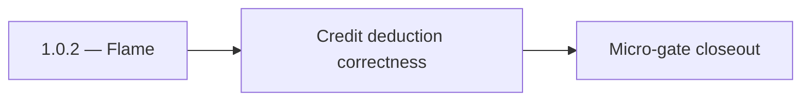

# 1.0.2 — Flame

- **Era:** `1.x` User/billing/credit — hub [`versions.md`](../versions.md) · minors start at [`1.0 — User Genesis`](1.0%20%E2%80%94%20User%20Genesis.md)
- **Minor:** [1.0 — User Genesis](./1.0 — User Genesis.md)
- **Codename:** Flame
- **Status:** ✅ Completed
## Focus
Credit deduction correctness

## Flowchart

## Micro-gate

| Track | Gate question | Answer / Evidence (fill at patch closeout) |
| --- | --- | --- |
| **Contract** | GraphQL / REST changes? Diff vs `docs/backend/apis/` or task pack; billing idempotency keys if mutations touched. | Document at patch closeout. |
| **Service** | Auth, credit deduction, billing state machine, and downstream Lambdas still pass smoke? | Document smoke paths. |
| **Surface** | App / admin / root / extension billing UX changed? Role + entitlement checks? | Document UX delta or N/A. |
| **Frontend** | Which routes/components must render or change for this patch? | `/login`, `/register`, credits badge, finder/verifier bindings — see minor doc. Document at closeout. |
| **Data** | `credits`, `subscriptions`, `plans`, `payment_submissions`, usage/ledger — migrations + lineage? | Document migrations/lineage or N/A. |
| **Ops** | Billing observability, rollback, secret rotation; fraud/abuse delta for `1.10` patches. | Document ops delta or N/A. |

## Tasks
### Contract
- ✅ Completed: Finder/verifier operations document credit cost (“1 per find/verify for FreeUser/ProUser”) per [`docs/backend/apis/15_EMAIL_MODULE.md`](../backend/apis/15_EMAIL_MODULE.md).
- ✅ Completed: Contract must ensure “deduct then call provider” ordering is reflected by gateway behavior (no partial successes without ledger updates).

### Service
- ✅ Completed: Deduct logic (`deduct_credit(user_uuid, feature, amount)`) runs before invoking Lambda Email API and increments `credits.consumed` in a single transaction.
- ✅ Completed: Retries must not double-charge:
- ✅ Completed: ensure idempotency middleware coverage for relevant gateway mutations/paths,
- ✅ Completed: or ensure resolvers dedupe via request correlation keys (if configured for 1.x).
- ✅ Completed: On provider failure, ensure credit deduction is either rolled back or classified per policy (must be explicit).

### Surface
- ✅ Completed: UI disables repeated submit when request is pending; if credit spend fails, it shows an “insufficient credits” / “request failed” message clearly.
- ✅ Completed: Credits badge updates after successful deduction (from the usage read path or optimistic sync).

### Data
- ✅ Completed: Verify `credits.total/consumed/reset_at` math:
- ✅ Completed: remaining = total - consumed (or `-1` for unlimited as per usage module semantics),
- ✅ Completed: feature mapping uses the same feature enum/name between deduction and `usage(feature)`.

### Ops
- ✅ Completed: Failure injection:
- ✅ Completed: duplicate request replay to finder/verifier endpoint must result in exactly one ledger decrement.
- ✅ Completed: retry after transient provider errors must not double-charge.

Codebases: `[appointment360][emailapis]`

## Service task slices
> Merged from era `1.x` user/billing task packs (P0→`.0`–`.2`, P1→`.3`–`.6`, Ops→`.7`–`.9`).

### Appointment360 (gateway)
- Define AuthQuery { me } returning UserType with all profile fields
- Define AuthMutation { login, register, logout, refreshToken } with typed inputs/outputs
- Define BillingQuery { billingInfo, plans, invoices }
- Define BillingMutation { subscribe, purchaseAddon, submitPaymentProof, approvePayment, declinePayment }
- Define UsageQuery { usage(feature) } returning credits remaining / consumed
- Define UserQuery { user(uuid), users(), userStats() } with admin-guarded overloads
- Define UserMutation { updateUser, deleteUser, promoteUser }
- Implement login mutation: validate credentials, issue HS256 JWT access + refresh tokens
- Implement register mutation: hash password, create user, issue tokens
- Implement logout mutation: insert token into token_blacklist table
- Implement refreshToken mutation: validate refresh token, issue new access token
- Implement me query: extract user from Context, return UserType
- Implement require_auth(info) guard in core/security.py
- Implement require_admin(info) guard for admin-only mutations
- Implement credit deduction service: deduct_credit(user_uuid, feature, amount)
- Implement usage(feature) query: read credit totals from credits table
- /login page → mutation login binding in authService.ts
- /register page → mutation register binding
- User profile page → query me + mutation updateProfile binding
- Credits counter component (header bar) → query usage polling on route change
- useAuth hook: login, logout, refresh token auto-retry on 401
- Create credits table: user_uuid, feature, total, consumed, reset_at
- Create plans table: id, name, price, limits JSON
- Create subscriptions table: user_uuid, plan_id, status, billing_period_start, billing_period_end
- Create token_blacklist table: token_hash, expires_at
- Create activities table: uuid, user_uuid, type, metadata JSON, created_at
- Run Alembic migration for all 1.x tables
- Configure ACCESS_TOKEN_EXPIRE_MINUTES (30) and REFRESH_TOKEN_EXPIRE_DAYS (7)
- Add SECRET_KEY rotation procedure to ops runbook

### emailapis / emailapigo
- Document **per-row** vs **per-job** credit semantics for bulk verify/finder
- Failed provider call: **refund or no-charge** policy explicit
- Idempotent bulk chunk: same chunk replay must not **double-bill**
- Parity matrix row: Python vs Go for **billing-relevant** response fields

### Jobs
- Define credit-aware job creation payload expectations.
- Define billing/audit semantics for retry and cancellation events.
- Attach billing context to job metadata when applicable.
- Validate access checks between owner/admin and retry controls.
- Ensure `job_events` carries credit/billing trace context.
- Document correlation between job IDs and usage/billing records.

## Evidence gate
Patch closeout includes contract diff, smoke output, data lineage delta, and ops note
