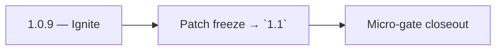

# 1.0.9 — Ignite

- **Era:** `1.x` User/billing/credit — hub [`versions.md`](../versions.md) · minors start at [`1.0 — User Genesis`](1.0%20%E2%80%94%20User%20Genesis.md)
- **Minor:** [1.0 — User Genesis](./1.0 — User Genesis.md)
- **Codename:** Ignite
- **Status:** ✅ Completed
## Focus
Patch freeze → `1.1`

## Flowchart

## Micro-gate

| Track | Gate question | Answer / Evidence (fill at patch closeout) |
| --- | --- | --- |
| **Contract** | GraphQL / REST changes? Diff vs `docs/backend/apis/` or task pack; billing idempotency keys if mutations touched. | Document at patch closeout. |
| **Service** | Auth, credit deduction, billing state machine, and downstream Lambdas still pass smoke? | Document smoke paths. |
| **Surface** | App / admin / root / extension billing UX changed? Role + entitlement checks? | Document UX delta or N/A. |
| **Frontend** | Which routes/components must render or change for this patch? | `/login`, `/register`, credits badge, finder/verifier bindings — see minor doc. Document at closeout. |
| **Data** | `credits`, `subscriptions`, `plans`, `payment_submissions`, usage/ledger — migrations + lineage? | Document migrations/lineage or N/A. |
| **Ops** | Billing observability, rollback, secret rotation; fraud/abuse delta for `1.10` patches. | Document ops delta or N/A. |

## Tasks
### Contract
- ✅ Completed: Confirm no breaking public GraphQL schema changes beyond the 1.0 package scope.
- ✅ Completed: Add “no public API change” note for this patch if only internal wiring changed.

### Service
- ✅ Completed: All 1.0 flows have green integration:
- ✅ Completed: auth loop (`login → me → logout → me`),
- ✅ Completed: finder/verifier credit spend loop,
- ✅ Completed: usage query visibility loop.

### Surface
- ✅ Completed: Final UX validation:
- ✅ Completed: login/register success + errors,
- ✅ Completed: credits badge correctness during edge-case transitions.

### Data
- ✅ Completed: Migrations applied and ledger sample rows can be produced for evidence.

### Ops
- 📌 Planned: **[appointment360]** — refine duplicate task (was: ✅ completed: release readiness:) | patch `1.0.9` band `9` | reason: specialize this file vs sibling patches; see docs/codebases/appointment360-codebase-analysis.md
- ✅ Completed: sign-off for the `1.1` billing maturity workstream,
- ✅ Completed: ensure rollback steps are documented for any credit-spend regression.

Codebases: `[appointment360][app][emailapis][jobs]`

## Release Gate and Evidence

## Service task slices
> Merged from era `1.x` user/billing task packs (P0→`.0`–`.2`, P1→`.3`–`.6`, Ops→`.7`–`.9`).

### Appointment360 (gateway)
- Wire GraphQL Idempotency-Key to billing mutations in Postman collection
- Write test: login → me → logout → me → error flow
- Write test: register → consume credit → query usage → low-credit guard

### emailapis / emailapigo
- Add observability checks and release validation evidence for era **`1.x`**.
- Capture rollback and incident-runbook notes for email-impacting releases.
- **Billing regression:** alert when bulk job completion count diverges from expected credit consumption (see **Service task slices** for Jobs in this patch / era).

### Jobs
- Add billing-impact alerts for job failure spikes.
- Add release checklist for billing-flow regression checks.

## Evidence gate
Micro-gate table filled and handoff note to `1.1.0` recorded
