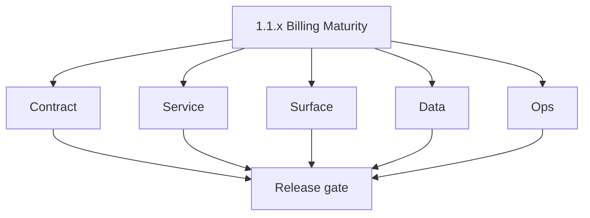
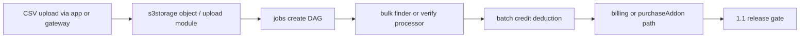

# Version 1.1 — Billing Maturity

- **Status:** ✅ Completed
- **Codename:** Billing Maturity
- **Era:** 1.x
- **Roadmap:** Stage **1.3** (billing & payments), **2.4** (bulk validation) — target **`1.1.0`** per [`docs/versions.md`](../versions.md)
- **Summary:** **CSV bulk** jobs hardening, **s3storage** artifacts, **batch credit** semantics, and **billing / credit-pack** operationalization toward manual payment flow.
- **Patch closure:** Every codenamed patch file includes **Micro-gate** + **Service task slices**. Era hub: [`versions.md`](../versions.md).

## Scope

- **Target:** `1.1.x` — reliable bulk export/verify/import paths with **billing context** and payment proof handoff.
- **In scope:** `contact360.io/jobs` processors, gateway mutations for billing drafts, `emailapis` bulk parity, payment proof upload via `s3storage`.
- **Owners:** Product + Payments / Data Pipeline.

## Flowchart

### Runtime focus (unique to this minor)

## Task tracks

### Contract

- ✅ Completed: 📌 Planned: Credit-aware **job create** payload; pre-check credits before enqueue.
- ✅ Completed: 📌 Planned: **Billing** mutations: `subscribe`, `purchaseAddon`, `submitPaymentProof` — idempotency keys per middleware.
- ✅ Completed: 📌 Planned: Bulk **row-level** failure vs credit charge policy documented.

- 📌 Planned: **[appointment360]** — refine duplicate task (was: 📌 planned: **[architecture]** — product **graphql** remains …) | patch `1.1.0` band `0` | reason: specialize this file vs sibling patches; see docs/codebases/appointment360-codebase-analysis.md
### Service

- ✅ Completed: 📌 Planned: Jobs: attach **user_uuid** / billing metadata on `job_node.data`.
- ✅ Completed: 📌 Planned: Gateway: reconcile **job completion** with usage ledger.
- ✅ Completed: 📌 Planned: emailapis: bulk **status vocabulary** aligned with billing reconciliation.

- 📌 Planned: **[appointment360]** — refine duplicate task (was: 📌 planned: **[architecture]** — **go/gin satellites** in sco…) | patch `1.1.0` band `0` | reason: specialize this file vs sibling patches; see docs/codebases/appointment360-codebase-analysis.md
### Surface

- ✅ Completed: 📌 Planned: Bulk upload UI, job progress, credit warning before start.
- ✅ Completed: 📌 Planned: Billing / UPI or proof modal wiring per roadmap 1.3 code pointers.

- 📌 Planned: **[appointment360]** — refine duplicate task (was: 📌 planned: **[architecture]** — **next.js** customer surface…) | patch `1.1.0` band `0` | reason: specialize this file vs sibling patches; see docs/codebases/appointment360-codebase-analysis.md
### Data

- ✅ Completed: 📌 Planned: `job_events` include correlation IDs for billing.
- ✅ Completed: 📌 Planned: Payment submission rows if applicable.

- 📌 Planned: **[appointment360]** — refine duplicate task (was: 📌 planned: **[architecture]** — **postgresql-first** per `do…) | patch `1.1.0` band `0` | reason: specialize this file vs sibling patches; see docs/codebases/appointment360-codebase-analysis.md
### Ops

- ✅ Completed: 📌 Planned: Alert on job failure spike affecting paid users.
- ✅ Completed: 📌 Planned: Runbook: retry vs refund credit policy.

- 📌 Planned: **[appointment360]** — refine duplicate task (was: 📌 planned: **[architecture]** — **observability**: correlate…) | patch `1.1.0` band `0` | reason: specialize this file vs sibling patches; see docs/codebases/appointment360-codebase-analysis.md
## Task Breakdown

| Pack | Critical |
| --- | --- |
| jobs | Credit metadata on create |
| appointment360 | Billing GraphQL + guards |
| s3storage | Proof + CSV prefixes |
| emailapis | Bulk correctness |

## Immediate next execution queue

- 📌 Planned: **Success-to-crediting time** KPI sample from roadmap 1.3.
- 📌 Planned: CSV queue correctness regression suite.

## Cross-service ownership

| Service | Role |
| --- | --- |
| `contact360.io/api` | Billing + job orchestration |
| `contact360.io/jobs` | Bulk processors |
| `lambda/s3storage` | Artifacts + proof |
| `lambda/emailapis` | Bulk email ops |

## References

- [`docs/roadmap.md`](../roadmap.md) — 1.3, 2.4
- **Service task slices** in `1.1.P` patch files (scope from former `jobs-user-billing-task-pack.md`)
- **Service task slices** in `1.1.P` patch files (scope from former `s3storage-user-billing-task-pack.md`)
- **Service task slices** in `1.1.P` patch files (scope from former `appointment360-user-billing-task-pack.md`)

## Backend API and Endpoint Scope

- GraphQL: `billing`, `jobs`, `email`, `upload`, `s3` as wired for bulk + billing.
- Jobs REST: create/status/timeline with billing fields in JSONB.

## Database and Data Lineage Scope

- Jobs DB: `job_node`, `job_events` with billing trace.
- Gateway DB: credits, subscriptions/plans, payment submissions.

## Frontend UX Surface Scope

- Bulk flows, billing page hooks, modals (`UpiPaymentModal` pattern per governance).

## UI Elements Checklist

- 📌 Planned: Bulk file picker + progress
- 📌 Planned: Credit estimate or warning
- 📌 Planned: Payment / proof submit CTA

## Flow / Graph Delta for This Minor

- **Delta:** Introduces **CSV → storage → jobs → batch billing** as primary spine; not the same as `1.0` single-finder path.

## Audit and Compliance Notes

- Audit **payment submission** and **credit pack** grants; restrict admin approve to staff roles.

## Patch ladder (`1.1.0` – `1.1.9`)

### Micro-gate reference (apply at every `1.N.P`)

| Track | Gate question (must answer Yes or document waiver) |
| --- | --- |
| **Contract** | Did any GraphQL / REST contract change? Diff vs `docs/backend/apis/`; billing idempotency keys documented? |
| **Service** | Auth, credit deduction, and billing paths still smoke for affected services? |
| **Surface** | App, admin, root, or extension billing UX changed? Role + entitlement checks? |
| **Frontend** | Which routes/components apply for this minor (see **Frontend UX Surface Scope**)? |
| **Data** | Migrations or lineage for credits, subscriptions, usage/ledger, payment proofs? |
| **Ops** | Observability, rollback, secrets; fraud/abuse runbooks where relevant? |
| **Architecture** | Go/Gin satellites only via Python GraphQL gateway (`contact360.io/api`); Next.js `NEXT_PUBLIC_GRAPHQL_URL`; Postgres-first / Redis exit per `docs/docs/data-stores-postgres.md`. |

**Patch intent bands:** `.0` charter · `.1`–`.2` P0-heavy **Service task slices** · `.3`–`.6` P1 / surface-data · `.7`–`.9` ops + minor freeze.

Theme: **Pipeline** — codenames in per-patch `1.1.P — *.md` files.

| Patch | Codename | Focus |
| --- | --- | --- |
| `1.1.0` | Channel | Billing + bulk charter |
| `1.1.1` | Intake | CSV ingest |
| `1.1.2` | Valve | Credit pre-check |
| `1.1.3` | Pump | Job enqueue |
| `1.1.4` | Flow | Processor steady-state |
| `1.1.5` | Pressure | Batch deduction |
| `1.1.6` | Surge | Failure handling |
| `1.1.7` | Vent | Partial completion policy |
| `1.1.8` | Drain | Reconciliation |
| `1.1.9` | Release | Handoff `1.2` / `1.3` minors |

### 1.1.0 — Channel (Billing + bulk charter)

**Contract**

- Freeze bulk billing creation contract: `JobMutation { createEmailFinderExport, createEmailVerifyExport }` must accept a payload that includes `user_uuid` plus billing correlation/idempotency expectations; bulk email queries use Email `findEmailsBulk` / `verifyEmailsBulk`.
- Freeze billing/draft contract: gateway uses `BillingMutation { subscribe, purchaseAddon, submitPaymentProof }` idempotency behavior aligned to `GraphQLIdempotencyMiddleware`.

**Service**

- Enforce credit-aware job creation: pre-check credits (or reject) before enqueuing DAG in `contact360.io/jobs`.
- Ensure `job_node.data` stores billing metadata needed for later reconciliation (e.g., `correlation_id`, credit estimate).

**Surface**

- Bulk upload UI requires credit estimate/warning before creating jobs; must show job progress state.
- Billing/proof CTA is present but can be shallow for 1.1 (handoff to 1.3 for full state machine).

**Data**

- Jobs DB schema (`job_node`, `job_events`) persists billing correlation context for later reconciliation.
- Gateway DB keeps ledger state (`credits`, `subscriptions`, and payment submission rows if drafted in 1.1).

**Ops**

- KPI snapshot: success-to-crediting latency baseline for later 1.3 improvements.
- CSV queue correctness regression suite for idempotent enqueue and small happy-path bulk runs.

Codebases: `[appointment360][jobs][s3storage][emailapis][mailvetter]`

### 1.1.1 — Intake (CSV ingest)

**Contract**

- Freeze CSV ingestion contract between app/gateway and s3storage:
  - Upload flow uses S3-style mutations (e.g., `startCsvMultipartUpload`, `uploadCsvPart`, `completeCsvUpload`) and `UploadQuery uploadStatus(sessionId)` semantics.
- Define minimum CSV schema/validation expectations so downstream jobs don’t start on malformed inputs.

**Service**

- s3storage upload endpoints enforce object-class rules and store artifacts under the prefix model (upload/meta paths).
- Metadata worker updates `metadata.json` after upload so jobs can proceed deterministically.

**Surface**

- UI shows upload progress (progress bar) and surfaces validation errors (blocked before job enqueue).

**Data**

- Persist actor/source metadata for the upload artifact for audit trails and later job linking.

**Ops**

- Test invalid CSV types/sizes are rejected at upload time (no job creation).

Codebases: `[s3storage][appointment360][app]`

### 1.1.2 — Valve (Credit pre-check)

**Contract**

- Job create contract must require credit pre-check behavior (fail fast) so job processors never run without a ledger plan.

**Service**

- Gateway checks `credits` / `usage(feature)` before creating a DAG; rejects with structured error if insufficient.
- Ensure feature enum naming matches deduction keys used by Email jobs.

**Surface**

- Before enqueue: show “not enough credits” state and route user to billing if applicable.

**Data**

- Usage/credits math is consistent with `credits.total - credits.consumed` and any unlimited convention.

**Ops**

- Automated negative test: insufficient credits → no `job_node` row and no downstream emailapis calls.

Codebases: `[appointment360][app]`

### 1.1.3 — Pump (Job enqueue)

**Contract**

- Job enqueue uses `JobMutation.createEmailFinderExport` / `createEmailVerifyExport` with:
  - `job_node.data.user_uuid`,
  - billing correlation identifiers for later credit deduction.

**Service**

- jobs scheduler enqueues `open` jobs and sets DAG edges in jobs DB.
- Worker pool transitions jobs and records `job_events` with billing trace data.

**Surface**

- UI shows enqueue success and transitions to “processing” state with progress.

**Data**

- `job_node` and `job_events` store `user_uuid` and `correlation_id`; row counts are persisted per checkpoint updates.

**Ops**

- Trace test: capture `job_uuid` → `job_events` → reconciliation inputs.

Codebases: `[jobs][appointment360]`

### 1.1.4 — Flow (Processor steady-state)

**Contract**

- Emailapis bulk result schema remains stable:
  - `BulkEmailFinderResponse` / `BulkEmailVerifierResponse` fields (`processedCount`, `totalSuccessful`, `validCount`, etc.).

**Service**

- jobs processors call emailapis bulk endpoints and update `job_response` and events per checkpoint.
- Ensure job completion state emits row totals needed for batch deduction.

**Surface**

- UI polls timeline/progress and displays steady-state progress without credit state drift.

**Data**

- Persist per-job charged-row inputs (or their safe proxies) in `job_events` / `job_response` for reconciliation.

**Ops**

- Smoke: small CSV (happy path) completes with correct row totals and corresponding credit reservation/deduction bookkeeping.

Codebases: `[jobs][emailapis][appointment360]`

### 1.1.5 — Pressure (Batch deduction)

**Contract**

- Define batch deduction policy precisely:
  - credits deducted based on completed/charged rows vs raw processed rows,
  - credit cost mapping matches usage feature keys.

**Service**

- Execute batch credit deduction for completed jobs using the persisted reconciliation inputs.
- Retries must not double-charge: reconcile via billing correlation/idempotency.

**Surface**

- After completion: show credit deduction summary (or at minimum accurate remaining credits) on UI.

**Data**

- Update gateway `credits.consumed` based on `charged_rows` from job results.

**Ops**

- Failure injection: induce mixed success/failure rows and verify deduction follows policy (no overcharge).

Codebases: `[appointment360][jobs][logsapi]`

### 1.1.6 — Surge (Failure handling)

**Contract**

- Bulk contract documents row-level failure vs credit charge semantics.

**Service**

- Implement retry/cancellation semantics so job retries do not re-run credit deduction.
- Ensure error envelopes are stored into `job_response` and/or `job_events`.

**Surface**

- UI offers safe retry/continue states; displays clear error reasons without leaking provider internals.

**Data**

- jobs DB maintains `try_count`, `job_response`, and checkpoint fields for replay safety.

**Ops**

- Simulate provider outages and verify:
  - no duplicate credits,
  - job retry eventually transitions to stable terminal states.

Codebases: `[jobs][appointment360][emailapis]`

### 1.1.7 — Vent (Partial completion policy)

**Contract**

- Document partial completion policy:
  - when to mark job “completed with partial errors,”
  - whether results download is allowed,
  - whether credits are deducted proportionally.

**Service**

- Processor updates job state + events so that reconciliation computes charged rows consistently.

**Surface**

- UI supports partial success display and “download results” for successful rows.

**Data**

- Reconciliation inputs must be deterministic across retries (same job_uuid → same charged_rows).

**Ops**

- Test: partial CSV run followed by retry of failed rows yields consistent credit totals.

Codebases: `[jobs][appointment360][app]`

### 1.1.8 — Drain (Reconciliation)

**Contract**

- Gateway reconciliation contract ties job completion totals to usage ledger:
  - charged-row totals must reconcile with `usage(feature)` within tolerances.

**Service**

- Reconcile job `job_uuid` results → update credits/usage and optionally emit logs.api billing events.

**Surface**

- Provide a visible reconciliation “badge”/hint (or at least accurate post-job credits remaining) so user sees consistency.

**Data**

- Ensure correlation IDs exist end-to-end so logs and ledgers are queryable.

**Ops**

- Divergence checks:
  - charged_rows sum vs gateway usage over a sliding window,
  - alert/monitor when variance crosses threshold.

Codebases: `[appointment360][jobs][logsapi]`

### 1.1.9 — Release (Handoff `1.2` / `1.3` minors)

**Contract**

- Confirm no breaking contract deltas to downstream minors:
  - `1.2` analytics reads,
  - `1.3` payment proof + admin approval flow wiring.

**Service**

- Integration gates:
  - bulk upload → job completion → credits update → usage read are green.

**Surface**

- UI smoke: bulk path works end-to-end and credits widget reflects ledger updates.

**Data**

- Migrations/ledger samples exist for evidence (job_events correlation + credits delta).

**Ops**

- Release readiness:
  - prepare handoff notes for `1.2` analytics and `1.3` payment state machine.

Codebases: `[appointment360][app][jobs][s3storage][emailapis]`

## Release Gate and Evidence

### Master Task Checklist

- 📌 Planned: versions.md + roadmap 1.3 alignment

### Backend API and Endpoints

- 📌 Planned: Billing + jobs contract diff

### Database and Data Lineage

- 📌 Planned: Event + ledger samples

### Frontend UX

- 📌 Planned: Bulk + billing smoke

### UI Elements

- 📌 Planned: Checklist

### Flow and Graph

- 📌 Planned: Bulk pipeline diagram current

### Validation

- 📌 Planned: KPI snapshot or waiver

### Release Gate

- 📌 Planned: Approve continuation on **`1.2`** / dedicated **`1.3`** payment slice

## Patches

| Patch | Codename | Doc |
| --- | --- | --- |
| `1.1.0` | Channel | [`1.1.0` — Channel](1.1.0 — Channel.md) |
| `1.1.1` | Intake | [`1.1.1` — Intake](1.1.1 — Intake.md) |
| `1.1.2` | Valve | [`1.1.2` — Valve](1.1.2 — Valve.md) |
| `1.1.3` | Pump | [`1.1.3` — Pump](1.1.3 — Pump.md) |
| `1.1.4` | Flow | [`1.1.4` — Flow](1.1.4 — Flow.md) |
| `1.1.5` | Pressure | [`1.1.5` — Pressure](1.1.5 — Pressure.md) |
| `1.1.6` | Surge | [`1.1.6` — Surge](1.1.6 — Surge.md) |
| `1.1.7` | Vent | [`1.1.7` — Vent](1.1.7 — Vent.md) |
| `1.1.8` | Drain | [`1.1.8` — Drain](1.1.8 — Drain.md) |
| `1.1.9` | Release | [`1.1.9` — Release](1.1.9 — Release.md) |
