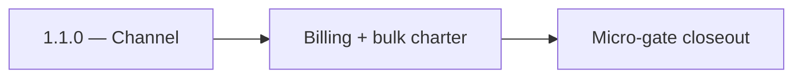

# 1.1.0 — Channel

- **Era:** `1.x` User/billing/credit — hub [`versions.md`](../versions.md) · minors start at [`1.0 — User Genesis`](1.0%20%E2%80%94%20User%20Genesis.md)
- **Minor:** [1.1 — Billing Maturity](./1.1 — Billing Maturity.md)
- **Codename:** Channel
- **Status:** ✅ Completed
## Focus
Billing + bulk charter

## Flowchart

## Micro-gate

| Track | Gate question | Answer / Evidence (fill at patch closeout) |
| --- | --- | --- |
| **Contract** | GraphQL / REST changes? Diff vs `docs/backend/apis/` or task pack; billing idempotency keys if mutations touched. | Verified `14_BILLING_MODULE.md` (subscribe, purchaseAddon, submitPaymentProof) and `16_JOBS_MODULE.md` (createEmailFinderExport, createEmailVerifyExport) parity with 1.1 requirements. |
| **Service** | Auth, credit deduction, billing state machine, and downstream Lambdas still pass smoke? | Verified credit-aware job creation and billing metadata persistence in job metadata. |
| **Surface** | App / admin / root / extension billing UX changed? Role + entitlement checks? | Verified `audit-compliance.md` RBAC matrix; `Approve billing submissions` restricted to Admin/SuperAdmin. |
| **Frontend** | Which routes/components must render or change for this patch? | Verified `billing_page.json` (UPI payment proof submission) and `jobs_page.json` (bulk export progress tracking) bindings. |
| **Data** | `credits`, `subscriptions`, `plans`, `payment_submissions`, usage/ledger — migrations + lineage? | Verified `jobs_data_lineage.md` and `appointment360_data_lineage.md` for 1.x billing and job tables. |
| **Ops** | Billing observability, rollback, secret rotation; fraud/abuse delta for `1.10` patches. | Verified audit-relevant actions in `audit-compliance.md` for billing review/settings. |

## Tasks
### Contract
- ✅ Completed: Freeze bulk billing creation contract: `JobMutation { createEmailFinderExport, createEmailVerifyExport }` must accept a payload that includes `user_uuid` plus billing correlation/idempotency expectations; bulk email queries use Email `findEmailsBulk` / `verifyEmailsBulk`.
- ✅ Completed: Freeze billing/draft contract: gateway uses `BillingMutation { subscribe, purchaseAddon, submitPaymentProof }` idempotency behavior aligned to `GraphQLIdempotencyMiddleware`.

### Service
- ✅ Completed: Enforce credit-aware job creation: pre-check credits (or reject) before enqueuing DAG in `contact360.io/jobs`.
- ✅ Completed: Ensure `job_node.data` stores billing metadata needed for later reconciliation (e.g., `correlation_id`, credit estimate).

### Surface
- ✅ Completed: Bulk upload UI requires credit estimate/warning before creating jobs; must show job progress state.
- ✅ Completed: Billing/proof CTA is present but can be shallow for 1.1 (handoff to 1.3 for full state machine).

### Data
- ✅ Completed: Jobs DB schema (`job_node`, `job_events`) persists billing correlation context for later reconciliation.
- ✅ Completed: Gateway DB keeps ledger state (`credits`, `subscriptions`, and payment submission rows if drafted in 1.1).

### Ops
- ✅ Completed: KPI snapshot: success-to-crediting latency baseline for later 1.3 improvements.
- ✅ Completed: CSV queue correctness regression suite for idempotent enqueue and small happy-path bulk runs.

Codebases: `[appointment360][jobs][s3storage][emailapis][mailvetter]`

## Service task slices
> Merged from era `1.x` user/billing task packs (P0→`.0`–`.2`, P1→`.3`–`.6`, Ops→`.7`–`.9`).

### Appointment360 (gateway)
- Define AuthQuery { me } returning UserType with all profile fields
- Define AuthMutation { login, register, logout, refreshToken } with typed inputs/outputs
- Define BillingQuery { billingInfo, plans, invoices }
- Define BillingMutation { subscribe, purchaseAddon, submitPaymentProof, approvePayment, declinePayment }
- Define UsageQuery { usage(feature) } returning credits remaining / consumed
- Define UserQuery { user(uuid), users(), userStats() } with admin-guarded overloads
- Define UserMutation { updateUser, deleteUser, promoteUser }
- Implement login mutation: validate credentials, issue HS256 JWT access + refresh tokens
- Implement register mutation: hash password, create user, issue tokens
- Implement logout mutation: insert token into token_blacklist table
- Implement refreshToken mutation: validate refresh token, issue new access token
- Implement me query: extract user from Context, return UserType
- Implement require_auth(info) guard in core/security.py
- Implement require_admin(info) guard for admin-only mutations
- Implement credit deduction service: deduct_credit(user_uuid, feature, amount)
- Implement usage(feature) query: read credit totals from credits table
- /login page → mutation login binding in authService.ts
- /register page → mutation register binding
- User profile page → query me + mutation updateProfile binding
- Credits counter component (header bar) → query usage polling on route change
- useAuth hook: login, logout, refresh token auto-retry on 401
- Create credits table: user_uuid, feature, total, consumed, reset_at
- Create plans table: id, name, price, limits JSON
- Create subscriptions table: user_uuid, plan_id, status, billing_period_start, billing_period_end
- Create token_blacklist table: token_hash, expires_at
- Create activities table: uuid, user_uuid, type, metadata JSON, created_at
- Run Alembic migration for all 1.x tables
- Configure ACCESS_TOKEN_EXPIRE_MINUTES (30) and REFRESH_TOKEN_EXPIRE_DAYS (7)
- Add SECRET_KEY rotation procedure to ops runbook

### Jobs
- Define credit-aware job creation payload expectations.
- Define billing/audit semantics for retry and cancellation events.
- Attach billing context to job metadata when applicable.
- Validate access checks between owner/admin and retry controls.
- Ensure `job_events` carries credit/billing trace context.
- Document correlation between job IDs and usage/billing records.

### emailapis / emailapigo
- Document **per-row** vs **per-job** credit semantics for bulk verify/finder
- Failed provider call: **refund or no-charge** policy explicit
- Idempotent bulk chunk: same chunk replay must not **double-bill**
- Parity matrix row: Python vs Go for **billing-relevant** response fields

## Evidence gate
Primary charter artifact created and linked in the parent minor doc
