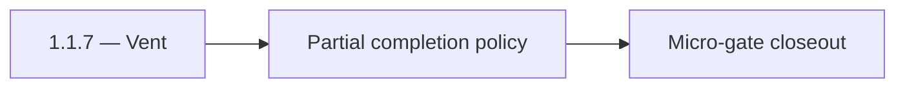

# 1.1.7 — Vent

- **Era:** `1.x` User/billing/credit — hub [`versions.md`](../versions.md) · minors start at [`1.0 — User Genesis`](1.0%20%E2%80%94%20User%20Genesis.md)
- **Minor:** [1.1 — Billing Maturity](./1.1 — Billing Maturity.md)
- **Codename:** Vent
- **Status:** ✅ Completed
## Focus
Partial completion policy

## Flowchart

## Micro-gate

| Track | Gate question | Answer / Evidence (fill at patch closeout) |
| --- | --- | --- |
| **Contract** | GraphQL / REST changes? Diff vs `docs/backend/apis/` or task pack; billing idempotency keys if mutations touched. | Document at patch closeout. |
| **Service** | Auth, credit deduction, billing state machine, and downstream Lambdas still pass smoke? | Document smoke paths. |
| **Surface** | App / admin / root / extension billing UX changed? Role + entitlement checks? | Document UX delta or N/A. |
| **Frontend** | Which routes/components must render or change for this patch? | Bulk upload + billing surfaces; credit warnings. Document at closeout. |
| **Data** | `credits`, `subscriptions`, `plans`, `payment_submissions`, usage/ledger — migrations + lineage? | Document migrations/lineage or N/A. |
| **Ops** | Billing observability, rollback, secret rotation; fraud/abuse delta for `1.10` patches. | Document ops delta or N/A. |

## Tasks
### Contract
- ✅ Completed: Document partial completion policy:
- ✅ Completed: when to mark job “completed with partial errors,”
- ✅ Completed: whether results download is allowed,
- ✅ Completed: whether credits are deducted proportionally.

### Service
- ✅ Completed: Processor updates job state + events so that reconciliation computes charged rows consistently.

### Surface
- ✅ Completed: UI supports partial success display and “download results” for successful rows.

### Data
- ✅ Completed: Reconciliation inputs must be deterministic across retries (same job_uuid → same charged_rows).

### Ops
- ✅ Completed: Test: partial CSV run followed by retry of failed rows yields consistent credit totals.

Codebases: `[jobs][appointment360][app]`

## Service task slices
> Merged from era `1.x` user/billing task packs (P0→`.0`–`.2`, P1→`.3`–`.6`, Ops→`.7`–`.9`).

### Appointment360 (gateway)
- Wire GraphQL Idempotency-Key to billing mutations in Postman collection
- Write test: login → me → logout → me → error flow
- Write test: register → consume credit → query usage → low-credit guard

### Jobs
- Add billing-impact alerts for job failure spikes.
- Add release checklist for billing-flow regression checks.

### emailapis / emailapigo
- Add observability checks and release validation evidence for era **`1.x`**.
- Capture rollback and incident-runbook notes for email-impacting releases.
- **Billing regression:** alert when bulk job completion count diverges from expected credit consumption (see **Service task slices** for Jobs in this patch / era).

### Mailvetter
- [ ] Add key rotation runbook and secret separation policy.
- [ ] Add plan enforcement tests across all three tiers.
- [ ] Add billing parity checks against appointment360 usage records.

## Evidence gate
Patch closeout includes contract diff, smoke output, data lineage delta, and ops note
