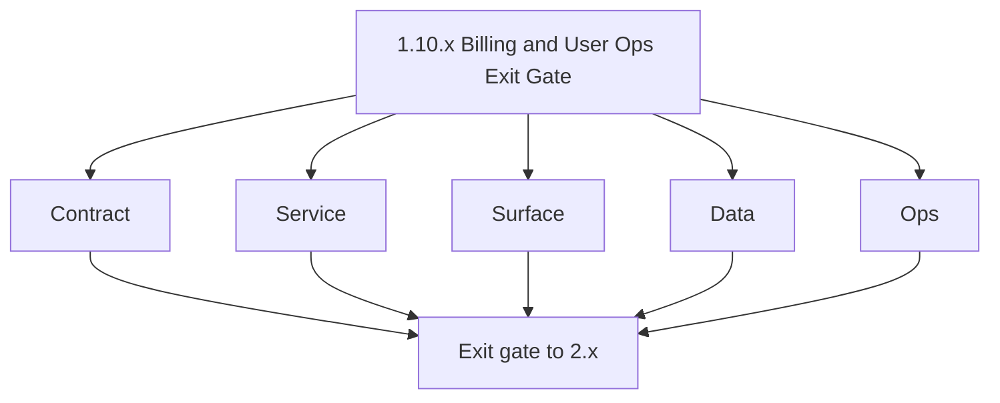
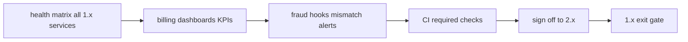

# Version 1.10 — Billing and User Ops Exit Gate

- **Status:** planned  
- **Codename:** Billing and User Ops Exit Gate  
- **Era:** 1.x  
- **Summary:** **1.x era completion** before heavy **`2.x` email system** delivery — health matrix for billing-critical paths, **observability** (credit mismatch, payment failures), **fraud/abuse** hooks, CI gates, runbooks.  
- **Patch closure:** Every codenamed patch file includes **Micro-gate** + **Service task slices**. Era hub: [`versions.md`](../versions.md).

## Scope

- **Target:** `1.10.x` — every service touching **user/billing/credit** has defined health, metrics, and rollback.  
- **In scope:** `appointment360`, `jobs` (credit metadata), `s3storage` (proofs), `logs.api`, `emailapis` (cost alignment), `admin`.

## Flowchart

### Runtime focus (unique to this minor)

## Task tracks

### Contract

- 📌 Planned: “Billing SLO” one-pager: payment success rate, crediting latency, ledger error budget.

### Service

- 📌 Planned: Synthetic probe: login → usage read → optional test billing env.

### Surface

- 📌 Planned: No new UX — ops readiness only unless exposing status page.

### Data

- 📌 Planned: Daily reconciliation report: credits issued vs payments approved.

### Ops

- 📌 Planned: On-call runbook index for billing incidents; Pager optional.

## Task Breakdown

| Service | Evidence |
| --- | --- |
| appointment360 | health + metrics |
| logs.api | billing event query works |
| jobs | credit metadata in sample job |
| s3storage | proof retention policy signed |

## Immediate next execution queue

- 📌 Planned: Executive **go/no-go** checklist for `2.x` kickoff.

## Cross-service ownership

| Role | Responsibility |
| --- | --- |
| Platform | Metrics + CI |
| Finance/Ops | Reconciliation |
| Security | Fraud rules |

## References

- [`docs/versions.md`](../versions.md)  
- [`docs/governance.md`](../governance.md)  
- **Service task slices** merged into each `1.10.P — *.md` patch file

## Backend API and Endpoint Scope

- Operational readiness; freeze breaking billing schema changes without version bump policy.

## Database and Data Lineage Scope

- Backup/restore drill for gateway DB (users + credits).

## Frontend UX Surface Scope

- Smoke only — production build passes.

## UI Elements Checklist

- 📌 Planned: N/A for ops gate

## Flow / Graph Delta for This Minor

- **Delta:** **Process maturity** — not a product feature minor.

## Audit and Compliance Notes

- Compliance sign-off that **payment** and **PII** handling meet MVP bar.

## Patch ladder (`1.10.0` – `1.10.9`)

### Micro-gate reference (apply at every `1.N.P`)

| Track | Gate question (must answer Yes or document waiver) |
| --- | --- |
| **Contract** | Did any GraphQL / REST contract change? Diff vs `docs/backend/apis/`; billing idempotency keys documented? |
| **Service** | Auth, credit deduction, and billing paths still smoke for affected services? |
| **Surface** | App, admin, root, or extension billing UX changed? Role + entitlement checks? |
| **Frontend** | Which routes/components apply for this minor (see **Frontend UX Surface Scope**)? |
| **Data** | Migrations or lineage for credits, subscriptions, usage/ledger, payment proofs? |
| **Ops** | Observability, rollback, secrets; fraud/abuse runbooks where relevant? |

**Patch intent bands:** `.0` charter · `.1`–`.2` P0-heavy **Service task slices** · `.3`–`.6` P1 / surface-data · `.7`–`.9` ops + minor freeze.

Theme: **Bridge**.

| Patch | Codename | Focus |
| --- | --- | --- |
| `1.10.0` | Matrix | Service inventory |
| `1.10.1` | Probe | Health automation |
| `1.10.2` | Observe | Metrics |
| `1.10.3` | Alert | Thresholds |
| `1.10.4` | Runbook | Incidents |
| `1.10.5` | Handoff | 2.x dependency list |
| `1.10.6` | Certify | Sign-offs |
| `1.10.7` | Freeze | Code freeze window |
| `1.10.8` | Promote | Tag release |
| `1.10.9` | Exit | **1.x complete** |

### 1.10.0 — Matrix (Service inventory)

**Contract**

- Define “Billing SLO” and scope:
  - payment success rate,
  - crediting latency,
  - ledger error budget.

**Service**

- Enumerate all user/billing/credit touching services and verify they have compatible health contracts:
  - appointment360, jobs, s3storage, logs.api, admin, emailapis.

**Surface**

- No new UX; ops readiness only unless exposing status externally.

**Data**

- Daily reconciliation report inputs are defined:
  - credits issued vs payments approved.

**Ops**

- Create inventory evidence:
  - list of endpoints/health checks to run during CI.

Codebases: `[appointment360][jobs][s3storage][logsapi][admin]`

### 1.10.1 — Probe (Health automation)

**Contract**

- Synthetic probe definition:
  - `login → usage read` and optional billing smoke (in a staging/test env).

**Service**

- Probe uses stable GraphQL operations:
  - `AuthMutation.login` then `UsageQuery.usage`.

**Surface**

- Not applicable (ops-only).

**Data**

- Probe stores trace/request id and expected response invariants.

**Ops**

- Automate probe in CI:
  - fail CI if health invariants break.

Codebases: `[appointment360]`

### 1.10.2 — Observe (Metrics)

**Contract**

- Define the metrics to observe:
  - request/error/duration aggregate metrics from middleware,
  - reconciliation divergence metrics.

**Service**

- Ensure tracing ids propagate:
  - request_id and trace_id are attached end-to-end.

**Surface**

- Not applicable.

**Data**

- Metrics are backed by logs.api where needed for later admin investigation.

**Ops**

- Confirm metrics dashboards:
  - billing dashboards KPIs reflect reality for credits/payments.

Codebases: `[logsapi][appointment360]`

### 1.10.3 — Alert (Thresholds)

**Contract**

- Define alert thresholds:
  - credit mismatch,
  - payment failures spikes,
  - divergence between charged_rows and ledger/usage.

**Service**

- Ensure alerts are driven by reliable signals:
  - logs.api billing event categories are queryable and indexed.

**Surface**

- Not applicable (ops alerts).

**Data**

- Record event schema versions and retention windows.

**Ops**

- Validate alert routing to runbook owners with correct severity.

Codebases: `[logsapi][admin]`

### 1.10.4 — Runbook (Incidents)

**Contract**

- Define incident procedures for:
  - missing credit grants,
  - stuck payment submissions,
  - ledger mismatch divergence.

**Service**

- Ensure rollback and replay steps map to real operations:
  - idempotency keys,
  - job retries vs refunds policy.

**Surface**

- Not applicable.

**Data**

- Runbook references:
  - exact logs.api queries and proof S3 prefixes.

**Ops**

- Run a dry run:
  - pick one synthetic failure and confirm runbook steps resolve it.

Codebases: `[appointment360][s3storage][jobs][logsapi]`

### 1.10.5 — Handoff (2.x dependency list)

**Contract**

- Produce a dependency list for `2.x` kickoff:
  - what 1.x exports/ledger guarantees are assumed.

**Service**

- Ensure no hidden constraints break `2.x` assumptions:
  - schema freeze notes for billing/credits.

**Surface**

- Not applicable.

**Data**

- Include reconciliation/diff baselines for 2.x.

**Ops**

- Handoff doc created and reviewed by platform/security owners.

Codebases: `[all 1.x packs]`

### 1.10.6 — Certify (Sign-offs)

**Contract**

- Certification checklist includes:
  - “billing critical paths have defined health and rollback”.

**Service**

- Run final integration suite:
  - bulk pipeline smoke,
  - proof upload → admin approve → credits update,
  - usage query correctness.

**Surface**

- Production build passes.

**Data**

- Backup/restore evidence exists for gateway DB (users + credits).

**Ops**

- Collect sign-offs from:
  - Finance/Ops (reconciliation),
  - Security (fraud/abuse rules),
  - Platform (metrics/CI).

Codebases: `[appointment360][admin][app]`

### 1.10.7 — Freeze (Code freeze window)

**Contract**

- Freeze breaking changes:
  - no schema changes without version bump policy.

**Service**

- Enforce release freeze window in CI:
  - probes + health checks must be green.

**Surface**

- Not applicable.

**Data**

- Ensure reconciliation report generation continues against stable data model.

**Ops**

- Monitor for any billing incident anomalies during freeze window.

Codebases: `[all 1.x packs]`

### 1.10.8 — Promote (Tag release)

**Contract**

- Tag release with evidence links:
  - CI probe logs,
  - reconciliation report artifact.

**Service**

- Ensure deployed versions match documentation:
  - services report expected health and version stamps.

**Surface**

- Not applicable.

**Data**

- Ensure logs retention includes incident windows needed for investigations.

**Ops**

- Promote only after all runbook/ops gates are satisfied or explicitly waived.

Codebases: `[ops + platform]`

### 1.10.9 — Exit (1.x complete)

**Contract**

- Confirm 1.x complete means:
  - no open contract drift,
  - billing/credits state machine behaves consistently,
  - security hardening and RBAC are in place.

**Service**

- Run final synthetic probe and reconciliation checks one last time.

**Surface**

- N/A.

**Data**

- Daily reconciliation report shows credits issued vs payments approved without unacceptable variance.

**Ops**

- Formal approval to start `2.x` Contact360 email system.

Codebases: `[appointment360][jobs][s3storage][logsapi][admin][app]`

## Release Gate and Evidence

### Master Task Checklist

- 📌 Planned: All packs ops rows satisfied or waived

### Backend API and Endpoints

- 📌 Planned: SLO doc

### Database and Data Lineage

- 📌 Planned: Backup drill note

### Frontend UX

- 📌 Planned: Prod build OK

### UI Elements

- 📌 Planned: N/A

### Flow and Graph

- 📌 Planned: Ops diagram

### Validation

- 📌 Planned: CI green + synthetic probe

### Release Gate

- 📌 Planned: **Formal approval to start `2.x` Contact360 email system**

## Patches

| Patch | Codename | Doc |
| --- | --- | --- |
| `1.10.0` | Matrix | [`1.10.0` — Matrix](1.10.0 — Matrix.md) |
| `1.10.1` | Probe | [`1.10.1` — Probe](1.10.1 — Probe.md) |
| `1.10.2` | Observe | [`1.10.2` — Observe](1.10.2 — Observe.md) |
| `1.10.3` | Alert | [`1.10.3` — Alert](1.10.3 — Alert.md) |
| `1.10.4` | Runbook | [`1.10.4` — Runbook](1.10.4 — Runbook.md) |
| `1.10.5` | Handoff | [`1.10.5` — Handoff](1.10.5 — Handoff.md) |
| `1.10.6` | Certify | [`1.10.6` — Certify](1.10.6 — Certify.md) |
| `1.10.7` | Freeze | [`1.10.7` — Freeze](1.10.7 — Freeze.md) |
| `1.10.8` | Promote | [`1.10.8` — Promote](1.10.8 — Promote.md) |
| `1.10.9` | Exit | [`1.10.9` — Exit](1.10.9 — Exit.md) |
