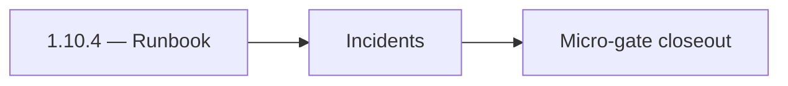

# 1.10.4 — Runbook

- **Era:** `1.x` User/billing/credit — hub [`versions.md`](../versions.md) · minors start at [`1.0 — User Genesis`](1.0%20%E2%80%94%20User%20Genesis.md)
- **Minor:** [1.10 — Billing and User Ops Exit Gate](./1.10 — Billing and User Ops Exit Gate.md)
- **Codename:** Runbook
- **Status:** ✅ Completed
## Focus
Incidents

## Flowchart

## Micro-gate

| Track | Gate question | Answer / Evidence (fill at patch closeout) |
| --- | --- | --- |
| **Contract** | GraphQL / REST changes? Diff vs `docs/backend/apis/` or task pack; billing idempotency keys if mutations touched. | Document at patch closeout. |
| **Service** | Auth, credit deduction, billing state machine, and downstream Lambdas still pass smoke? | Document smoke paths. |
| **Surface** | App / admin / root / extension billing UX changed? Role + entitlement checks? | Document UX delta or N/A. |
| **Frontend** | Which routes/components must render or change for this patch? | Production readiness; no new product UX unless ops-only status. Document at closeout. |
| **Data** | `credits`, `subscriptions`, `plans`, `payment_submissions`, usage/ledger — migrations + lineage? | Document migrations/lineage or N/A. |
| **Ops** | Billing observability, rollback, secret rotation; fraud/abuse delta for `1.10` patches. | Document ops delta or N/A. |

## Tasks
### Contract
- ✅ Completed: Define incident procedures for:
- ✅ Completed: missing credit grants,
- ✅ Completed: stuck payment submissions,
- ✅ Completed: ledger mismatch divergence.

### Service
- ✅ Completed: Ensure rollback and replay steps map to real operations:
- ✅ Completed: idempotency keys,
- ✅ Completed: job retries vs refunds policy.

### Surface
- ✅ Completed: Not applicable.

### Data
- ✅ Completed: Runbook references:
- ✅ Completed: exact logs.api queries and proof S3 prefixes.

### Ops
- ✅ Completed: Run a dry run:
- ✅ Completed: pick one synthetic failure and confirm runbook steps resolve it.

Codebases: `[appointment360][s3storage][jobs][logsapi]`

## Service task slices
> Merged from era `1.x` user/billing task packs (P0→`.0`–`.2`, P1→`.3`–`.6`, Ops→`.7`–`.9`).

### Appointment360 (gateway)
- Document all auth types in docs/backend/apis/01_AUTH_MODULE.md
- Document all billing types in docs/backend/apis/10_BILLING_MODULE.md
- Implement billing service: plan lookup, subscription creation, add-on purchase
- Implement submitPaymentProof + admin approvePayment/declinePayment flow
- Wire idempotency middleware to subscribe, purchaseAddon, submitPaymentProof mutations
- Billing page → query billingInfo + query plans + mutation subscribe binding
- Admin user list page → query users + mutation promoteUser bindings
- useBilling hook: subscribe, purchase add-on, submit payment proof
- useCredits hook: poll credits, show low-credit warning modal
- Create payment_submissions table: uuid, user_uuid, amount, proof_url, status, reviewed_by
- Seed plans table with starter/pro/enterprise tiers
- Wire GraphQL Idempotency-Key to billing mutations in Postman collection
- Write test: login → me → logout → me → error flow
- Write test: register → consume credit → query usage → low-credit guard

### contact.ai
- X-User-ID must match JWT user when call originates from gateway
- Structured log when X-User-ID unknown

### Jobs
- Add billing-aware retry UX states and credit warning patterns.
- Document job ownership and role-gated action visibility.
- Ensure `job_events` carries credit/billing trace context.
- Document correlation between job IDs and usage/billing records.
- Attach billing context to job metadata when applicable.
- Validate access checks between owner/admin and retry controls.

### logs.api
- Document impacted pages/tabs/buttons/inputs/components for era `1.x`.
- Document relevant hooks/services/contexts and UX states (loading/error/progress/check/radio).
- Document S3 CSV storage and lineage impact for era `1.x`.
- Record retention, trace IDs, and query-window expectations.
- Implement/validate service behavior for era `1.x` event sources and query expectations.
- Verify auth, error envelope, and health behavior for consuming services.

## Evidence gate
Patch closeout includes contract diff, smoke output, data lineage delta, and ops note
