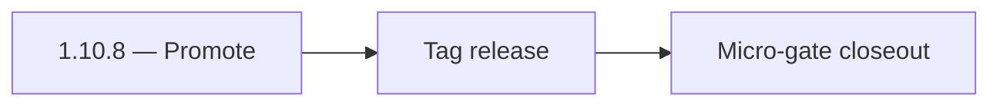

# 1.10.8 — Promote

- **Era:** `1.x` User/billing/credit — hub [`versions.md`](../versions.md) · minors start at [`1.0 — User Genesis`](1.0%20%E2%80%94%20User%20Genesis.md)
- **Minor:** [1.10 — Billing and User Ops Exit Gate](./1.10 — Billing and User Ops Exit Gate.md)
- **Codename:** Promote
- **Status:** ✅ Completed
## Focus
Tag release

## Flowchart

## Micro-gate

| Track | Gate question | Answer / Evidence (fill at patch closeout) |
| --- | --- | --- |
| **Contract** | GraphQL / REST changes? Diff vs `docs/backend/apis/` or task pack; billing idempotency keys if mutations touched. | Document at patch closeout. |
| **Service** | Auth, credit deduction, billing state machine, and downstream Lambdas still pass smoke? | Document smoke paths. |
| **Surface** | App / admin / root / extension billing UX changed? Role + entitlement checks? | Document UX delta or N/A. |
| **Frontend** | Which routes/components must render or change for this patch? | Production readiness; no new product UX unless ops-only status. Document at closeout. |
| **Data** | `credits`, `subscriptions`, `plans`, `payment_submissions`, usage/ledger — migrations + lineage? | Document migrations/lineage or N/A. |
| **Ops** | Billing observability, rollback, secret rotation; fraud/abuse delta for `1.10` patches. | Document ops delta or N/A. |

## Tasks
### Contract
- ✅ Completed: Tag release with evidence links:
- ✅ Completed: CI probe logs,
- ✅ Completed: reconciliation report artifact.

### Service
- ✅ Completed: Ensure deployed versions match documentation:
- ✅ Completed: services report expected health and version stamps.

### Surface
- 📌 Planned: **[appointment360]** — refine duplicate task (was: ✅ completed: not applicable.) | patch `1.10.8` band `8` | reason: specialize this file vs sibling patches; see docs/codebases/appointment360-codebase-analysis.md

### Data
- ✅ Completed: Ensure logs retention includes incident windows needed for investigations.

### Ops
- ✅ Completed: Promote only after all runbook/ops gates are satisfied or explicitly waived.

Codebases: `[ops + platform]`

## Service task slices
> Merged from era `1.x` user/billing task packs (P0→`.0`–`.2`, P1→`.3`–`.6`, Ops→`.7`–`.9`).

### Appointment360 (gateway)
- Wire GraphQL Idempotency-Key to billing mutations in Postman collection
- Write test: login → me → logout → me → error flow
- Write test: register → consume credit → query usage → low-credit guard

### contact.ai
- [ ] Rotate `API_KEY` secret in secrets manager alongside other `1.x` secret rotation.
- [ ] Add `LAMBDA_AI_API_URL` to `appointment360` deploy environment (value may be placeholder in `1.x`).
- [ ] IAM policy review: Lambda execution role for contact.ai has least-privilege RDS/Secrets access.
- [ ] Add contact.ai health endpoint to monitoring dashboard health grid.

### emailapis / emailapigo
- Add observability checks and release validation evidence for era **`1.x`**.
- Capture rollback and incident-runbook notes for email-impacting releases.
- **Billing regression:** alert when bulk job completion count diverges from expected credit consumption (see **Service task slices** for Jobs in this patch / era).

### Jobs
- Add billing-impact alerts for job failure spikes.
- Add release checklist for billing-flow regression checks.

### logs.api
- Add observability checks and release validation evidence for era `1.x`.
- Capture rollback and incident-runbook notes for logging-impacting releases.

### Mailvetter
- [ ] Add key rotation runbook and secret separation policy.
- [ ] Add plan enforcement tests across all three tiers.
- [ ] Add billing parity checks against appointment360 usage records.

### Salesnavigator
- [ ] Add billing event emission smoke test (or confirm no-op stub is acceptable)
- [ ] Add IAM policy for Lambda to emit billing events if event bus is used
- [ ] Secret rotation: add `CONNECTRA_API_KEY` to rotation schedule
- `docs/codebases/salesnavigator-codebase-analysis.md`
- `docs/backend/apis/SALESNAVIGATOR_ERA_TASK_PACKS.md`

## Evidence gate
Patch closeout includes contract diff, smoke output, data lineage delta, and ops note
