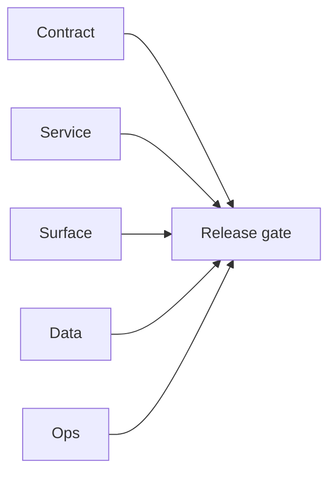

# 1.11.100 — EC2 email server user-billing patch linkage

## Scope

Cross-era mapping of EC2 email runtime patches that affect authenticated usage pathways.

## Included patch intents

- `002-cors-hardening.patch`: controlled browser origin policy for protected endpoints.
- `006-error-handling.patch`: stronger runtime error handling for job and queue state.

## User/billing relevance

- API-key protected paths are more deterministic and easier to audit under failures.

## Flowchart

Five-track delivery (contract / service / surface / data / ops) for this doc:

**Master hub:** [`docs/docs/flowchart.md`](../docs/flowchart.md) — cross-system diagrams and era strip (`0.x` → `10.x`).
