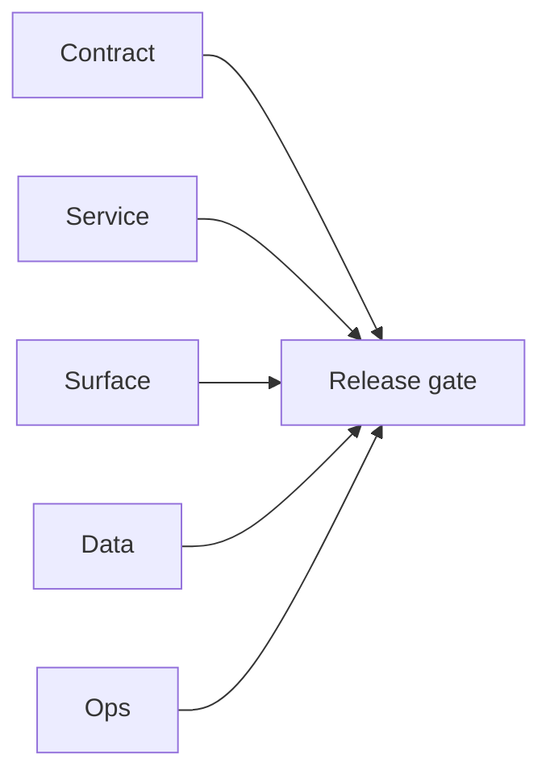

# 1.11.100 — EC2 email server user-billing patch linkage

## Scope

Cross-era mapping of EC2 email runtime patches that affect authenticated usage pathways.

## Included patch intents

- `002-cors-hardening.patch`: controlled browser origin policy for protected endpoints.
- `006-error-handling.patch`: stronger runtime error handling for job and queue state.

## User/billing relevance

- API-key protected paths are more deterministic and easier to audit under failures.

## Flowchart

Five-track delivery (contract / service / surface / data / ops) for this doc:

**Master hub:** [`docs/docs/flowchart.md`](../docs/flowchart.md) — cross-system diagrams and era strip (`0.x` → `10.x`).

## Task tracks

### Contract

- ✅ Completed: Patch intents (`002-cors-hardening`, `006-error-handling`) documented; protected API-key routes enumerated for billing/usage audit.

### Service

- ✅ Completed: EC2 email.server runtime receives patches; CORS and error-handling behavior aligned with gateway expectations.

### Surface

- ✅ Completed: No direct dashboard delta for this evidence doc; authenticated clients inherit stricter origin + error semantics.

### Data

- ✅ Completed: Queue/job state persistence paths unchanged in schema; failure handling improves consistency of `scheduler_jobs` status updates.

### Ops

- ✅ Completed: Evidence suitable for release packet; correlate with `logsapi` / email.server logs when validating patch rollout.
