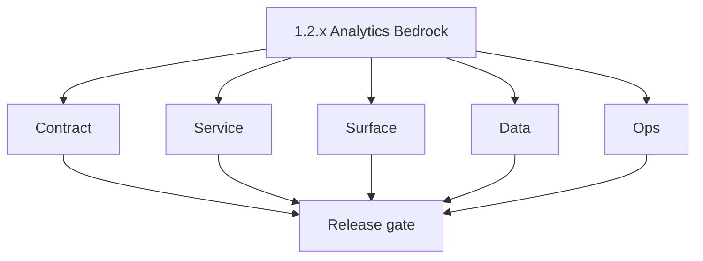
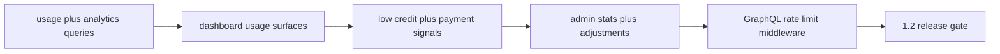

# Version 1.2 — Analytics Bedrock

- **Status:** ✅ Completed
- **Codename:** Analytics Bedrock
- **Era:** 1.x
- **Roadmap:** Roll-up of **1.4** (analytics), **1.5** (notifications), **1.6** (admin), **1.7** (security) — ships as **`1.2.0`** per [`docs/versions.md`](../versions.md)
- **Summary:** Cross-cutting “post-billing MVP” slice: **usage visibility**, **low-credit / payment feedback**, **admin controls**, **GraphQL rate limiting** — without expanding scope into `2.x` email-only features.
- **Patch closure:** Every codenamed patch file includes **Micro-gate** + **Service task slices**. Era hub: [`versions.md`](../versions.md).

## Scope

- **Target:** `1.2.x` — user-visible **analytics** + **notifications** + **admin** + **baseline throttling** in one coordinated minor when product bundles roadmap stages.
- **Note:** This file describes the **aggregated release**; finer slices may map to **`1.4`–`1.7`** minors in parallel docs.

## Flowchart

### Runtime focus (unique to this minor)

## Task tracks

### Contract

- ✅ Completed: 📌 Planned: `usage`, `analytics`, `admin` GraphQL operations documented.
- ✅ Completed: 📌 Planned: Rate limit: config keys + error shape for throttled clients.

- 📌 Planned: **[appointment360]** — refine duplicate task (was: 📌 planned: **[architecture]** — product **graphql** remains …) | patch `1.2.0` band `0` | reason: specialize this file vs sibling patches; see docs/codebases/appointment360-codebase-analysis.md
### Service

- ✅ Completed: 📌 Planned: Usage **aggregation** or query path performant for MVP scale.
- ✅ Completed: 📌 Planned: Admin mutations: **creditUser**, **adjustCredits** — audit-wrapped.

- 📌 Planned: **[appointment360]** — refine duplicate task (was: 📌 planned: **[architecture]** — **go/gin satellites** in sco…) | patch `1.2.0` band `0` | reason: specialize this file vs sibling patches; see docs/codebases/appointment360-codebase-analysis.md
### Surface

- ✅ Completed: 📌 Planned: [`docs/governance.md`](../governance.md) pointers: `usage/page.tsx`, `CreditBudgetAlerts`, admin clients.

- 📌 Planned: **[appointment360]** — refine duplicate task (was: 📌 planned: **[architecture]** — **next.js** customer surface…) | patch `1.2.0` band `0` | reason: specialize this file vs sibling patches; see docs/codebases/appointment360-codebase-analysis.md
### Data

- ✅ Completed: 📌 Planned: logs.api **S3 CSV** events for billing/auth if admin views query logs.

- 📌 Planned: **[appointment360]** — refine duplicate task (was: 📌 planned: **[architecture]** — **postgresql-first** per `do…) | patch `1.2.0` band `0` | reason: specialize this file vs sibling patches; see docs/codebases/appointment360-codebase-analysis.md
### Ops

- ✅ Completed: 📌 Planned: Dashboard health for rate-limit metrics optional.

- 📌 Planned: **[appointment360]** — refine duplicate task (was: 📌 planned: **[architecture]** — **observability**: correlate…) | patch `1.2.0` band `0` | reason: specialize this file vs sibling patches; see docs/codebases/appointment360-codebase-analysis.md
## Task Breakdown

| Stage | Maps to minor (optional) |
| --- | --- |
| 1.4 usage | `1.4 — Usage Ledger.md` |
| 1.5 notify | `1.5 — Notification Rail.md` |
| 1.6 admin | `1.6 — Admin Control Plane.md` |
| 1.7 security | `1.7 — Security Hardening.md` |

## Immediate next execution queue

- 📌 Planned: Confirm **order** of landing child minors to avoid half-shipped analytics.

## Cross-service ownership

| Owner | Scope |
| --- | --- |
| Frontend | Usage + alert components |
| Platform API | Queries + middleware |
| Admin / DocsAI | Credit/payment review |

## References

- [`docs/governance.md`](../governance.md) — 1.4–1.7 code map
- [`docs/roadmap.md`](../roadmap.md)

## Backend API and Endpoint Scope

- `usage`, `analytics`, `admin`, `billing` modules; `GraphQLRateLimitMiddleware`.

## Database and Data Lineage Scope

- Credits, usage logs, optional aggregates; logs.api for operational queries.

## Frontend UX Surface Scope

- Usage page, alerts in layout, admin templates.

## UI Elements Checklist

- 📌 Planned: Usage charts/tables
- 📌 Planned: CreditBudgetAlerts
- 📌 Planned: Admin approve/decline

## Flow / Graph Delta for This Minor

- **Delta:** Adds **telemetry + control + throttle** layer after `1.0`/`1.1` core monetization paths.

## Audit and Compliance Notes

- Full audit for **admin credit adjustments** and **payment decisions**.

## Patch ladder (`1.2.0` – `1.2.9`)

### Micro-gate reference (apply at every `1.N.P`)

| Track | Gate question (must answer Yes or document waiver) |
| --- | --- |
| **Contract** | Did any GraphQL / REST contract change? Diff vs `docs/backend/apis/`; billing idempotency keys documented? |
| **Service** | Auth, credit deduction, and billing paths still smoke for affected services? |
| **Surface** | App, admin, root, or extension billing UX changed? Role + entitlement checks? |
| **Frontend** | Which routes/components apply for this minor (see **Frontend UX Surface Scope**)? |
| **Data** | Migrations or lineage for credits, subscriptions, usage/ledger, payment proofs? |
| **Ops** | Observability, rollback, secrets; fraud/abuse runbooks where relevant? |
| **Architecture** | Go/Gin satellites only via Python GraphQL gateway (`contact360.io/api`); Next.js `NEXT_PUBLIC_GRAPHQL_URL`; Postgres-first / Redis exit per `docs/docs/data-stores-postgres.md`. |

**Patch intent bands:** `.0` charter · `.1`–`.2` P0-heavy **Service task slices** · `.3`–`.6` P1 / surface-data · `.7`–`.9` ops + minor freeze.

Theme: **Compass**.

| Patch | Codename | Focus |
| --- | --- | --- |
| `1.2.0` | Bearing | Release charter |
| `1.2.1` | Heading | Usage query MVP |
| `1.2.2` | North | Ledger consistency |
| `1.2.3` | Chart | Analytics surface |
| `1.2.4` | Course | Low-credit UX |
| `1.2.5` | Horizon | Notification wiring |
| `1.2.6` | Waypoint | Admin stats |
| `1.2.7` | Drift | Admin credit adjust |
| `1.2.8` | True | Rate limit on |
| `1.2.9` | Anchor | `1.2.x` freeze |

### 1.2.0 — Bearing (Release charter)

**Contract**

- Document GraphQL operation surface for the minor:
  - usage: `UsageQuery.usage(feature)` per [`docs/backend/apis/09_USAGE_MODULE.md`](../backend/apis/09_USAGE_MODULE.md),
  - admin stats: `AdminQuery.userStats` / `AdminQuery.users` / `AdminQuery.logStatistics` per [`docs/backend/apis/13_ADMIN_MODULE.md`](../backend/apis/13_ADMIN_MODULE.md),
  - optional notification listing: `NotificationsQuery.notifications` per [`docs/backend/apis/05_NOTIFICATIONS_MODULE.md`](../backend/apis/05_NOTIFICATIONS_MODULE.md).
- Define throttling/rate-limit contract readiness (429 error envelope) aligned with `GraphQLRateLimitMiddleware` config.

**Service**

- Implement MVP usage aggregation path and ensure it is the same underlying source as credit deduction (`credits` → `usage(feature)`).
- Ensure admin stats and notification listing are RBAC-safe (role-gated resolvers).

**Surface**

- Confirm UI entry points exist:
  - usage dashboard components,
  - `CreditBudgetAlerts` placement in app layout (driven by remaining credit computed from usage).

**Data**

- Ensure logs/audit evidence for admin and billing/auth events are queryable from logs.api canonical store (S3 CSV lineage).

**Ops**

- Combined DoD charter: “usage + low-credit cues + admin views load” before landing child minors (`1.4`–`1.7`).

Codebases: `[appointment360][app][logsapi][admin]`

### 1.2.1 — Heading (Usage query MVP)

**Contract**

- Lock `UsageQuery.usage(feature)` return schema: `UsageResponse.features[].{used,limit,remaining,resetAt}` per [`docs/backend/apis/09_USAGE_MODULE.md`](../backend/apis/09_USAGE_MODULE.md).

**Service**

- Ensure `usage` implementation derives from the same credits ledger columns (`credits.total`, `credits.consumed`, `credits.reset_at`).

**Surface**

- Usage page binds `graphql/GetUsage` and renders cards/table values via `useUsagePage`.

**Data**

- Usage rows/limits exist for first tracked features (auto-create behavior matches usage module expectations).

**Ops**

- Load smoke: usage query under typical dashboard access pattern (no N+1).

Codebases: `[appointment360][app]`

### 1.2.2 — North (Ledger consistency)

**Contract**

- Define reconciliation expectations between:
  - deduction operations (credit spend),
  - ledger columns (`credits.*`),
  - usage read (`usage(feature)`).

**Service**

- Ensure deterministic ledger math:
  - remaining = limit - used for finite plans,
  - unlimited uses the documented convention (`999999` / remaining = `-1`).

**Surface**

- Add/enable a discrepancy indicator (even if subtle) if client-side cached values diverge.

**Data**

- Validate `credits` lineage updates the correct `feature` bucket used by `usage(feature)`.

**Ops**

- Spot-check:
  - run finder/verifier actions,
  - compare ledger delta to usage query output for the same feature.

Codebases: `[appointment360]`

### 1.2.3 — Chart (Analytics surface)

**Contract**

- Confirm analytics chart data endpoints are defined for dashboard visualization:
  - `AnalyticsQuery.performanceMetrics` / `aggregateMetrics` per [`docs/backend/apis/18_ANALYTICS_MODULE.md`](../backend/apis/18_ANALYTICS_MODULE.md),
  - usage overview components use `usage` or `featureOverview` query.

**Service**

- Ensure analytics reads don’t require billing schema expansions in this minor (MVP scale query plan).

**Surface**

- Dashboard chart components render safely under auth:
  - loading state,
  - empty/zero metrics state.

**Data**

- No additional retention changes required; analytics queries respect user isolation.

**Ops**

- Visual smoke: chart loads with throttling enabled (rate-limit layer does not break chart calls).

Codebases: `[appointment360][app][logsapi]`

### 1.2.4 — Course (Low-credit UX)

**Contract**

- Define the “low credit” signal as derived from usage remaining:
  - source of truth: `usage(feature)` remaining (not stale client state).

**Service**

- Ensure the server emits/derives low-credit status consistently after billing approve or credit spend.

**Surface**

- `CreditBudgetAlerts` displays threshold cues and routes user to billing when appropriate.

**Data**

- Prevent duplicate cues (policy can be session-scoped for MVP).

**Ops**

- Monitor false-positive rate after threshold tuning (KPI: correct alerting on state changes).

Codebases: `[appointment360][app]`

### 1.2.5 — Horizon (Notification wiring)

**Contract**

- Notifications wiring uses `NotificationsQuery.notifications` and notification mutation endpoints:
  - `markNotificationAsRead`,
  - `markNotificationsAsRead`,
  - `updateNotificationPreferences`.
  (All per [`docs/backend/apis/05_NOTIFICATIONS_MODULE.md`](../backend/apis/05_NOTIFICATIONS_MODULE.md).)

**Service**

- Ensure low-credit or billing feedback events create notifications with correct `NotificationType` (e.g., `BILLING`).

**Surface**

- UI lists notifications or surfaces toasts that correspond to created notification rows.

**Data**

- Notification rows include read state and user association (`userId`).

**Ops**

- Idempotency/duplication test: avoid duplicate notifications for the same underlying credit/billing event.

Codebases: `[appointment360][app][logsapi]`

### 1.2.6 — Waypoint (Admin stats)

**Contract**

- Admin stats queries align with [`docs/backend/apis/13_ADMIN_MODULE.md`](../backend/apis/13_ADMIN_MODULE.md):
  - `userStats`, `users`, optional `logs` / `logStatistics`.

**Service**

- Ensure admin stats resolvers aggregate billing/auth evidence safely (no PII leakage in admin stats responses).

**Surface**

- Admin UI templates show stats grids with loading/error states; verify RBAC gating for non-superadmin users.

**Data**

- Evidence queries tie back to logs.api S3 CSV categories so admin can explain “why” a state is true.

**Ops**

- RBAC test:
  - non-admin cannot access admin operations.

Codebases: `[appointment360][admin][logsapi]`

### 1.2.7 — Drift (Admin credit adjust)

**Contract**

- Admin credit adjustment operations include gateway admin mutation paths:
  - `creditUser`,
  - `adjustCredits`,
  - plus error/audit semantics.

**Service**

- Ensure adjustments write full audit context (actor, reason, before/after) and emit billing events to logs.api.

**Surface**

- Admin credit adjust form captures amount + reason and requires confirmation (`ConfirmModal`/similar).

**Data**

- Persist adjustment lineage:
  - the credit changes must reconcile with subsequent `usage(feature)` reads.

**Ops**

- Negative test: attempt credit adjust without admin role → denied and logged.

Codebases: `[appointment360][admin][logsapi]`

### 1.2.8 — True (Rate limit on)

**Contract**

- Define 429 behavior for GraphQL:
  - config key `GRAPHQL_RATE_LIMIT_REQUESTS_PER_MINUTE`,
  - client retry guidance in error extensions.

**Service**

- Enable/tune `GraphQLRateLimitMiddleware` and ensure it composes correctly with `GraphQLMutationAbuseGuardMiddleware`.

**Surface**

- App shows a user-friendly throttle/retry message (and respects `Retry-After` if present).

**Data**

- Optional: persist rate-limited/block counters to logs.api for later analysis.

**Ops**

- Load test:
  - burst traffic triggers throttling before DB exhaustion.

Codebases: `[appointment360][app]`

### 1.2.9 — Anchor (`1.2.x` freeze)

**Contract**

- No breaking contract deltas between child minors (`1.4` usage, `1.5` notifications, `1.6` admin, `1.7` security) for the operations introduced here.

**Service**

- Integration gates:
  - usage query,
  - low-credit cues,
  - admin stats load,
  - rate-limit path.

**Surface**

- Combined smoke: dashboard and admin can navigate without stuck loading.

**Data**

- Ensure logs/audit evidence exists for the critical 1.2 paths.

**Ops**

- Freeze sign-off: readiness for subsequent minors that deepen analytics/ledger/admin/safety.

Codebases: `[appointment360][app][admin][logsapi]`

## Release Gate and Evidence

### Master Task Checklist

- 📌 Planned: Roadmap 1.4–1.7 DoD trace

### Backend API and Endpoints

- 📌 Planned: Diff + middleware config

### Database and Data Lineage

- 📌 Planned: Usage + logs pointers

### Frontend UX

- 📌 Planned: Combined smoke

### UI Elements

- 📌 Planned: Checklist

### Flow and Graph

- 📌 Planned: End-to-end sketched

### Validation

- 📌 Planned: Load smoke for usage query

### Release Gate

- 📌 Planned: Sign-off for **`1.8` Credit Pack Maturity** and subsequent minors, or coordinated ship per product

## Patches

| Patch | Codename | Doc |
| --- | --- | --- |
| `1.2.0` | Bearing | [`1.2.0` — Bearing](1.2.0 — Bearing.md) |
| `1.2.1` | Heading | [`1.2.1` — Heading](1.2.1 — Heading.md) |
| `1.2.2` | North | [`1.2.2` — North](1.2.2 — North.md) |
| `1.2.3` | Chart | [`1.2.3` — Chart](1.2.3 — Chart.md) |
| `1.2.4` | Course | [`1.2.4` — Course](1.2.4 — Course.md) |
| `1.2.5` | Horizon | [`1.2.5` — Horizon](1.2.5 — Horizon.md) |
| `1.2.6` | Waypoint | [`1.2.6` — Waypoint](1.2.6 — Waypoint.md) |
| `1.2.7` | Drift | [`1.2.7` — Drift](1.2.7 — Drift.md) |
| `1.2.8` | True | [`1.2.8` — True](1.2.8 — True.md) |
| `1.2.9` | Anchor | [`1.2.9` — Anchor](1.2.9 — Anchor.md) |
