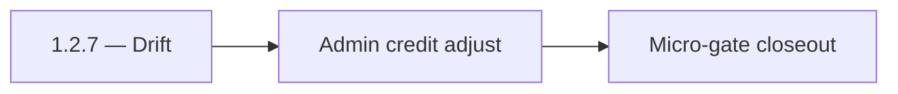

# 1.2.7 — Drift

- **Era:** `1.x` User/billing/credit — hub [`versions.md`](../versions.md) · minors start at [`1.0 — User Genesis`](1.0%20%E2%80%94%20User%20Genesis.md)
- **Minor:** [1.2 — Analytics Bedrock](./1.2 — Analytics Bedrock.md)
- **Codename:** Drift
- **Status:** ✅ Completed
## Focus
Admin credit adjust

## Flowchart

## Micro-gate

| Track | Gate question | Answer / Evidence (fill at patch closeout) |
| --- | --- | --- |
| **Contract** | GraphQL / REST changes? Diff vs `docs/backend/apis/` or task pack; billing idempotency keys if mutations touched. | Document at patch closeout. |
| **Service** | Auth, credit deduction, billing state machine, and downstream Lambdas still pass smoke? | Document smoke paths. |
| **Surface** | App / admin / root / extension billing UX changed? Role + entitlement checks? | Document UX delta or N/A. |
| **Frontend** | Which routes/components must render or change for this patch? | Usage dashboard, `CreditBudgetAlerts`, analytics hooks. Document at closeout. |
| **Data** | `credits`, `subscriptions`, `plans`, `payment_submissions`, usage/ledger — migrations + lineage? | Document migrations/lineage or N/A. |
| **Ops** | Billing observability, rollback, secret rotation; fraud/abuse delta for `1.10` patches. | Document ops delta or N/A. |

## Tasks
### Contract
- ✅ Completed: Admin credit adjustment operations include gateway admin mutation paths:
- ✅ Completed: `creditUser`,
- ✅ Completed: `adjustCredits`,
- ✅ Completed: plus error/audit semantics.

### Service
- ✅ Completed: Ensure adjustments write full audit context (actor, reason, before/after) and emit billing events to logs.api.

### Surface
- ✅ Completed: Admin credit adjust form captures amount + reason and requires confirmation (`ConfirmModal`/similar).

### Data
- ✅ Completed: Persist adjustment lineage:
- ✅ Completed: the credit changes must reconcile with subsequent `usage(feature)` reads.

### Ops
- ✅ Completed: Negative test: attempt credit adjust without admin role → denied and logged.

Codebases: `[appointment360][admin][logsapi]`

## Service task slices
> Merged from era `1.x` user/billing task packs (P0→`.0`–`.2`, P1→`.3`–`.6`, Ops→`.7`–`.9`).

### Appointment360 (gateway)
- Wire GraphQL Idempotency-Key to billing mutations in Postman collection
- Write test: login → me → logout → me → error flow
- Write test: register → consume credit → query usage → low-credit guard

### logs.api
- Add observability checks and release validation evidence for era `1.x`.
- Capture rollback and incident-runbook notes for logging-impacting releases.

### emailapis / emailapigo
- Add observability checks and release validation evidence for era **`1.x`**.
- Capture rollback and incident-runbook notes for email-impacting releases.
- **Billing regression:** alert when bulk job completion count diverges from expected credit consumption (see **Service task slices** for Jobs in this patch / era).

## Evidence gate
Patch closeout includes contract diff, smoke output, data lineage delta, and ops note
