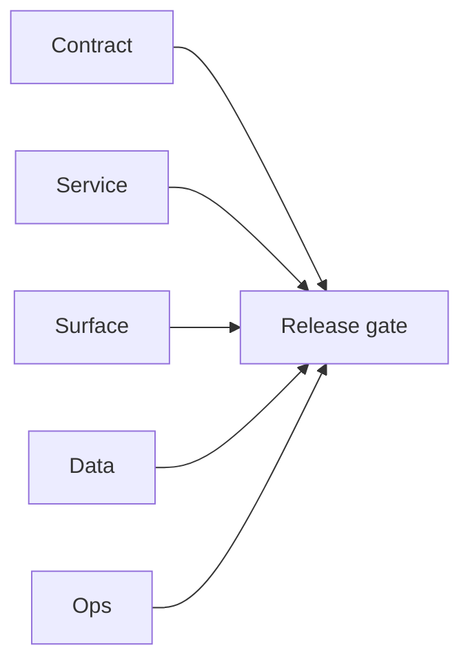

## Focus

Local smoke execution for `contact360.io/api` against era `1.2` contract expectations.

## Micro-gate

- `GET /health` => `200` in `1.546627s`
- `GET /health/db` => `200` in `0.008340s`
- `GET /health/logging` => `200` in `0.012623s`
- `GET /health/slo` => `200` in `0.010472s`
- `GET /graphql?query={ auth { me { uuid email } } }` => `200`, payload returns `auth.me = null`

## Tasks

### Contract

- [ ] Resolve GraphQL contract drift in query examples:
  - `health.apiMetadata.status` field is not queryable in runtime.
  - `billing.plans` does not expose `uuid` and `amount` fields as documented in some examples.

### Service

- [ ] Stabilize request body parsing for POST `/graphql` payload workflows used by smoke scripts.

### Surface

- [ ] Align dashboard/admin error handling copy for GraphQL field mismatch responses observed during smoke queries.

### Data

- [ ] Verify whether anonymous `auth.me = null` is expected or should return explicit auth error envelope for client consistency.

### Ops

- [ ] Add canonical smoke script with URL-encoded GraphQL GET and JSON POST variants.

## Evidence gate

- `tmp/evidence/api/health.json`
- `tmp/evidence/api/health_db.json`
- `tmp/evidence/api/health_logging.json`
- `tmp/evidence/api/health_slo.json`
- `tmp/evidence/api/graphql_auth_me_unauth.json`
- `tmp/evidence/api/graphql_api_metadata.json`
- `tmp/evidence/api/graphql_billing_plans.json`

## Flowchart

Five-track delivery (contract / service / surface / data / ops) for this doc:

**Master hub:** [`docs/docs/flowchart.md`](../docs/flowchart.md) — cross-system diagrams and era strip (`0.x` → `10.x`).
