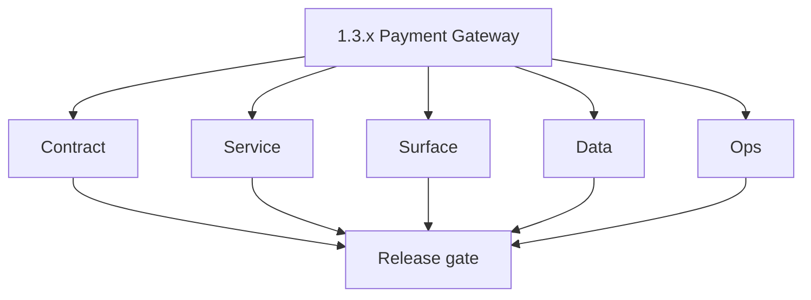
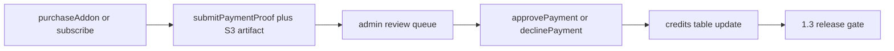

# Version 1.3 — Payment Gateway

- **Status:** ✅ Completed
- **Codename:** Payment Gateway
- **Era:** 1.x
- **Roadmap:** Stage **1.3** — purchase packs, manual payment, proof, admin approve → credit
- **Summary:** **Billing state machine** end-to-end: `purchaseAddon` / `submitPaymentProof`, **S3** proof object, **admin** `approvePayment` / `declinePayment`, **atomic** credit ledger update.
- **Patch closure:** Every codenamed patch file includes **Micro-gate** + **Service task slices**. Era hub: [`versions.md`](../versions.md).

## Scope

- **Target:** `1.3.x` patches — payment-to-crediting correctness (KPI: success-to-crediting time).
- **In scope:** `GraphQLIdempotencyMiddleware` on billing mutations, payment submission persistence.
- **Out of scope:** Full subscription SaaS (future eras).

## Flowchart

### Runtime focus (unique to this minor)

## Task tracks

### Contract

- ✅ Completed: 📌 Planned: Billing types in `docs/backend/apis/10_BILLING_MODULE.md` (or equivalent).
- ✅ Completed: 📌 Planned: Idempotency key header for subscribe/purchase/proof.

- 📌 Planned: **[appointment360]** — refine duplicate task (was: 📌 planned: **[architecture]** — product **graphql** remains …) | patch `1.3.0` band `0` | reason: specialize this file vs sibling patches; see docs/codebases/appointment360-codebase-analysis.md
### Service

- ✅ Completed: 📌 Planned: Server-side validation of proof metadata; no double-credit on retry.
- ✅ Completed: 📌 Planned: Decline path: reason code + user-visible state.

- 📌 Planned: **[appointment360]** — refine duplicate task (was: 📌 planned: **[architecture]** — **go/gin satellites** in sco…) | patch `1.3.0` band `0` | reason: specialize this file vs sibling patches; see docs/codebases/appointment360-codebase-analysis.md
### Surface

- ✅ Completed: 📌 Planned: `UpiPaymentModal` / billing service hooks; admin payment list.

- 📌 Planned: **[appointment360]** — refine duplicate task (was: 📌 planned: **[architecture]** — **next.js** customer surface…) | patch `1.3.0` band `0` | reason: specialize this file vs sibling patches; see docs/codebases/appointment360-codebase-analysis.md
### Data

- ✅ Completed: 📌 Planned: `payment_submissions` (or equivalent) + linkage to `users.uuid`.
- ✅ Completed: 📌 Planned: logs.api audit events: payment_received, payment_approved.

- 📌 Planned: **[appointment360]** — refine duplicate task (was: 📌 planned: **[architecture]** — **postgresql-first** per `do…) | patch `1.3.0` band `0` | reason: specialize this file vs sibling patches; see docs/codebases/appointment360-codebase-analysis.md
### Ops

- ✅ Completed: 📌 Planned: Manual reconciliation runbook for stuck submissions.

- 📌 Planned: **[appointment360]** — refine duplicate task (was: 📌 planned: **[architecture]** — **observability**: correlate…) | patch `1.3.0` band `0` | reason: specialize this file vs sibling patches; see docs/codebases/appointment360-codebase-analysis.md
## Task Breakdown

| Component | Task |
| --- | --- |
| Gateway | Billing service + idempotency |
| s3storage | Proof object class + retention |
| admin | approve/decline UI + API |

## Immediate next execution queue

- 📌 Planned: Failure injection: duplicate idempotency key → single credit.

## Cross-service ownership

| Service | Role |
| --- | --- |
| `contact360.io/api` | Billing mutations |
| `lambda/s3storage` | Proof storage |
| `contact360.io/admin` | Review |

## References

- [`docs/roadmap.md`](../roadmap.md) — stage 1.3
- **Service task slices** in `1.3.P` patch files (scope from former `s3storage-user-billing-task-pack.md`)
- **Service task slices** in `1.3.P` patch files (scope from former `appointment360-user-billing-task-pack.md`)

## Backend API and Endpoint Scope

- `BillingMutation`, `AdminMutation` payment paths; optional `BillingQuery` invoices.

## Database and Data Lineage Scope

- Plans, subscriptions, payment proofs metadata, credits adjustment history.

## Frontend UX Surface Scope

- Billing page, proof upload, success/error toasts, admin queue.

## UI Elements Checklist

- 📌 Planned: Plan cards / purchase CTA
- 📌 Planned: File upload for proof
- 📌 Planned: Admin approve / decline buttons

## Flow / Graph Delta for This Minor

- **Delta:** First **closed loop** for money → credits; distinct from `1.0` auth-only and `1.1` bulk pipeline.

## Audit and Compliance Notes

- Immutable audit log for **who** approved **which** submission; PII minimization on proof images.

## Patch ladder (`1.3.0` – `1.3.9`)

### Micro-gate reference (apply at every `1.N.P`)

| Track | Gate question (must answer Yes or document waiver) |
| --- | --- |
| **Contract** | Did any GraphQL / REST contract change? Diff vs `docs/backend/apis/`; billing idempotency keys documented? |
| **Service** | Auth, credit deduction, and billing paths still smoke for affected services? |
| **Surface** | App, admin, root, or extension billing UX changed? Role + entitlement checks? |
| **Frontend** | Which routes/components apply for this minor (see **Frontend UX Surface Scope**)? |
| **Data** | Migrations or lineage for credits, subscriptions, usage/ledger, payment proofs? |
| **Ops** | Observability, rollback, secrets; fraud/abuse runbooks where relevant? |
| **Architecture** | Go/Gin satellites only via Python GraphQL gateway (`contact360.io/api`); Next.js `NEXT_PUBLIC_GRAPHQL_URL`; Postgres-first / Redis exit per `docs/docs/data-stores-postgres.md`. |

**Patch intent bands:** `.0` charter · `.1`–`.2` P0-heavy **Service task slices** · `.3`–`.6` P1 / surface-data · `.7`–`.9` ops + minor freeze.

Theme: **Vault**.

| Patch | Codename | Focus |
| --- | --- | --- |
| `1.3.0` | Keycard | State machine doc |
| `1.3.1` | Lock | Authorization |
| `1.3.2` | Ledger | DB schema |
| `1.3.3` | Proof | Upload contract |
| `1.3.4` | Submit | User submit |
| `1.3.5` | Review | Admin list |
| `1.3.6` | Approve | Happy path credit |
| `1.3.7` | Credit | Ledger atomicity |
| `1.3.8` | Record | logs.api |
| `1.3.9` | Close | Freeze |

### 1.3.0 — Keycard (State machine doc)

**Contract**

- Define payment + proof contract across GraphQL mutations:
  - `BillingMutation { purchaseAddon, submitPaymentProof }`,
  - `BillingMutation { approvePayment, declinePayment }`,
  - ensure correlation/idempotency key header expectations.
- Align “status vocabulary” for payment submissions (`pending/approved/declined`) with gateway + admin UI.

**Service**

- Implement/confirm end-to-end state machine:
  - user submits payment proof (gateway persists submission row),
  - admin approves/declines (gateway/ledger updates credits),
  - credit ledger changes occur only on approval.
- Ensure s3storage proof storage path policy is deterministic for a submission.

**Surface**

- Confirm billing UX uses the 2-step payment flow:
  - `PaymentModal` + `UpiPaymentModal` for QR/payment,
  - file input `upi-proof-upload` for payment screenshot,
  - inputs include `upi-reference` (UTR/transaction reference).

**Data**

- Validate `payment_submissions` lineage:
  - `user_uuid` FK,
  - `proof_url`,
  - `status`,
  - `reviewed_by` for admin decisions.

**Ops**

- Create the evidence checklist:
  - “proof object exists + submission row updated + credits changed only on approve”.

Codebases: `[appointment360][s3storage][app][admin][logsapi]`

### 1.3.1 — Lock (Authorization)

**Contract**

- Enforce admin-only authorization for approval/decline:
  - `approvePayment` / `declinePayment` require `require_admin` guards (and audit wrapping).

**Service**

- Reject non-admin calls to approve/decline with structured GraphQL auth errors.
- Ensure user cannot approve their own submissions; ensure admin ID is recorded (`reviewed_by`).

**Surface**

- UI: admin-side approval/decline path is role-gated (no action buttons for non-admin).

**Data**

- Ensure `payment_submissions.reviewed_by` is set only on approve/decline.

**Ops**

- Pen-test gate:
  - “non-admin cannot call admin mutations” scenario is validated.

Codebases: `[appointment360][admin]`

### 1.3.2 — Ledger (DB schema)

**Contract**

- Payment schema contract defines the minimal fields required for reconciliation:
  - `payment_submissions.uuid/user_uuid/amount/proof_url/status/reviewed_by`.

**Service**

- Implement DB operations to create submission rows on `submitPaymentProof` and to mark/transition on approve/decline.

**Surface**

- Billing page shows “pending review” messaging tied to `payment_submissions.status=pending`.

**Data**

- Confirm credit ledger mapping:
  - credits are updated only after `approvePayment`,
  - `credits.consumed` increments reconcile with approved submission amount/feature mapping.

**Ops**

- Migration evidence: show one `payment_submissions` row + one matching credits delta trace.

Codebases: `[appointment360][logsapi]`

### 1.3.3 — Proof (Upload contract)

**Contract**

- Freeze s3storage “proof object class policy” for payment screenshots:
  - required content-type and max size,
  - deterministic prefix and metadata.json linkage.
- File upload contract is compatible with billing proof UI:
  - Billing UI sends the file + `upi-reference` text to gateway.

**Service**

- s3storage upload endpoints validate per object class and store proof under prefix model (e.g., `{bucket_id}/upload/`).
- Metadata worker updates `metadata.json` to support later verification/replay.

**Surface**

- `PaymentModal` validates screenshot input and provides clear error states for unsupported formats.

**Data**

- Persist `payment_submissions.proof_url` only after successful s3storage upload.

**Ops**

- Upload negative tests:
  - invalid file types rejected,
  - oversized proofs rejected with a safe error envelope.

Codebases: `[s3storage][appointment360][app]`

### 1.3.4 — Submit (User submit)

**Contract**

- Define submission request behavior for `submitPaymentProof`:
  - idempotency key header expectations,
  - status transition from `pending` on first submission.

**Service**

- Store `payment_submissions` on submit with correct linkage (`user_uuid`, `amount`, `proof_url`).
- Prevent double-credit on replays (same idempotency key/correlation must not create multiple credit ledger updates).

**Surface**

- Billing page after submit shows:
  - “Your payment is being reviewed” text (`payment-pending`),
  - success/error toasts tied to mutation response.

**Data**

- Ensure repeated submissions are de-duped:
  - status remains `pending` without duplicating rows that would cause double approval.

**Ops**

- Failure injection:
  - duplicate proof submission with same idempotency key results in a single submission effect.

Codebases: `[appointment360][app][s3storage]`

### 1.3.5 — Review (Admin list)

**Contract**

- Admin can list payment submissions for review:
  - Admin query surface ties to `AdminQuery.paymentSubmissions` / `AdminQuery.users` patterns.

**Service**

- Ensure review list returns submissions with fields needed for decision:
  - proof_url, amount, status, reviewed_by (when decided).

**Surface**

- Admin UI shows payment queue with approve/decline controls and reason inputs.

**Data**

- Confirm filterability by status (`pending/approved/declined`) and sorting stability.

**Ops**

- UI + authorization test:
  - admin sees only eligible items, and approves update status deterministically.

Codebases: `[appointment360][admin][logsapi]`

### 1.3.6 — Approve (Happy path credit)

**Contract**

- Define happy path semantics for `approvePayment`:
  - transitions submission to `approved`,
  - credits update based on approved amount/plan.

**Service**

- Implement atomic sequence:
  - verify submission is still `pending`,
  - update submission status + reviewed_by,
  - deduct/credit ledger update,
  - emit audit event to logs.api.

**Surface**

- Billing UI and credits widget update so user sees credits added after admin approval.

**Data**

- credits ledger update is correct and matches `payment_submissions.amount`.

**Ops**

- Smoke:
  - end-to-end proof upload → approve → credit ledger delta observed.

Codebases: `[appointment360][logsapi][admin][app]`

### 1.3.7 — Credit (Ledger atomicity)

**Contract**

- Confirm idempotency on `approvePayment`:
  - repeated approvals must be no-ops after first successful transition.

**Service**

- Ensure the credit write and status transition are atomic (no partial commits).
- Confirm failure between status and credit update rolls back.

**Surface**

- UI reflects final state consistently:
  - “approved” status, credits updated, no flicker to pending.

**Data**

- credits and payment_submissions remain consistent; no double credits for the same submission.

**Ops**

- Duplicate approval injection:
  - re-approve same submission; credits increment exactly once.

Codebases: `[appointment360][admin]`

### 1.3.8 — Record (logs.api)

**Contract**

- Ensure logs events emitted for each step:
  - `billing.payment_submitted`,
  - `billing.payment_approved`,
  - `billing.payment_declined`.

**Service**

- Write audit event payloads with:
  - `user_uuid`,
  - `submission_id` (payment_submissions uuid),
  - admin actor uuid (`reviewed_by`),
  - credit granted amount.

**Surface**

- Provide admin/user visibility (at least internal traceability) by exposing request_id/trace id in logs.

**Data**

- logs.api canonical store remains S3 CSV; events are queryable via time-windowed admin views.

**Ops**

- Verify queryability:
  - admin can search logs for payment submission flow by submission_id.

Codebases: `[logsapi][appointment360][admin]`

### 1.3.9 — Close (Freeze)

**Contract**

- No schema drift allowed beyond this minor’s slice:
  - payment proof + admin review contract stays stable for `1.4`.

**Service**

- Integration gates:
  - approve/decline path works with idempotency,
  - ledger state matches logs.

**Surface**

- Final UI validation on billing page:
  - proof upload flow works,
  - pending → approved user feedback correct.

**Data**

- Evidence:
  - sample `payment_submissions` row + credit delta rows.

**Ops**

- Release freeze:
  - “Ready for 1.4 usage ledger depth” checklist is signed off.

Codebases: `[appointment360][app][s3storage][admin][logsapi]`

## Release Gate and Evidence

### Master Task Checklist

- 📌 Planned: KPI: success-to-crediting time sample

### Backend API and Endpoints

- 📌 Planned: Idempotency tests attached

### Database and Data Lineage

- 📌 Planned: ER note for payment tables

### Frontend UX

- 📌 Planned: Proof flow recording

### UI Elements

- 📌 Planned: Checklist

### Flow and Graph

- 📌 Planned: Approve/decline diagram

### Validation

- 📌 Planned: Duplicate submission test

### Release Gate

- 📌 Planned: Ready for **`1.4` Usage Ledger** depth or `1.2` bundle

## Patches

| Patch | Codename | Doc |
| --- | --- | --- |
| `1.3.0` | Keycard | [`1.3.0` — Keycard](1.3.0 — Keycard.md) |
| `1.3.1` | Lock | [`1.3.1` — Lock](1.3.1 — Lock.md) |
| `1.3.2` | Ledger | [`1.3.2` — Ledger](1.3.2 — Ledger.md) |
| `1.3.3` | Proof | [`1.3.3` — Proof](1.3.3 — Proof.md) |
| `1.3.4` | Submit | [`1.3.4` — Submit](1.3.4 — Submit.md) |
| `1.3.5` | Review | [`1.3.5` — Review](1.3.5 — Review.md) |
| `1.3.6` | Approve | [`1.3.6` — Approve](1.3.6 — Approve.md) |
| `1.3.7` | Credit | [`1.3.7` — Credit](1.3.7 — Credit.md) |
| `1.3.8` | Record | [`1.3.8` — Record](1.3.8 — Record.md) |
| `1.3.9` | Close | [`1.3.9` — Close](1.3.9 — Close.md) |
