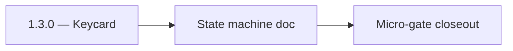

# 1.3.0 — Keycard

- **Era:** `1.x` User/billing/credit — hub [`versions.md`](../versions.md) · minors start at [`1.0 — User Genesis`](1.0%20%E2%80%94%20User%20Genesis.md)
- **Minor:** [1.3 — Payment Gateway](./1.3 — Payment Gateway.md)
- **Codename:** Keycard
- **Status:** ✅ Completed
## Focus
State machine doc

## Flowchart

## Micro-gate

| Track | Gate question | Answer / Evidence (fill at patch closeout) |
| --- | --- | --- |
| **Contract** | GraphQL / REST changes? Diff vs `docs/backend/apis/` or task pack; billing idempotency keys if mutations touched. | Document at patch closeout. |
| **Service** | Auth, credit deduction, billing state machine, and downstream Lambdas still pass smoke? | Document smoke paths. |
| **Surface** | App / admin / root / extension billing UX changed? Role + entitlement checks? | Document UX delta or N/A. |
| **Frontend** | Which routes/components must render or change for this patch? | Payment proof upload, billing toasts, admin review links. Document at closeout. |
| **Data** | `credits`, `subscriptions`, `plans`, `payment_submissions`, usage/ledger — migrations + lineage? | Document migrations/lineage or N/A. |
| **Ops** | Billing observability, rollback, secret rotation; fraud/abuse delta for `1.10` patches. | Document ops delta or N/A. |

## Tasks
### Contract
- ✅ Completed: Define payment + proof contract across GraphQL mutations:
- ✅ Completed: `BillingMutation { purchaseAddon, submitPaymentProof }`,
- ✅ Completed: `BillingMutation { approvePayment, declinePayment }`,
- ✅ Completed: ensure correlation/idempotency key header expectations.
- ✅ Completed: Align “status vocabulary” for payment submissions (`pending/approved/declined`) with gateway + admin UI.

### Service
- ✅ Completed: Implement/confirm end-to-end state machine:
- ✅ Completed: user submits payment proof (gateway persists submission row),
- ✅ Completed: admin approves/declines (gateway/ledger updates credits),
- ✅ Completed: credit ledger changes occur only on approval.
- ✅ Completed: Ensure s3storage proof storage path policy is deterministic for a submission.

### Surface
- ✅ Completed: Confirm billing UX uses the 2-step payment flow:
- ✅ Completed: `PaymentModal` + `UpiPaymentModal` for QR/payment,
- ✅ Completed: file input `upi-proof-upload` for payment screenshot,
- ✅ Completed: inputs include `upi-reference` (UTR/transaction reference).

### Data
- ✅ Completed: Validate `payment_submissions` lineage:
- ✅ Completed: `user_uuid` FK,
- ✅ Completed: `proof_url`,
- ✅ Completed: `status`,
- ✅ Completed: `reviewed_by` for admin decisions.

### Ops
- ✅ Completed: Create the evidence checklist:
- ✅ Completed: “proof object exists + submission row updated + credits changed only on approve”.

Codebases: `[appointment360][s3storage][app][admin][logsapi]`

## Service task slices
> Merged from era `1.x` user/billing task packs (P0→`.0`–`.2`, P1→`.3`–`.6`, Ops→`.7`–`.9`).

### Appointment360 (gateway)
- Define AuthQuery { me } returning UserType with all profile fields
- Define AuthMutation { login, register, logout, refreshToken } with typed inputs/outputs
- Define BillingQuery { billingInfo, plans, invoices }
- Define BillingMutation { subscribe, purchaseAddon, submitPaymentProof, approvePayment, declinePayment }
- Define UsageQuery { usage(feature) } returning credits remaining / consumed
- Define UserQuery { user(uuid), users(), userStats() } with admin-guarded overloads
- Define UserMutation { updateUser, deleteUser, promoteUser }
- Implement login mutation: validate credentials, issue HS256 JWT access + refresh tokens
- Implement register mutation: hash password, create user, issue tokens
- Implement logout mutation: insert token into token_blacklist table
- Implement refreshToken mutation: validate refresh token, issue new access token
- Implement me query: extract user from Context, return UserType
- Implement require_auth(info) guard in core/security.py
- Implement require_admin(info) guard for admin-only mutations
- Implement credit deduction service: deduct_credit(user_uuid, feature, amount)
- Implement usage(feature) query: read credit totals from credits table
- /login page → mutation login binding in authService.ts
- /register page → mutation register binding
- User profile page → query me + mutation updateProfile binding
- Credits counter component (header bar) → query usage polling on route change
- useAuth hook: login, logout, refresh token auto-retry on 401
- Create credits table: user_uuid, feature, total, consumed, reset_at
- Create plans table: id, name, price, limits JSON
- Create subscriptions table: user_uuid, plan_id, status, billing_period_start, billing_period_end
- Create token_blacklist table: token_hash, expires_at
- Create activities table: uuid, user_uuid, type, metadata JSON, created_at
- Run Alembic migration for all 1.x tables
- Configure ACCESS_TOKEN_EXPIRE_MINUTES (30) and REFRESH_TOKEN_EXPIRE_DAYS (7)
- Add SECRET_KEY rotation procedure to ops runbook

### logs.api
- Define and freeze era `1.x` logging schema additions and compatibility notes.
- Update endpoint/reference matrix in `docs/backend/endpoints/logsapi_endpoint_era_matrix.json`.
- Implement/validate service behavior for era `1.x` event sources and query expectations.
- Verify auth, error envelope, and health behavior for consuming services.
- Document S3 CSV storage and lineage impact for era `1.x`.
- Record retention, trace IDs, and query-window expectations.

## Evidence gate
Primary charter artifact created and linked in the parent minor doc
