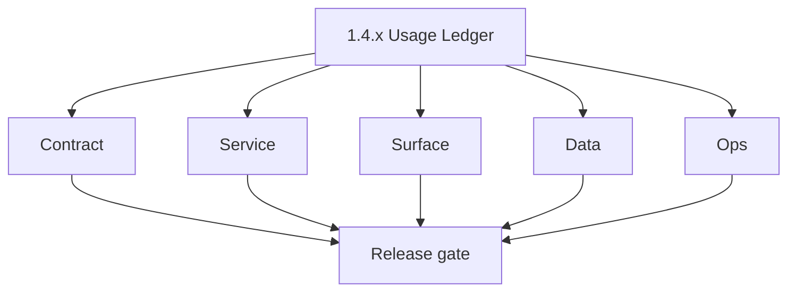
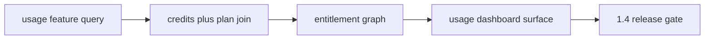

# Version 1.4 — Usage Ledger

- **Status:** ✅ Completed
- **Codename:** Usage Ledger
- **Era:** 1.x
- **Roadmap:** Stage **1.4** — minimal user analytics, usage vs entitlement
- **Summary:** **`usage(feature)`** depth, **credits** table joins, **entitlement** display, dashboard **usage** surface per [`docs/governance.md`](../governance.md).
- **Patch closure:** Every codenamed patch file includes **Micro-gate** + **Service task slices**. Era hub: [`versions.md`](../versions.md).

## Scope

- **Target:** `1.4.x` — user can see **consumption**, **limits**, and **package/expiry** context without full `2.x` email analytics.

## Flowchart

### Runtime focus (unique to this minor)

## Task tracks

### Contract

- ✅ Completed: 📌 Planned: Stable **`UsageQuery`** fields; feature enum alignment with deduction code.

- 📌 Planned: **[appointment360]** — refine duplicate task (was: 📌 planned: **[architecture]** — product **graphql** remains …) | patch `1.4.0` band `0` | reason: specialize this file vs sibling patches; see docs/codebases/appointment360-codebase-analysis.md
### Service

- ✅ Completed: 📌 Planned: No N+1 on usage page; consider DataLoaders.

- 📌 Planned: **[appointment360]** — refine duplicate task (was: 📌 planned: **[architecture]** — **go/gin satellites** in sco…) | patch `1.4.0` band `0` | reason: specialize this file vs sibling patches; see docs/codebases/appointment360-codebase-analysis.md
### Surface

- ✅ Completed: 📌 Planned: `app/(dashboard)/usage/page.tsx` pattern; hooks `useUsage`, `usageService`.

- 📌 Planned: **[appointment360]** — refine duplicate task (was: 📌 planned: **[architecture]** — **next.js** customer surface…) | patch `1.4.0` band `0` | reason: specialize this file vs sibling patches; see docs/codebases/appointment360-codebase-analysis.md
### Data

- ✅ Completed: 📌 Planned: Ledger rows consistent with **`deduct_credit`**; reconciliation job or report optional.

- 📌 Planned: **[appointment360]** — refine duplicate task (was: 📌 planned: **[architecture]** — **postgresql-first** per `do…) | patch `1.4.0` band `0` | reason: specialize this file vs sibling patches; see docs/codebases/appointment360-codebase-analysis.md
### Ops

- ✅ Completed: 📌 Planned: Cache invalidation if usage cached client-side.

- 📌 Planned: **[appointment360]** — refine duplicate task (was: 📌 planned: **[architecture]** — **observability**: correlate…) | patch `1.4.0` band `0` | reason: specialize this file vs sibling patches; see docs/codebases/appointment360-codebase-analysis.md
## Task Breakdown

- Align with governance **1.4** code map.

## Immediate next execution queue

- 📌 Planned: Spot-check: finder count vs ledger for test user.

## Cross-service ownership

| Owner | Area |
| --- | --- |
| Frontend | Usage UX |
| API | Usage module |
| Data | Credits schema |

## References

- [`docs/governance.md`](../governance.md)
- **Service task slices** in `1.4.P` patch files (scope from former `logsapi-user-billing-credit-task-pack.md`)

## Backend API and Endpoint Scope

- `usage`, optional `analytics` read modules.

## Database and Data Lineage Scope

- credits, usage_logs, plan limits JSON.

## Frontend UX Surface Scope

- Usage page, export optional later.

## UI Elements Checklist

- 📌 Planned: Feature breakdown table
- 📌 Planned: Remaining credits / limit bar

## Flow / Graph Delta for This Minor

- **Delta:** First-class **visibility** into spend; not notification (`1.5`) or admin (`1.6`).

## Audit and Compliance Notes

- Usage views must respect **tenant/user** isolation; admin views separate RBAC.

## Patch ladder (`1.4.0` – `1.4.9`)

### Micro-gate reference (apply at every `1.N.P`)

| Track | Gate question (must answer Yes or document waiver) |
| --- | --- |
| **Contract** | Did any GraphQL / REST contract change? Diff vs `docs/backend/apis/`; billing idempotency keys documented? |
| **Service** | Auth, credit deduction, and billing paths still smoke for affected services? |
| **Surface** | App, admin, root, or extension billing UX changed? Role + entitlement checks? |
| **Frontend** | Which routes/components apply for this minor (see **Frontend UX Surface Scope**)? |
| **Data** | Migrations or lineage for credits, subscriptions, usage/ledger, payment proofs? |
| **Ops** | Observability, rollback, secrets; fraud/abuse runbooks where relevant? |
| **Architecture** | Go/Gin satellites only via Python GraphQL gateway (`contact360.io/api`); Next.js `NEXT_PUBLIC_GRAPHQL_URL`; Postgres-first / Redis exit per `docs/docs/data-stores-postgres.md`. |

**Patch intent bands:** `.0` charter · `.1`–`.2` P0-heavy **Service task slices** · `.3`–`.6` P1 / surface-data · `.7`–`.9` ops + minor freeze.

Theme: **Meter** — see master checklist.

| Patch | Codename | Focus |
| --- | --- | --- |
| `1.4.0` | Gauge | Charter |
| `1.4.1` | Read | Query MVP |
| `1.4.2` | Sum | Aggregation |
| `1.4.3` | Total | Cross-feature |
| `1.4.4` | Quota | Limits |
| `1.4.5` | Limit | Enforcement display |
| `1.4.6` | Alert | Discrepancy flag |
| `1.4.7` | Reset | Period rollover UI |
| `1.4.8` | Sync | Reconcile badge |
| `1.4.9` | Balance | Freeze |

### 1.4.0 — Gauge (Charter)

**Contract**

- Define `UsageQuery.usage(feature)` and the expected `UsageResponse.features[]` shape for the usage ledger UI:
  - `used`, `limit`, `remaining`, `resetAt` per [`docs/backend/apis/09_USAGE_MODULE.md`](../backend/apis/09_USAGE_MODULE.md).

**Service**

- Implement usage ledger computation by joining credits + plan limits:
  - `credits (total/consumed/reset_at)` reconciles with `plans.limits` (JSON feature → limit).

**Surface**

- Usage page renders a feature breakdown and remaining/limit bar (“first-class visibility into spend”):
  - components: `UsageOverview`, `UsageLimitsTable`.

**Data**

- Validate lineage columns:
  - `credits.total`, `credits.consumed`, `credits.reset_at`,
  - `plans.limits` (JSONB).

**Ops**

- Spot-check ledger math for one test user by comparing finder/verifier actions vs usage results.

Codebases: `[appointment360][app]`

### 1.4.1 — Read (Query MVP)

**Contract**

- Confirm `UsageQuery.usage(feature)` returns correct values for both:
  - all features list,
  - single feature filter.

**Service**

- Ensure query implementation avoids N+1 by using DataLoaders or bulk reads (Usage page scale sanity).

**Surface**

- `usage/page.tsx` binds `graphql/GetUsage` and displays values consistently in cards and/or table view.

**Data**

- Usage response is sourced directly from credits ledger columns (no drift from cached UI state).

**Ops**

- Load smoke: usage query completes within expected latency for MVP dashboard traffic.

Codebases: `[appointment360][app]`

### 1.4.2 — Sum (Aggregation)

**Contract**

- Define how totals are aggregated across features (for “sum” cards/totals).

**Service**

- Ensure aggregation logic doesn’t introduce rounding errors:
  - totals derived from `credits.consumed/total` rather than client estimates.

**Surface**

- Aggregate UI elements update from the same usage read path (no separate endpoints).

**Data**

- Validate that monthly reset conventions reflected in `resetAt` are applied consistently to totals.

**Ops**

- Regression: run multiple feature actions and confirm sums match ledger deltas.

Codebases: `[appointment360][app]`

### 1.4.3 — Total (Cross-feature)

**Contract**

- Confirm cross-feature views reuse the single source of truth:
  - `UsageResponse.features[]` from `UsageQuery.usage(feature: null)`.

**Service**

- Ensure limits/remaining calculations apply to each feature bucket even when some features are never used.

**Surface**

- Feature breakdown table shows rows for key features with correct `remaining` and `resetAt`.

**Data**

- Usage rows auto-create behavior (from usage module docs) aligns with credits table initialization.

**Ops**

- Edge test: new user with no prior usage still gets correct remaining/limit defaults.

Codebases: `[appointment360]`

### 1.4.4 — Quota (Limits)

**Contract**

- Confirm plan limit enforcement semantics:
  - free/pro tier limits map from `plans.limits` JSONB,
  - unlimited convention is consistent (`limit=999999` → `remaining=-1`).

**Service**

- Ensure limit mapping from `plans` is applied per feature key used by deduction.

**Surface**

- Remaining credits / limit bar uses server-derived `remaining` and displays quota thresholds clearly.

**Data**

- `plans` seed data and `credits.feature` naming stay aligned; mismatch is treated as a contract failure.

**Ops**

- Test matrix:
  - FreeUser vs ProUser shows correct limit/remaining outputs.

Codebases: `[appointment360][app]`

### 1.4.5 — Limit (Enforcement display)

**Contract**

- Define display behavior when remaining is 0 (or below threshold):
  - user sees disabled actions or upgrade CTA guidance.

**Service**

- Ensure remaining==0 cases are consistent across:
  - usage query,
  - credits badge/header.

**Surface**

- Usage UI shows a “limit reached” state; any actions that consume credits should reflect current server state.

**Data**

- credits ledger state is authoritative; client cache cannot override server truth.

**Ops**

- Zero/near-zero test: consume credits until limit reached and confirm UI/usage stay consistent.

Codebases: `[appointment360][app]`

### 1.4.6 — Alert (Discrepancy flag)

**Contract**

- Define a discrepancy signal:
  - when client-side cached usage differs from a fresh server `usage(feature)` read.

**Service**

- Provide a mechanism for the UI to detect mismatch:
  - either via explicit response metadata or via strict re-fetch gating after state changes.

**Surface**

- If discrepancy is detected, show an alert state instead of stale “remaining” numbers.

**Data**

- Ensure discrepancy detection compares the same feature key normalization.

**Ops**

- Reconciliation test:
  - force a stale client state and confirm the next refresh corrects it safely.

Codebases: `[appointment360][app]`

### 1.4.7 — Reset (Period rollover UI)

**Contract**

- Define rollover semantics:
  - `resetAt` values returned by `usage` correspond to the period boundary.

**Service**

- Ensure resetAt is computed from credits reset policy and matches backend time zone expectations.

**Surface**

- UI displays reset date/time (“Credits reset on {resetDate}”) and updates after rollover.

**Data**

- `credits.reset_at` (and any reset logic) is consistent with usage module response.

**Ops**

- Time-travel test:
  - simulate period rollover and confirm cards/table update.

Codebases: `[appointment360]`

### 1.4.8 — Sync (Reconcile badge)

**Contract**

- Define what “reconciled” means for the usage ledger:
  - ledger deltas after usage-impacting actions match `usage(feature)` values.

**Service**

- After credit-affecting operations, ensure client-side sync triggers a usage refetch or guarantees freshness.

**Surface**

- Show a reconciliation badge/hint only when server state and ledger-derived values match.

**Data**

- Correlation between operations and usage state transitions is traceable (request_id / trace_id).

**Ops**

- Post-action validation:
  - run finder/verifier and ensure usage page shows correct “synced” status.

Codebases: `[appointment360][app]`

### 1.4.9 — Balance (Freeze)

**Contract**

- Freeze 1.4 public contract surface:
  - no breaking changes to `UsageQuery` response keys for 1.5/1.6.

**Service**

- Integration gates:
  - usage query + credits badge + usage UI consistency.

**Surface**

- Final UI smoke:
  - cards/table render correctly with loading + error states.

**Data**

- Migrations/seed data for credits/plans remain valid and consistent.

**Ops**

- Sign-off for handoff to `1.5` notification cues (ensuring low-credit triggers still use correct usage values).

Codebases: `[appointment360][app]`

## Release Gate and Evidence

### Master Task Checklist

- 📌 Planned: Analytics adoption metric stub

### Backend API and Endpoints

- 📌 Planned: usage query contract

### Database and Data Lineage

- 📌 Planned: Sample export

### Frontend UX

- 📌 Planned: usage page smoke

### UI Elements

- 📌 Planned: checklist

### Flow and Graph

- 📌 Planned: reviewed

### Validation

- 📌 Planned: ledger consistency check

### Release Gate

- 📌 Planned: handoff `1.5`

## Patches

| Patch | Codename | Doc |
| --- | --- | --- |
| `1.4.0` | Gauge | [`1.4.0` — Gauge](1.4.0 — Gauge.md) |
| `1.4.1` | Read | [`1.4.1` — Read](1.4.1 — Read.md) |
| `1.4.2` | Sum | [`1.4.2` — Sum](1.4.2 — Sum.md) |
| `1.4.3` | Total | [`1.4.3` — Total](1.4.3 — Total.md) |
| `1.4.4` | Quota | [`1.4.4` — Quota](1.4.4 — Quota.md) |
| `1.4.5` | Limit | [`1.4.5` — Limit](1.4.5 — Limit.md) |
| `1.4.6` | Alert | [`1.4.6` — Alert](1.4.6 — Alert.md) |
| `1.4.7` | Reset | [`1.4.7` — Reset](1.4.7 — Reset.md) |
| `1.4.8` | Sync | [`1.4.8` — Sync](1.4.8 — Sync.md) |
| `1.4.9` | Balance | [`1.4.9` — Balance](1.4.9 — Balance.md) |
