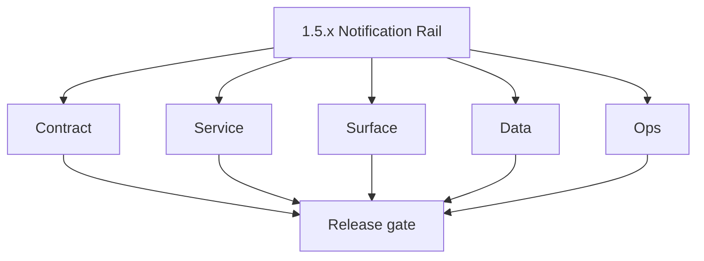
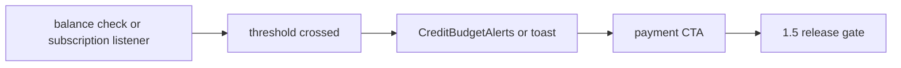

# Version 1.5 — Notification Rail

- **Status:** planned  
- **Codename:** Notification Rail  
- **Era:** 1.x  
- **Roadmap:** Stage **1.5** — low-credit + payment-success cues (minimal; not full email automation)  
- **Summary:** **Threshold-driven** cues: credit budget component in layout, **toast** on payment success, hooks to drive user toward **billing** without spamming.  
- **Patch closure:** Every codenamed patch file includes **Micro-gate** + **Service task slices**. Era hub: [`versions.md`](../versions.md).

## Scope

- **Target:** `1.5.x` — reliable **notification** semantics tied to credit state changes.

## Flowchart

### Runtime focus (unique to this minor)

## Task tracks

### Contract

- 📌 Planned: Optional `notifications` GraphQL or client-only cues — document source of truth.

### Service

- 📌 Planned: Server pushes **accurate** balance after billing approve (avoid stale client).

### Surface

- 📌 Planned: `CreditBudgetAlerts` via `MainLayout`; payment modal success feedback.

### Data

- 📌 Planned: No duplicate notification state; idempotent “low credit shown once per session” policy.

### Ops

- 📌 Planned: Monitor false-positive rate (KPI: notification correctness).

## Task Breakdown

- Governance **1.5** pointers.

## Immediate next execution queue

- 📌 Planned: Test: drop below threshold → alert; refill → dismiss.

## Cross-service ownership

| Owner | Role |
| --- | --- |
| Frontend | Alerts + toasts |
| API | Balance freshness |

## References

- [`docs/governance.md`](../governance.md)  
- [`docs/roadmap.md`](../roadmap.md) — 1.5

## Backend API and Endpoint Scope

- `usage`, `billing` reads; optional notification preferences later.

## Database and Data Lineage Scope

- Client state only unless persisting notification prefs.

## Frontend UX Surface Scope

- Main layout, billing success path.

## UI Elements Checklist

- 📌 Planned: Alert banner / chip  
- 📌 Planned: Dismiss / snooze if product allows  
- 📌 Planned: Success toast on payment  

## Flow / Graph Delta for This Minor

- **Delta:** User **pulled** to billing via proactive cues — orthogonal to ledger UI (`1.4`).

## Audit and Compliance Notes

- Do not leak **other users’** billing state in shared components.

## Patch ladder (`1.5.0` – `1.5.9`)

### Micro-gate reference (apply at every `1.N.P`)

| Track | Gate question (must answer Yes or document waiver) |
| --- | --- |
| **Contract** | Did any GraphQL / REST contract change? Diff vs `docs/backend/apis/`; billing idempotency keys documented? |
| **Service** | Auth, credit deduction, and billing paths still smoke for affected services? |
| **Surface** | App, admin, root, or extension billing UX changed? Role + entitlement checks? |
| **Frontend** | Which routes/components apply for this minor (see **Frontend UX Surface Scope**)? |
| **Data** | Migrations or lineage for credits, subscriptions, usage/ledger, payment proofs? |
| **Ops** | Observability, rollback, secrets; fraud/abuse runbooks where relevant? |

**Patch intent bands:** `.0` charter · `.1`–`.2` P0-heavy **Service task slices** · `.3`–`.6` P1 / surface-data · `.7`–`.9` ops + minor freeze.

Theme: **Signal**.

| Patch | Codename | Focus |
| --- | --- | --- |
| `1.5.0` | Pulse | Charter |
| `1.5.1` | Wave | Threshold rules |
| `1.5.2` | Frequency | Debounce |
| `1.5.3` | Trigger | Low credit |
| `1.5.4` | Dispatch | Payment success |
| `1.5.5` | Relay | Layout wiring |
| `1.5.6` | Notify | Component polish |
| `1.5.7` | Confirm | User ack |
| `1.5.8` | Quiet | Suppress rules |
| `1.5.9` | Silence | Freeze |

### 1.5.0 — Pulse (Charter)

**Contract**

- Define “low-credit” cue semantics and their UI entry points:
  - threshold derived from remaining credits (prefer `usage(feature)` / server-derived remaining).
- Define “payment success” cue semantics after admin approval:
  - gateway state refreshed so credits reflect ledger reality.

**Service**

- Ensure balance refresh after billing approve so the success toast is consistent with credit updates.

**Surface**

- Place `CreditBudgetAlerts` in the app layout (via `MainLayout`) and wire success feedback to the billing flow.
- Billing UI success cue uses `PaymentModal` flow (“Admin approves → credits added automatically”).

**Data**

- MVP can keep notification display state ephemeral (session-scoped); optional: later wire `NotificationPreferences`.

**Ops**

- KPI note: correctness of alerting (false positives/false negatives) before moving to `1.6`.

Codebases: `[appointment360][app]`

### 1.5.1 — Wave (Threshold rules)

**Contract**

- Define threshold bands:
  - remaining > 50% (green), 20–50% (amber), < 20% (red), consistent with usage/credit progress display.

**Service**

- Compute threshold state from server-derived remaining/limit values (no stale client-only math).

**Surface**

- Update `CreditBudgetAlerts` display state for each band.

**Data**

- Keep the threshold function stable across refresh so UI isn’t jittery.

**Ops**

- Test threshold boundary values (exact 50%, 20%, 0).

Codebases: `[appointment360][app]`

### 1.5.2 — Frequency (Debounce)

**Contract**

- Debounce/dedupe policy:
  - “show low-credit alert once per session” (or once per credit spend action) for MVP.

**Service**

- Ensure alert generation isn’t triggered repeatedly during intermediate refreshes.

**Surface**

- UI does not spam: alert components and toasts are rate-limited client-side (or gated by response changes).

**Data**

- Track suppression scope (session-scoped key) if no persistence is used.

**Ops**

- Test: repeated polling/refetch does not create duplicate alerts.

Codebases: `[app]`

### 1.5.3 — Trigger (Low credit)

**Contract**

- Define trigger condition:
  - when usage/remaining crosses into low-credit band.

**Service**

- Ensure trigger uses `usage(feature)`/credits remaining (authoritative).

**Surface**

- Trigger causes:
  - `CreditBudgetAlerts` visible state,
  - payment CTA deep-linking to `/billing`.

**Data**

- Ensure feature-key alignment between UI triggers and backend credit buckets.

**Ops**

- Edge test: credits reach threshold then drop again; cue triggers again only when warranted.

Codebases: `[appointment360][app]`

### 1.5.4 — Dispatch (Payment success)

**Contract**

- Define “payment success” dispatch event:
  - emitted after `approvePayment` crediting completes.
- Map to UI feedback:
  - payment success toast (billing page path).

**Service**

- After approval, ensure credit ledger update completes before user-facing success cue is shown.

**Surface**

- `PaymentModal` shows “pending review” then success state after approval; toast shown once per approval.

**Data**

- Optional traceability:
  - include request/trace id so the UI can correlate to the correct state change.

**Ops**

- KPI: success-to-UI update time; verify under slow network conditions.

Codebases: `[appointment360][admin][app][logsapi]`

### 1.5.5 — Relay (Layout wiring)

**Contract**

- Wire cues to `MainLayout` so every relevant page receives the same alert context.

**Service**

- Ensure layout can pull remaining/threshold state consistently (via hooks that refetch when needed).

**Surface**

- Confirm component placement:
  - `CreditBudgetAlerts` in layout,
  - payment CTA targets billing surfaces.

**Data**

- Ensure no user leakage between auth sessions in shared layout components.

**Ops**

- Smoke: open billing page, approve payment, confirm toast/alerts appear on subsequent navigation.

Codebases: `[app]`

### 1.5.6 — Notify (Component polish)

**Contract**

- Polish the alert component and toast patterns:
  - avoid inconsistent copy,
  - avoid mismatched icons/colors across alert/CTA.

**Service**

- Ensure alert states are derived from the same server payload shape.

**Surface**

- Component uses consistent UI primitives (Alert/Badge/Toast patterns already used in the app).

**Data**

- Optional: align “acknowledged” behavior with later notification persistence.

**Ops**

- Visual regression smoke for 3 threshold bands.

Codebases: `[app]`

### 1.5.7 — Confirm (User ack)

**Contract**

- Define user acknowledgement:
  - dismiss/snooze low-credit cue (MVP) or mark as read (if using notifications persistence later).

**Service**

- If persistent later: use `markNotificationAsRead` / `markNotificationsAsRead` mutations.

**Surface**

- Dismiss interaction confirmed by UI state change.

**Data**

- Session-scoped suppression key updated on ack.

**Ops**

- Test: ack suppresses cue until next meaningful credit change.

Codebases: `[app][appointment360]`

### 1.5.8 — Quiet (Suppress rules)

**Contract**

- Define additional suppression:
  - don’t show low-credit cue while the user is already on the billing page (optional MVP rule).

**Service**

- Ensure suppression doesn’t interfere with critical auth failures or billing state correctness.

**Surface**

- Suppression rules evaluated with routing awareness.

**Data**

- No new DB requirements for MVP; keep suppression ephemeral.

**Ops**

- Regression: verify billing page still shows payment and proof flows even when alerts suppressed.

Codebases: `[app]`

### 1.5.9 — Silence (Freeze)

**Contract**

- Freeze notification cue semantics for `1.6` admin workflows:
  - ensure no contract drift in the payload shape driving `CreditBudgetAlerts`.

**Service**

- Integration gates: layout wiring and threshold cue logic remains stable.

**Surface**

- Final freeze checklist: cues display correctly across auth/navigation.

**Data**

- No schema changes required for this minor’s MVP notification rail.

**Ops**

- Sign-off before `1.6 Admin Control Plane`.

Codebases: `[appointment360][app]`

## Release Gate and Evidence

### Master Task Checklist

- 📌 Planned: KPI note

### Backend API and Endpoints

- 📌 Planned: balance refresh contract

### Database and Data Lineage

- 📌 Planned: N/A or prefs

### Frontend UX

- 📌 Planned: screen record

### UI Elements

- 📌 Planned: checklist

### Flow and Graph

- 📌 Planned: ok

### Validation

- 📌 Planned: edge thresholds

### Release Gate

- 📌 Planned: `1.6`

## Patches

| Patch | Codename | Doc |
| --- | --- | --- |
| `1.5.0` | Pulse | [`1.5.0` — Pulse](1.5.0 — Pulse.md) |
| `1.5.1` | Wave | [`1.5.1` — Wave](1.5.1 — Wave.md) |
| `1.5.2` | Frequency | [`1.5.2` — Frequency](1.5.2 — Frequency.md) |
| `1.5.3` | Trigger | [`1.5.3` — Trigger](1.5.3 — Trigger.md) |
| `1.5.4` | Dispatch | [`1.5.4` — Dispatch](1.5.4 — Dispatch.md) |
| `1.5.5` | Relay | [`1.5.5` — Relay](1.5.5 — Relay.md) |
| `1.5.6` | Notify | [`1.5.6` — Notify](1.5.6 — Notify.md) |
| `1.5.7` | Confirm | [`1.5.7` — Confirm](1.5.7 — Confirm.md) |
| `1.5.8` | Quiet | [`1.5.8` — Quiet](1.5.8 — Quiet.md) |
| `1.5.9` | Silence | [`1.5.9` — Silence](1.5.9 — Silence.md) |
