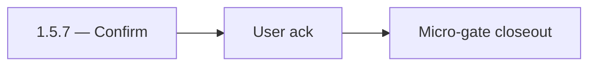

# 1.5.7 — Confirm

- **Era:** `1.x` User/billing/credit — hub [`versions.md`](../versions.md) · minors start at [`1.0 — User Genesis`](1.0%20%E2%80%94%20User%20Genesis.md)
- **Minor:** [1.5 — Notification Rail](./1.5 — Notification Rail.md)
- **Codename:** Confirm
- **Status:** planned

## Focus
User ack

## Flowchart

## Micro-gate

| Track | Gate question | Answer / Evidence (fill at patch closeout) |
| --- | --- | --- |
| **Contract** | GraphQL / REST changes? Diff vs `docs/backend/apis/` or task pack; billing idempotency keys if mutations touched. | Document at patch closeout. |
| **Service** | Auth, credit deduction, billing state machine, and downstream Lambdas still pass smoke? | Document smoke paths. |
| **Surface** | App / admin / root / extension billing UX changed? Role + entitlement checks? | Document UX delta or N/A. |
| **Frontend** | Which routes/components must render or change for this patch? | Notification / low-credit cues in `MainLayout`. Document at closeout. |
| **Data** | `credits`, `subscriptions`, `plans`, `payment_submissions`, usage/ledger — migrations + lineage? | Document migrations/lineage or N/A. |
| **Ops** | Billing observability, rollback, secret rotation; fraud/abuse delta for `1.10` patches. | Document ops delta or N/A. |

## Tasks
### Contract
- Define user acknowledgement:
  - dismiss/snooze low-credit cue (MVP) or mark as read (if using notifications persistence later).

### Service
- If persistent later: use `markNotificationAsRead` / `markNotificationsAsRead` mutations.

### Surface
- Dismiss interaction confirmed by UI state change.

### Data
- Session-scoped suppression key updated on ack.

### Ops
- Test: ack suppresses cue until next meaningful credit change.

Codebases: `[app][appointment360]`

## Service task slices
> Merged from era `1.x` user/billing task packs (P0→`.0`–`.2`, P1→`.3`–`.6`, Ops→`.7`–`.9`).

### Appointment360 (gateway)
- Wire GraphQL Idempotency-Key to billing mutations in Postman collection
- Write test: login → me → logout → me → error flow
- Write test: register → consume credit → query usage → low-credit guard

### logs.api
- Add observability checks and release validation evidence for era `1.x`.
- Capture rollback and incident-runbook notes for logging-impacting releases.

## Evidence gate
Patch closeout includes contract diff, smoke output, data lineage delta, and ops note
