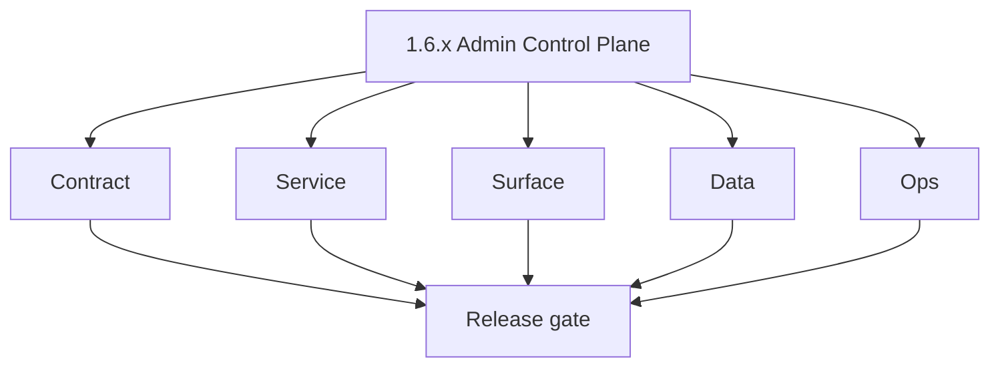
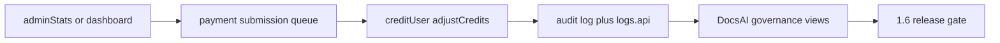

# Version 1.6 — Admin Control Plane

- **Status:** planned  
- **Codename:** Admin Control Plane  
- **Era:** 1.x  
- **Roadmap:** Stage **1.6** — admin analytics/control, payment review, credit/package adjustments  
- **Summary:** **DocsAI / Django admin** + GraphQL **admin** module: `paymentSubmissions`, **approvePayment** / **declinePayment**, **creditUser** / **adjustCredits**, with **audit** completeness.  
- **Patch closure:** Every codenamed patch file includes **Micro-gate** + **Service task slices**. Era hub: [`versions.md`](../versions.md).

## Scope

- **Target:** `1.6.x` — operators can **correct** user state safely with full audit trail.

## Flowchart

### Runtime focus (unique to this minor)

## Task tracks

### Contract

- 📌 Planned: Admin-only resolvers; **`require_admin`** guards.

### Service

- 📌 Planned: `admin_client.py` actions match GraphQL mutations.

### Surface

- 📌 Planned: Admin templates; payment list approve/decline.

### Data

- 📌 Planned: Every adjustment writes **actor**, **reason**, **before/after**.

### Ops

- 📌 Planned: Runbook for mistaken credit grant reversal process.

## Task Breakdown

- Governance **1.6** code map.

## Immediate next execution queue

- 📌 Planned: Pen-test: non-admin cannot call admin mutations.

## Cross-service ownership

| Owner | Role |
| --- | --- |
| Governance | DocsAI sync |
| Platform | GraphQL admin |
| Security | RBAC audit |

## References

- [`docs/governance.md`](../governance.md)  
- [`docs/docsai-sync.md`](../docsai-sync.md)  
- [`docs/codebases/admin-codebase-analysis.md`](../codebases/admin-codebase-analysis.md)

## Backend API and Endpoint Scope

- `AdminQuery`, `AdminMutation`, billing approve paths.

## Database and Data Lineage Scope

- Payment submissions, credit adjustments, audit tables.

## Frontend UX Surface Scope

- `contact360.io/admin` primarily; not main app.

## UI Elements Checklist

- 📌 Planned: Submission table  
- 📌 Planned: Approve / decline with reason  
- 📌 Planned: Credit adjust form  

## Flow / Graph Delta for This Minor

- **Delta:** Introduces **operator** control plane — highest privilege; must pair with `1.7` rate limits for public GraphQL.

## Audit and Compliance Notes

- Mandatory audit events per [`docs/audit-compliance.md`](../audit-compliance.md); **DocsAI** mirrors `architecture.md` / `roadmap.md`.

## Patch ladder (`1.6.0` – `1.6.9`)

### Micro-gate reference (apply at every `1.N.P`)

| Track | Gate question (must answer Yes or document waiver) |
| --- | --- |
| **Contract** | Did any GraphQL / REST contract change? Diff vs `docs/backend/apis/`; billing idempotency keys documented? |
| **Service** | Auth, credit deduction, and billing paths still smoke for affected services? |
| **Surface** | App, admin, root, or extension billing UX changed? Role + entitlement checks? |
| **Frontend** | Which routes/components apply for this minor (see **Frontend UX Surface Scope**)? |
| **Data** | Migrations or lineage for credits, subscriptions, usage/ledger, payment proofs? |
| **Ops** | Observability, rollback, secrets; fraud/abuse runbooks where relevant? |

**Patch intent bands:** `.0` charter · `.1`–`.2` P0-heavy **Service task slices** · `.3`–`.6` P1 / surface-data · `.7`–`.9` ops + minor freeze.

Theme: **Dial**.

| Patch | Codename | Focus |
| --- | --- | --- |
| `1.6.0` | Switch | Charter |
| `1.6.1` | Lever | RBAC |
| `1.6.2` | Panel | Admin UI shell |
| `1.6.3` | Override | Emergency adjust |
| `1.6.4` | Grant | Positive credit |
| `1.6.5` | Revoke | Negative adjust |
| `1.6.6` | Audit | log pipeline |
| `1.6.7` | Log | logs.api |
| `1.6.8` | Report | exports |
| `1.6.9` | Close | Freeze |

### 1.6.0 — Switch (Charter)

**Contract**

- Admin control plane contract is defined:
  - admin query surfaces (`AdminQuery.users`, `AdminQuery.userStats`, etc.),
  - admin mutation surfaces (`AdminMutation.creditUser`, `AdminMutation.adjustCredits`, plus payment approve/decline paths).

**Service**

- Enforce admin-only access checks for all admin operations (RBAC guard correctness is MVP).

**Surface**

- Admin UI shell loads:
  - admin console navigation,
  - base templates and payment/user management surfaces.

**Data**

- Ensure audit fields exist for any adjustment:
  - actor id and reason are persisted for downstream evidence.

**Ops**

- Smoke: admin can view a user list and perform a no-op adjustment review path without breaking RBAC.

Codebases: `[admin][appointment360][logsapi]`

### 1.6.1 — Lever (RBAC)

**Contract**

- RBAC contract:
  - `require_admin` is applied to admin mutations,
  - non-admin access is denied consistently.

**Service**

- Verify role mapping between JWT claims and admin guards:
  - admin vs superadmin behavior aligns with auth docs.

**Surface**

- UI hides/blocks actions:
  - approve/decline buttons,
  - credit adjustment form inputs.

**Data**

- Audit actions record the correct actor (admin user uuid).

**Ops**

- Pen-test gate:
  - non-admin cannot call `creditUser` / `adjustCredits`.

Codebases: `[appointment360][admin]`

### 1.6.2 — Panel (Admin UI shell)

**Contract**

- Define UI contract for the admin shell:
  - data tables require stable IDs, pagination, and row-level actions.

**Service**

- Admin client calls map to gateway operations (appointments module + billing/admin module operations).

**Surface**

- Admin templates include:
  - user management table,
  - credit adjust modal inputs (`credit-amount`, `credit-reason`),
  - payment submissions review table.

**Data**

- Table data aligns with admin query response shape and logs evidence.

**Ops**

- UI smoke:
  - admin navigates between tabs and sees consistent data refresh.

Codebases: `[admin][appointment360]`

### 1.6.3 — Override (Emergency adjust)

**Contract**

- Define emergency adjustment semantics:
  - allowed mutation types (`creditUser`, `adjustCredits`) and required reason fields.

**Service**

- Ensure adjustments are safe:
  - write actor/reason/before-after atomically,
  - restrict negative/positive adjust behaviors to authorized use-cases.

**Surface**

- Admin provides clear confirmation steps (disable “submit” until reason exists if required).

**Data**

- `credits` ledger and any related adjustment records reconcile with subsequent `usage(feature)` reads.

**Ops**

- Test “emergency adjust” path:
  - wrong reason still blocked (if policy),
  - correct adjustment shows updated remaining credits.

Codebases: `[appointment360][admin]`

### 1.6.4 — Grant (Positive credit)

**Contract**

- Define positive credit adjustment contract:
  - update credits total/consumed per adjustment policy,
  - ensure idempotency if admin double-submits.

**Service**

- Implement/validate positive credit mutation:
  - writes audit event and updates ledger in a single transaction.

**Surface**

- Admin credit adjust modal shows “before/after” preview (if available) and confirms completion.

**Data**

- Credits ledger updates reconcile with usage query outputs.

**Ops**

- Smoke test:
  - grant for a user results in increased remaining credits immediately.

Codebases: `[appointment360][logsapi][admin]`

### 1.6.5 — Revoke (Negative adjust)

**Contract**

- Define negative adjustment semantics:
  - cannot reduce below 0 unless policy allows,
  - requires reason and actor.

**Service**

- Implement/validate negative credit adjustment:
  - ensures ledger invariants remain correct.

**Surface**

- Admin UI shows post-adjust state and handles failure with safe error messages.

**Data**

- Ensure no orphaned payment_submissions/review states if adjustment relates to payment.

**Ops**

- Negative test:
  - attempt invalid negative adjust and confirm no ledger changes occur.

Codebases: `[appointment360][admin]`

### 1.6.6 — Audit (log pipeline)

**Contract**

- Define audit event requirements for credit adjustments and payment decisions:
  - include actor, reason, submission_id when relevant.

**Service**

- Ensure audit pipeline emits logs events on adjustment completion.

**Surface**

- Provide admin UX hooks to view “why” for changes (at least via trace/log identifiers).

**Data**

- Ensure logs/audit evidence references stable IDs (user_uuid, submission_id).

**Ops**

- Evidence test:
  - adjustment produces one audit log entry and is queryable.

Codebases: `[logsapi][appointment360][admin]`

### 1.6.7 — Log (logs.api)

**Contract**

- Freeze logs.api S3 CSV event category naming for admin actions:
  - billing/payment approval events and credit.deduct/adjust events.

**Service**

- Verify correct mapping from gateway audit events to logs.api ingestion schema.

**Surface**

- Admin logs view (if exposed) can retrieve events by user/submission id.

**Data**

- Ensure logs retention and privacy constraints are respected:
  - proof artifacts aren’t duplicated (store only S3 keys/urls).

**Ops**

- Queryability test:
  - search for adjustment events and verify results within time window.

Codebases: `[logsapi][appointment360][admin]`

### 1.6.8 — Report (exports)

**Contract**

- Define exports/report contracts:
  - admin can request aggregated exports of billing/auth/admin evidence.

**Service**

- Ensure export jobs (or report generation routines) read the same evidence sources (ledger + logs).

**Surface**

- Admin UI exposes report/export buttons with correct feedback and download states.

**Data**

- Ensure report output includes correlation ids and does not include PII beyond allowed fields.

**Ops**

- Smoke:
  - generate and validate one export after an adjustment.

Codebases: `[admin][appointment360][logsapi]`

### 1.6.9 — Close (Freeze)

**Contract**

- Freeze admin control-plane contract so `1.7` rate limiting can be tuned without drift.

**Service**

- Integration gates:
  - RBAC + adjustments + audit/log emission all remain green.

**Surface**

- Admin walkthrough smoke:
  - approve/decline and credit adjust flows operate end-to-end.

**Data**

- Evidence sample rows remain consistent after freeze.

**Ops**

- Release sign-off: ready for security hardening and later ops exit gate.

Codebases: `[appointment360][admin][logsapi]`

## Release Gate and Evidence

### Master Task Checklist

- 📌 Planned: Audit sample attached

### Backend API and Endpoints

- 📌 Planned: admin matrix

### Database and Data Lineage

- 📌 Planned: adjustment row example

### Frontend UX

- 📌 Planned: admin walkthrough

### UI Elements

- 📌 Planned: checklist

### Flow and Graph

- 📌 Planned: reviewed

### Validation

- 📌 Planned: RBAC tests

### Release Gate

- 📌 Planned: `1.7`

## Patches

| Patch | Codename | Doc |
| --- | --- | --- |
| `1.6.0` | Switch | [`1.6.0` — Switch](1.6.0 — Switch.md) |
| `1.6.1` | Lever | [`1.6.1` — Lever](1.6.1 — Lever.md) |
| `1.6.2` | Panel | [`1.6.2` — Panel](1.6.2 — Panel.md) |
| `1.6.3` | Override | [`1.6.3` — Override](1.6.3 — Override.md) |
| `1.6.4` | Grant | [`1.6.4` — Grant](1.6.4 — Grant.md) |
| `1.6.5` | Revoke | [`1.6.5` — Revoke](1.6.5 — Revoke.md) |
| `1.6.6` | Audit | [`1.6.6` — Audit](1.6.6 — Audit.md) |
| `1.6.7` | Log | [`1.6.7` — Log](1.6.7 — Log.md) |
| `1.6.8` | Report | [`1.6.8` — Report](1.6.8 — Report.md) |
| `1.6.9` | Close | [`1.6.9` — Close](1.6.9 — Close.md) |
