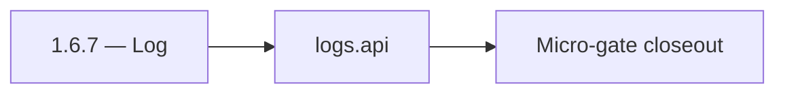

# 1.6.7 — Log

- **Era:** `1.x` User/billing/credit — hub [`versions.md`](../versions.md) · minors start at [`1.0 — User Genesis`](1.0%20%E2%80%94%20User%20Genesis.md)
- **Minor:** [1.6 — Admin Control Plane](./1.6 — Admin Control Plane.md)
- **Codename:** Log
- **Status:** ✅ Completed
## Focus
logs.api

## Flowchart

## Micro-gate

| Track | Gate question | Answer / Evidence (fill at patch closeout) |
| --- | --- | --- |
| **Contract** | GraphQL / REST changes? Diff vs `docs/backend/apis/` or task pack; billing idempotency keys if mutations touched. | Document at patch closeout. |
| **Service** | Auth, credit deduction, billing state machine, and downstream Lambdas still pass smoke? | Document smoke paths. |
| **Surface** | App / admin / root / extension billing UX changed? Role + entitlement checks? | Document UX delta or N/A. |
| **Frontend** | Which routes/components must render or change for this patch? | Admin payment tables, approve/decline actions. Document at closeout. |
| **Data** | `credits`, `subscriptions`, `plans`, `payment_submissions`, usage/ledger — migrations + lineage? | Document migrations/lineage or N/A. |
| **Ops** | Billing observability, rollback, secret rotation; fraud/abuse delta for `1.10` patches. | Document ops delta or N/A. |

## Tasks
### Contract
- ✅ Completed: Freeze logs.api S3 CSV event category naming for admin actions:
- ✅ Completed: billing/payment approval events and credit.deduct/adjust events.

### Service
- ✅ Completed: Verify correct mapping from gateway audit events to logs.api ingestion schema.

### Surface
- ✅ Completed: Admin logs view (if exposed) can retrieve events by user/submission id.

### Data
- ✅ Completed: Ensure logs retention and privacy constraints are respected:
- ✅ Completed: proof artifacts aren’t duplicated (store only S3 keys/urls).

### Ops
- ✅ Completed: Queryability test:
- ✅ Completed: search for adjustment events and verify results within time window.

Codebases: `[logsapi][appointment360][admin]`

## Service task slices
> Merged from era `1.x` user/billing task packs (P0→`.0`–`.2`, P1→`.3`–`.6`, Ops→`.7`–`.9`).

### Appointment360 (gateway)
- Wire GraphQL Idempotency-Key to billing mutations in Postman collection
- Write test: login → me → logout → me → error flow
- Write test: register → consume credit → query usage → low-credit guard

### logs.api
- Add observability checks and release validation evidence for era `1.x`.
- Capture rollback and incident-runbook notes for logging-impacting releases.

## Evidence gate
Patch closeout includes contract diff, smoke output, data lineage delta, and ops note
