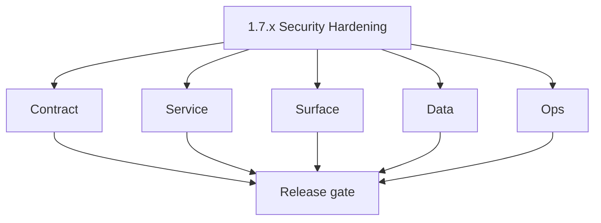
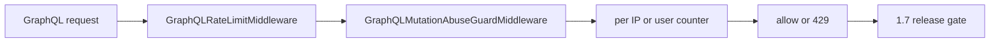

# Version 1.7 — Security Hardening

- **Status:** ✅ Completed
- **Codename:** Security Hardening
- **Era:** 1.x
- **Roadmap:** Stage **1.7** — baseline **GraphQL rate limiting** and abuse resistance
- **Summary:** Enable and tune **`GraphQLRateLimitMiddleware`**, align with **`GraphQLMutationAbuseGuardMiddleware`**, ensure **429** behavior is safe for dashboard + extension clients.
- **Patch closure:** Every codenamed patch file includes **Micro-gate** + **Service task slices**. Era hub: [`versions.md`](../versions.md).

## Scope

- **Target:** `1.7.x` — `GRAPHQL_RATE_LIMIT_REQUESTS_PER_MINUTE` > 0 in non-dev; document bypass for health.

## Flowchart

### Runtime focus (unique to this minor)

## Task tracks

### Contract

- ✅ Completed: ✅ Completed: 📌 Planned: Document **rate-limit** error in GraphQL extensions; client retry guidance.

- ✅ Completed: 📌 Planned: **[appointment360]** — refine duplicate task (was: 📌 planned: **[architecture]** — product **graphql** remains …) | patch `1.7.0` band `0` | reason: specialize this file vs sibling patches; see docs/codebases/appointment360-codebase-analysis.md
### Service

- ✅ Completed: ✅ Completed: 📌 Planned: Redis or in-memory store consistent across Lambda/EC2 deploy target.
- ✅ Completed: ✅ Completed: 📌 Planned: Whitelist internal health / introspection policy.

- ✅ Completed: 📌 Planned: **[appointment360]** — refine duplicate task (was: 📌 planned: **[architecture]** — **go/gin satellites** in sco…) | patch `1.7.0` band `0` | reason: specialize this file vs sibling patches; see docs/codebases/appointment360-codebase-analysis.md
### Surface

- ✅ Completed: ✅ Completed: 📌 Planned: App: backoff on 429; user-friendly message.

- ✅ Completed: 📌 Planned: **[appointment360]** — refine duplicate task (was: 📌 planned: **[architecture]** — **next.js** customer surface…) | patch `1.7.0` band `0` | reason: specialize this file vs sibling patches; see docs/codebases/appointment360-codebase-analysis.md
### Data

- ✅ Completed: ✅ Completed: 📌 Planned: Optional persistence of block events to logs.api.

- ✅ Completed: 📌 Planned: **[appointment360]** — refine duplicate task (was: 📌 planned: **[architecture]** — **postgresql-first** per `do…) | patch `1.7.0` band `0` | reason: specialize this file vs sibling patches; see docs/codebases/appointment360-codebase-analysis.md
### Ops

- ✅ Completed: ✅ Completed: 📌 Planned: Tune limits per environment; alert on abuse spike vs legit traffic drop.

- ✅ Completed: 📌 Planned: **[appointment360]** — refine duplicate task (was: 📌 planned: **[architecture]** — **observability**: correlate…) | patch `1.7.0` band `0` | reason: specialize this file vs sibling patches; see docs/codebases/appointment360-codebase-analysis.md
## Task Breakdown

- [`docs/governance.md`](../governance.md) — 1.7 code map (`middleware.py`).

## Immediate next execution queue

- 📌 Planned: Load test: rate limit triggers before DB exhaustion.

## Cross-service ownership

| Owner | Role |
| --- | --- |
| Platform API | Middleware |
| Frontend | Client handling |
| Security | Policy |

## References

- [`docs/codebases/appointment360-codebase-analysis.md`](../codebases/appointment360-codebase-analysis.md) — middleware stack

## Backend API and Endpoint Scope

- Gateway middleware only; no new product schema required.

## Database and Data Lineage Scope

- Optional counters in Redis; not PostgreSQL by default.

## Frontend UX Surface Scope

- Error toast, retry-after UX.

## UI Elements Checklist

- 📌 Planned: Rate limit message
- 📌 Planned: Optional countdown

## Flow / Graph Delta for This Minor

- **Delta:** Moves gateway from “open by default” to **prod-safe** throttling — complements `0.4` RBAC.

## Audit and Compliance Notes

- Log **rate_limited** events with **request_id**; avoid logging full JWT.

## Patch ladder (`1.7.0` – `1.7.9`)

### Micro-gate reference (apply at every `1.N.P`)

| Track | Gate question (must answer Yes or document waiver) |
| --- | --- |
| **Contract** | Did any GraphQL / REST contract change? Diff vs `docs/backend/apis/`; billing idempotency keys documented? |
| **Service** | Auth, credit deduction, and billing paths still smoke for affected services? |
| **Surface** | App, admin, root, or extension billing UX changed? Role + entitlement checks? |
| **Frontend** | Which routes/components apply for this minor (see **Frontend UX Surface Scope**)? |
| **Data** | Migrations or lineage for credits, subscriptions, usage/ledger, payment proofs? |
| **Ops** | Observability, rollback, secrets; fraud/abuse runbooks where relevant? |
| **Architecture** | Go/Gin satellites only via Python GraphQL gateway (`contact360.io/api`); Next.js `NEXT_PUBLIC_GRAPHQL_URL`; Postgres-first / Redis exit per `docs/docs/data-stores-postgres.md`. |

**Patch intent bands:** `.0` charter · `.1`–`.2` P0-heavy **Service task slices** · `.3`–`.6` P1 / surface-data · `.7`–`.9` ops + minor freeze.

Theme: **Shield**.

| Patch | Codename | Focus |
| --- | --- | --- |
| `1.7.0` | Wall | Charter |
| `1.7.1` | Filter | Path rules |
| `1.7.2` | Guard | User vs IP key |
| `1.7.3` | Rate | Limit values |
| `1.7.4` | Throttle | 429 body |
| `1.7.5` | Block | Abuse patterns |
| `1.7.6` | Allow | Whitelist |
| `1.7.7` | Score | Heuristics optional |
| `1.7.8` | Warn | Observability |
| `1.7.9` | Harden | Freeze |

### 1.7.0 — Wall (Charter)

**Contract**

- Define throttling contract for public GraphQL:
  - `GraphQLRateLimitMiddleware` governs `/graphql`,
  - define config key `GRAPHQL_RATE_LIMIT_REQUESTS_PER_MINUTE` semantics.

**Service**

- Confirm middleware composes correctly with:
  - `GraphQLMutationAbuseGuardMiddleware`,
  - `GraphQLIdempotencyMiddleware`.

**Surface**

- App provides error toast + user-friendly “try again” guidance for rate limits.

**Data**

- Optional: define whether block events are persisted (later in logs.api) or kept transient.

**Ops**

- Baseline test that 429 triggers before DB exhaustion (no cascading failures).

Codebases: `[appointment360][app]`

### 1.7.1 — Filter (Path rules)

**Contract**

- Define path rules:
  - apply rate limit only to `/graphql` and potentially admin/internal endpoints as required.

**Service**

- Ensure rate-limit middleware doesn’t block health probes or introspection endpoints.

**Surface**

- Ensure internal UI calls (dashboard loads) are not affected unexpectedly.

**Data**

- N/A (middleware-layer change).

**Ops**

- Smoke: health endpoints still respond under burst.

Codebases: `[appointment360]`

### 1.7.2 — Guard (User vs IP key)

**Contract**

- Define rate-limit keying strategy:
  - per IP and/or per authenticated user UUID.

**Service**

- Ensure key extraction is consistent for both:
  - authenticated requests,
  - unauthenticated requests.

**Surface**

- Ensure user-facing behavior is consistent across auth states.

**Data**

- Optional counters store strategy (e.g., Redis vs in-memory).

**Ops**

- Validate that abuse from one user doesn’t starve other legitimate users.

Codebases: `[appointment360][app]`

### 1.7.3 — Rate (Limit values)

**Contract**

- Define numeric limits per environment:
  - dev/prod/test differences documented.

**Service**

- Configure limits so that typical dashboard usage stays under threshold.

**Surface**

- UI retry behavior respects throttle intervals.

**Data**

- N/A.

**Ops**

- Burst test:
  - ensure 429 occurs only after expected request counts.

Codebases: `[appointment360]`

### 1.7.4 — Throttle (429 body)

**Contract**

- Define 429 error envelope shape:
  - include stable code and `Retry-After` guidance if present.

**Service**

- Ensure GraphQL error extensions are set consistently:
  - include request_id/trace_id for correlation.

**Surface**

- App shows countdown/optional retry UI.

**Data**

- No persistence required in this patch.

**Ops**

- Contract tests validate 429 shape for a sample blocked mutation.

Codebases: `[appointment360][app]`

### 1.7.5 — Block (Abuse patterns)

**Contract**

- Define which “high-risk mutations” are guarded by `GraphQLMutationAbuseGuardMiddleware` (based on policy list).

**Service**

- Ensure abuse guard behavior blocks malicious patterns without breaking legitimate billing/admin actions.

**Surface**

- UI: error toast should suggest retry later (no confusing generic failure).

**Data**

- Optional persist of block events to logs.api (policy decision).

**Ops**

- Load test with realistic mutation mix:
  - login/usage vs billing mutation attempts.

Codebases: `[appointment360][app]`

### 1.7.6 — Allow (Whitelist)

**Contract**

- Define whitelist of internal/health requests that bypass certain checks.

**Service**

- Implement whitelist safely (avoid bypassing billing/admin-critical endpoints).

**Surface**

- No user-facing changes besides improved stability.

**Data**

- N/A.

**Ops**

- Verify health/introspection still work under high load.

Codebases: `[appointment360]`

### 1.7.7 — Score (Heuristics optional)

**Contract**

- If heuristics are enabled, define what “score” influences:
  - block vs allow thresholds.

**Service**

- Ensure heuristic decisions are explainable via observability fields.

**Surface**

- No new UX required; only improves detection accuracy.

**Data**

- N/A.

**Ops**

- Test heuristic stability across deploy targets (EC2 vs Lambda).

Codebases: `[appointment360]`

### 1.7.8 — Warn (Observability)

**Contract**

- Define what gets logged for rate-limit / abuse events:
  - include `request_id`, actor identifiers, and mutation name (if safe).

**Service**

- Ensure logs are emitted consistently and do not include full JWT bodies.

**Surface**

- App error correlation:
  - optionally display request id in debug builds.

**Data**

- Optional: forward rate_limited events into logs.api (later queryable evidence).

**Ops**

- Validate log entries exist for a controlled 429 test.

Codebases: `[appointment360][logsapi]`

### 1.7.9 — Harden (Freeze)

**Contract**

- Freeze middleware behavior for 1.8 entitlement/time-based logic:
  - avoid changing 429 response shape post-freeze.

**Service**

- Integration gate: public GraphQL throttling + billing-critical mutation flow remain green.

**Surface**

- Client smoke on dashboard + billing pages with throttling enabled.

**Data**

- N/A.

**Ops**

- Release sign-off before moving to credit pack maturity.

Codebases: `[appointment360][app]`

## Release Gate and Evidence

### Master Task Checklist

- 📌 Planned: Config documented per env

### Backend API and Endpoints

- 📌 Planned: 429 contract

### Database and Data Lineage

- 📌 Planned: N/A

### Frontend UX

- 📌 Planned: Client smoke

### UI Elements

- 📌 Planned: checklist

### Flow and Graph

- 📌 Planned: middleware order verified

### Validation

- 📌 Planned: k6 or manual burst

### Release Gate

- 📌 Planned: `1.8`

## Patches

| Patch | Codename | Doc |
| --- | --- | --- |
| `1.7.0` | Wall | [`1.7.0` — Wall](1.7.0 — Wall.md) |
| `1.7.1` | Filter | [`1.7.1` — Filter](1.7.1 — Filter.md) |
| `1.7.2` | Guard | [`1.7.2` — Guard](1.7.2 — Guard.md) |
| `1.7.3` | Rate | [`1.7.3` — Rate](1.7.3 — Rate.md) |
| `1.7.4` | Throttle | [`1.7.4` — Throttle](1.7.4 — Throttle.md) |
| `1.7.5` | Block | [`1.7.5` — Block](1.7.5 — Block.md) |
| `1.7.6` | Allow | [`1.7.6` — Allow](1.7.6 — Allow.md) |
| `1.7.7` | Score | [`1.7.7` — Score](1.7.7 — Score.md) |
| `1.7.8` | Warn | [`1.7.8` — Warn](1.7.8 — Warn.md) |
| `1.7.9` | Harden | [`1.7.9` — Harden](1.7.9 — Harden.md) |
