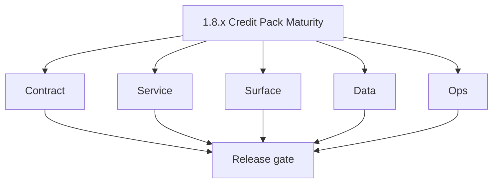
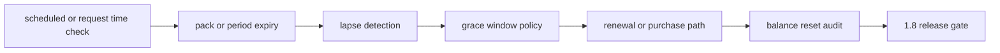

# Version 1.8 — Credit Pack Maturity

- **Status:** ✅ Completed
- **Codename:** Credit Pack Maturity  
- **Era:** 1.x  
- **Roadmap:** Post-**1.7** — **pack expiry**, **lapse**, **renewal**, **grace**  
- **Summary:** Product rules when **subscription or credit pack** ends: detect lapse, **grace period**, balance reset or rollover, **audit** events, user messaging.  
- **Patch closure:** Every codenamed patch file includes **Micro-gate** + **Service task slices**. Era hub: [`versions.md`](../versions.md).

## Scope

- **Target:** `1.8.x` — no silent loss of access; explicit states in API and UI.

## Flowchart

### Runtime focus (unique to this minor)

## Task tracks

### Contract

- ✅ Completed: 📌 Planned: GraphQL errors: `PACK_EXPIRED`, `GRACE_PERIOD` — document semantics.

### Service

- ✅ Completed: 📌 Planned: Cron or lazy check on **usage** / **billing** read; consistent with **deduction**.
- ✅ Completed: 📌 Planned: Idempotent lapse transition.

### Surface

- ✅ Completed: 📌 Planned: Renewal CTA; clear copy on **frozen** features.

### Data

- ✅ Completed: 📌 Planned: `subscriptions` / `credits.reset_at` or equivalent; migration evidence.

### Ops

- ✅ Completed: 📌 Planned: Reconciliation: users stuck in grace — playbook.

## Task Breakdown

- Cross-links: **billing** (`1.3`) + **notifications** (`1.5`).

## Immediate next execution queue

- 📌 Planned: Time-travel test: simulate expiry in staging.

## Cross-service ownership

| Owner | Role |
| --- | --- |
| API | Entitlement engine |
| App | UX states |
| Data | Schema |

## References

- [`docs/roadmap.md`](../roadmap.md) — 1.2 credit lapse narrative  
- **Service task slices** in `1.8.P` patch files (scope from former `appointment360-user-billing-task-pack.md`)

## Backend API and Endpoint Scope

- `billing`, `usage`, background tasks if any.

## Database and Data Lineage Scope

- subscriptions, credits, audit of state transitions.

## Frontend UX Surface Scope

- Locked feature overlays, renewal funnel.

## UI Elements Checklist

- 📌 Planned: Expiry banner  
- 📌 Planned: Countdown or date display  
- 📌 Planned: Renew button  

## Flow / Graph Delta for This Minor

- **Delta:** Time dimension on **credits** — not covered in static `1.0` ledger.

## Audit and Compliance Notes

- Log **lapse** and **renewal** with user id and prior balance.

## Patch ladder (`1.8.0` – `1.8.9`)

### Micro-gate reference (apply at every `1.N.P`)

| Track | Gate question (must answer Yes or document waiver) |
| --- | --- |
| **Contract** | Did any GraphQL / REST contract change? Diff vs `docs/backend/apis/`; billing idempotency keys documented? |
| **Service** | Auth, credit deduction, and billing paths still smoke for affected services? |
| **Surface** | App, admin, root, or extension billing UX changed? Role + entitlement checks? |
| **Frontend** | Which routes/components apply for this minor (see **Frontend UX Surface Scope**)? |
| **Data** | Migrations or lineage for credits, subscriptions, usage/ledger, payment proofs? |
| **Ops** | Observability, rollback, secrets; fraud/abuse runbooks where relevant? |

**Patch intent bands:** `.0` charter · `.1`–`.2` P0-heavy **Service task slices** · `.3`–`.6` P1 / surface-data · `.7`–`.9` ops + minor freeze.

Theme: **Bundle**.

| Patch | Codename | Focus |
| --- | --- | --- |
| `1.8.0` | Pack | Charter |
| `1.8.1` | Tier | Plan rules |
| `1.8.2` | Quota | Limits |
| `1.8.3` | Expiry | Detection |
| `1.8.4` | Lapse | State machine |
| `1.8.5` | Renewal | Purchase |
| `1.8.6` | Grace | Window |
| `1.8.7` | Reset | Balance |
| `1.8.8` | Archive | History |
| `1.8.9` | Rotate | Key/policy refresh |

### 1.8.0 — Pack (Charter)

**Contract**

- Define entitlement errors and semantics:
  - `PACK_EXPIRED`,
  - `GRACE_PERIOD`.
- Contract states what API/UI actions are allowed in each state (expired vs grace vs active).

**Service**

- Implement entitlement engine with time dimension:
  - derive state from `subscriptions.billing_period_end` and/or `credits.reset_at`.

**Surface**

- Add expiry UX:
  - expiry banner,
  - countdown/date display,
  - renew button CTA.

**Data**

- Validate state lineage:
  - `subscriptions.status` transitions,
  - `credits.reset_at` updates.

**Ops**

- Policy evidence:
  - time simulation for activation → expiry → grace boundaries and reconciliation notes.

Codebases: `[appointment360][app][jobs]`

### 1.8.1 — Tier (Plan rules)

**Contract**

- Define plan-tier rule mapping on expiry:
  - which features freeze,
  - which features remain during grace.

**Service**

- Apply plan rules consistently:
  - align `plans.limits` JSON with feature-key gating.

**Surface**

- Locked feature overlay appears only where policy says (plan-specific).

**Data**

- Ensure feature enum naming matches between:
  - deduction buckets,
  - plans limit keys,
  - gating logic.

**Ops**

- Test matrix across plan tiers (free/pro/enterprise if applicable).

Codebases: `[appointment360][app]`

### 1.8.2 — Quota (Limits)

**Contract**

- Define quota behavior when pack is expiring:
  - how remaining is computed in grace vs expired.

**Service**

- Ensure quota/remaining is derived from correct columns:
  - credits total/consumed plus reset/grace rules.

**Surface**

- Usage UI and remaining bars reflect expiry state without contradictions.

**Data**

- `credits` ledger invariants hold across state transitions.

**Ops**

- Verify no “silent loss of access”:
  - state changes reflect immediately after boundary checks.

Codebases: `[appointment360]`

### 1.8.3 — Expiry (Detection)

**Contract**

- Define expiry detection method and timing:
  - scheduled vs on-demand checks.

**Service**

- Implement detection consistent with 1.x deduction:
  - expiry state changes do not conflict with usage reads.

**Surface**

- Countdown display uses correct time source and format.

**Data**

- State transition uses deterministic time boundaries from stored dates.

**Ops**

- Time-travel test:
  - simulate expiry in staging and verify API returns `PACK_EXPIRED` or `GRACE_PERIOD` correctly.

Codebases: `[appointment360][jobs][app]`

### 1.8.4 — Lapse (State machine)

**Contract**

- Freeze lapse state machine semantics:
  - transitions and idempotency rules.

**Service**

- Ensure lapse transition is idempotent:
  - repeated detection does not produce inconsistent credits status or double audits.

**Surface**

- Lapse UX record and banner updates.

**Data**

- Store lapse state transitions for later audit:
  - use consistent status enums and lineage to `subscriptions`.

**Ops**

- Playbook:
  - users stuck in lapse/grace have a defined reconciliation procedure.

Codebases: `[appointment360][logsapi]`

### 1.8.5 — Renewal (Purchase)

**Contract**

- Renewal purchase path uses existing billing mutations:
  - `BillingMutation.subscribe` / `purchaseAddon` patterns with idempotency expectations.

**Service**

- Ensure renewal updates entitlements:
  - on approved payment, restore active status and reset credits.

**Surface**

- Renewal CTA works and clearly states what will be unlocked.

**Data**

- Update `subscriptions` status and billing period fields; update `credits.reset_at` or equivalent.

**Ops**

- KPI:
  - time from renewal approval to credits reset/visibility.

Codebases: `[appointment360][app][admin]`

### 1.8.6 — Grace (Window)

**Contract**

- Document grace window policy:
  - duration,
  - allowed actions,
  - exact semantics for `GRACE_PERIOD` error responses.

**Service**

- Grace logic is time-bounded and consistent across replicas:
  - avoid off-by-one errors at boundaries.

**Surface**

- UX shows “grace” state and remaining time; renew CTA remains active.

**Data**

- Store or derive grace window boundaries deterministically from persisted state.

**Ops**

- Boundary tests:
  - grace start/end show correct errors and UI overlays.

Codebases: `[appointment360][app]`

### 1.8.7 — Reset (Balance)

**Contract**

- Define balance reset semantics after renewal/grace end:
  - what happens to consumed/used counters.

**Service**

- Reset credits ledger state atomically:
  - update totals and consumed counters consistently.

**Surface**

- Expiry banners disappear; remaining credits bar refreshes to correct value.

**Data**

- Ensure ledger update reconciles with usage query results immediately after reset.

**Ops**

- Test: user can spend credits after reset with consistent ledger deltas.

Codebases: `[appointment360][app]`

### 1.8.8 — Archive (History)

**Contract**

- Define what history is retained (minimum viable):
  - state transitions for expiry/grace/lapse.

**Service**

- Archive state transitions with audit fields (actor if applicable).

**Surface**

- If UI surfaces history, it uses non-PII safe views.

**Data**

- Persist references for audit; consider logs.api evidence for cross-service traceability.

**Ops**

- Validate:
  - archived records are queryable and retention compliant.

Codebases: `[appointment360][logsapi]`

### 1.8.9 — Rotate (Key/policy refresh)

**Contract**

- Define policy refresh semantics:
  - state machine and thresholds remain consistent through the patch.

**Service**

- Ensure no runtime regressions after policy refresh:
  - state derivation stays deterministic.

**Surface**

- UX remains stable (no flicker or inconsistent overlays during refresh).

**Data**

- No schema changes required; ensure existing migrations remain valid.

**Ops**

- Freeze:
  - sign-off before `1.9` identity/session hardening.

Codebases: `[appointment360][app]`

## Release Gate and Evidence

### Master Task Checklist

- 📌 Planned: Policy doc signed

### Backend API and Endpoints

- 📌 Planned: state enum table

### Database and Data Lineage

- 📌 Planned: migration proof

### Frontend UX

- 📌 Planned: lapse UX record

### UI Elements

- 📌 Planned: checklist

### Flow and Graph

- 📌 Planned: state diagram

### Validation

- 📌 Planned: time simulation

### Release Gate

- 📌 Planned: `1.9`

## Patches

| Patch | Codename | Doc |
| --- | --- | --- |
| `1.8.0` | Pack | [`1.8.0` — Pack](1.8.0 — Pack.md) |
| `1.8.1` | Tier | [`1.8.1` — Tier](1.8.1 — Tier.md) |
| `1.8.2` | Quota | [`1.8.2` — Quota](1.8.2 — Quota.md) |
| `1.8.3` | Expiry | [`1.8.3` — Expiry](1.8.3 — Expiry.md) |
| `1.8.4` | Lapse | [`1.8.4` — Lapse](1.8.4 — Lapse.md) |
| `1.8.5` | Renewal | [`1.8.5` — Renewal](1.8.5 — Renewal.md) |
| `1.8.6` | Grace | [`1.8.6` — Grace](1.8.6 — Grace.md) |
| `1.8.7` | Reset | [`1.8.7` — Reset](1.8.7 — Reset.md) |
| `1.8.8` | Archive | [`1.8.8` — Archive](1.8.8 — Archive.md) |
| `1.8.9` | Rotate | [`1.8.9` — Rotate](1.8.9 — Rotate.md) |
