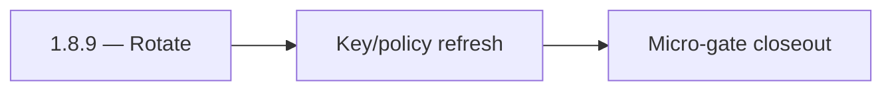

# 1.8.9 — Rotate

- **Era:** `1.x` User/billing/credit — hub [`versions.md`](../versions.md) · minors start at [`1.0 — User Genesis`](1.0%20%E2%80%94%20User%20Genesis.md)
- **Minor:** [1.8 — Credit Pack Maturity](./1.8 — Credit Pack Maturity.md)
- **Codename:** Rotate
- **Status:** planned

## Focus
Key/policy refresh

## Flowchart

## Micro-gate

| Track | Gate question | Answer / Evidence (fill at patch closeout) |
| --- | --- | --- |
| **Contract** | GraphQL / REST changes? Diff vs `docs/backend/apis/` or task pack; billing idempotency keys if mutations touched. | Document at patch closeout. |
| **Service** | Auth, credit deduction, billing state machine, and downstream Lambdas still pass smoke? | Document smoke paths. |
| **Surface** | App / admin / root / extension billing UX changed? Role + entitlement checks? | Document UX delta or N/A. |
| **Frontend** | Which routes/components must render or change for this patch? | Pack expiry / renewal / grace UI. Document at closeout. |
| **Data** | `credits`, `subscriptions`, `plans`, `payment_submissions`, usage/ledger — migrations + lineage? | Document migrations/lineage or N/A. |
| **Ops** | Billing observability, rollback, secret rotation; fraud/abuse delta for `1.10` patches. | Document ops delta or N/A. |

## Tasks
### Contract
- Define policy refresh semantics:
  - state machine and thresholds remain consistent through the patch.

### Service
- Ensure no runtime regressions after policy refresh:
  - state derivation stays deterministic.

### Surface
- UX remains stable (no flicker or inconsistent overlays during refresh).

### Data
- No schema changes required; ensure existing migrations remain valid.

### Ops
- Freeze:
  - sign-off before `1.9` identity/session hardening.

Codebases: `[appointment360][app]`

## Release Gate and Evidence

## Service task slices
> Merged from era `1.x` user/billing task packs (P0→`.0`–`.2`, P1→`.3`–`.6`, Ops→`.7`–`.9`).

### Appointment360 (gateway)
- Wire GraphQL Idempotency-Key to billing mutations in Postman collection
- Write test: login → me → logout → me → error flow
- Write test: register → consume credit → query usage → low-credit guard

### Jobs
- Add billing-impact alerts for job failure spikes.
- Add release checklist for billing-flow regression checks.

## Evidence gate
Micro-gate table filled and handoff note to `1.9.0` recorded
